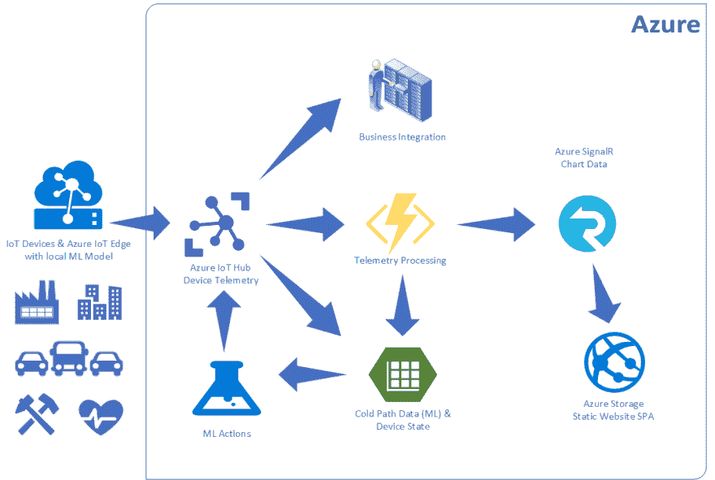
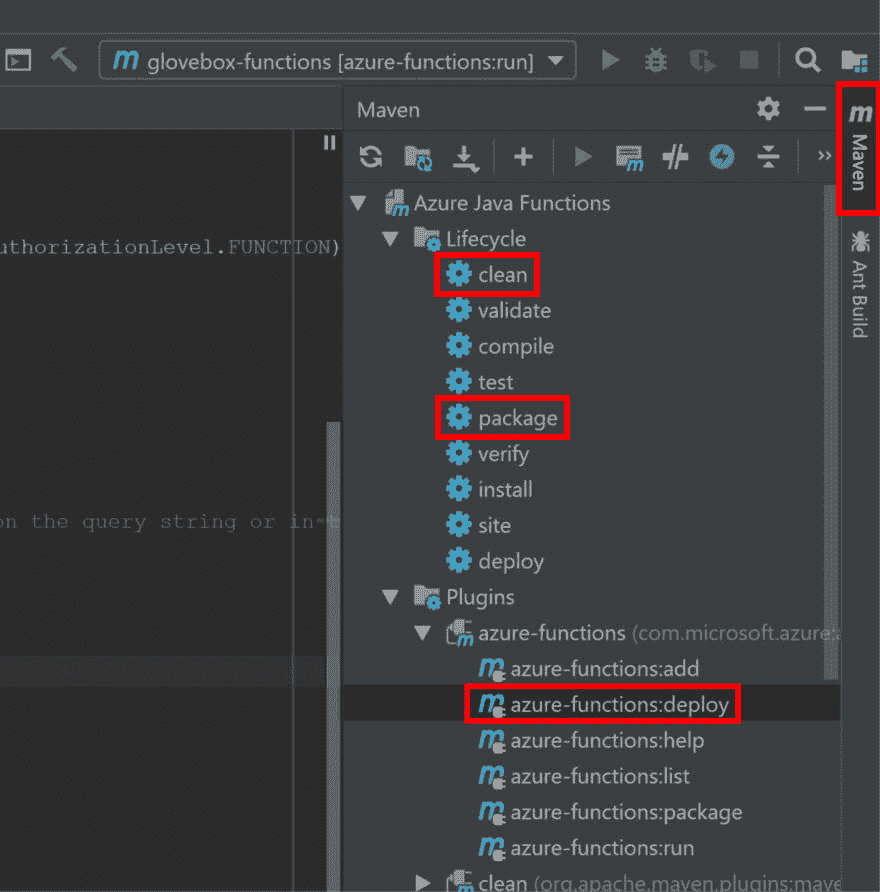
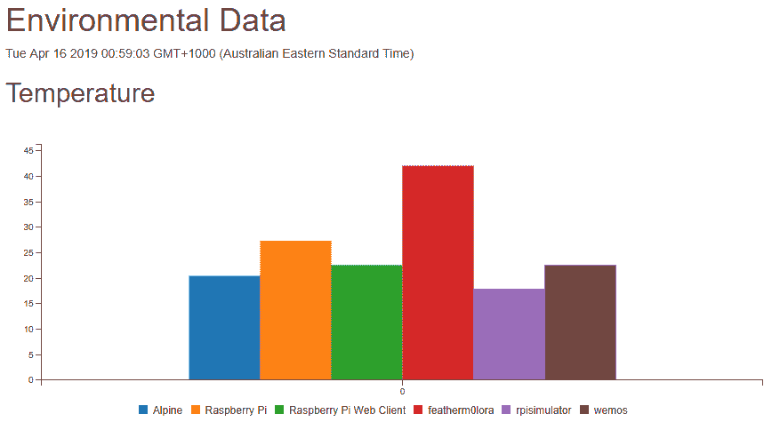

# 使用 Kotlin Azure 函数和 SignalR 构建无服务器物联网解决方案

> 原文：<https://dev.to/azure/building-a-serverless-iot-solution-with-kotlin-azure-functions-and-signalr-2lpg>

关注我 [Twitter](https://twitter.com/dglover) 、[项目源代码](https://github.com/gloveboxes/Going-Serverless-with-Kotlin-Azure-Functions-SignalR)、 [Powerpoint 幻灯片](https://github.com/gloveboxes/Going-Serverless-with-Kotlin-Azure-Functions-SignalR/blob/master/docs/Kotlin%20Serverless%20with%20Azure%20Functions%20Final%20-%20March%202019.pptx)、 [PDF 幻灯片](https://github.com/gloveboxes/Going-Serverless-with-Kotlin-Azure-Functions-SignalR/blob/master/docs/Kotlin%20Serverless%20with%20Azure%20Functions%20Final%20-%20March%202019.pdf)

## 解决方案概述

[](https://res.cloudinary.com/practicaldev/image/fetch/s--3VhTWdJQ--/c_limit%2Cf_auto%2Cfl_progressive%2Cq_auto%2Cw_880/https://raw.githubusercontent.com/gloveboxes/Going-Serverless-with-Kotlin-Azure-Functions-SignalR/master/docs/resources/solution-architecture.png)

该解决方案图概述了一个典型的物联网解决方案。 [Azure 物联网中心](https://docs.microsoft.com/en-us/azure/iot-hub?WT.mc_id=devto-blog-dglover)负责互联网规模、安全、与设备和后端服务的双向通信。

Azure IoT Hub 可以将遥测数据[路由](https://docs.microsoft.com/en-us/azure/iot-hub/tutorial-routing?WT.mc_id=devto-blog-dglover)到各种服务，也可以以 [Apache Avro](https://avro.apache.org/docs/current/) 或 JSON 格式存储，用于审计、集成或驱动机器学习过程等目的。

这篇文章截取了这一场景的一部分，讲述了通过 Kotlin Azure Functions 和 Azure SignalR 对来自 Azure IoT Hub 的遥测数据进行直接的[无服务器](https://en.wikipedia.org/wiki/Serverless_computing)处理，以实现近乎实时的仪表板。

### Azure 服务

该解决方案中使用了以下 Azure 服务，这些服务在免费层中可用: [Azure 物联网中心](https://docs.microsoft.com/en-us/azure/iot-hub?WT.mc_id=devto-blog-dglover)、 [Azure 功能](https://docs.microsoft.com/en-us/azure/azure-functions?WT.mc_id=devto-blog-dglover)、 [Azure 信号员](https://docs.microsoft.com/en-us/azure/azure-signalr?WT.mc_id=devto-blog-dglover)、 [Azure 存储](https://docs.microsoft.com/en-us/azure/storage?WT.mc_id=devto-blog-dglover)、 [Azure 存储静态网站](https://docs.microsoft.com/en-us/azure/storage/blobs/storage-blob-static-website?WT.mc_id=devto-blog-dglover)

你可以注册一个[免费 Azure 账户](https://azure.microsoft.com/en-au/free?WT.mc_id=devto-blog-dglover)，如果你是学生，那么一定要注册[学生 Azure](https://azure.microsoft.com/en-au/free/students?WT.mc_id=devto-blog-dglover)，不需要信用卡。

## 开发 Kotlin Azure 函数

《使用 IntelliJ 创建基于 Kotlin 的 Azure 函数》指南有关于集成需求、JDK、IntelliJ、Azure CLI 等的所有信息，并有一个使用 IntelliJ 创建第一个 Kotlin Azure 函数的分步指南。

## Java 和 Kotlin Azure 函数的资源

*   [用 Java 和 Maven 创建你的第一个函数](https://docs.microsoft.com/en-us/azure/azure-functions/functions-create-first-java-maven?WT.mc_id=devto-blog-dglover)
*   [用 Java 和 IntelliJ 创建你的第一个 Azure 函数](https://docs.microsoft.com/en-us/azure/azure-functions/functions-create-maven-intellij?WT.mc_id=devto-blog-dglover)
*   [宣布 Azure 函数中 Java 支持的普遍可用性](https://azure.microsoft.com/en-au/blog/announcing-the-general-availability-of-java-support-in-azure-functions?WT.mc_id=devto-blog-dglover)
*   [Azure 函数触发器和绑定概念](https://docs.microsoft.com/en-us/azure/azure-functions/functions-triggers-bindings?WT.mc_id=devto-blog-dglover)
*   用于 Azure 功能的 Maven 插件
*   [Azure Functions Java 开发者指南](https://docs.microsoft.com/en-au/azure/azure-functions/functions-reference-java?WT.mc_id=devto-blog-dglover)
*   用于 Azure 功能的 Java API

## 解决方案组件(包含在本 GitHub repo 中)

1.  Kotlin Azure 函数。这个 Azure 函数处理成批的遥测数据，然后校准和验证遥测数据，并更新设备状态 Azure 存储表，然后将遥测数据传递给 Azure SignalR 服务，以进行近乎实时的 web 客户端更新。

2.  [网络仪表盘](https://enviro.z8.web.core.windows.net/enviromon.html)。这款单页 Web 应用作为静态网站托管在 Azure Storage 上。所以它也是无服务器的。

## 设计注意事项

### 乐观并发

首先，理解[事件中枢触发缩放](https://docs.microsoft.com/en-us/azure/azure-functions/functions-bindings-event-iot#trigger---scaling?WT.mc_id=devto-blog-dglover)以及如何启动额外的功能实例来处理事件是很有用的。

我想在设备状态表中维护一个计数，记录设备发送遥测数据的次数。该解决方案实现了 [Azure Storage/CosmosDB 开放式并发](https://azure.microsoft.com/en-us/blog/managing-concurrency-in-microsoft-azure-storage-2?WT.mc_id=devto-blog-dglover)。

[乐观并发(OCC)](https://en.wikipedia.org/wiki/Optimistic_concurrency_control) 假设多个事务可以频繁完成而不会互相干扰。运行时，事务使用数据资源，但不获取这些资源的锁。在提交之前，每个事务都会验证没有其他事务修改过它所读取的数据。OCC 通常用于数据争用较少的环境中。

如果有多个函数实例更新并且有冲突，我已经实现了指数回退并添加了一个随机因子来允许重试。

```
Pseudo code: random(occBase, min(occCap, occBase * 2 ^ attempt)) 
```

```
private  fun calcExponentialBackoff(attempt: Int) : Long{
    val base = occBase * Math.pow(2.0, attempt.toDouble())
    return ThreadLocalRandom.current().nextLong(occBase,min(occCap, base.toLong()))
} 
```

从我有限的测试来看，指数补偿是有效的。

## 遥测处理

在处理每条消息时，检索现有实体，更新“计数”，并用新的遥测数据更新实体。如果存在 OCC 冲突，则该过程后退所计算的时间，并重试更新。

```
message.forEach { environment ->

    maxRetry = 0

    while (maxRetry < 10) {
        maxRetry++

        try {
            top = TableOperation.retrieve(_partitionKey, environment.deviceId, EnvironmentEntity::class.java)
            val existingEntity = deviceStateTable.execute(top).getResultAsType<EnvironmentEntity>()

            calibrate(environment)

            if (!validateTelemetry(environment)) {
                context.logger.info("Data failed validation.")
                break
            }

            with(environment) {
                partitionKey = _partitionKey
                rowKey = environment.deviceId
                timestamp = Date()
            }

            if (existingEntity?.etag != null) {
                environment.etag = existingEntity.etag
                environment.count = existingEntity.count
                environment.count++

                top = TableOperation.replace(environment)
                deviceStateTable.execute(top)
            } else {
                environment.count = 1
                top = TableOperation.insert(environment)
                deviceStateTable.execute(top)
            }

            deviceState[environment.deviceId!!] = environment

            break

        } catch (e: java.lang.Exception) {
            val interval = calcExponentialBackoff(maxRetry)
            Thread.sleep(interval)
            context.logger.info("Optimistic Consistency Backoff interval $interval")
        }
    }

    if (maxRetry >= 10){
        context.logger.info("Failed to commit")
    }
} 
```

### 遥测校准优化

您可以在设备上或云中校准数据。我更喜欢校准云端。校准数据可以用 Azure 函数数据绑定加载，但我更喜欢延迟加载校准数据。可能会有大量校准数据，因此在触发该功能时一次性加载所有数据是没有意义的。

```
private fun calibrate(environment: EnvironmentEntity) {
    val calibrationData:CalibrationEntity?

    if (calibrationMap.containsKey(environment.deviceId)){
        calibrationData = calibrationMap[environment.deviceId]
    }
    else {
        top = TableOperation.retrieve(_partitionKey, environment.deviceId, CalibrationEntity::class.java)
        calibrationData = calibrationTable.execute(top).getResultAsType<CalibrationEntity>()
        calibrationMap[environment.deviceId] = calibrationData
    }

    with(environment) {
        calibrationData?.let {
            temperature = scale(temperature, it.TemperatureSlope, it.TemperatureYIntercept)
            humidity = scale(humidity, it.HumiditySlope, it.HumidityYIntercept)
            pressure = scale(pressure, it.PressureSlope, it.PressureYIntercept)
        }
    }
} 
```

### 遥测验证

物联网解决方案应验证遥测技术，以确保数据在合理的范围内，以允许故障传感器。

```
private fun validateTelemetry(telemetry: EnvironmentEntity): Boolean {
    telemetry.temperature?.let {
        if (it < -10 || it > 70) {
            return false
        }
    }

    telemetry.humidity?.let {
        if (it < 0 || it > 100) {
            return false
        }
    }

    telemetry.pressure?.let {
        if (it < 0 || it > 1500) {
            return false
        }
    }

    return true
} 
```

## Azure SignalR 集成

没有服务端 Azure SignalR SDK。要从 Event Hub Trigger Azure 函数向 Dashboard Web 客户端发送遥测数据，您需要调用一个绑定到 SignalR 服务的 HTTP Azure 函数。然后，这个 SignalR Azure 函数通过 SignalR 发送遥测数据，就好像数据来自客户端应用程序一样。

Azure SignalR 集成的流程如下:

1.  Web 客户端对' **negotiate** '进行 REST 调用，其中，将信号' **Hubname** '返回给客户端。
2.  Web 客户端然后对' **getdevicestate** '进行 REST 调用，这个 HTTP 触发器从设备状态表中检索所有设备的状态。数据通过 SignalR 经由从对' **negotiate** 的调用返回的相同' **Hubname** 返回给客户端。
3.  当新的遥测数据通过物联网集线器到达时，触发“**遥测数据处理**”触发器，遥测数据在设备状态表中更新，并对“**发送信号消息**”进行 REST 调用，遥测数据被发送到所有在“**集线器名称**信道上侦听的信号客户端。

[](https://res.cloudinary.com/practicaldev/image/fetch/s--umkLgrSy--/c_limit%2Cf_auto%2Cfl_progressive%2Cq_auto%2Cw_880/https://raw.githubusercontent.com/gloveboxes/Going-Serverless-with-Kotlin-Azure-Functions-SignalR/master/docs/resources/service-side-signalr.png)

## 设置概述

这个实验室使用 Azure 上的免费服务。需要设置以下内容:

1.  Azure 物联网中心和 Azure 物联网设备
2.  蓝色信号服务
3.  部署 Kotlin Azure 函数
4.  展开信号器。NET Core Azure 函数

### 第一步:按照 Raspberry Pi 模拟器指南设置 Azure 物联网中心

[设置 Raspberry Pi 模拟器](https://docs.microsoft.com/en-us/azure/iot-hub/iot-hub-raspberry-pi-web-simulator-get-started?WT.mc_id=devto-blog-dglover)

[](https://res.cloudinary.com/practicaldev/image/fetch/s--QOkeHfbG--/c_limit%2Cf_auto%2Cfl_progressive%2Cq_auto%2Cw_880/https://docs.microsoft.com/en-us/azure/iot-hub/media/iot-hub-raspberry-pi-web-simulator/3_banner.png%3FWT.mc_id%3Ddevto-blog-dglover)

### 第二步:创建 Azure 资源组

[阿兹集团创建](https://docs.microsoft.com/en-us/cli/azure/group?view=azure-cli-latest#az-group-create&WT.mc_id=devto-blog-dglover)

```
az group create -l westus -n enviromon-kotlin 
```

### 第三步:创建 Azure 信号服务

*   创建 az signalr 服务
*   [az signalr 键列表](https://docs.microsoft.com/en-us/cli/azure/ext/signalr/signalr/key?view=azure-cli-latest#ext-signalr-az-signalr-key-list&WT.mc_id=devto-blog-dglover)返回您需要的 signalr 的连接字符串。NET Core Azure 函数。

```
az signalr create -n <Your SignalR Name> -g enviromon-kotlin --sku Free_DS2 --unit-count 1
az signalr key list -n <Your SignalR Name> -g enviromon-kotlin 
```

### 第四步:创建存储账户

[az 存储账户创建](https://docs.microsoft.com/en-us/cli/azure/storage/account?view=azure-cli-latest#az-storage-account-create&WT.mc_id=devto-blog-dglover)

```
az storage account create -n enviromonstorage -g enviromon-kotlin -l westus --sku Standard_LRS --kind StorageV2 
```

### 第五步:克隆项目

```
git clone https://github.com/gloveboxes/Going-Serverless-with-Kotlin-Azure-Functions-SignalR.git 
```

### 第六步:部署信号员。NET Core Azure 函数

```
cd Going-Serverless-with-Kotlin-Azure-Functions-SignalR

cd iot-serverless-kotlin-azure-functions-signalr

cp local.settings.sample.json local.settings.json 
```

### 第七步:用 IntelliJ 打开 Kotlin Azure Functions 项目

从 Linux 和 macOS 上的终端，或 Windows 上的 Powershell。

```
 cd Going-Serverless-with-Kotlin-Azure-Functions-SignalR

cd iot-serverless-kotlin-azure-functions-signalr

cp local.settings.sample.json local.settings.json 
```

启动 **IntelliJ** ，打开“**IOT-server less-kot Lin-azure-functions-signalr**文件夹中的项目。

### 第八步:更新 local.settings.json

```
{  "IsEncrypted":  false,  "Values":  {  "AzureWebJobsStorage":  "",  "FUNCTIONS_WORKER_RUNTIME":  "java",  "StorageConnectionString":  "",  "PartitionKey":  "Sydney",  "IotHubConnectionString":  "",  "AzureSignalRConnectionString":  "",  "AzureSignalRUrl":  ""  },  "Host":  {  "LocalHttpPort":  7071,  "CORS":  "http://127.0.0.1:5500,http://localhost:5500",  "CORSCredentials":  true  }  } 
```

### 第九步:部署 Kotlin Azure 功能

打开' **Maven** 标签，运行' **clean** '，运行' **package** ，然后运行' **azure-functions:deploy**

[](https://res.cloudinary.com/practicaldev/image/fetch/s--nUdsnHKj--/c_limit%2Cf_auto%2Cfl_progressive%2Cq_auto%2Cw_880/https://raw.githubusercontent.com/gloveboxes/Going-Serverless-with-Kotlin-Azure-Functions-SignalR/master/docs/resources/azure-function-deploy.jpg)

### 第十步:为 Azure 存储启用静态网站

仪表板项目包含静态网站项目。

遵循 Azure 存储中的[静态网站托管指南。](https://docs.microsoft.com/en-us/azure/storage/blobs/storage-blob-static-website?WT.mc_id=devto-blog-dglover)

用于此示例的页面是 enviromon.html。确保在网页 javascript 中修改“apiBaseUrl”URL，以指向您的 SignalR Azure 函数实例。

将仪表板项目的内容复制到静态网站。

### 步骤 11:使能信号员的 CORS。NET Core Azure 函数

[az functionapp cors add](https://docs.microsoft.com/en-us/cli/azure/functionapp/cors?view=azure-cli-latest#az-functionapp-cors-add&WT.mc_id=devto-blog-dglover)

```
az functionapp cors add -g enviromon-kotlin -n <Your SignalR Function Name> --allowed-origins <https://my-static-website-url> 
```

### 第十二步:启动仪表盘

从您的网络浏览器中，导航到[https://your-start-web-site/enviro mon . html](https://your-start-web-site/enviromon.html)

来自 Raspberry Pi 模拟器的遥测数据将显示在仪表板上。

[](https://res.cloudinary.com/practicaldev/image/fetch/s--t2T6SDDp--/c_limit%2Cf_auto%2Cfl_progressive%2Cq_auto%2Cw_880/https://raw.githubusercontent.com/gloveboxes/Going-Serverless-with-Kotlin-Azure-Functions-SignalR/master/docs/resources/dashboard.png)