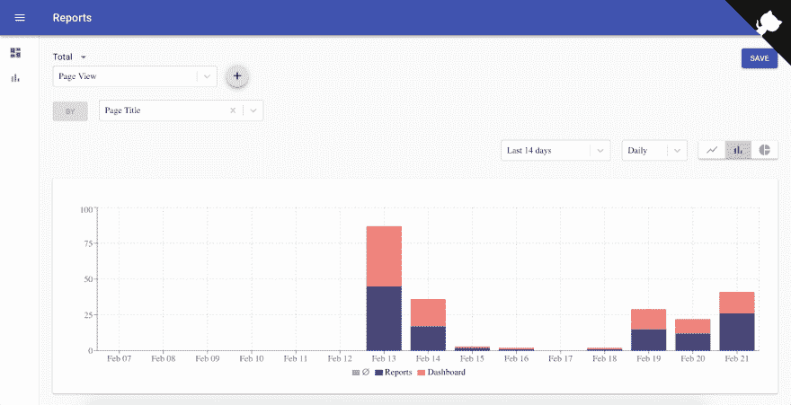
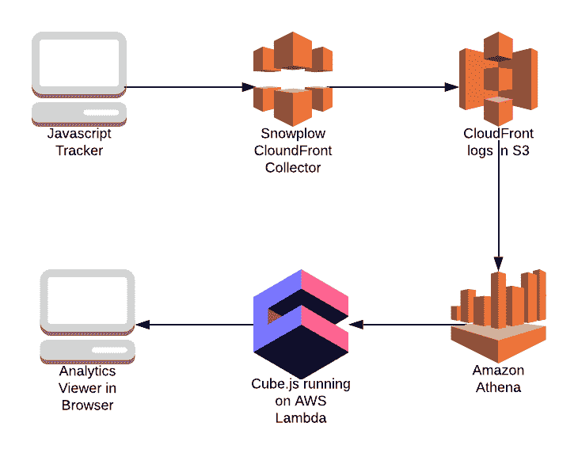
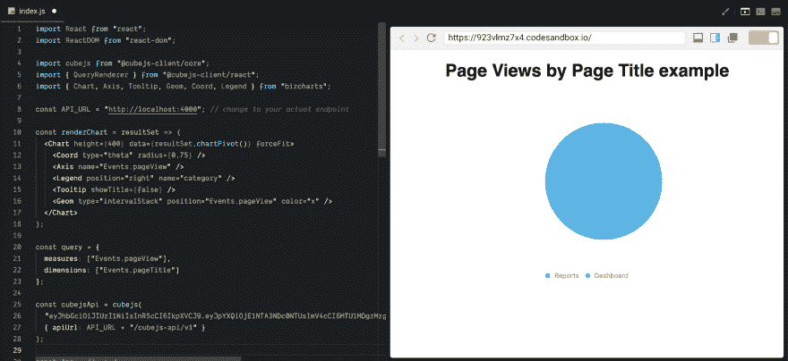

# 构建无服务器 Mixpanel 替代方案。第 1 部分:收集和显示事件

> 原文：<https://dev.to/cubejs/building-a-serverless-mixpanel-alternative-part-1-collecting-and-displaying-events-43h2>

这是关于使用 [Cube.js](https://github.com/cube-js/cube.js) 构建分析 web 应用程序的系列教程的第一部分。它希望读者熟悉 Javascript、Node.js、React，并具备 SQL 的基本知识。[最终的源代码在这里](https://github.com/cube-js/cube.js/tree/master/examples/event-analytics)和[现场演示在这里](https://d1ygcqhosay4lt.cloudfront.net/)。示例应用程序是无服务器的，运行在 AWS Lambda 上。它显示自己的使用数据。

[](https://res.cloudinary.com/practicaldev/image/fetch/s--VPi0HdV6--/c_limit%2Cf_auto%2Cfl_progressive%2Cq_auto%2Cw_880/https://media.graphcms.com/8iQ3g6FUTDqvC73peT6q)

有一类分析工具，如 Mixpanel 或 Amplitude，它们擅长处理事件数据。它们非常适合测量产品或参与度指标，如激活漏斗或保留率。它们对于测量 A/B 测试也非常有用。

尽管所有这些工具都能完成工作，但它们都是专有的、基于云的。当隐私受到关注时，这可能是个问题。或者如果有人想定制漏斗或保留如何在引擎盖下工作。虽然传统的 BI 工具，如 Tableau 或 Power BI，可能用于运行相同的分析，但它们不能提供相同级别的用户体验。问题是它们被设计成通用的商业智能工具，而不是专门用于漏斗、保持、A/B 测试等。

随着前端开发的进步，快速开发复杂的用户界面成为可能。五年前需要一周才能建成的东西现在一个下午就能建成。在后端和基础设施方面，基于云的 MPP 数据库，如 BigQuery 和 Athena，正在极大地改变这一格局。当数据在数据库内部转换时，ELT 方法变得越来越流行，取代了传统的 ETL。无服务器架构使得轻松部署和扩展应用成为可能。

所有这些都使得构建 Mixpanel、Amplitude 或 Kissmetrics 等现有服务的内部替代品成为可能。在这一系列教程中，我们将构建一个全功能的开源事件分析系统。

它将包括以下功能:

*   数据收集；
*   仪表板；
*   使用查询生成器进行即席分析；
*   漏斗分析；
*   滞留分析；
*   无服务器部署；
*   A/B 测试；
*   实时事件监控；

下图显示了我们的应用程序的架构:

[](https://res.cloudinary.com/practicaldev/image/fetch/s--K2ceKms4--/c_limit%2Cf_auto%2Cfl_progressive%2Cq_auto%2Cw_880/https://media.graphcms.com/Q37GPFyT72clApTI6gDg)

在教程的第一部分，我们将更多地关注如何收集和存储数据。并简要介绍如何根据这些数据制作一个简单的图表。以下部分更侧重于查询数据和构建各种分析报告功能。

## 收集事件

我们将使用 Snowplow Cloudfront Collector 和 Javascript Tracker。我们需要上传一个跟踪像素到亚马逊 CloudFront CDN。Snowplow Tracker 通过对像素发出 GET 请求并将数据作为查询字符串参数传递给收集器来发送数据。CloudFront 收集器使用 CloudFront 日志记录将请求(包括查询字符串)记录到 S3 桶中。

接下来，我们需要安装 Javascript Tracker。[这里是完整的指南](https://github.com/snowplow/snowplow/wiki/javascript-tracker-setup)。

但是，简而言之，它类似于 Google Analytics 或 Mixpanel 的跟踪代码，所以我们只需要将它嵌入到我们的 HTML 页面中。

```
<script type="text/javascript">      
  ;(function(p,l,o,w,i,n,g){if(!p[i]){p.GlobalSnowplowNamespace=p.GlobalSnowplowNamespace||[];
   p.GlobalSnowplowNamespace.push(i);p[i]=function(){(p[i].q=p[i].q||[]).push(arguments)
   };p[i].q=p[i].q||[];n=l.createElement(o);g=l.getElementsByTagName(o)[0];n.async=1;
   n.src=w;g.parentNode.insertBefore(n,g)}} .  (window,document,"script","//d1fc8wv8zag5ca.cloudfront.net/2.10.2/sp.js","snowplow"));

  window.snowplow('newTracker', 'cf', '<YOUR_CLOUDFRONT_DISTRIBUTION_URL>’, { post: false });
</script> 
```

在这里，您可以看到它是如何嵌入到我们的示例应用程序中的。

一旦我们在 S3 桶中有了数据，也就是 CloudFront 日志，我们就可以用 Athena 查询它。我们需要做的就是为 CloudFront 日志创建一个表。

将以下 DDL 语句复制并粘贴到 Athena 控制台中。修改存储日志的 S3 存储桶的位置。

```
CREATE EXTERNAL TABLE IF NOT EXISTS default.cloudfront_logs (
  `date` DATE,
  time STRING,
  location STRING,
  bytes BIGINT,
  requestip STRING,
  method STRING,
  host STRING,
  uri STRING,
  status INT,
  referrer STRING,
  useragent STRING,
  querystring STRING,
  cookie STRING,
  resulttype STRING,
  requestid STRING,
  hostheader STRING,
  requestprotocol STRING,
  requestbytes BIGINT,
  timetaken FLOAT,
  xforwardedfor STRING,
  sslprotocol STRING,
  sslcipher STRING,
  responseresulttype STRING,
  httpversion STRING,
  filestatus STRING,
  encryptedfields INT
)
ROW FORMAT DELIMITED 
FIELDS TERMINATED BY '\t'
LOCATION 's3://CloudFront_bucket_name/AWSLogs/Account_ID/'
TBLPROPERTIES ( 'skip.header.line.count'='2' ) 
```

现在我们准备将 Cube.js 连接到 Athena，并开始构建我们的第一个仪表板。

## 构建我们的第一个图表

首先，安装 Cube.js CLI。它用于各种 Cube.js 工作流。

```
$ npm install -g cubejs-cli 
```

接下来，通过运行以下命令创建一个新的 Cube.js 服务。注意，我们在这里将 Athena 指定为数据库(-d athena)，将 template 指定为无服务器(-t 无服务器)。Cube.js 支持不同的配置，但是对于本教程，我们将使用无服务器的配置。

```
$ cubejs create event-analytics-backend -d athena -t serverless 
```

一旦运行，`create`命令将创建一个新的项目目录，其中包含新的 Cube.js 项目的搭建。这包括启动 Cube.js 后端所需的所有文件，在 React 应用程序中显示 Cube.js 查询结果的示例前端代码，以及一些突出显示 Cube.js 数据模式层格式的示例模式文件。

这个项目目录中的`.env`文件包含相关数据库凭证的占位符。对于 Athena，您需要指定运行 Athena 查询所需的[访问的 AWS 访问和密钥，以及存储查询结果的目标 AWS 区域和](https://docs.aws.amazon.com/athena/latest/ug/access.html) [S3 输出位置](https://docs.aws.amazon.com/athena/latest/ug/querying.html)。

```
CUBEJS_DB_TYPE=athena
CUBEJS_AWS_KEY=<YOUR ATHENA AWS KEY HERE>
CUBEJS_AWS_SECRET=<YOUR ATHENA SECRET KEY HERE>
CUBEJS_AWS_REGION=<AWS REGION STRING, e.g. us-east-1>
# You can find the Athena S3 Output location here: https://docs.aws.amazon.com/athena/latest/ug/querying.html
CUBEJS_AWS_S3_OUTPUT_LOCATION=<S3 OUTPUT LOCATION> 
```

现在，让我们为事件模型创建一个基本的 Cube.js 模式。Cube.js 使用数据模式生成并执行 SQL 你可以在这里了解更多。

用以下内容创建一个`schema/Events.js`文件。

```
const regexp = (key) => `&${key}=([^&]+)`;
const parameters = {
  event: regexp('e'),
  event_id: regexp('eid'),
  page_title: regexp('page')
}

cube(`Events`, {
  sql:
    `SELECT
      from_iso8601_timestamp(to_iso8601(date) || 'T' || "time") as time, ${Object.keys(parameters).map((key) => ( `url_decode(url_decode(regexp_extract(querystring, '${parameters[key]}', 1))) as ${key}` )).join(", ")} FROM cloudfront_logs
    WHERE length(querystring) > 1
    `,

  measures: {
    pageView: {
      type: `count`,
      filters: [
        { sql: `${CUBE}.event = 'pv'` }
      ]
    },
  },

  dimensions: {
    pageTitle: {
      sql: `page_title`,
      type: `string`
    }
  }
}); 
```

在模式文件中，我们创建了一个事件多维数据集。它将包含我们活动的所有信息。在基本 SQL 语句中，我们使用`regexp`函数从跟踪器发送的查询字符串中提取值。Cube.js 擅长运行这样的转换，它也可以物化其中一些转换以优化性能。我们将在教程的下一部分讨论它。

有了这个模式，我们可以运行我们的开发服务器并构建第一个图表。

通过运行以下命令启动开发服务器。

```
$ npm dev 
```

访问 [http://localhost:4000](http://localhost:4000) ，应该会打开一个带有示例的 CodeSandbox。将`renderChart`功能和`query`变量更改如下。

```
const renderChart = resultSet => (
  <Chart height={400} data={resultSet.chartPivot()} forceFit>
    <Coord type="theta" radius={0.75} />
    <Axis name="Events.pageView" />
    <Legend position="right" name="category" />
    <Tooltip showTitle={false} />
    <Geom type="intervalStack" position="Events.pageView" color="x" />
  </Chart>
);

const query = {
  measures: ["Events.pageView"],
  dimensions: ["Events.pageTitle"]
}; 
```

现在，您应该能够看到饼图，这取决于您的 S3 中有哪些数据。

[](https://res.cloudinary.com/practicaldev/image/fetch/s--_JcmyySm--/c_limit%2Cf_auto%2Cfl_progressive%2Cq_auto%2Cw_880/https://media.graphcms.com/MPZmJlTBQKeDk4260AEg)

在下一部分中，我们将介绍如何构建一个仪表板和动态查询构建器，就像 Mixpanel 或 Amplitude 中的一样。第 3 部分将介绍如何建立漏斗，第 4 部分—保持。在最后一部分，我们将讨论如何以无服务器模式将整个应用程序部署到 AWS Lambda。

你可以在这里查看该应用程序的完整源代码。

这里有现场演示。