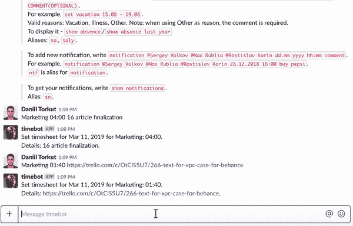
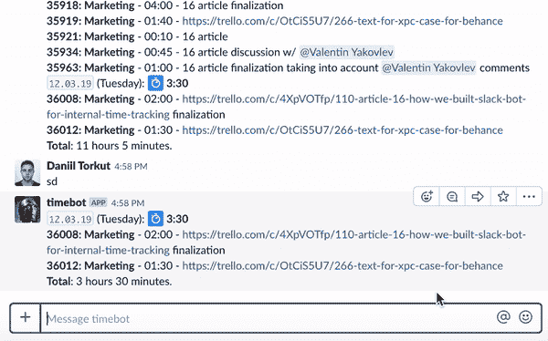
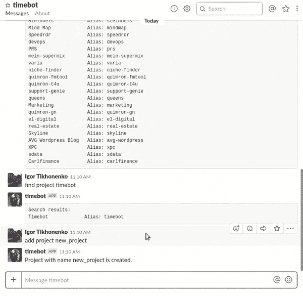
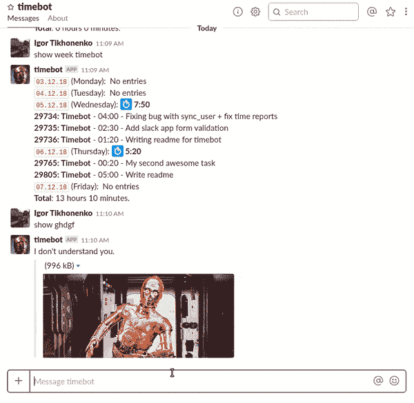

# 我们如何用 Ruby on Rails 和 Vue.js 构建一个用于时间跟踪的 Slack Bot

> 原文：<https://dev.to/codicacom/building-a-slack-bot-for-internal-time-tracking-2n5o>

*这篇文章最初发表在 [Codica 博客](https://www.codica.com/blog/time-tracking-with-slack-bot/)上。*

在这篇文章中，我们想告诉你我们的内部时间跟踪解决方案，或者我们如何简化大量的日常工作。

现在，这个跟踪时间的聊天机器人给了我们一个机会来验证和检查公司的开发工作流程，并指定每个成员的表现。

让我们开始，看看我们如何开发所谓的 **Timebot** 以及它给我们的开发团队带来了什么优势。

## 挑战

在 Codica，我们使用 Slack 来考虑各种项目问题。Slack 应用程序提供了创建聊天机器人的机会，因此出现了一个想法:为什么不创建一个跟踪时间的 Slack 机器人？

此外，使用 Slack 构建这样一个工具的另一个原因是 web 解决方案非常耗时。我们有一个想法，创造一个更有效和定制的时间跟踪选项。

## 解

### 目标

一开始，我们的主要目标是满足以下要求:

*   简化团队的跟踪流程
*   自动向客户提供全面有效的报告
*   提供明确评估总体工作量的机会
*   记录每个公司的员工对项目的贡献

经过几次讨论，我们意识到以下功能列表将有助于我们实现既定目标:

*   **时间追踪**
*   **透明报告系统**
*   **与 Trello 捆绑**
*   **管理面板**

### 发展

#### 1。定义技术堆栈

在考虑了所需的功能之后，我们转向了技术实现。出于开发目的，我们创建了两个应用程序:

*   [Slack bot(时间机器人)](https://github.com/codica2/timebot)
*   [互动管理面板](https://github.com/codica2/vue-timebot)

我们选择了以下工具来开发 Slack bot:

*   `Rails 5`
*   `Ruby 2.4`
*   `PostgreSQL`

这些工具是在开发**管理面板**的过程中使用的:

*   `Vue`
*   `Vue-router`
*   `Vuex`
*   `Vue-element-admin (admin panel template)`
*   `JWT (JSON Web Token)`

#### 2。Bot 创建和集成

首先，我们按照提示完成了在 [Slack API](https://my.slack.com/services/new/bot) 创建 Bot 的过程。在这里，您可以指定您的工作区，定义 Bot 的名称，上传或选择配置文件映像，并获得一个特殊的 API 令牌。

然后，为了管理我们的 Timebot 的 API，我们使用了 [Slack Ruby Client](https://github.com/slack-ruby/slack-ruby-client) 来采用特殊的接口。

因此，我们将 Slack API 令牌插入到`.env`文件中，如下所示:

```
Slack.configure do |config|
  config.token = ENV['SLACK_API_TOKEN']
End 
```

Enter fullscreen mode Exit fullscreen mode

因此，我们已经集成了 Slack API，现在我们可以配置我们的 Timebot 了。

#### 3。创建命令列表

当 Slack Bot 准备好进行配置时，我们开始创建可用的命令。他们都是通过 if 创造出来的..else 条件语句。以下是列表中的一些命令:

| **命令** | **描述** |
| --- | --- |
| 帮助 | 打印帮助。 |
| 项目 | 打印所有可用的项目。 |
| 查找项目搜索 _ 查询 | 找一个具体的项目。 |
| PROJECT_NAME 小时:分钟注释 | 记录时间 |
| /logtime | 通过交互式对话记录时间。 |
| 编辑新日期(可选)时间条目 ID 小时:分钟注释 | 编辑现有的时间条目。 |
| 更新(可选)日。月.年项目名称小时:分钟备注 | 为特定日期创建一个条目。 |
| 添加项目项目名称 | 添加新项目。 |
| 展示日/展示周/展示月 | 获取当天/周/月的报告。 |
| 显示缺勤/显示去年的缺勤 | 显示缺勤。 |

每个团队成员都有一个特殊的 ID，由 Slack bot 识别。当用户输入命令时，机器人会检查它是否是有效的命令。

最初，我们已经定义了`Event Handler` :

```
class EventHandler
 include Message::Conditions
 include Message::Logger

 attr_reader :client, :data, :sender, :messages, :public_channels

 def initialize(client, data, messages, public_channels)
   @client          = client
   @data            = data
   @public_channels = public_channels
   @sender          = Message::Sender.new
   @messages        = messages
 end

 def handle_message
   return if message_is_not_processable
   user = User.find_by(uid: data.user)
   log_incoming_message(user, data.text)
   if message_is_enter_time
     CreateEntry.call(user, data.text, messages)
   elsif message_is_specify_project
     SpecifyProject.call(user, data.text, messages)
   elsif message_is_request_for_help
     ShowHelp.call(user)
   elsif message_is_remove_entry
     RemoveEntry.call(user, data.text)
   elsif message_is_show_reports
     ShowReport.call(user, data.text)
   elsif message_is_enter_time_for_day
     CreateEntryForDay.call(user, data.text)
   elsif message_is_request_for_project
     ShowProjects.call(user)
...
   else
     DoNotUnderstand.call(user, messages)
   end
 end
End 
```

Enter fullscreen mode Exit fullscreen mode

接下来，我们为每个机器人的命令定义了`Classes`，例如:

```
class AddProject < BaseService
 include ServiceHelper

 attr_reader :user, :text

 def initialize(user, text)
   @user = user
   @text = text
   super()
 end

 def call
   project_name = text.match(Message::Conditions::ADD_PROJECT_REGEXP)[1]
   project = find_project_by_name(project_name)

   if project
     sender.send_message(user, "Project with name #{project.name} already exists.")
     return
   end

   if project_name.length < Project::MINIMUM_PROJECT_NAME_LENGTH
     text = "Project name is too short - must be at least #{Project::MINIMUM_PROJECT_NAME_LENGTH} characters."
     sender.send_message(user, text)
     return
   end

   project = Project.create!(name: project_name)
   sender.send_message(user, "Project with name #{project.name} is created.")
 end
end 
```

Enter fullscreen mode Exit fullscreen mode

我们随时都有可能创建新的命令

### 我们的 Timebot 工作流程示例

**时间跟踪**提供了一个监控在特定任务上花费的小时数的机会。每个员工的时间表上都有这些数据，可以查看和编辑。

要添加新的时间记录，您需要输入项目名称、为特定任务花费的时间，并添加注释以指定详细信息。

[](https://res.cloudinary.com/practicaldev/image/fetch/s--8HcrgLs---/c_limit%2Cf_auto%2Cfl_progressive%2Cq_66%2Cw_880/https://thepracticaldev.s3.amazonaws.com/i/2prmx3yorwzga2x5z5j4.gif)

**缺勤**提供了跟踪成员休假、生病和其他缺勤原因的机会。

[](https://res.cloudinary.com/practicaldev/image/fetch/s--zjeE8e5R--/c_limit%2Cf_auto%2Cfl_progressive%2Cq_66%2Cw_880/https://thepracticaldev.s3.amazonaws.com/i/0bjf3tdqoh14b0ixzoss.gif)

**开发报告**是为了收集特定的数据，用于未来的统计和分析生成。

[](https://res.cloudinary.com/practicaldev/image/fetch/s--U0GAn4IV--/c_limit%2Cf_auto%2Cfl_progressive%2Cq_66%2Cw_880/https://thepracticaldev.s3.amazonaws.com/i/l3wpzvke5trlcji6e97a.gif)

**项目**被定义为让用户跟踪、添加和使用项目进行时间记录。

[](https://res.cloudinary.com/practicaldev/image/fetch/s--fEF56E05--/c_limit%2Cf_auto%2Cfl_progressive%2Cq_66%2Cw_880/https://thepracticaldev.s3.amazonaws.com/i/tnnec2i5eldi780k0q32.gif)

## 我们取得了什么成就

总之，我们已经向你展示了我们是如何开发 SlackBot 的，我们相信这个指南对你和你的企业是有价值和有用的。

以下是我们的 SlackBot 带来的一些特性和流程改进:

*   高效的时间跟踪工具
*   跟踪工作时间和缺勤(假期、病假)
*   会议前 10 分钟弹出的会议时间通知
*   整个公司的绩效和速度的总体情况

要阅读完整的功能列表，请查看我们的文章:[构建一个用于内部时间跟踪的 Slack Bot](https://www.codica.com/blog/time-tracking-with-slack-bot/)。