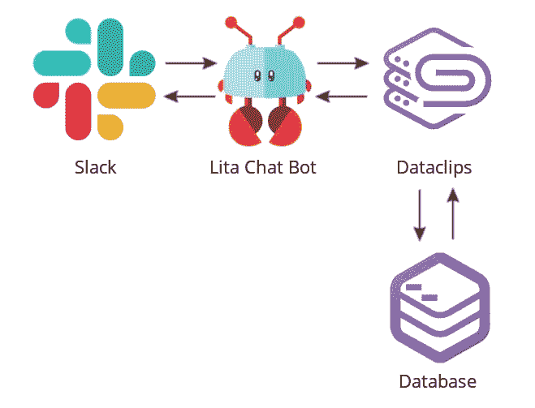
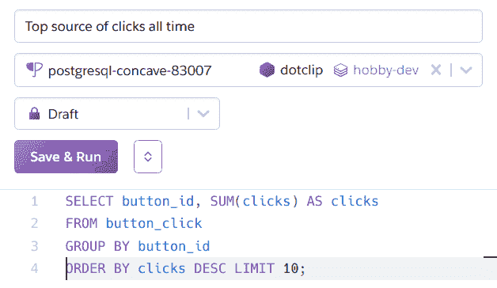
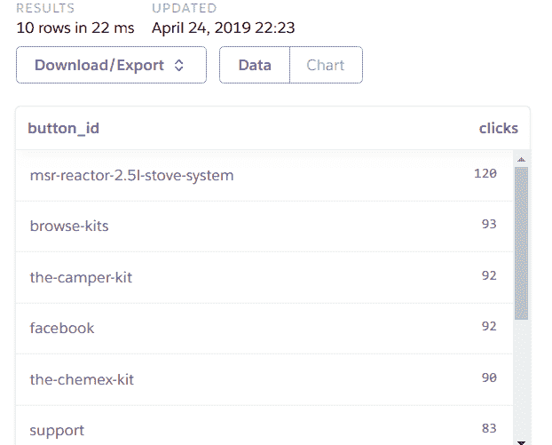
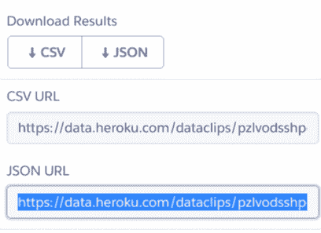
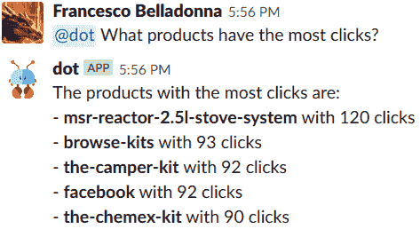

# 构建一个 Slackbot 来回答数据库中的分析问题

> 原文：<https://dev.to/heroku/building-a-slackbot-to-answer-analytics-questions-from-your-database-4ndf>

任何企业，无论规模大小或行业，都依赖于信息。DevOps 团队面临的一个持续挑战是找到更快、更容易和更好的方法，以便在业务用户需要时随时随地将信息传递到他们手中。过去，这需要使用商业智能(BI)解决方案或对数据库运行自定义查询。如果像问聊天机器人一样简单呢？无需担心报告或查询。聊天机器人可以在整个团队都能看到的频道上回答问题。

数字产品交付平台提供商[kaja bi](https://www.heroku.com/podcasts/codeish/3-spreading-the-database-love)通过开发一个简单的聊天机器人来回答商业问题，从而解决了这个问题。工程或营销团队的任何人都可以通过询问聊天机器人获得最新数据。它很聪明，可以在数据库中查找数据来回答问题。

下图显示了该解决方案的工作原理。当聊天机器人收到来自 Slack 用户的消息时，会向预先建立的[数据剪辑](https://data.heroku.com/dataclips)发送一个请求，它会直接从生产数据库获取实时数据作为响应。结果显示在聊天窗口中，格式非常适合用户。一旦建立了聊天机器人，就可以很容易地创建新的请求，并与相关的业务受众共享，供他们使用。

[](https://res.cloudinary.com/practicaldev/image/fetch/s--R0bQdzXU--/c_limit%2Cf_auto%2Cfl_progressive%2Cq_auto%2Cw_880/https://thepracticaldev.s3.amazonaws.com/i/4hfhchjz9hqhv8c6n431.jpg)
*Lita 聊天机器人从 Dataclips 中获取数据的图示*

# 商业智能和仪表板的节约成本的替代方案

chatbot 方法提供了一种替代方法，可以编写专门的分析查询，并创建一个完整的基础结构来公开它们。大多数公司通过成熟的商业智能解决方案或通过构建最终成为 web 应用程序的仪表板来解决对及时业务数据的需求，这两种方式在开发和维护方面都非常昂贵。

仪表板要求开发团队部署、维护和升级您的应用程序和数据库，而开发团队被迫更新管道以及添加功能以满足更复杂的用例。人们还必须在办公室里查看物理仪表板或调出单独的报告来查看最新结果，这限制了可见性。

聊天机器人可以让你的团队在聊天室里立即看到数据，所有人都已经在看了，包括办公室和远程员工。当你在讨论一个话题并有一个问题时，你可以看到并与小组中的每个人分享你的见解。没有必要点击一个链接来打开一个单独的报告。例如，现在营销、财务和运营领域的业务用户可以随时获得帮助公司发展所需的见解。

此外，与创建定制的数据转储和报告不同，这使得 DevOps 团队可以从事价值更高的项目。最初设置聊天机器人需要一些时间，但是添加额外的提示相对来说比较快。

# 如何创建自己的聊天机器人

Lita 让使用 Ruby 创建你自己的聊天机器人变得容易。它可以使用数据剪辑从数据库中查询数据。借助 Dataclips，您团队中熟悉 SQL 的任何人都可以根据实时生产数据轻松创建报告，并使用唯一的 URL 在您的组织内安全地[共享结果](https://devcenter.heroku.com/articles/dataclips)。chatbot 组件使业务用户可以轻松地对数据剪辑进行查询。聊天机器人从该 URL 中提取结果，并将其显示在 Slack 对话中。

通过本教程，您将了解如何通过创建聊天机器人来复制 Kajabi 的设置，聊天机器人可以通过 Dataclips 访问您的数据库，并为您的最终用户提供相关的见解。

# 创建数据剪辑

在本教程中，我们的示例业务是跟踪各种来源的点击，包括社交网络和网站。数据剪辑将用于提供点击量最高的来源。教程的这一步假设您可以访问一个 [Heroku Postgres](https://devcenter.heroku.com/articles/heroku-postgresql) 数据库。

```
-- Top sources of clicks
SELECT button_id, SUM(clicks) AS clicks FROM button_click GROUP BY button_id ORDER BY clicks DESC LIMIT 10; 
```

如果您缺少一个模式来运行分析查询，那么您可以使用这篇博文中将要用到的示例:

```
CREATE TABLE button_click (
  id serial PRIMARY KEY,
  "uuid" VARCHAR(37),
  button_id VARCHAR(90),
  created_date TIMESTAMP NOT NULL DEFAULT now(),
  clicks integer
); 
```

您可以使用如下插入查询:

```
INSERT INTO button_click("uuid", button_id, created_date, clicks) VALUES ('b2344e6d-b864-418f-91e7-28748bb94487', 'facebook', '2019-04-19T20:11:49-07:00', '3'); 
```

现在，继续访问您的[数据剪辑页面](https://data.heroku.com/dataclips)，点击**新建数据剪辑**，为其指定一个名称，并选择一个数据存储(您的数据库)。然后用之前的查询填充页面上的查询部分:

[](https://res.cloudinary.com/practicaldev/image/fetch/s--WHiNfzcm--/c_limit%2Cf_auto%2Cfl_progressive%2Cq_auto%2Cw_880/https://thepracticaldev.s3.amazonaws.com/i/zwhocnfadn9drhu5rc09.png)

点击**保存&运行**，查询现在以表格格式呈现，并带有数据，以及以图表形式查看的选项:

[](https://res.cloudinary.com/practicaldev/image/fetch/s--rYGQCzhg--/c_limit%2Cf_auto%2Cfl_progressive%2Cq_auto%2Cw_880/https://thepracticaldev.s3.amazonaws.com/i/cmf1wcmlsv60a5iaygak.png)

最后，通过点击**下载/导出**并选择文本字段 **JSON url** 来复制 URL:

[](https://res.cloudinary.com/practicaldev/image/fetch/s--BziCM4Ql--/c_limit%2Cf_auto%2Cfl_progressive%2Cq_auto%2Cw_880/https://thepracticaldev.s3.amazonaws.com/i/em3otp6g75o2i12vl0lq.png)

记下 URL 或者将其导出到环境变量`DOT_API_URL`(您将在开发聊天机器人时使用它)。

# 设置 Lita

有很多库可以创建聊天机器人。在本教程中，您将学习使用 [Lita](https://www.lita.io/) ，这是一个框架，它极大地简化了过程，同时提供了很好的可扩展性。安装过程需要以下软件:

*   [Ruby](https://www.ruby-lang.org/en/downloads/) (本教程使用 2.6.1 版本)
*   [RubyGems](https://rubygems.org/)
*   [Bundler](https://bundler.io/) 版本 2(红宝石宝石)
*   [再说一遍](https://redis.io/download)
*   以管理员身份访问[空闲工作区](https://slack.com/create)
*   先前创建的数据剪辑

通过运行:
安装 Lita 4.7.1(本教程使用的版本)

```
$ gem install lita --version 4.7.1
Successfully installed lita-4.7.1
1 gem installed 
```

然后，创建一个名为“Dot”的 Lita 项目，该项目将作为基线，您将向其添加机器人的 Ruby 代码:

```
$ lita new dot
      create  dot
      create  dot/Gemfile
      create  dot/lita_config.rb 
```

运行`cd dot`并重新配置`Gemfile`以包含所需的依赖项:

```
source "https://rubygems.org"
ruby ">= 2.6.1"

gem "lita",       "~> 4.7.1"
gem "lita-slack", "~> 1.8.0"
gem "httparty",   "~> 0.17.0" 
```

最后，使用`bundle install`安装依赖项。gem 文件中的另外两个 gem 是:

*   [lita-slack](https://github.com/litaio/lita-slack) ，一个用于 Lita 的松弛[适配器](https://docs.lita.io/plugin-authoring/adapters/)
*   httparty，Ruby 的一个简单的 HTTP 客户端

设置的最后一步包括更改 Lita 的配置文件`lita_config.rb`以使用 Slack 适配器并访问 Redis 数据库(运行 Lita 所需的):

```
Lita.configure do |config|
  # This is your bot name
  config.robot.name = "Dot"

  config.robot.locale = :en

  config.robot.log_level = :info
  config.robot.admins = [ENV.fetch("DOT_ADMIN_ID")]

  config.robot.adapter = :slack
  config.adapters.slack.token = ENV.fetch("DOT_SLACK_TOKEN")

  config.http.port = ENV["PORT"] || 3000
  config.redis = { url: ENV.fetch("REDIS_URL") }

  dataclip = config.handlers.dataclip_handler
  dataclip.top_clicks_all_time_url = ENV.fetch("DOT_API_URL")
end 
```

此外，您需要在启动应用程序时设置这些环境变量:

*   您的用户 ID 在 Slack 上吗
*   `DOT_SLACK_TOKEN`是通过[将 Lita integration 添加到您的空闲工作空间](https://my.slack.com/services/new/lita)获得的令牌
*   Lita 用它来运行一个微型网络服务器，允许机器人通过 HTTP 接受输入，并创建格式良好的网页，您可以提供这些网页作为对某些命令的响应
*   `REDIS_URL`是一个字符串，指定使用 [redis-url 格式](https://github.com/ddollar/redis-url)连接到 Redis 服务器的详细信息
*   `DOT_API_URL`是您之前在设置数据剪辑时复制的 url 机器人用它来回答用户的请求

# 编写处理程序

配置完 Lita 之后，是时候添加功能来响应聊天命令“点击量最大的来源”要实现这一点，请进行以下更改:

*   在您的`lita_config.rb`文件的顶部添加行`require_relative "./dataclip_handler"`
*   创建文件`dataclip_handler.rb`

用 Lita 的话来说，文件`dataclip_handler.rb`是一个[处理程序](https://docs.lita.io/plugin-authoring/handlers/)，它允许你的机器人响应聊天命令和事件，并在响应中编写聊天消息。将以下代码粘贴到文件中:

```
module Lita
  module Handlers
    class DataclipHandler < Handler
      config :top_clicks_all_time_url

      route(/products\shave\sthe\smost\sclicks/, command: true) do |response|
        url = config.top_clicks_all_time_url
        http_response = HTTParty.get(url, follow_redirects: true)
        data = JSON.
          parse(http_response.body).
          fetch("values").
          lazy.
          map { |arr| ({ name: arr[0], clicks: arr[1] }) }.
          take(5)

        msg = "The products with the most clicks are:\n"
        data.each do |source|
          msg << "- *#{source[:name]}* with #{source[:clicks]} clicks\n"
        end

        response.reply(msg)
      end
    end

    Lita.register_handler(DataclipHandler)
  end
end 
```

让我们看一下每一条相关的线:

```
class DataclipHandler < Handler 
```

`Handler`类将提供各种类方法，最有趣的是允许监听聊天消息的`route,`。

```
config :top_clicks_all_time_url 
```

该行允许处理器接受配置选项，该选项在`lita_config.rb`中提供。用下面的代码获取一个环境变量:

```
dataclip = config.handlers.dataclip_handler
dataclip.top_clicks_all_time_url = ENV.fetch("DOT_API_URL") 
```

下一行是:

```
route(/products\shave\sthe\smost\sclicks/, command: true) do |response| 
```

它指示 Lita 收听直接发给机器人 ( `command: true`选项)的聊天消息**，其中包含句子“产品有最多的点击”，并跳过一般的无地址消息。有效的聊天消息应该是:** 

```
@dot What products have the most clicks? 
```

查询的答案由 *do 块的内容决定。*在这种情况下，下一行声明:

```
url = config.top_clicks_all_time_url
http_response = HTTParty.get(url, follow_redirects: true) 
```

http_response 包含一个 JSON 格式的字符串，类似于:

```
{  "title":  "Top source of clicks all time",  "values":  [  ["msr-reactor-2.5l-stove-system",  120],  ["browse-kits",  93],  ["the-camper-kit",  92],  ["facebook",  92],  ["the-chemex-kit",  90],  ["support",  83],  ["chemex-classic-6-cup-coffee-maker",  81],  ["the-french-press-kit",  66],  ["contact-us",  58],  ["the-pour-over-kit",  50]  ],  "fields":  ["button_id",  "clicks"],  "types":  [1043,  20],  "type_names":  ["text",  "integer"],  "started_at":  "2019-04-21 02:10:09 +0000",  "finished_at":  "2019-04-21 02:10:09 +0000",  "checksum":  "cf491f4dd64f044eb2e41f04676f5dca"  } 
```

因此，下面几行代码将用于从`values`键中提取结果，并以更有用的格式公开它们:

```
data = JSON.
  parse(http_response.body).
  fetch("values").
  lazy.
  map { |arr| ({ name: arr[0], clicks: arr[1] }) }.
  take(5) 
```

首先，解析响应体，并提取值。然后，数组的每个条目都被转换成格式为`{ name: "source_name_here", clicks: 123 }`的散列。最后，只显示前五个结果，以防止聊天室人满为患。

有了获取的数据和精心准备的数据，就有可能创建机器人将要编写的聊天消息:

```
msg = "The products with the most clicks are:\n"
data.each do |source|
  msg << "- *#{source[:name]}* with #{source[:clicks]} clicks\n"
end 
```

这段代码很简单:它在变量`msg`中创建一条聊天消息，并用由五个主要条目和点击次数组成的项目列表填充它。

最后一行是:

```
response.reply(msg) 
```

这命令机器人回复先前构建的聊天消息。

文件中还有一个重要的行在`route`块之外:

```
Lita.register_handler(DataclipHandler) 
```

这指示 Lita 在引导时加载处理程序，以便可以执行代码。

# 与您的聊天机器人互动

如果您一直遵循本教程，那么您已经准备好测试您的应用程序了。在`Dot`文件夹中，运行以下命令:

```
$ bundle exec lita start
[2019-04-25 06:18:10 UTC] INFO: Connected to Slack. 
```

应用程序将启动，并显示一个日志条目“连接到 Slack”

访问您的 Slack 工作区，邀请聊天室的聊天机器人，并向其发送聊天消息，内容为:

```
@dot What products have the most clicks? 
```

机器人将根据您的数据片段内容做出响应:

[](https://res.cloudinary.com/practicaldev/image/fetch/s--QF2n5FFl--/c_limit%2Cf_auto%2Cfl_progressive%2Cq_auto%2Cw_880/https://thepracticaldev.s3.amazonaws.com/i/gwangdnmim6qzn3pdlb5.png)

您可以通过添加将 Slack 消息转换成 SQL 查询的功能来扩展您的聊天机器人的功能。这可以让您的团队在创建数据剪辑之前进行试验，并简化定制。

# 更好的业务洞察力

通过本教程，您能够创建一个数据剪辑并将其连接到 Slackbot，这样每个营销团队成员都可以随时访问该查询。这种配置不仅极其简单，而且通过将流程无缝地注入到用户的现有工作流中，为您的业务分析提供了更高程度的可见性。