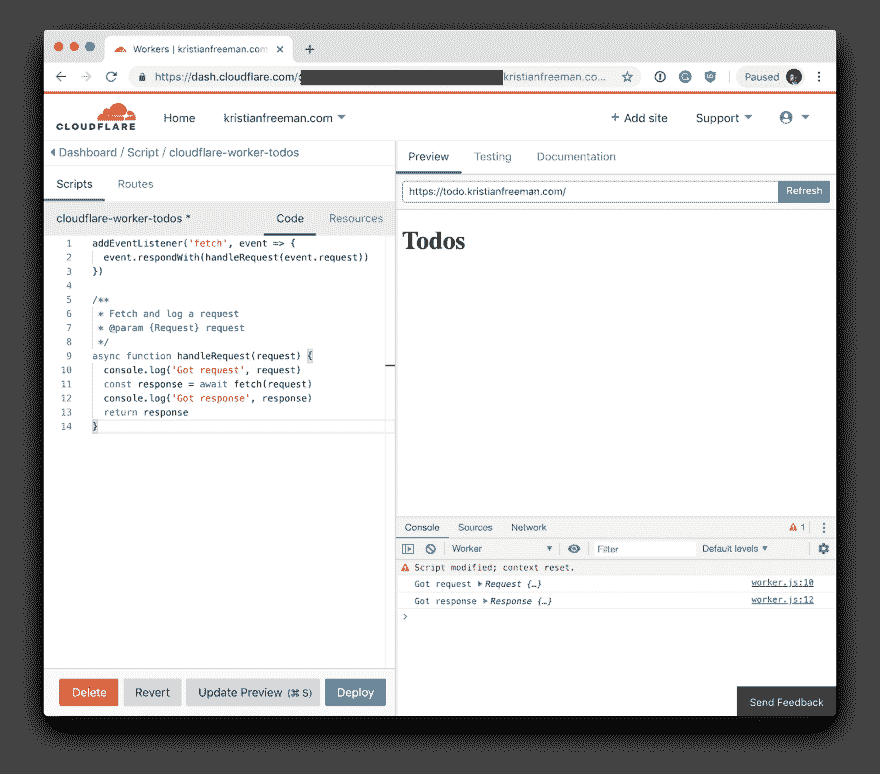
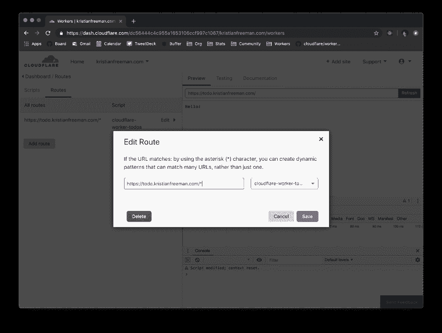
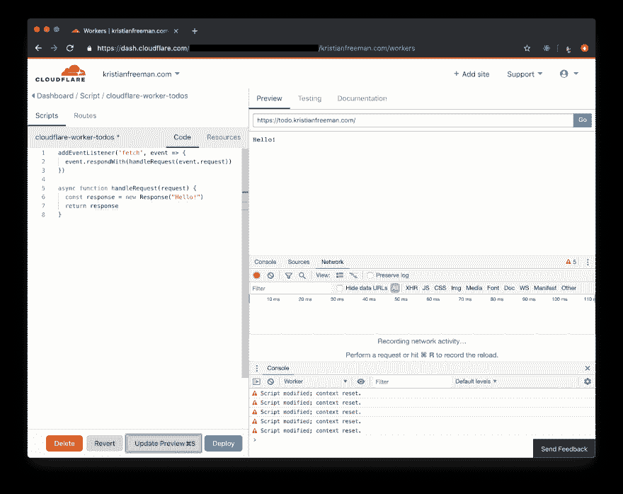
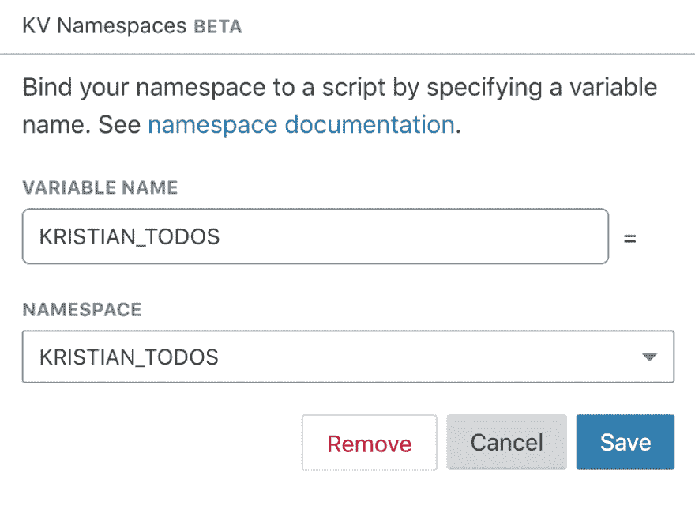
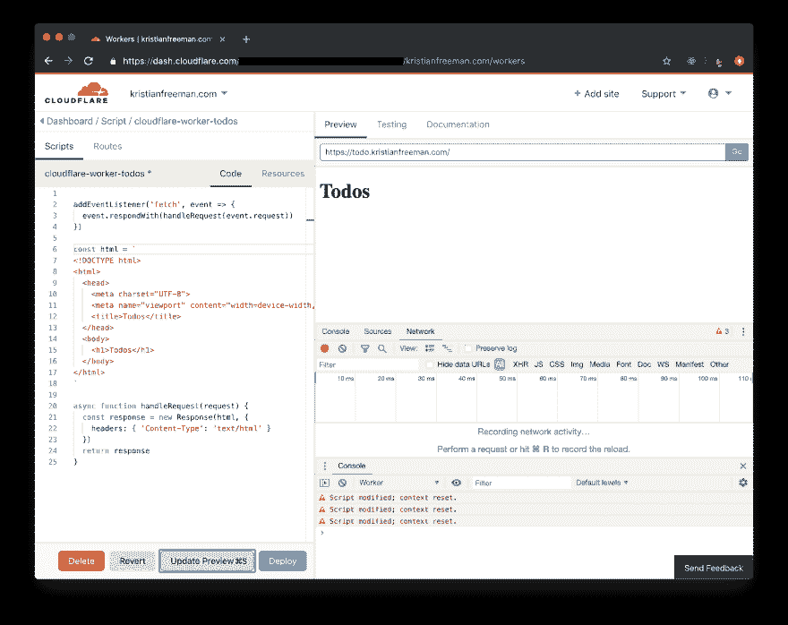
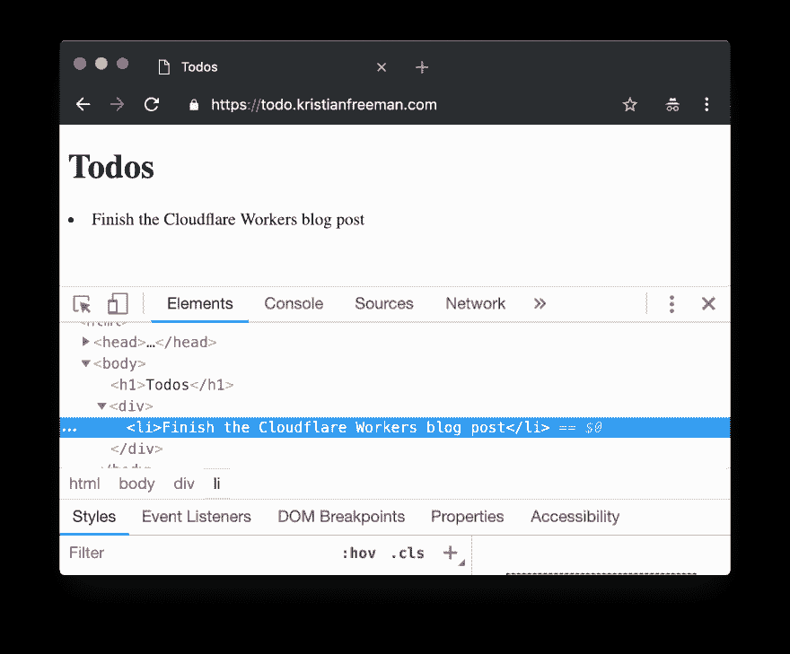
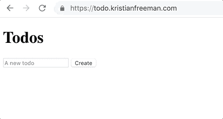
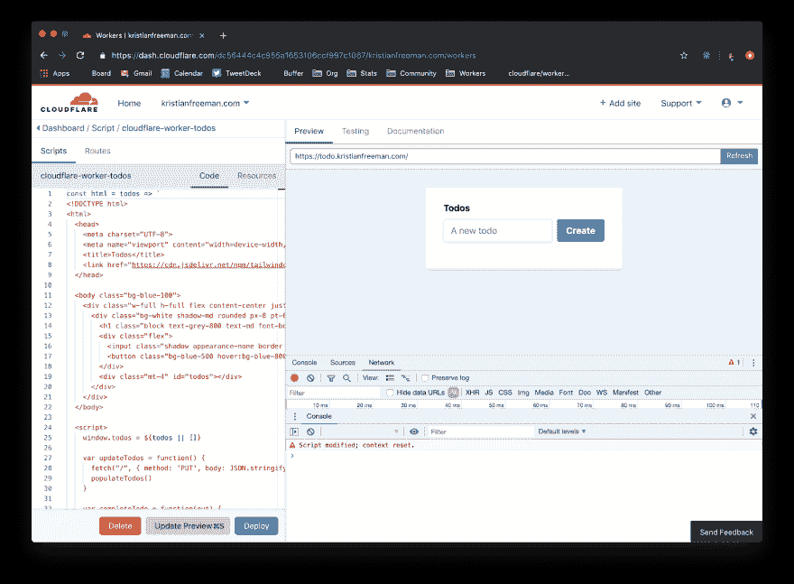
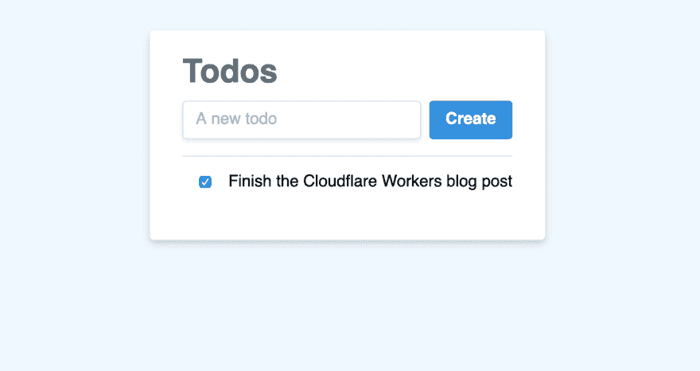

# 使用 Cloudflare Workers 和 KV 构建待办事项列表应用程序

> 原文：<https://dev.to/cloudflare/building-a-to-do-list-application-with-cloudflare-workers-and-kv-504d>

在本教程中，我们将使用 HTML、CSS 和 JavaScript 构建一个 todo list 应用程序，但有所不同:所有数据都应该存储在新推出的 Workers KV 中，应用程序本身应该使用 Cloudflare Workers 直接从 Cloudflare 的 edge 网络提供服务。

首先，让我们把这个项目分成几个不同的独立步骤。特别是，它有助于关注与工作人员 KV 一起工作的约束，因为处理数据通常是构建应用程序最复杂的部分:

1.  构建 todos 数据结构
2.  将 todos 写入 Workers KV
3.  从工人 KV 检索 todos
4.  向客户端返回一个 HTML 页面，包括待办事项(如果存在的话)
5.  允许在 UI 中创建新的待办事项
6.  允许在 UI 中完成待办事项
7.  处理待办事项更新

这个任务顺序非常方便，因为它几乎完美地分为两个部分:首先，了解我们需要了解的关于 Workers *和* KV 的 Cloudflare/API 级别的事情，其次，实际构建一个用户界面来处理数据。

## 了解工人

就实现而言，这个项目的大部分都是围绕 KV 展开的——尽管可能是这样，但将*分解成*工人到底是什么还是很有用的。

服务工作者是在您的浏览器中运行的后台脚本，与您的应用程序一起运行。Cloudflare Workers 是相同的概念，但是功能更强大:您的 Worker 脚本运行在 Cloudflare 的边缘网络上，位于您的应用程序和客户端浏览器之间。这为有趣的集成提供了大量的机会，尤其是考虑到网络在全球的巨大规模。以下是我认为最有趣的一些使用案例:

1.  自定义安全/过滤规则，在不良行为者到达源头之前阻止他们
2.  根据请求内容替换/增加网站内容(即用户代理和其他标题)
3.  缓存请求以提高性能，或者使用 Cloudflare KV 优化应用程序中的高读取任务
4.  在边缘直接构建应用程序*，完全消除对原始服务器的依赖*

 *对于这个项目，我们将非常倾向于后者，构建一个客户端可以与之通信的应用程序，在 Cloudflare 的边缘网络上提供服务。这意味着它将在全球范围内可用，具有低延迟，同时仍然允许直接用 JavaScript 构建应用程序的易用性。

## 设置画布

首先，我想从最低限度着手这个项目:没有框架、JS 实用程序或任何类似的东西。特别是，我最感兴趣的是从头开始编写一个项目，并直接从边缘为它服务。通常，我会将一个站点部署到类似于 [GitHub Pages](https://pages.github.com/) 的地方，但是完全避免对原始服务器的需求似乎是一个非常强大的(和高性能的想法)——让我们试试吧！

我也考虑过使用 [TodoMVC](https://todomvc.com/) 作为构建应用程序功能的蓝图，但即使是 [Vanilla JS](http://todomvc.com/examples/vanillajs/#/) 版本也是数量可观的[代码](https://github.com/tastejs/todomvc/tree/gh-pages/examples/vanillajs)，包括许多节点包——这并不是一段可以直接转储到 Worker 本身的简洁代码。

相反，我决定通过构建一个简单的空白 HTML 页面，并将其包含在 Worker 中来着手这个项目。首先，我们将局部地勾画出一些东西，像这样:

```
<!DOCTYPE html>
<html>
  <head>
    <meta charset="UTF-8">
    <meta name="viewport" content="width=device-width,initial-scale=1">
    Todos
  </head>
  <body>
    <h1>Todos</h1>
  </body>
</html> 
```

Enter fullscreen mode Exit fullscreen mode

请记住这段代码——我们稍后会将它添加到 Workers 脚本中。出于本教程的目的，我将在`todo.kristianfreeman.com`提供这个项目。我的个人网站已经托管在 Cloudflare 上，由于我将提供服务，是时候创建我的第一个工作人员了。

## 创建工人

在我的 Cloudflare 帐户中，我跳转到 Workers 选项卡并启动了 Workers 编辑器。

这是我最喜欢的编辑器功能之一——与你的实际网站一起工作，理解*工作人员将如何*与你现有的项目交互。

[](https://res.cloudinary.com/practicaldev/image/fetch/s--xvKEJSf5--/c_limit%2Cf_auto%2Cfl_progressive%2Cq_auto%2Cw_880/https://thepracticaldev.s3.amazonaws.com/i/ghp3xa609zgpj4b1qnad.png)

任何以前使用过`fetch`库的人都应该熟悉编写 Worker 的过程。简而言之，工人的默认代码挂钩到`fetch`事件，将该事件的`request`传递到自定义函数`handleRequest` :

```
addEventListener('fetch', event => {
  event.respondWith(handleRequest(event.request))
}) 
```

Enter fullscreen mode Exit fullscreen mode

在`handleRequest`中，我们使用`fetch`发出实际请求，并将响应返回给客户端。简而言之，我们有一个拦截响应体的地方，但是默认情况下，我们让它通过:

```
async function handleRequest(request) {
  console.log('Got request', request)
  const response = await fetch(request)
  console.log('Got response', response)
  return response
} 
```

Enter fullscreen mode Exit fullscreen mode

因此，考虑到这一点，我们实际上从哪里开始与我们的员工一起做事情呢？

与 Workers 接口中给你的默认代码不同，我们想跳过获取传入请求:相反，我们将构造一个新的`Response`，并直接从边缘服务它:

```
async function handleRequest(request) {
  const response = new Response("Hello!")
  return response
} 
```

Enter fullscreen mode Exit fullscreen mode

考虑到我们已经添加到 worker 中的非常小的功能，让我们来部署它。进入 Worker 编辑器的“Routes”选项卡，我添加了路线`https://todo.kristianfreeman.com/*`并将其附加到`cloudflare-worker-todos`脚本中。

[](https://res.cloudinary.com/practicaldev/image/fetch/s--Ej0GM0Un--/c_limit%2Cf_auto%2Cfl_progressive%2Cq_auto%2Cw_880/https://thepracticaldev.s3.amazonaws.com/i/dahr821wnwknak29b58x.png)

一旦连接上，我就部署这个工人，瞧！访问浏览器内给我一个简单的“你好！”回复。

[](https://res.cloudinary.com/practicaldev/image/fetch/s---h1q67-r--/c_limit%2Cf_auto%2Cfl_progressive%2Cq_auto%2Cw_880/https://thepracticaldev.s3.amazonaws.com/i/m8nw9w9pk5x66ebhs1b6.png)

## 向 KV 写入数据

下一步是用实际数据填充我们的 todo 列表。为此，我们将利用 Cloudflare 的 Workers KV——这是一个简单的键值存储，您可以在 Worker 脚本中访问它来读取(和写入，尽管不太常见)数据。

要开始使用 KV，我们需要设置一个“名称空间”。我们所有的缓存数据都将存储在这个名称空间中，只需稍加配置，我们就可以在脚本中用预定义的变量访问这个名称空间。

我将创建一个名为`KRISTIAN_TODOS`的新名称空间，在 Worker 编辑器中，我将通过将名称空间绑定到变量`KRISTIAN_TODOS`来公开它。

[](https://res.cloudinary.com/practicaldev/image/fetch/s--jrUuYce8--/c_limit%2Cf_auto%2Cfl_progressive%2Cq_auto%2Cw_880/https://thepracticaldev.s3.amazonaws.com/i/bewzhi32ucbmjgxxsrhc.png)

鉴于我的脚本中出现了`KRISTIAN_TODOS`，是时候理解 KV API 了。在撰写本文时，KV 名称空间有三种主要的方法可以用来与缓存接口:`get`、`put`和`delete`。相当简单！

让我们通过定义一个初始数据集来开始存储数据，我们将使用`put`方法将它放入缓存中。我选择定义一个对象`defaultData`，而不是一个简单的 todos 数组:我们以后可能想在这个缓存对象中存储元数据和其他信息。给定该数据对象，我将使用`JSON.stringify`将一个简单的字符串放入缓存:

```
async function handleRequest(request) {
  // ...previous code

  const defaultData = { 
    todos: [
      {
        id: 1,
        name: 'Finish the Cloudflare Workers blog post',
        completed: false
      }
    ] 
  }
  KRISTIAN_TODOS.put("data", JSON.stringify(defaultData))
} 
```

Enter fullscreen mode Exit fullscreen mode

工作者 KV 数据存储是*最终*一致的:写入缓存意味着它将最终*可用*，但是有可能在写入之后立即尝试从缓存中读回一个值，却发现缓存还没有更新。

考虑到缓存中存在数据，并且假设我们的缓存最终是一致的，我们应该稍微调整一下这段代码:首先，我们应该从缓存中读取数据，解析出值，如果存在的话，就把它作为数据源。如果没有，我们将参考`defaultData`，现在将它设置为数据源*(记住，应该在以后设置...*最终*，同时也将其设置在缓存中以备将来使用。为了简单起见，将代码分成几个函数，结果如下:* 

```
const defaultData = { 
  todos: [
    {
      id: 1,
      name: 'Finish the Cloudflare Workers blog post',
      completed: false
    }
  ] 
}

const setCache = data => KRISTIAN_TODOS.put("data", data)
const getCache = () => KRISTIAN_TODOS.get("data")

async function getTodos(request) {
  // ... previous code

  let data;
  const cache = await getCache()
  if (!cache) {
    await setCache(JSON.stringify(defaultData))
    data = defaultData
  } else {
    data = JSON.parse(cache)
  }
} 
```

Enter fullscreen mode Exit fullscreen mode

## 渲染数据来自 KV

假设在我们的代码中出现了`data`,它是我们应用程序的缓存数据对象，我们实际上应该获取这些数据并在屏幕上显示出来。

在我们的 Workers 脚本中，我们将创建一个新变量`html`，并使用它来构建一个静态 HTML 模板，我们可以将其提供给客户端。在`handleRequest`中，我们可以构造一个新的`Response`(带有`text/html`的`Content-Type`头)，并将其提供给客户端:

```
const html = `
<!DOCTYPE html>
<html>
  <head>
    <meta charset="UTF-8">
    <meta name="viewport" content="width=device-width,initial-scale=1">
    Todos
  </head>
  <body>
    <h1>Todos</h1>
  </body>
</html>
`

async function handleRequest(request) {
  const response = new Response(html, {
    headers: { 'Content-Type': 'text/html' }
  })
  return response
} 
```

Enter fullscreen mode Exit fullscreen mode

[](https://res.cloudinary.com/practicaldev/image/fetch/s--PxZFX-Y5--/c_limit%2Cf_auto%2Cfl_progressive%2Cq_auto%2Cw_880/https://thepracticaldev.s3.amazonaws.com/i/9m8gymd3u8mkryg6cfq7.png)

我们已经呈现了一个静态 HTML 站点，现在我们可以开始用数据填充它了！在`body`中，我们将添加一个 id 为`todos` :
的`ul`标签

```
<body>
  <h1>Todos</h1>
  <ul id="todos"></ul> </body> 
```

Enter fullscreen mode Exit fullscreen mode

给定这个主体，我们还可以在主体后添加一个脚本*，它接受一个`todos`数组，遍历它，并为数组中的每个 todo 创建一个`li`元素，并将它附加到`todos`列表:* 

```
<script>
  window.todos = [];
  var todoContainer = document.querySelector("#todos");
  window.todos.forEach(todo => {
    var el = document.createElement("li");
    el.innerText = todo.name;
    todoContainer.appendChild(el);
  });
</script> 
```

Enter fullscreen mode Exit fullscreen mode

我们的静态页面可以接收`window.todos`，并基于它呈现 HTML，但是我们实际上没有从 KV 传入任何数据。为此，我们需要做一些改变。

首先，我们的`html` *变量*会变成一个*函数*。该函数将接受一个参数`todos`，它将填充上面代码示例中的`window.todos`变量:

```
const html = todos => `
<!doctype html>
<html>
  <!-- ... -->
  <script>
    window.todos = ${todos || []} var todoContainer = document.querySelector("#todos");
    // ...
  <script>
</html>
` 
```

Enter fullscreen mode Exit fullscreen mode

在`handleRequest`中，我们可以用检索到的 KV `data`调用`html`函数，并基于它生成一个`Response`:

```
async function handleRequest(request) {
  let data;

  // Set data using cache or defaultData from previous section...

  const body = html(JSON.stringify(data.todos))
  const response = new Response(body, {
    headers: { 'Content-Type': 'text/html' }
  })
  return response
} 
```

Enter fullscreen mode Exit fullscreen mode

成品看起来像这样:

[](https://res.cloudinary.com/practicaldev/image/fetch/s--BU_cVl6R--/c_limit%2Cf_auto%2Cfl_progressive%2Cq_auto%2Cw_880/https://thepracticaldev.s3.amazonaws.com/i/ob7q7p957u2hep9xqjzw.png)

## 从 UI 添加待办事项

此时，我们已经构建了一个 Cloudflare Worker，它从 Cloudflare KV 获取数据，并基于该数据呈现一个静态页面。该静态页面读取数据，并基于该数据生成一个 todo 列表。当然，我们缺少的部分是从 UI 内部创建 todos。我们知道我们可以使用 KV API 添加 todos 我们可以简单地通过说`KRISTIAN_TODOS.put(newData)`来更新缓存，但是我们如何从 UI 内部更新它呢？

这里值得注意的是，Cloudflare 的 Workers 文档表明，对 KV 名称空间的任何写入都是通过它们的 API 进行的——也就是说，最简单的形式是一个 cURL 语句:

```
curl "<https://api.cloudflare.com/client/v4/accounts/$ACCOUNT_ID/storage/kv/namespaces/$NAMESPACE_ID/values/first-key>" \
  -X PUT \
  -H "X-Auth-Email: $CLOUDFLARE_EMAIL" \
  -H "X-Auth-Key: $CLOUDFLARE_AUTH_KEY" \
  --data 'My first value!' 
```

Enter fullscreen mode Exit fullscreen mode

我们将通过在 worker 中处理第二条路由来实现类似的东西，这条路由被设计来监视对`/`的`PUT`请求。当在那个 URL 上收到一个正文时，工作人员将使用`cache.put`把新的 todo 数据发送到我们的 KV store。

我将把这个新功能添加到我的 worker 中，在`handleRequest`中，如果请求方法是一个`PUT`，它将获取请求体并更新缓存:

```
addEventListener('fetch', event => {
  event.respondWith(handleRequest(event.request))
})

const setCache = data => KRISTIAN_TODOS.put("data", data)

async function updateTodos(request) {
  const body = await request.text()
  const ip = request.headers.get("CF-Connecting-IP")
  const cacheKey = `data-${ip}`;
  try {
    JSON.parse(body)
    await setCache(body)
    return new Response(body, { status: 200 })
  } catch (err) {
    return new Response(err, { status: 500 })
  }
}

async function handleRequest(request) {
  if (request.method === "PUT") {
    return updateTodos(request);
  } else {
    // Defined in previous code block
    return getTodos(request);
  }
} 
```

Enter fullscreen mode Exit fullscreen mode

这个脚本非常简单——我们检查请求是否是一个`PUT`,并将剩余的代码包装在一个`try/catch`块中。首先，我们解析传入请求的主体，确保它是 JSON，然后用新数据更新缓存，并将其返回给用户。如果有任何问题，我们简单地返回一个 500。如果这个路由遇到了一个 HTTP 方法*而不是*而不是`PUT`——也就是说，GET、DELETE 或者其他什么——我们返回一个 404。

有了这个脚本，我们现在可以向我们的 HTML 页面添加一些“动态”功能，以实际实现这一路线。

首先，我们将为我们的 todo“名称”创建一个`input`，为“提交”todo 创建一个`button`。

```
<div>
  <input type="text" name="name" placeholder="A new todo"></input>
  <button id="create">Create</button>
</div> 
```

Enter fullscreen mode Exit fullscreen mode

给定`input`和`button`，我们可以添加一个相应的 JavaScript 函数来观察对`button`的点击——一旦`button`被点击，浏览器就会`PUT`到`/`并提交 todo。

```
var createTodo = function() {
  var input = document.querySelector("input[name=name]");
  if (input.value.length) {
    fetch("/", { 
      method: 'PUT', 
      body: JSON.stringify({ todos: todos }) 
    });
  }
};

document.querySelector("#create")
  .addEventListener('click', createTodo); 
```

Enter fullscreen mode Exit fullscreen mode

这段代码更新了缓存，但是我们的本地 UI 呢？记住 KV 缓存是*最终一致的*——即使我们更新我们的工人从缓存读取并返回它，我们也不能保证它实际上是最新的。相反，让我们只在本地更新 todo 列表，方法是使用我们的原始代码来呈现 todo 列表，使它成为一个名为`populateTodos`的可重用函数，并在页面加载时调用它*，在缓存请求完成时调用*:

```
var populateTodos = function() {
  var todoContainer = document.querySelector("#todos");
  todoContainer.innerHTML = null;
  window.todos.forEach(todo => {
    var el = document.createElement("li");
    el.innerText = todo.name;
    todoContainer.appendChild(el);
  });
};

populateTodos();

var createTodo = function() {
  var input = document.querySelector("input[name=name]");
  if (input.value.length) {
    todos = [].concat(todos, { 
      id: todos.length + 1, 
      name: input.value,
      completed: false,
    });
    fetch("/", { 
      method: 'PUT', 
      body: JSON.stringify({ todos: todos }) 
    });
    populateTodos();
    input.value = "";
  }
};

document.querySelector("#create")
  .addEventListener('click', createTodo); 
```

Enter fullscreen mode Exit fullscreen mode

有了客户端代码，部署新的 Worker 应该将所有这些部分放在一起。结果是一个实际的动态待办事项列表！

[](https://res.cloudinary.com/practicaldev/image/fetch/s--K51Pq3xq--/c_limit%2Cf_auto%2Cfl_progressive%2Cq_66%2Cw_880/https://thepracticaldev.s3.amazonaws.com/i/7ivvgs1g50c0m1pgaggd.gif)

## 从 UI 更新待办事项

对于我们(非常)基本的待办事项列表的最后一部分，我们需要能够更新待办事项——特别是将它们标记为已完成。

幸运的是，这项工作的大量基础设施已经到位。我们目前可以更新缓存中的待办事项列表数据，正如我们的`createTodo`函数所证明的。事实上，对 todo 执行更新更多的是客户端任务，而不是工作端任务！

首先，让我们更新用于生成 todo 的客户端代码。我们将把待办事项容器*和*迁移成使用`div` s:
，而不是基于`ul`的列表

```
<!-- <ul id="todos"></ul> becomes... -->
<div id="todos"></div> 
```

Enter fullscreen mode Exit fullscreen mode

可以更新`populateTodos`函数，为每个 todo 生成一个`div`。此外，我们将把 todo 的名称移动到那个`div` :
的子元素中

```
var populateTodos = function() {
  var todoContainer = document.querySelector("#todos");
  todoContainer.innerHTML = null;
  window.todos.forEach(todo => {
    var el = document.createElement("div");
    var name = document.createElement("span");
    name.innerText = todo.name;
    el.appendChild(name);
    todoContainer.appendChild(el);
  });
} 
```

Enter fullscreen mode Exit fullscreen mode

到目前为止，我们已经设计了这段代码的客户端部分来接收一个 todos 数组，并给出该数组，呈现出一个简单的 HTML 元素列表。我们已经做了很多事情，但是还没有用上:特别是包含 id，更新 todo 上的`completed`值。幸运的是，为了支持在 UI 中更新 todos，这些东西配合得很好。

首先，在 HTML 中标明每个 todo 的 ID 是很有用的。通过这样做，我们可以在以后引用该元素，以便将它对应到我们代码的 JavaScript 部分中的 todo。 *[数据属性](https://developer.mozilla.org/en-US/docs/Web/API/HTMLElement/dataset)* ，以及 JavaScript 中对应的`dataset`方法，是实现这一点的完美方式。当我们为每个 todo 生成`div`元素时，我们可以简单地将一个名为`todo`的数据属性附加到每个 div:

```
window.todos.forEach(todo => {
  var el = document.createElement("div");
  el.dataset.todo = todo.id
  // ... more setup

  todoContainer.appendChild(el);
}); 
```

Enter fullscreen mode Exit fullscreen mode

在我们的 HTML 中，todo 的每个`div`现在都有一个附加的数据属性，类似于:

```
<div data-todo="1"></div>
<div data-todo="2"></div> 
```

Enter fullscreen mode Exit fullscreen mode

现在我们可以为每个 todo 元素生成一个复选框。当然，对于新的待办事项，这个复选框默认为未选中，但是我们可以在窗口中呈现元素时将其标记为选中:

```
window.todos.forEach(todo => {
  var el = document.createElement("div");
  el.dataset.todo = todo.id

  var name = document.createElement("span");
  name.innerText = todo.name;

  var checkbox = document.createElement("input")
  checkbox.type = "checkbox"
  checkbox.checked = todo.completed ? 1 : 0;

  el.appendChild(checkbox);
  el.appendChild(name);
  todoContainer.appendChild(el);
}) 
```

Enter fullscreen mode Exit fullscreen mode

复选框被设置为正确反映每个 todo 上的`completed`的值，但是当我们实际选中复选框时，它还没有更新！为此，我们将在`click`事件上添加一个事件监听器，名为`completeTodo`。在函数内部，我们将检查 checkbox 元素，找到它的父元素(todo `div`)，并使用它的“todo”数据属性在我们的数据中找到相应的 todo。给定 todo，我们可以切换 completed 的值，更新我们的数据，并重新呈现 UI:

```
var completeTodo = function(evt) {
  var checkbox = evt.target;
  var todoElement = checkbox.parentNode;

  var newTodoSet = [].concat(window.todos)
  var todo = newTodoSet.find(t => 
    t.id == todoElement.dataset.todo
  );
  todo.completed = !todo.completed;
  todos = newTodoSet;
  updateTodos()
} 
```

Enter fullscreen mode Exit fullscreen mode

我们代码的最终结果是一个系统，它只需检查`todos`变量，用该值更新我们的 Cloudflare KV 缓存，然后根据本地数据直接重新呈现 UI。

[](https://res.cloudinary.com/practicaldev/image/fetch/s--RzHMcz0_--/c_limit%2Cf_auto%2Cfl_progressive%2Cq_auto%2Cw_880/https://thepracticaldev.s3.amazonaws.com/i/byj8qoks7je8elw64d9q.png)

## 结论和下一步措施

由此，我们创建了一个非常出色的项目:一个几乎完全静态的 HTML/JS 应用程序，由 Cloudflare KV 和 Workers 透明地提供支持，在边缘提供服务。这个应用程序还需要增加一些东西，无论你是想实现一个更好的设计(我将把它留给读者去实现——你可以在[todo.kristianfreeman.com](https://todo.kristianfreeman.com/)看到我的版本)、安全性、速度等等。

[](https://res.cloudinary.com/practicaldev/image/fetch/s--t9G7KkrA--/c_limit%2Cf_auto%2Cfl_progressive%2Cq_auto%2Cw_880/https://thepracticaldev.s3.amazonaws.com/i/blm1ozwkpd3lmagy39hx.png)

一个有趣且相当简单的附加功能是实现每用户缓存。当然，现在，缓存键仅仅是“数据”:任何访问该网站的人都将与任何其他用户共享一个待办事项列表。因为我们的 worker 内部有请求信息，所以很容易使这些数据特定于用户。例如，通过基于请求 IP 生成缓存键来实现每用户缓存:

```
const ip = request.headers.get("CF-Connecting-IP")
const cacheKey = `data-${ip}`;
const getCache = key => KRISTIAN_TODOS.get(key)
getCache(cacheKey) 
```

Enter fullscreen mode Exit fullscreen mode

再部署一次我们的 Workers 项目，我们就有了一个完整的 todo list 应用程序，在边缘提供了针对每个用户的功能！

我们的 Workers 脚本的最终版本如下所示:

```
const html = todos => `
<!DOCTYPE html>
<html>
  <head>
    <meta charset="UTF-8">
    <meta name="viewport" content="width=device-width,initial-scale=1">
    Todos
    <link href="https://cdn.jsdelivr.net/npm/tailwindcss/dist/tailwind.min.css" rel="stylesheet"></link>
  </head>

  <body class="bg-blue-100">
    <div class="w-full h-full flex content-center justify-center mt-8">
      <div class="bg-white shadow-md rounded px-8 pt-6 py-8 mb-4">
        <h1 class="block text-grey-800 text-md font-bold mb-2">Todos</h1>
        <div class="flex">
          <input class="shadow appearance-none border rounded w-full py-2 px-3 text-grey-800 leading-tight focus:outline-none focus:shadow-outline" type="text" name="name" placeholder="A new todo"></input>
          <button class="bg-blue-500 hover:bg-blue-800 text-white font-bold ml-2 py-2 px-4 rounded focus:outline-none focus:shadow-outline" id="create" type="submit">Create</button>
        </div>
        <div class="mt-4" id="todos"></div>
      </div>
    </div>
  </body>

  <script>
    window.todos = ${todos || []} var updateTodos = function() {
      fetch("/", { method: 'PUT', body: JSON.stringify({ todos: window.todos }) })
      populateTodos()
    }

    var completeTodo = function(evt) {
      var checkbox = evt.target
      var todoElement = checkbox.parentNode
      var newTodoSet = [].concat(window.todos)
      var todo = newTodoSet.find(t => t.id == todoElement.dataset.todo)
      todo.completed = !todo.completed
      window.todos = newTodoSet
      updateTodos()
    }

    var populateTodos = function() {
      var todoContainer = document.querySelector("#todos")
      todoContainer.innerHTML = null

      window.todos.forEach(todo => {
        var el = document.createElement("div")
        el.className = "border-t py-4"
        el.dataset.todo = todo.id

        var name = document.createElement("span")
        name.className = todo.completed ? "line-through" : ""
        name.innerText = todo.name

        var checkbox = document.createElement("input")
        checkbox.className = "mx-4"
        checkbox.type = "checkbox"
        checkbox.checked = todo.completed ? 1 : 0
        checkbox.addEventListener('click', completeTodo)

        el.appendChild(checkbox)
        el.appendChild(name)
        todoContainer.appendChild(el)
      })
    }

    populateTodos()

    var createTodo = function() {
      var input = document.querySelector("input[name=name]")
      if (input.value.length) {
        window.todos = [].concat(todos, { id: window.todos.length + 1, name: input.value, completed: false })
        input.value = ""
        updateTodos()
      }
    }

    document.querySelector("#create").addEventListener('click', createTodo)
  </script>
</html>
`

const defaultData = { todos: [] }

const setCache = (key, data) => KRISTIAN_TODOS.put(key, data)
const getCache = key => KRISTIAN_TODOS.get(key)

async function getTodos(request) {
  const ip = request.headers.get('CF-Connecting-IP')
  const cacheKey = `data-${ip}`
  let data
  const cache = await getCache(cacheKey)
  if (!cache) {
    await setCache(cacheKey, JSON.stringify(defaultData))
    data = defaultData
  } else {
    data = JSON.parse(cache)
  }
  const body = html(JSON.stringify(data.todos || []))
  return new Response(body, {
    headers: { 'Content-Type': 'text/html' },
  })
}

const putInCache = (cacheKey, body) => {
  const accountId = '$accountId'
  const namespaceId = '$namespaceId'
  return fetch(
    `https://api.cloudflare.com/client/v4/accounts/${accountId}/storage/kv/namespaces/${namespaceId}/values/${cacheKey}`,
    {
      method: 'PUT',
      body,
      headers: {
        'X-Auth-Email': '$cloudflareEmail',
        'X-Auth-Key': '$cloudflareApiKey',
      },
    },
  )
}

async function updateTodos(request) {
  const body = await request.text()
  const ip = request.headers.get('CF-Connecting-IP')
  const cacheKey = `data-${ip}`
  try {
    JSON.parse(body)
    await putInCache(cacheKey, body)
    return new Response(body, { status: 200 })
  } catch (err) {
    return new Response(err, { status: 500 })
  }
}

async function handleRequest(request) {
  if (request.method === 'PUT') {
    return updateTodos(request)
  } else {
    return getTodos(request)
  }
}

addEventListener('fetch', event => {
  event.respondWith(handleRequest(event.request))
}) 
```

Enter fullscreen mode Exit fullscreen mode

想自己试试吗？报名参加 [Cloudflare Workers](https://www.cloudflare.com/products/cloudflare-workers/) ，试一试吧！我很想听听进展如何:)

您可以在 [GitHub](https://github.com/signalnerve/cloudflare-workers-todos) 上找到该项目的源代码，以及带有部署说明的自述文件。**