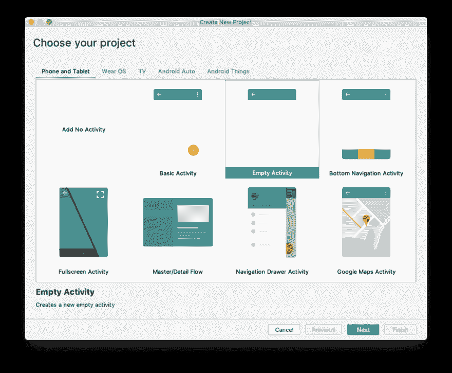
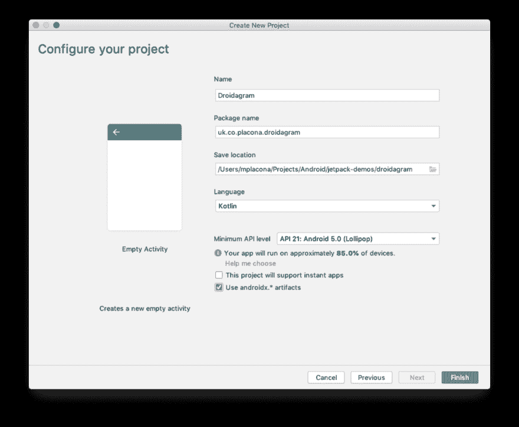
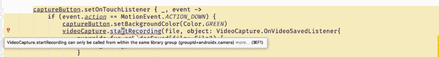

# 用摄像头在 android 中构建视频录制应用程序

> 原文：<https://dev.to/mplacona/building-a-video-recording-application-in-android-with-camerax-2ibb>

在 Android 中录制视频曾经是一项非常复杂的任务，需要编写大量样板代码来初始化相机，然后保持对视频状态及其元数据的控制。

随着 [CameraX](https://developer.android.com/jetpack/androidx/releases/camerax) 到 [Android Jetpack](https://developer.android.com/jetpack) 的引入，只需要几行代码就可以实现。让我们构建一个视频录制应用程序。

# 设置

> 如果你只是想看着它运行，而不是跟随它，你可以在这个库中下载这个项目的代码。

在 Android Studio 中，创建一个包含空活动的新项目。

[](https://res.cloudinary.com/practicaldev/image/fetch/s--Zwt2Qkdb--/c_limit%2Cf_auto%2Cfl_progressive%2Cq_auto%2Cw_880/https://placona.co.img/2019/05/camerax-01.png)

在下一个屏幕上给你的项目命名，我给我的项目命名为`Droidagram`，并确保检查了`Use androidx.* artifacts`。我将在这里使用 Kotlin，但是如果您喜欢输入更多的代码，您可以随意使用 Java。

[](https://res.cloudinary.com/practicaldev/image/fetch/s--1M3ZoBFQ--/c_limit%2Cf_auto%2Cfl_progressive%2Cq_auto%2Cw_880/https://placona.co.img/2019/05/camerax-02.png)

打开你的`AndroidManifest.xml`，在`<application`标签前添加以下内容。

```
<uses-permission android:name="android.permission.CAMERA" />
<uses-permission android:name="android.permission.RECORD_AUDIO" /> 
```

Enter fullscreen mode Exit fullscreen mode

这确保我们请求正确的权限来打开摄像机并在设备上录制音频。

打开您的模块级别`build.gradle`，添加以下依赖项并同步:

```
def camerax_version = "1.0.0-alpha01"
implementation "androidx.camera:camera-core:${camerax_version}"
implementation "androidx.camera:camera-camera2:${camerax_version}" 
```

Enter fullscreen mode Exit fullscreen mode

在撰写本文时,“1.0.0-alpha01”是 CameraX 的最新版本，所以请务必在此处查看[以获得更新的版本，不过请记住，它可能会破坏您在此处看到的代码。](https://mvnrepository.com/artifact/androidx.camera/camera-core)

打开`activity_main.xml`，在 XML 视图上添加一个`TextureView`和一个`ImageButton`，而不是现有的`TextView`

```
<TextureView
            android:id="@+id/view_finder"
            android:layout_width="0dp"
            android:layout_height="0dp"
            app:layout_constraintTop_toTopOf="parent"
            app:layout_constraintBottom_toBottomOf="parent"
            app:layout_constraintStart_toStartOf="parent"
            app:layout_constraintEnd_toEndOf="parent" />

    <ImageButton
            android:layout_width="72dp"
            android:layout_height="72dp" app:srcCompat="@android:drawable/ic_menu_camera"
            android:id="@+id/capture_button" android:layout_marginBottom="24dp"
            app:layout_constraintBottom_toBottomOf="parent"
            app:layout_constraintEnd_toEndOf="parent" android:layout_marginEnd="8dp"
            app:layout_constraintStart_toStartOf="parent" android:layout_marginStart="8dp"
            android:layout_marginTop="8dp" app:layout_constraintTop_toBottomOf="@+id/view_finder"
            app:layout_constraintHorizontal_bias="0.498" app:layout_constraintVertical_bias="0.748"
            android:background="#F44336"/> 
```

Enter fullscreen mode Exit fullscreen mode

如果您现在运行这个应用程序，您将会看到类似如下的内容:

[](https://res.cloudinary.com/practicaldev/image/fetch/s--vb9nNc2y--/c_limit%2Cf_auto%2Cfl_progressive%2Cq_auto%2Cw_880/https://placona.co.img/2019/05/camerax-03.png)

# 添加摄像机预览

为了能够预览摄像机，我们需要首先请求权限。我们通过`MainActivity.kt`并在`class`前添加几个常数来实现。

```
private const val REQUEST_CODE_PERMISSIONS = 10
private val REQUIRED_PERMISSIONS = arrayOf(Manifest.permission.CAMERA, Manifest.permission.RECORD_AUDIO)
private val tag = MainActivity::class.java.simpleName 
```

Enter fullscreen mode Exit fullscreen mode

这里的数字 10 只是一个任意的数字，我们用它来跟踪权限，然后我们有一个数组，其中包含我们需要的权限，这些权限与我们之前添加到清单中的内容相匹配。只要确保从`import android.Manifest`导入`Manifest`即可。

现在让我们改变这个类，使它也实现`LifecycleOwner`，因为我们稍后需要将我们的摄像机绑定到它。

```
class MainActivity : AppCompatActivity(), LifecycleOwner { 
```

Enter fullscreen mode Exit fullscreen mode

在类内部，在`onCreate`之前添加下面的`lateinit`变量。

```
private lateinit var viewFinder: TextureView
private lateinit var captureButton: ImageButton
private lateinit var videoCapture: VideoCapture 
```

Enter fullscreen mode Exit fullscreen mode

在`onCreate`内部，在`setContentView`之后添加以下代码行，以便在活动开始时请求权限:

```
viewFinder = findViewById(R.id.view_finder)
captureButton = findViewById(R.id.capture_button)

// Request camera permissions
if (allPermissionsGranted()) {
    viewFinder.post { startCamera() }
} else {
    ActivityCompat.requestPermissions(
        this, REQUIRED_PERMISSIONS, REQUEST_CODE_PERMISSIONS)
} 
```

Enter fullscreen mode Exit fullscreen mode

请注意，`allPermissionsGranted`和`startCamera`在 IDE 上都显示为红色。

在类的底部，就在`onCreate`之后，添加以下三个方法，错误警告消失:

```
override fun onRequestPermissionsResult(
    requestCode: Int, permissions: Array<String>, grantResults: IntArray) {
    if (requestCode == REQUEST_CODE_PERMISSIONS) {
        if (allPermissionsGranted()) {
            viewFinder.post { startCamera() }
        } else {
            Toast.makeText(this,
                "Permissions not granted by the user.",
                Toast.LENGTH_SHORT).show()
            finish()
        }
    }
}

private fun allPermissionsGranted(): Boolean {
    for (permission in REQUIRED_PERMISSIONS) {
        if (ContextCompat.checkSelfPermission(
                this, permission) != PackageManager.PERMISSION_GRANTED) {
            return false
        }
    }
    return true
}

private fun startCamera() {
    TODO("not implemented") //To change body of created functions use File | Settings | File Templates.
} 
```

Enter fullscreen mode Exit fullscreen mode

一旦用户决定是否接受我们可以在应用程序中使用摄像头，第一种和第二种方法将处理权限请求和响应。确保如果您现在运行应用程序，您对两者都说“允许”。

最后，我们将添加一些代码，以便在运行应用程序时在屏幕上显示相机预览。

从`startCamera`方法中删除`TODO`代码，并添加以下代码:

```
// Create configuration object for the viewfinder use case
val previewConfig = PreviewConfig.Builder().build()
// Build the viewfinder use case
val preview = Preview(previewConfig)

preview.setOnPreviewOutputUpdateListener {
    viewFinder.surfaceTexture = it.surfaceTexture
}

// Bind use cases to lifecycle
CameraX.bindToLifecycle(this, preview) 
```

Enter fullscreen mode Exit fullscreen mode

上面的代码是你预览相机所需要的全部。如果您现在运行该应用程序，它会为您的设备或模拟器打开摄像头。现在是一个很好的机会来尝试一下，看看是否一切都配置正确。

# 编程按钮

我想让这个按钮只在我按住的时候录音，松开时停止录音。让我们将这个逻辑添加到方法结束之前的`onCreate`中。

```
captureButton.setOnTouchListener { _, event ->
    if (event.action == MotionEvent.ACTION_DOWN) {
        captureButton.setBackgroundColor(Color.GREEN)

    } else if (event.action == MotionEvent.ACTION_UP) {
        captureButton.setBackgroundColor(Color.RED)
    }
    false
} 
```

Enter fullscreen mode Exit fullscreen mode

按住按钮会改变它的背景颜色，松开按钮会恢复到原来的颜色。

# 录制视频

现在我们准备录制视频。就在按钮的逻辑之前，添加下面的变量，这样我们就获得了保存记录的位置和文件名。

```
val file = File(externalMediaDirs.first(),
            "${System.currentTimeMillis()}.mp4") 
```

Enter fullscreen mode Exit fullscreen mode

现在我们只需要改变我们的按钮，当按下时，它也开始记录，当释放时，它停止记录。

```
captureButton.setOnTouchListener { _, event ->
    if (event.action == MotionEvent.ACTION_DOWN) {
        captureButton.setBackgroundColor(Color.GREEN)
        videoCapture.startRecording(file, object: VideoCapture.OnVideoSavedListener{
        override fun onVideoSaved(file: File?) {
            Log.i(tag, "Video File : $file")
        }
        override fun onError(useCaseError: VideoCapture.UseCaseError?, message: String?, cause: Throwable?) {
            Log.i(tag, "Video Error: $message")
        }
    })

    } else if (event.action == MotionEvent.ACTION_UP) {
        captureButton.setBackgroundColor(Color.RED)
        videoCapture.stopRecording()
        Log.i(tag, "Video File stopped")
    }
    false
} 
```

Enter fullscreen mode Exit fullscreen mode

如果你运行的是 CameraX 版本`1.0.0-alpha01`，你会注意到在`startRecording`和`stopRecording`方法下有一条红色的曲线。这是因为该功能仍然是高度实验性的，可能会改变，并且仍然受到限制。

[](https://res.cloudinary.com/practicaldev/image/fetch/s--VUFRTVb_--/c_limit%2Cf_auto%2Cfl_progressive%2Cq_auto%2Cw_880/https://placona.co.img/2019/05/camerax-04.png)

您可以通过在这个类的顶部添加以下内容来告诉编译器忽略这些内容:

```
@SuppressLint("RestrictedApi")
class MainActivity : AppCompatActivity(), LifecycleOwner { 
```

Enter fullscreen mode Exit fullscreen mode

我们需要做的最后一件事是初始化录像机用例，所以当摄像机启动时，我们告诉它准备好一些记录动作。转到`startCamera`方法，在`val preview = ...`之后添加下面的代码:

```
// Create a configuration object for the video use case
val videoCaptureConfig = VideoCaptureConfig.Builder().apply {
    setTargetRotation(viewFinder.display.rotation)
}.build()
videoCapture = VideoCapture(videoCaptureConfig) 
```

Enter fullscreen mode Exit fullscreen mode

这为视频捕获用例创建了一个新的配置，并初始化了我们拥有的最后一个未初始化的 lateinit 变量，称为`videoCapture`。让我们也将它绑定到生命周期，将其改为:

```
// Bind use cases to lifecycle
CameraX.bindToLifecycle(this, preview, videoCapture) 
```

Enter fullscreen mode Exit fullscreen mode

运行应用程序并按住 record 按钮，一旦你释放它，你的视频就会被保存到文件系统中。您可以前往`/storage/emulated/0/Android/media/[your.package.name]`查看您的录像。

这就是使用 JetPack 的这个新功能所需要的全部。获取录音，并通过联系我让我知道你的想法 [@marcos_placona](https://twitter.com/marcos_placona) 。