# 生成 Visual Studio 代码扩展

> 原文：<https://dev.to/azure/building-a-visual-studio-code-extension-dkj>

# Visual Studio 代码扩展开发

我不喜欢帖子里冗长的介绍，因为你知道是什么把你带到这里的，不需要这些废话。让我们开始吧...

## 假设

*   你知道 [Visual Studio 代码(VS 代码)](https://code.visualstudio.com/?WT.mc_id=devto-blog-brcl)
*   您熟悉 VS 代码中的[扩展，并且使用过一些，但以前没有构建过](https://marketplace.visualstudio.com/vscode?WT.mc_id=devto-blog-brcl)
*   你至少知道一点儿 [TypeScript](https://www.typescriptlang.org/) /JavaScript 和 Node.js

> 如果你真的不知道这些中的一个或任何一个，那也没关系，因为我们不太关注代码，但是如果你有什么不明白的，请在下面留下评论，我会尽快回复你。

*   您已经安装了以下软件:

    *   [Node.js](https://nodejs.org)
    *   [npm](https://www.npmjs.com/) (或[纱](https://yarnpkg.com))
    *   约曼

        `npm i -g yo`

    *   [VS 代码约曼发生器](https://github.com/Microsoft/vscode-generator-code)

        `npm i -g generator-code`

### 可以构建什么样的扩展？

你可以建造任何你想建造的东西。您可以构建几个主要的扩展“类型”,这可以让您更好地了解从哪里开始。让我们按照你可能想做的事情来把它们分类。

#### 1。定制 VS 代码的外观和感觉

这是什么意思？颜色主题和图标主题。颜色主题实际上是第一次扩展的一个很好的起点。为了更好地理解，让我们先把它们再分解一下。

*   颜色主题

这种类型的扩展定制了 VS 代码的视觉外观。您可以在用户界面(UI)中的许多不同方面更改颜色。这可能会让人不知所措。使用一个你喜欢但想修改的现有主题是开始创建你自己的主题的好方法。这样做会给你很多颜色变化的例子，你可以调整并很快看到结果。然而，我们很快就会看到从头开始是多么容易。

写这篇文章时，我最喜欢的主题是[莎拉·德拉斯纳](https://twitter.com/sarah_edo)的[夜猫子](https://marketplace.visualstudio.com/items?itemName=sdras.night-owl&WT.mc_id=devto-blog-brcl)

[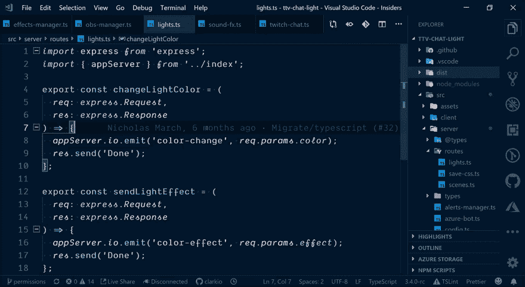](https://res.cloudinary.com/practicaldev/image/fetch/s--U4M6yWzS--/c_limit%2Cf_auto%2Cfl_progressive%2Cq_66%2Cw_880/https://thepracticaldev.s3.amazonaws.com/i/aqx4ru3kvmv30wmnh8yr.gif)

*   图标主题

这种类型的扩展定制与文件/文件夹类型相关联的图形。一个很好的例子是[材质图标主题](https://marketplace.visualstudio.com/items?itemName=PKief.material-icon-theme&WT.mc_id=devto-blog-brcl)(这是我使用的)。

[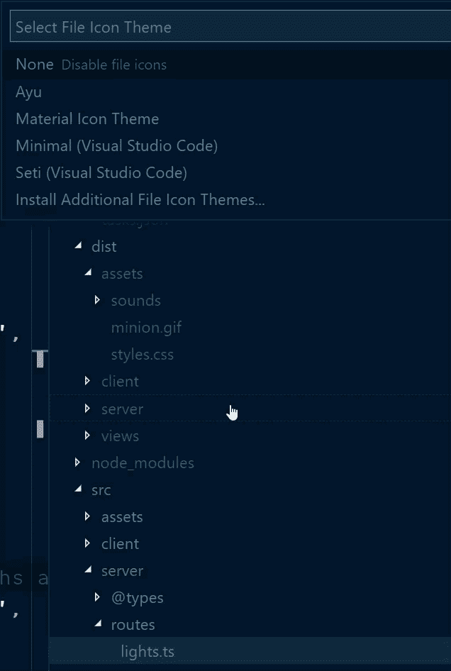](https://res.cloudinary.com/practicaldev/image/fetch/s--yGPIBu8U--/c_limit%2Cf_auto%2Cfl_progressive%2Cq_66%2Cw_880/https://thepracticaldev.s3.amazonaws.com/i/c7osr8qz093hr1133zd4.gif)

* * *

#### 2。扩展现有功能

这是什么意思？这意味着在 VS 代码中有一些现有的能力/特性，但是你希望它有更多的东西。一个简单的例子是创建新的键映射，使那些习惯于在另一个编辑器中使用某些键盘快捷键的人更容易使用。一个类似的例子是一个扩展，它提供代码片段来生成在 Node.js 应用程序中重用的公共代码。

以下是一些简单的例子:

*   键盘映射扩展[升华文本](https://marketplace.visualstudio.com/items?itemName=ms-vscode.sublime-keybindings&WT.mc_id=devto-blog-brcl)
*   代码片段扩展 [Vue.js 片段](https://marketplace.visualstudio.com/items?itemName=hollowtree.vue-snippets&WT.mc_id=devto-blog-brcl)

更复杂的例子:

*   用 Git 增强源代码控制: [GitLens](https://marketplace.visualstudio.com/items?itemName=eamodio.gitlens&WT.mc_id=devto-blog-brcl)
*   提高代码可读性:[括号对着色](https://marketplace.visualstudio.com/items?itemName=CoenraadS.bracket-pair-colorizer-2&WT.mc_id=devto-blog-brcl)

* * *

#### 3。添加新功能

这是什么意思？这意味着 VS 代码没有提供你想要使用的某种功能。在这种情况下，我们构建一个添加该功能的扩展。

示例:

*   **问题**:没有原生支持连接 Chrome 的调试器进行前端 web 开发。

    **解决方案**:Chrome 扩展的[调试器](https://marketplace.visualstudio.com/items?itemName=msjsdiag.debugger-for-chrome&WT.mc_id=devto-blog-brcl)

*   **问题**:在编写 Python 代码时，没有对智能完成(Intellisense)的本地支持

    **解决方案** : [Python 扩展](https://marketplace.visualstudio.com/items?itemName=ms-python.python&WT.mc_id=devto-blog-brcl)

*   **问题**:不支持集成 Twitch 聊天消息来控制高亮代码行

    **解决方案**:用于抽动延伸的[线条荧光笔](https://marketplace.visualstudio.com/items?itemName=clarkio.twitch-highlighter&WT.mc_id=devto-blog-brcl)

* * *

#### 4。将其他扩展聚合到一个地方

这是什么意思？您将许多扩展放在一个包中，帮助完成特定的焦点/动作类别。本质上，有许多扩展对于您正在进行的开发类型来说是非常好的，但是您可能没有意识到它们。有人可以将它们收集在一起，使它们更容易找到并立即安装。

这方面的一个例子是[Angular Essentials](https://marketplace.visualstudio.com/items?itemName=johnpapa.angular-essentials&WT.mc_id=devto-blog-brcl)extension pack，它将一堆与角度相关的扩展打包到一个地方。在 [GitHub](https://github.com/johnpapa/vscode-angular-essentials) 上查看源代码，看看创建一个需要做些什么。

> 这些类型的扩展由它们的`package.json`文件驱动，以定义包含在包中的其他扩展。见 Angular Essentials 的例子 [package.json](https://github.com/johnpapa/vscode-angular-essentials/blob/master/package.json#L33)

### 如何构建扩展？

最简单的扩展之一是颜色主题扩展。现在让我们一步一步地构建其中的一个。

#### 构建颜色主题扩展

让我们从头开始构建一个颜色主题扩展，来感受一下如何创建我们的第一个扩展。我们将使用 VS 代码 Yeoman 生成器，因此请确保您在终端/命令提示符下执行了以下命令:

```
npm i -g generator-code 
```

Enter fullscreen mode Exit fullscreen mode

> 这将安装 Yeoman CLI 工具和 VS 代码模板/脚手架生成器，作为其中的一个选项

一旦你安装了它，转到你想用于开发的主文件夹/目录(例如:`cd /my/dev/folder`)并运行下面的命令开始:

```
yo code 
```

Enter fullscreen mode Exit fullscreen mode

系统会提示您选择想要创建的扩展类型。使用键盘箭头键移动到“新颜色主题”选项，并按下`Enter`键。

[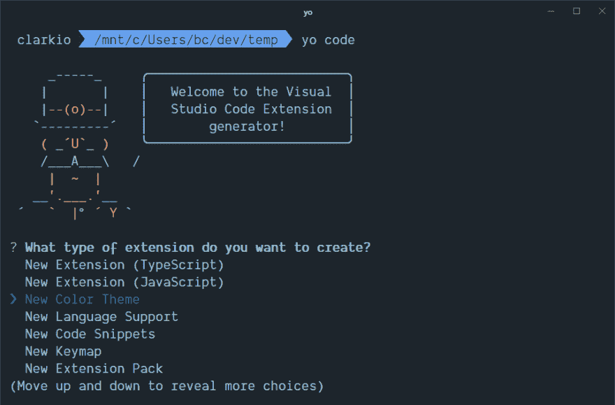](https://res.cloudinary.com/practicaldev/image/fetch/s--upBojB37--/c_limit%2Cf_auto%2Cfl_progressive%2Cq_auto%2Cw_880/https://thepracticaldev.s3.amazonaws.com/i/7lz6dwz8iislcffxg4fv.png)

接下来，将提示您选择导入或转换现有的颜色主题。选择选项“不，重新开始”

[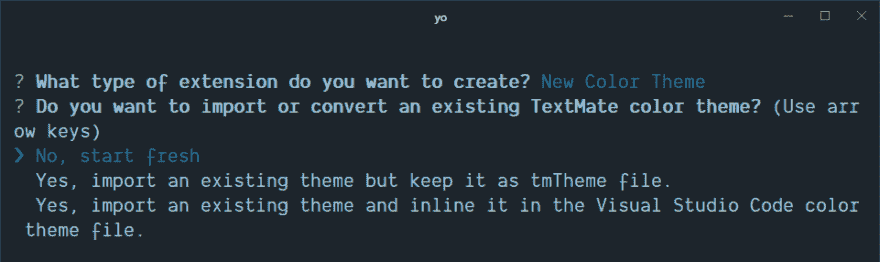](https://res.cloudinary.com/practicaldev/image/fetch/s--fli_7DFw--/c_limit%2Cf_auto%2Cfl_progressive%2Cq_auto%2Cw_880/https://thepracticaldev.s3.amazonaws.com/i/bt9svgb4vdow9iqjq9cm.png)

从这里开始，提示将要求您提供关于扩展的详细信息。

*   `name`:这决定了它将在你当前目录下创建的文件夹。
*   这是将在扩展市场中使用的，以便其他人找到它，所以如果你计划以后发布它，请确保这是唯一的(我通常使用我的用户名句柄，后跟扩展/主题的名称)。
*   描述你的扩展的更长的格式文本
*   你的主题名称:这是用户在 VS 代码中切换主题时看到的一个选项(在安装之后)
*   这给了你一个创建主题的起点，而不是试图找出如何从头开始创建一个。选择最适合您要创建的颜色主题类型的选项:深色、浅色、高对比度

[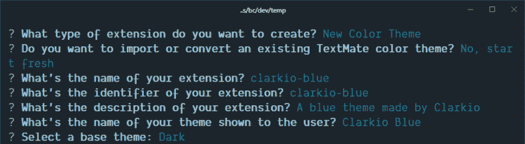](https://res.cloudinary.com/practicaldev/image/fetch/s--JEfyFTL0--/c_limit%2Cf_auto%2Cfl_progressive%2Cq_auto%2Cw_880/https://thepracticaldev.s3.amazonaws.com/i/e6x6l1vfo5vo55gedk8o.png)

当你输入完你的颜色主题的所有选项后，在最后一个提示下按`Enter`键开始生成所有的东西。您将在终端/命令提示符下看到一些进展，显示它为您生成的文件和文件夹。

[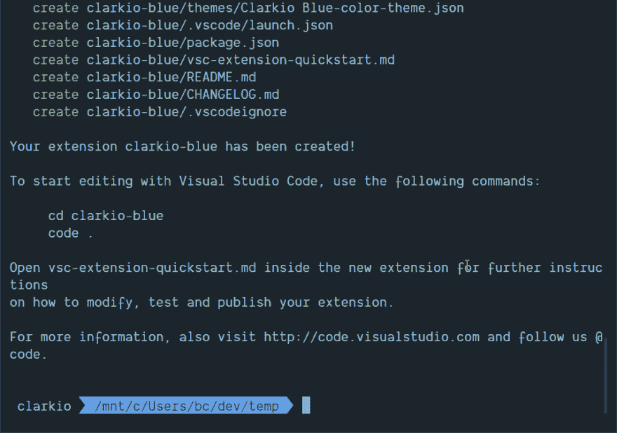](https://res.cloudinary.com/practicaldev/image/fetch/s--b1W6QV0p--/c_limit%2Cf_auto%2Cfl_progressive%2Cq_auto%2Cw_880/https://thepracticaldev.s3.amazonaws.com/i/j5ttotn1201k7zeu6y86.png)

完成后，您应该会看到一条消息，内容如下:“要开始编辑 Visual Studio 代码，请使用以下命令:”运行下面显示的命令，您会看到 VS Code 打开了颜色主题扩展的文件夹。

[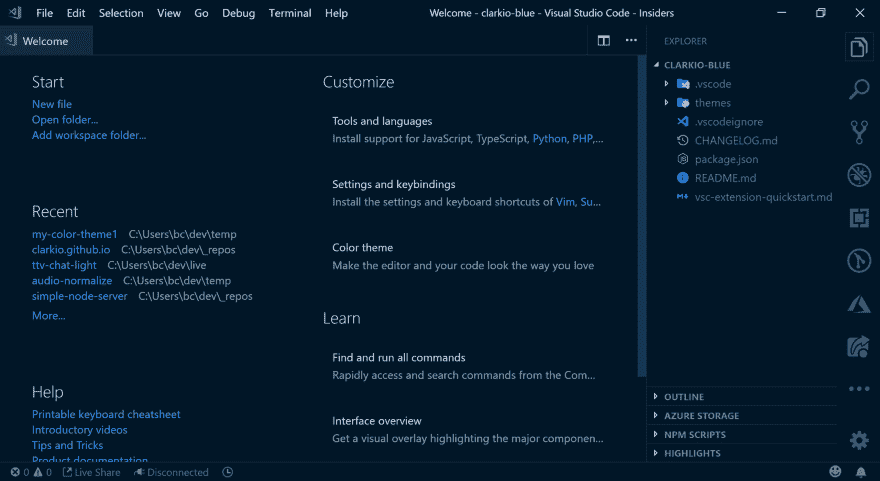](https://res.cloudinary.com/practicaldev/image/fetch/s--jrF93jGT--/c_limit%2Cf_auto%2Cfl_progressive%2Cq_auto%2Cw_880/https://thepracticaldev.s3.amazonaws.com/i/zvcxfnq5rl8ojd6ahc20.png)

使用键盘快捷键`CTRL/CMD + SHIFT + D`在 VS 代码中打开调试器视图(或者点击有 bug 的图标)。点击绿色的“播放”按钮(如下图所示)开始调试/运行你的颜色主题扩展。

[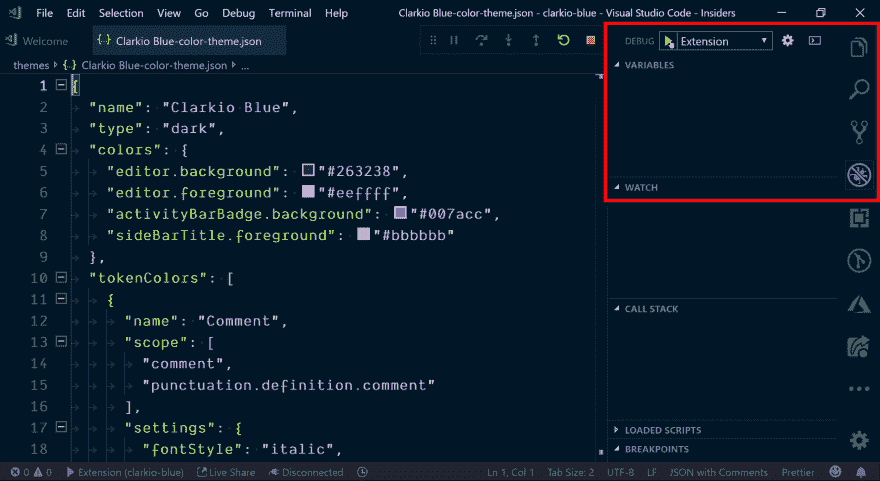](https://res.cloudinary.com/practicaldev/image/fetch/s--a8Gc0e3F--/c_limit%2Cf_auto%2Cfl_progressive%2Cq_auto%2Cw_880/https://thepracticaldev.s3.amazonaws.com/i/kat6ziphx2qpp9nsupld.png)

一旦运行，您将看到一个新的 VS 代码实例打开，标题为“扩展开发主机”。这是一个单独的 VS 代码实例，运行时加载了您的扩展。回到上一步，当在终端/命令提示符中生成这个颜色主题扩展时，我为我的基本主题选择了“深色”选项，因此我将它视为 VS 代码的扩展开发主机实例中的默认颜色。根据您在该步骤中选择的基本主题，您可能会看到不同的颜色。让我们测试一下改变主题的颜色。

[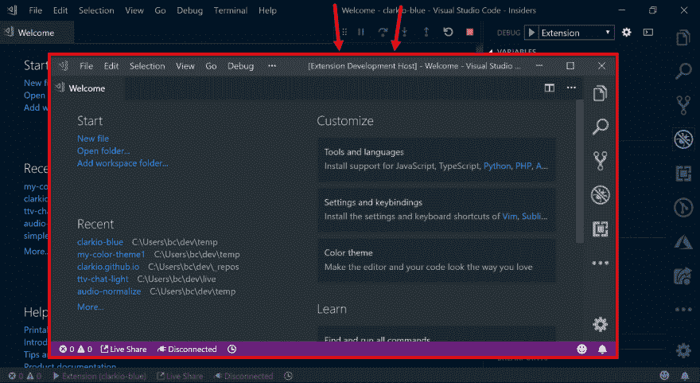](https://res.cloudinary.com/practicaldev/image/fetch/s--a_DMfJIk--/c_limit%2Cf_auto%2Cfl_progressive%2Cq_auto%2Cw_880/https://thepracticaldev.s3.amazonaws.com/i/d63w8m50wbqjnzehkweb.png)

回到另一个打开了扩展文件夹的 VS 代码实例。展开“主题”文件夹，双击`.json`文件打开/查看内容。

[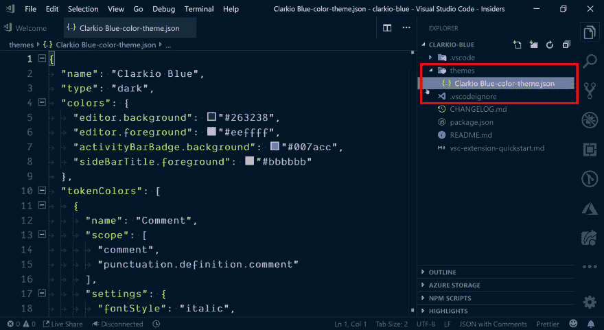](https://res.cloudinary.com/practicaldev/image/fetch/s--44Jna96K--/c_limit%2Cf_auto%2Cfl_progressive%2Cq_auto%2Cw_880/https://thepracticaldev.s3.amazonaws.com/i/iaz9vbpywvvpire7tm6b.png)

现在在 JSON 文件中的`colors`键下找到`editor.background`键。将鼠标悬停在`string`值上，在 VS 代码中显示颜色选择器视图。小心地将你的鼠标移动到颜色选择器弹出视图中，将颜色改为不同的颜色。您将看到`string`值发生变化。

[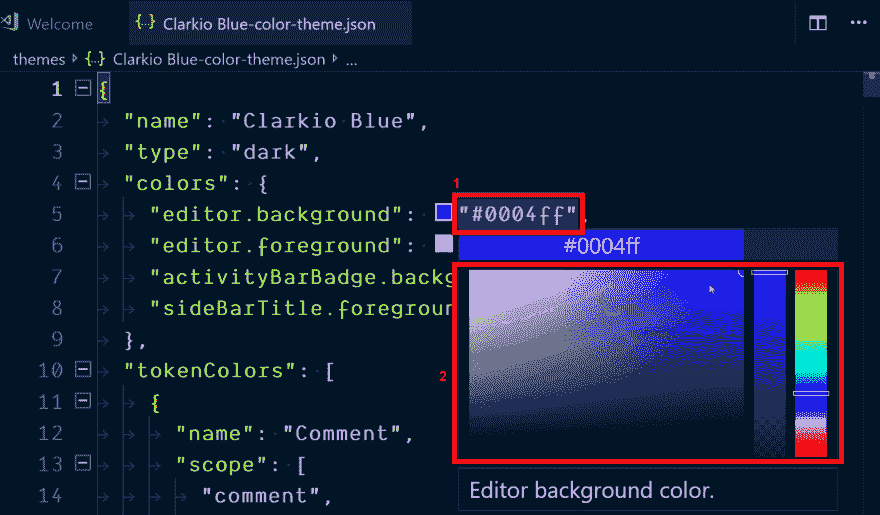](https://res.cloudinary.com/practicaldev/image/fetch/s--0evWUYJx--/c_limit%2Cf_auto%2Cfl_progressive%2Cq_auto%2Cw_880/https://thepracticaldev.s3.amazonaws.com/i/agw0c23qixn1ymkrm4mp.png)

一旦你保存了你的修改，你会看到 VS 代码的“扩展开发主机”会自动更新并显示颜色的变化。

[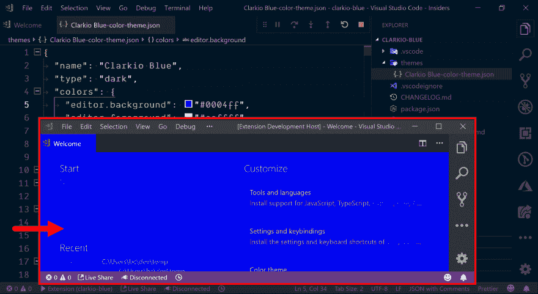](https://res.cloudinary.com/practicaldev/image/fetch/s--XX1ep-w1--/c_limit%2Cf_auto%2Cfl_progressive%2Cq_auto%2Cw_880/https://thepracticaldev.s3.amazonaws.com/i/jb15tt8902y8kt7959qy.png)

你做到了！祝贺您为 Visual Studio 代码创建了第一个扩展！随意继续调整`.json`文件中的颜色选项，进一步定制你的颜色主题扩展。

#### 多建点东西

创建一个颜色主题扩展是很棒的，但它并没有深入到增强或创建 VS 代码中的特性。让我们通过创建一个扩展来创建一个文件，该文件列出了我们在 VS 代码中使用的所有扩展。

转到您希望用于开发的主文件夹/目录(例如:`cd /my/dev/folder`)并运行以下命令开始:

```
yo code 
```

Enter fullscreen mode Exit fullscreen mode

系统会提示您选择想要创建的扩展类型。使用键盘箭头键移动到“新扩展名(TypeScript)”选项，并按下`Enter`键。

[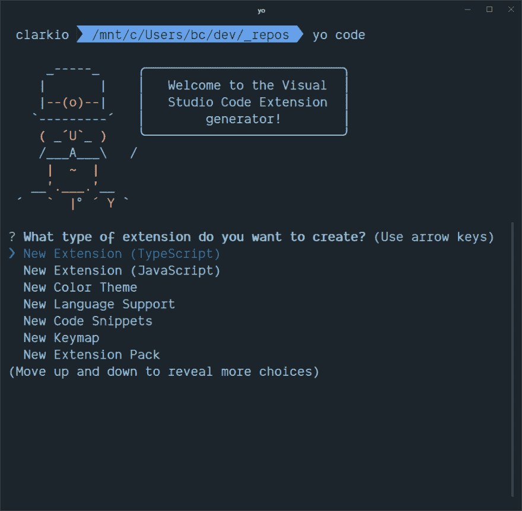](https://res.cloudinary.com/practicaldev/image/fetch/s--PXRmmMNr--/c_limit%2Cf_auto%2Cfl_progressive%2Cq_auto%2Cw_880/https://thepracticaldev.s3.amazonaws.com/i/6k3x1lxdkjp2y4s6qdks.png)

从这里开始，提示将要求您提供关于扩展的详细信息。

*   `name`:这决定了它将在你当前目录下创建的文件夹。
*   这是将在扩展市场中使用的，以便其他人找到它，所以如果你计划以后发布它，请确保这是唯一的(我通常使用我的用户名句柄，后跟扩展/主题的名称)。
*   描述你的扩展的更长的格式文本
*   你的主题名称:这是用户在 VS 代码中切换主题时看到的一个选项(在安装之后)
*   `git repository`:这给了你是否将项目初始化为一个新的 git 库的选项
*   在 npm 和 yarn 之间选择你喜欢的

[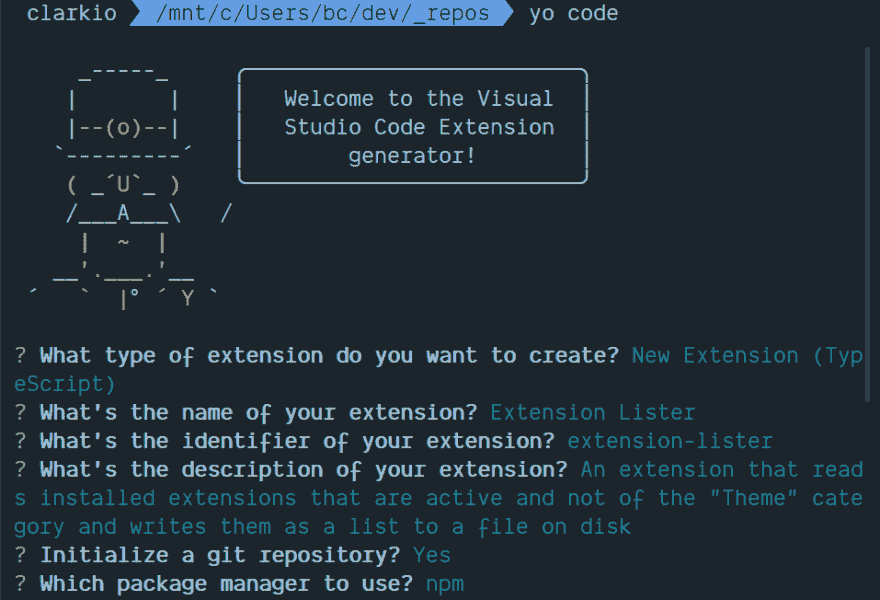](https://res.cloudinary.com/practicaldev/image/fetch/s--j7Iqw8cg--/c_limit%2Cf_auto%2Cfl_progressive%2Cq_auto%2Cw_880/https://thepracticaldev.s3.amazonaws.com/i/93uji99emqhn7f6i8gek.png)

切换到新生成的扩展目录，并在 VS 代码中打开它

[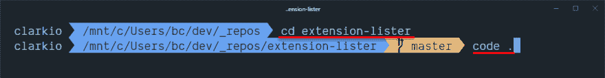](https://res.cloudinary.com/practicaldev/image/fetch/s--HM0ViJnX--/c_limit%2Cf_auto%2Cfl_progressive%2Cq_auto%2Cw_880/https://thepracticaldev.s3.amazonaws.com/i/hr56jncdzqs9lujclqzq.png)

VS 代码扩展利用`package.json`作为它们的清单，并在传统选项之外用一些进一步的选项来扩展它。我们不会对所有这些进行详细描述，但是为了这个扩展的目的，我们需要改变一些。

1.  打开`package.json`文件，找到`activationEvents`键。这定义了什么动作将激活您的扩展。目前它被定义为当命令“helloWorld”被触发时激活你的扩展。你会看到这是一个字符串值`"onCommand:extension.helloWorld"`。为了确保我们与这个新扩展的意图保持一致，用`createList`替换`helloWorld`，因为这将是我们将创建的命令的名称。

2.  在`activationEvents`键下方不远处，你会发现另一个键`contributes`。这定义了您的扩展可以“贡献”给 VS 代码的许多方式。目前它有一个明确的选项，那就是通过`commands`选项。这是一个数组，定义了扩展将通过命令面板提供给 VS 代码的各种命令。您应该看到一个定义为`extension.helloWorld`的命令。在 VS 代码中连接命令时，该命令的“extension”部分充当名称空间,“helloWorld”部分在您的扩展中为该命令创建一个惟一的名称。我们需要确保这得到改变，以匹配我们在`activationEvents`中更新的内容，所以用`createList`替换这里的`helloWorld`。

3.  命令定义中的`title`键提供了将在命令面板中显示给用户的文本。将该键的值更改为`Create List`。我们在这个文件中要改变的最后一件事是在`title`下面添加另一个键，所以在`title`值的末尾加一个逗号，然后按“Enter”键换一个新行。添加一个键`"category"`(智能感知应该也会弹出来提供帮助)并给它一个值`"Extension Lister"`。这个`category`有助于可视化地对命令进行分组，以便它们在命令面板中显示为如下所示:“”(例如:“扩展监听器:创建列表”)

[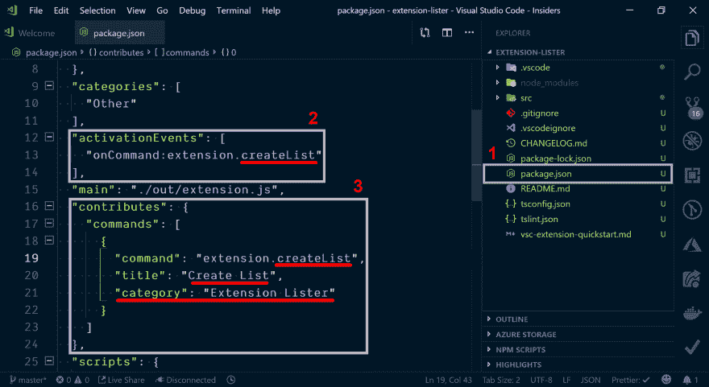](https://res.cloudinary.com/practicaldev/image/fetch/s--8A0t08Bw--/c_limit%2Cf_auto%2Cfl_progressive%2Cq_auto%2Cw_880/https://thepracticaldev.s3.amazonaws.com/i/l9j8dj4c9v9umzt4og5p.png)

让我们开始构建这个扩展的功能。在`src`文件夹中，你会看到一个文件`extension.ts`。这是用于加载扩展和相应功能的主文件。花点时间阅读代码中的注释，这些注释有助于描述为您生成的部分代码...认真去读完再回来。

现在您对代码已经比较熟悉了，让我们来设置第一个命令。我们首先需要更新我们的命令代码，以匹配我们在`package.json`中所做的更改。找到代码`registerCommand('extension.helloWorld'`，将`helloWorld`替换为`createList`。

[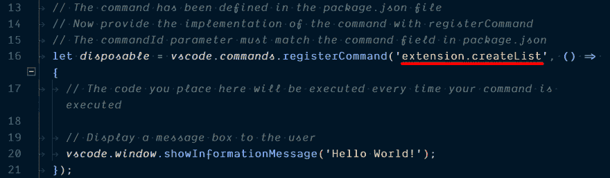](https://res.cloudinary.com/practicaldev/image/fetch/s--0sfV6oCs--/c_limit%2Cf_auto%2Cfl_progressive%2Cq_auto%2Cw_880/https://thepracticaldev.s3.amazonaws.com/i/nnwrbgpt8e84qf5bzilb.png)

好了，命令连接正确，我们准备开始收集扩展列表。VS 代码 API 提供了一个名称空间`extensions`，它包含了在`all`数组下实例中所有可用扩展的列表。我们通过`import * as vscode from 'vscode';`语句访问 API。因为这已经在`registerCommand`(第 17 行)中完成了，所以让我们抓取数组并将其赋给一个常量。将代码行`vscode.window.showInformationMessage('Hello World!');`(及其上面的注释)替换为以下代码:

```
const activeExtensions = vscode.extensions.all; 
```

Enter fullscreen mode Exit fullscreen mode

如果您在这一行运行并调试带有断点的扩展，您会注意到数组包含了几乎所有安装的扩展，并可用于运行该扩展的 VS 代码实例。现在您可以自己尝试一下，但这不是必需的。这是一个好的开始，但是如果你检查扩展的集合，你会注意到它包括为 VS 代码内置的扩展，那些当前不活跃的扩展和主题扩展。

因为我们得到的扩展超出了我们想要包含在列表中的范围(活动的，非主题类型，扩展),所以我们需要先过滤一些结果。添加下面的数组方法`filter`，以捕获范围内的扩展。

```
const activeExtensions = vscode.extensions.all.filter(
  (extension: vscode.Extension<any>) => {
    return (
      extension.isActive && // make sure it is active
      !extension.packageJSON.isBuiltin && // don't include built in
      !extension.packageJSON.categories.some(
        // don't include themes
        (category: string) => category.toLocaleLowerCase() === 'themes'
      )
    );
  }
); 
```

Enter fullscreen mode Exit fullscreen mode

接下来，我们希望将写入文件的内容格式化如下:`<extension name>: <extension marketplace URL>`。这将使共享变得容易，并允许其他人快速安装扩展。为此，让我们遍历扩展数组，创建一个要写入文件的内容字符串。使用下面的代码来完成，并在定义和分配了`activeExtensions`数组之后添加它:

```
let extensionListData = ''; // variable to hold the file contents as a string
activeExtensions.forEach((extension: vscode.Extension<any>) => {
  // thanks to TypeScript and the exposed Extension type from the VS Code API we get intellisense to see the properties of each extension.
  // In particular we want to read the display name property found in the `packageJSON` object and generate the URL using the extension ID property
  extensionListData += `${
    extension.packageJSON.displayName
  }: https://marketplace.visualstudio.com/items?itemName=${extension.id}\n`;
}); 
```

Enter fullscreen mode Exit fullscreen mode

此时，我们已经有了我们需要的数据，并且是人类可读的格式，所以我们准备好询问用户他们想在哪里保存这个文件。对于可视提示和队列，VS 代码通过其`window`名称空间提供选项。我们特别想要`showSaveDialog`函数。我们可以向它提供一些选项/参数，以便在该对话框中帮助创建更好的用户体验。我们知道这只是一个纯文本文件，所以我们将提供一个过滤选项，将文件类型限制为`*.txt`。

当用户在保存对话框中完成他们的动作时，文件的结果 URI(通用资源指示器)将在 promise `.then()` resolve 函数中返回给我们。我们需要首先确保确实提供了 URI。如果不是，我们可以用`vscode.window.showErrorMessage()`显示一个错误对话框。一旦我们知道我们至少有一个值，我们可以写入文件，但让我们坚持一下。请看下面的代码，它完成了我们在本节中讨论的内容:

```
vscode.window.showSaveDialog({ filters: { '*': ['txt'] } }).then(uri => {
  if (!uri) {
    // This pops up an error notification dialog
    vscode.window.showErrorMessage(
      'You must select a file location to create the extension list'
    );
    return; // Don't proceed if we don't have a file URI to write to
  }
  // We'll add the code to write to a file here next...
}); 
```

Enter fullscreen mode Exit fullscreen mode

我们希望在操作系统的文件系统上实现对文件的写入，但是，我们不应该用那些代码污染我们的主扩展代码。让我们创建一个单独的文件来处理向文件系统写入文件。通过点击图标或使用键盘快捷键`CTRL/CMD + SHIFT + E`打开 VS 代码的文件浏览器视图。右键单击`src`文件夹并选择“新建文件”

[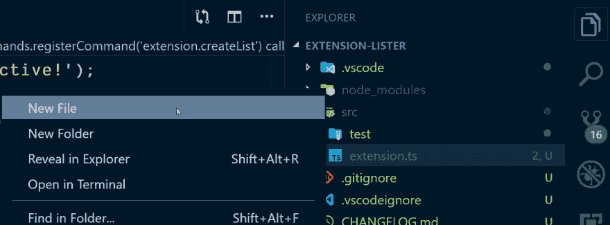](https://res.cloudinary.com/practicaldev/image/fetch/s--Jm9W3F96--/c_limit%2Cf_auto%2Cfl_progressive%2Cq_auto%2Cw_880/https://thepracticaldev.s3.amazonaws.com/i/4n8j7jm5cimw4va0z36z.png)

将其命名为`file-manager`,并按回车键完成文件创建。VS 代码应该会自动打开文件，如果没有，双击它。我们不会看下面的代码，因为它与 VS 代码扩展的创建并不相关，但是我们知道它处理的是将内容写入文件。如果您愿意，可以随时查看代码。将此添加到`file-manager.ts`文件并保存:

```
import { promises } from 'fs'; // leverage the Node.js file system module's functions

export function writeExtensionListFile(uri: string, data: any) {
  return promises.writeFile(uri, data);
} 
```

Enter fullscreen mode Exit fullscreen mode

我们现在可以从我们创建的`file-manager.ts`文件中导入`writeExtensionListFile()`函数来处理最后一步。再次打开`extension.ts`文件，在`vscode`导入(在第 3 行找到):
之后添加一个导入语句

```
import { writeExtensionListFile } from './file-manager'; 
```

Enter fullscreen mode Exit fullscreen mode

太好了，让我们用它吧。下到我们有`showSaveDialog`的地方，在检查`uri`值的部分之后添加下面的代码:

```
// Provide the full path on the file system for the file to write to and the contents we want to write to that file
writeExtensionListFile(uri.fsPath, extensionListData)
  .then(() => {
    // if the file was created successfully show an alert notification
    vscode.window.showInformationMessage(
      'Extension list was successfully created'
    );
  })
  .catch((error: any) => {
    // if the file failed to be created show an error notification
    vscode.window.showErrorMessage(
      'There was an issue creating the extension list'
    );
    console.error(error);
  }); 
```

Enter fullscreen mode Exit fullscreen mode

这段代码是做什么的？它调用函数`writeExtensionListFile`并传入完整的文件系统路径值(对象`uri`的一个属性)和我们想要写入的内容。如果成功通过，我们通过`vscode.window.showInformationMessage()`功能让用户知道，否则我们用`vscode.window.showErrorMessage()`功能显示一条错误消息。

> 如果有些东西不能正常工作，你可以使用下面的 GitHub 库作为完整代码的参考: [VS 代码扩展列表器](https://github.com/clarkio/vscode-extension-lister)

我们试一试怎么样？按`F5`开始调试或者在 VS 代码中打开调试视图，按绿色的“Play”按钮。

[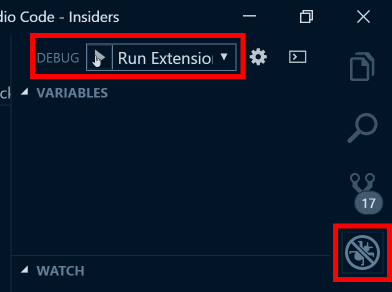](https://res.cloudinary.com/practicaldev/image/fetch/s--zsOCPBOY--/c_limit%2Cf_auto%2Cfl_progressive%2Cq_auto%2Cw_880/https://thepracticaldev.s3.amazonaws.com/i/vqgrwy8qvsdntk0k5l62.png)

然后，您将看到一个新的 VS 代码实例加载，标题为“扩展开发主机”，其中运行着您的扩展。使用键盘快捷键`CTRL/CMD + SHIFT + P`打开命令面板，并键入`lister`来查看我们的扩展可用的命令。

[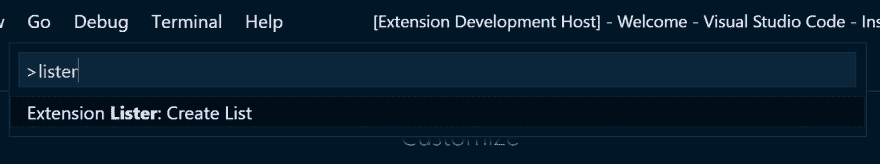](https://res.cloudinary.com/practicaldev/image/fetch/s--Lt0xaYsh--/c_limit%2Cf_auto%2Cfl_progressive%2Cq_auto%2Cw_880/https://thepracticaldev.s3.amazonaws.com/i/ull8yq84dx5g0tygeow5.png)

按下键盘上的“Enter”键，系统会提示您为文件选择一个位置和名称。为您的文件选择一个位置和名称，然后单击“保存”按钮。您应该会看到在 VS 代码的右下角弹出一个成功通知。

[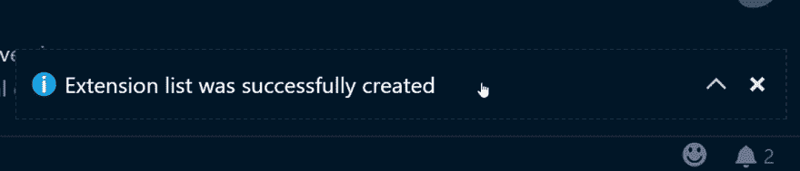](https://res.cloudinary.com/practicaldev/image/fetch/s--u5crruUg--/c_limit%2Cf_auto%2Cfl_progressive%2Cq_auto%2Cw_880/https://thepracticaldev.s3.amazonaws.com/i/x8deblmu2jenmlyuurm6.png)

只是为了确保转到您保存文件的位置并打开它来查看内容。您应该会看到您正在使用的活动扩展的完整列表及其 marketplace URLs。

[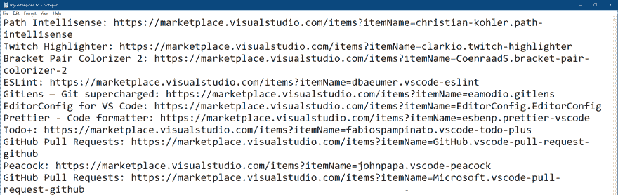](https://res.cloudinary.com/practicaldev/image/fetch/s--v4LZ3HeQ--/c_limit%2Cf_auto%2Cfl_progressive%2Cq_auto%2Cw_880/https://thepracticaldev.s3.amazonaws.com/i/l3mejaj13c3pgfkxz2yh.png)

恭喜你创建了另一个 VS 代码扩展，并且增加了新的功能！

### 如何发布扩展？

与其在这里再写同样的信息，不如看一看[发布扩展文档](https://code.visualstudio.com/api/working-with-extensions/publishing-extension?WT.mc_id=devto-blog-brcl)。VS Code 网站上提供的文档非常简单易懂，所以可以查看更多细节。

### 去哪里了解更多？

阅读更多关于 VS 代码扩展开发的最好地方是官方的 [VS 代码 API 文档](https://code.visualstudio.com/api?WT.mc_id=devto-blog-brcl)站点。您会在左侧找到一个目录，它是可扩展的，围绕扩展开发分解了重要的主题。

## 关闭

如果你还有其他问题没有在这里回答，请在评论中告诉我。我会定期检查，如果这种形式更合适的话，我会回复或发帖跟进。

感谢你阅读这篇文章，希望对你有所帮助。

在以下位置连接:

*   [推特](https://twitter.com/_clarkio)
*   [抽动](https://twitch.tv/clarkio)
*   [Instagram](https://instagram.com/_clarkio)
*   [GitHub](https://github.com/clarkio)
*   [YouTube](https://youtube.com/c/clarkio)
*   [网站](https://clarkio.com)