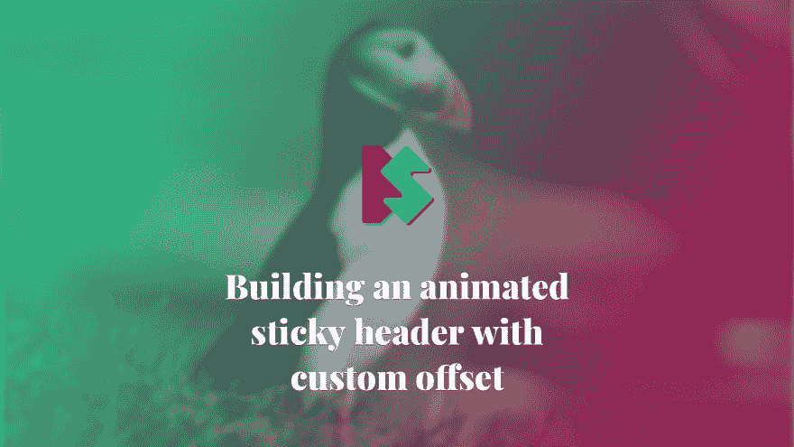

# 构建带有自定义偏移量的动画粘性标题

> 原文：<https://dev.to/starbist/building-an-animated-sticky-header-with-custom-offset-2o60>

[](https://www.silvestar.codes/articles/building-an-animated-sticky-header-with-custom-offset/)

*这篇文章最初发表于 [silvestar.codes](https://www.silvestar.codes/articles/building-an-animated-sticky-header-with-custom-offset/) 。*

粘性元素在整个网络中被广泛使用。随着`position: sticky`属性的出现，我们可以不用 JavaScript 插件来创建粘性元素。但是如果没有一点 JavaScript，用动画创建粘性元素是不可能实现的。

# 规格

任务是构建一个粘滞标题，当用户滚动静态标题或在自定义偏移位置时出现。向下滚动时，静态标题应该保持在原来的位置，而粘性标题应该向下滚动。向上滚动时，粘性标题应该消失，静态标题应该向下滚动。请注意，静态标头和粘性标头的内容是不同的。

# 解

为了更容易理解规格，请看这支包含完整解决方案的笔:

[https://codepen.io/CiTA/embed/BGQPBz?height=600&default-tab=result&embed-version=2](https://codepen.io/CiTA/embed/BGQPBz?height=600&default-tab=result&embed-version=2)

# 击穿

为了更好地理解这段代码是如何工作的，我们应该检查一下 HTML 结构。

## HTML

下面是 HTML 结构的简化预览:

```
<main>
  <header>
    <div class="header header--alpha">
      ...
    </div>
    <div class="header header--beta">
      ...
    </div>
  </header>
  <div class="fake-header"></div>
  <article>
    ... 
  </article>
</main> 
```

Enter fullscreen mode Exit fullscreen mode

在`main`元素中，我们有`header,` `.fake-header`和`article`元素。为了让`position: sticky`工作，粘性元素应该在可滚动元素内部——在我们的例子中是`main`元素。

标头包含两个元素:

*   `.header--alpha`、静态头，以及
*   `.header--beta`，粘粘的表头。

## CSS

首先，让我们设计包装元素的样式。默认情况下，它应该具有相对位置，一旦达到偏移量，它就具有粘性。

```
header {
  top: 0;
  position: relative;
  overflow: hidden;
}

header.sticky {
  position: sticky;
} 
```

Enter fullscreen mode Exit fullscreen mode

属性`top: 0`将确保我们的标题被粘贴到顶部，属性`overflow: hidden`隐藏了`header`元素之外的所有内容。

接下来，我们应该定义标题部分的行为。

```
.header--alpha {
  transition: .225s ease-out;
}

.sticky .header--alpha {
  opacity: .5;
  transform: translateY(-100%);
  transition: none;
} 
```

Enter fullscreen mode Exit fullscreen mode

`.header--alpha`，我们的静态头默认是可见的。当用户滚动超过偏移量时，包装器`header`元素变得有粘性，它将立即被转移到包装器元素之外，没有任何过渡效果。请注意，当粘滞效果不活动时，当元素回到原始位置时，它将被转换。

```
.header--beta {
  position: absolute;
  top: 0;
  left: 0;
  right: 0;
  opacity: .5;
  transform: translateY(-100%);
}

.sticky .header--beta {
  opacity: 1;
  transform: translateY(0);
  transition: .35s ease-out;
} 
```

Enter fullscreen mode Exit fullscreen mode

`.header--beta`，我们的粘性头被绝对定位并在包装器`header`元素之外被转换。当粘性效应被激活时，它将在原始位置进行平移和过渡。

## JavaScript

您可能已经注意到了`.fake-header`元素。

```
.fake-header {
  height: 1px;
  position: relative;
} 
```

Enter fullscreen mode Exit fullscreen mode

该元素用作滚动的偏移量。当它到达视窗顶部时，标题变得粘粘的。而当页眉变得有粘性时，伪元素会被推高页眉的高度加上一个额外的像素。当用户向上滚动并到达新位置的伪元素时，粘性效果将被关闭。

```
const $realSticky = document.querySelector("header");
const $fakeSticky = document.querySelector(".fake-header");

const stickyHeader = () => function() {
  const sr1 = $fakeSticky.getBoundingClientRect();
  const sr2 = $realSticky.getBoundingClientRect();

  if (sr1.top > 0) {
    $realSticky.classList.remove("sticky");
    $fakeSticky.style.top = 0;
  } else {
    $realSticky.classList.add("sticky");
    $fakeSticky.style.top = `-${sr2.height + 1}px`;
  }
};

window.addEventListener("scroll", _.debounce(stickyHeader(), 15)); 
```

Enter fullscreen mode Exit fullscreen mode

在本例中， [lodash debounce](https://lodash.com/docs/4.17.10#debounce) 函数用于在滚动事件时执行任务。

*我知道我可以写出更好的 JS 代码并避免添加`.fake-header`元素，但是我想创建一个没有太多计算的演示。*

## 额外

因为静态标题决定了包装元素的高度，所以一旦粘性标题出现，我们就很难选择或点击它后面的内容。

我们可以使用指针事件来解决这个问题:

```
header {
  pointer-events: none;
}

.header {
  pointer-events: all;
} 
```

Enter fullscreen mode Exit fullscreen mode

首先我们将`pointer-events`到`none`设置为`header`元素来禁用点击/悬停事件，然后我们将`pointer-events`设置为`all`来再次启用它们。

# 结论

你可以在我的代码笔上看到完整的演示[。](https://codepen.io/CiTA/pen/BGQPBz)

该演示使用了支持有限的 [`position: sticky`](https://caniuse.com/#search=position%3A%20sticky) 和 [`pointer-events`](https://caniuse.com/#search=pointer-events) 属性。

看到 CSS 发展如此之快，我真的很兴奋。全新的属性，如`position: sticky`和`pointer-events`允许我们更轻松、更自然地为最终用户创造更好的体验。而且支持一天比一天好。🏆