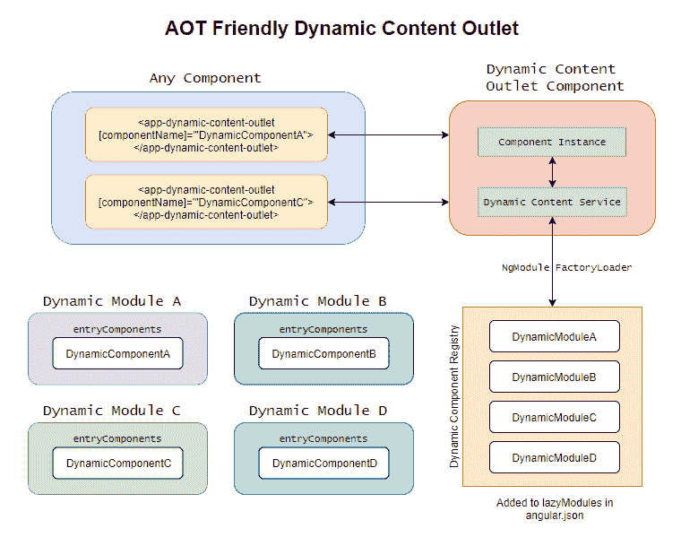

# 在 Angular 建立一个 AOT 友好的动态内容出口

> 原文：<https://dev.to/angular/building-an-aot-friendly-dynamic-content-outlet-inangular-217k>

[](https://res.cloudinary.com/practicaldev/image/fetch/s--1XO2U3LW--/c_limit%2Cf_auto%2Cfl_progressive%2Cq_auto%2Cw_880/https://wesleygrimes.com/assets/post_headers/dynamic_content_outlet_header.png)

# 概述—动态内容出口

您是否曾经需要在 Angular 应用程序中动态加载内容或组件？内置结构指令(`*ngIf*`，`*ngSwitch`)不提供的方式怎么样？您是否也需要使用提前编译的优化优势？

嗯，我有好消息要告诉你……(不，你不必是查克·诺里斯！)如果您保持关注，我将帮助您建立并运行一个解决方案，它将提供一种可靠的方法，在运行时从您的应用程序中选择并动态加载一组预定义的模块和组件。

> 本文假设您正在构建使用 Angular CLI 生成的 Angular 6+应用程序。有关使用 Angular CLI 的信息，请查阅[官方文档](https://angular.io/cli#cli-command-reference)。
> 
> 这是出于我工作的公司的业务需要。这里需要注意的是，很多文章和例子都是关于在 Angular 中动态加载内容的，但是我发现在启用了`—prod`或`—aot`标志的情况下编译 Angular 时，没有一篇文章和例子是可靠的。好消息是，我在这篇文章中描述的内容对于提前编译非常有效。

# 我们要做什么

我们将构建一个带有动态组件出口的特殊模块，它可以包含在您的应用程序中的任何地方并在其中使用。惟一的要求是预先注册一个数组，将动态组件映射到它们的父模块。您还将把这些模块添加到您的`angular.json`文件的`lazyModules`属性中。通过这样做，编译器将预编译这些模块。然后，编译器将它们分割成独立的小块，并在运行时通过 AOT 使它们对 SystemJS 加载器可用。

* * *

## 让我们建立我们的动态内容出口

假设您有一个现有的 Angular 6+ CLI 生成的项目，让我们通过以下步骤来构建构成这个新的动态内容出口的必要部分。

### 生成动态内容出口模块

通过在您选择的 shell 中运行以下命令，生成一个名为`DynamicContentOutletModule`的新模块:

```
$ ng g m dynamic-content-outlet 
```

我们稍后将回到本模块，并做好准备。

### 建立动态内容出口注册表

在新创建的文件夹`src/app/dynamic-content-outlet`下创建一个名为`dynamic-content-outlet.registry.ts`的新文件。这将作为将组件名数组映射到模块路径和模块名的占位符。现在，它将是一个空数组，如下所示。

```
interface RegistryItem {
  componentName: string;
  modulePath: string;
  moduleName: string;
}

/**
 * A registry array of Component Name to details
 * that must be updated with each new component
 * that you wish to load dynamically.
 */

export const DynamicContentOutletRegistry: RegistryItem[] = []; 
```

### 构建动态内容出口错误组件

在文件夹`src/app/dynamic-content-outlet/dynamic-content-outlet-error.component.ts`下创建一个新文件。这将作为在试图加载动态组件时出现错误时要呈现的组件。您可以定制`template`属性，以使用您可能有的任何定制样式或布局。`errorMessage`输入必须保持不变，并且在试图动态呈现您的组件时会被提供错误的实际细节。

```
import { Component, Input } from '@angular/core';

@Component({
  selector: 'app-dynamic-content-outlet-error-component',
  template: `
    <div>{{ errorMessage }}</div>
  `
})
export class DynamicContentOutletErrorComponent {
  @Input() errorMessage: string;
  constructor() {}
} 
```

### 构建动态内容出口服务

在文件夹`src/app/dynamic-content-outlet/dynamic-content-outlet.service.ts`下创建一个新文件。

*   该服务封装了使用 SystemJS 加载动态组件的逻辑，并将它们呈现到动态内容出口中。
*   它使用`DynamicContentOutletRegistry`通过`componentName`查找模块。
*   它还利用了一个新的`static`属性，我们稍后会将这个属性添加到我们希望动态加载的名为`dynamicComponentsMap`的每个模块中。这允许我们获取给定的`componentName`的类型文字，以便`resolveComponentFactory`可以实例化正确的组件。你可能会问为什么我们不在`DynamicContentOutletRegistry`中添加第四个属性，这是因为如果我们在注册表中导入该类型，那么它就违背了延迟加载这些模块的目的，因为该类型将包含在主包中。
*   如果出现错误，将显示一个包含错误信息的`DynamicContentOutletErrorComponent`。

```
import {
  ComponentFactoryResolver,
  ComponentRef,
  Injectable,
  Injector,
  NgModuleFactoryLoader,
  Type
} from '@angular/core';
import { DynamicContentOutletErrorComponent } from './dynamic-content-outlet-error.component';
import { DynamicContentOutletRegistry } from './dynamic-content-outlet.registry';

type ModuleWithDynamicComponents = Type<any> & {
  dynamicComponentsMap: {};
};

@Injectable()
export class DynamicContentOutletService {
  constructor(
    private componentFactoryResolver: ComponentFactoryResolver,
    private moduleLoader: NgModuleFactoryLoader,
    private injector: Injector
  ) {}

  async GetComponent(componentName: string): Promise<ComponentRef<any>> {
    const modulePath = this.getModulePathForComponent(componentName);

    if (!modulePath) {
      return this.getDynamicContentErrorComponent(
        `Unable to derive modulePath from component: ${componentName} in dynamic-content.registry.ts`
      );
    }

    try {
      const moduleFactory = await this.moduleLoader.load(modulePath);
      const moduleReference = moduleFactory.create(this.injector);
      const componentResolver = moduleReference.componentFactoryResolver;

      const componentType = (moduleFactory.moduleType as ModuleWithDynamicComponents)
        .dynamicComponentsMap[componentName];

      const componentFactory = componentResolver.resolveComponentFactory(
        componentType
      );
      return componentFactory.create(this.injector);
    } catch (error) {
      console.error(error.message);
      return this.getDynamicContentErrorComponent(
        `Unable to load module ${modulePath}.
                Looked up using component: ${componentName}. Error Details: ${
          error.message
        }`
      );
    }
  }

  private getModulePathForComponent(componentName: string) {
    const registryItem = DynamicContentOutletRegistry.find(
      i => i.componentName === componentName
    );

    if (registryItem && registryItem.modulePath) {
      // imported modules must be in the format 'path#moduleName'
      return `${registryItem.modulePath}#${registryItem.moduleName}`;
    }

    return null;
  }

  private getDynamicContentErrorComponent(errorMessage: string) {
    const factory = this.componentFactoryResolver.resolveComponentFactory(
      DynamicContentOutletErrorComponent
    );
    const componentRef = factory.create(this.injector);
    const instance = <any>componentRef.instance;
    instance.errorMessage = errorMessage;
    return componentRef;
  }
} 
```

### 构建动态内容出口组件

在文件夹`src/app/dynamic-content-outlet/dynamic-content-outlet.component.ts`下创建一个新文件。该组件接受一个名为`componentName`的输入属性，该属性将调用传递给它的`DynamicContentOutletService.GetComponent`方法`componentName`。然后，该服务返回该呈现和编译的组件的实例，以注入到视图中。如果呈现因某种原因失败，该服务将返回一个错误组件实例。组件通过`ngOnChanges`生命周期方法监听变化。如果`@Input() componentName: string;`被设置或改变，它会根据需要自动重新渲染组件。它还可以正确处理使用`ngOnDestroy`生命周期方法销毁组件。

```
import {
  Component,
  ComponentRef,
  Input,
  OnChanges,
  OnDestroy,
  ViewChild,
  ViewContainerRef
} from '@angular/core';
import { DynamicContentOutletService } from './dynamic-content-outlet.service';

@Component({
  selector: 'app-dynamic-content-outlet',
  template: `
    <ng-container #container></ng-container>
  `
})
export class DynamicContentOutletComponent implements OnDestroy, OnChanges {
  @ViewChild('container', { read: ViewContainerRef })
  container: ViewContainerRef;

  @Input() componentName: string;

  private component: ComponentRef<{}>;

  constructor(private dynamicContentService: DynamicContentOutletService) {}

  async ngOnChanges() {
    await this.renderComponent();
  }

  ngOnDestroy() {
    this.destroyComponent();
  }

  private async renderComponent() {
    this.destroyComponent();

    this.component = await this.dynamicContentService.GetComponent(
      this.componentName
    );
    this.container.insert(this.component.hostView);
  }

  private destroyComponent() {
    if (this.component) {
      this.component.destroy();
      this.component = null;
    }
  }
} 
```

### 完成零件到动态内容出口模块的接线

确保您的`src/app/dynamic-content-outlet/dynamic-content-outlet.module.ts`文件如下所示:

```
import { CommonModule } from '@angular/common';
import {
  NgModule,
  NgModuleFactoryLoader,
  SystemJsNgModuleLoader
} from '@angular/core';
import { DynamicContentOutletErrorComponent } from './dynamic-content-outlet-error.component';
import { DynamicContentOutletComponent } from './dynamic-content-outlet.component';
import { DynamicContentOutletService } from './dynamic-content-outlet.service';

@NgModule({
  imports: [CommonModule],
  declarations: [
    DynamicContentOutletComponent,
    DynamicContentOutletErrorComponent
  ],
  exports: [DynamicContentOutletComponent],
  providers: [
    {
      provide: NgModuleFactoryLoader,
      useClass: SystemJsNgModuleLoader
    },
    DynamicContentOutletService
  ]
})
export class DynamicContentOutletModule {} 
```

* * *

## 让我们使用新的动态内容出口

唷！深呼吸，抓起一杯咖啡(法国新闻公平贸易有机暗烤)。艰苦的工作已经过去了。接下来，我们将介绍实际使用这个新模块的过程！

[](https://res.cloudinary.com/practicaldev/image/fetch/s--h1UqQVSE--/c_limit%2Cf_auto%2Cfl_progressive%2Cq_auto%2Cw_880/https://cdn-images-1.medium.com/max/1600/1%2A8BhahXd-DWmGj_n-mhP-gA.jpeg)

对于您想要动态呈现的任何组件，您需要执行以下四个步骤。 ***这些步骤必须完全遵循*** *。*

### 1。为动态导入准备模块

*   确认组件列在组件所属模块的`entryComponents`数组中。

*   向该模块添加一个名为`dynamicComponentsMap`的新`static`属性。这允许我们获取给定的`componentName`的类型文字，以便`resolveComponentFactory`可以实例化正确的组件。

> 你可能会问为什么我们不在名为`componentType`的`DynamicContentOutletRegistry`中添加第四个属性；这是因为如果我们在注册表中导入该类型，那么它就违背了延迟加载这些模块的目的，因为该类型将包含在主包中。

准备好的模块可能如下所示:

```
import { CommonModule } from '@angular/common';
import { NgModule } from '@angular/core';
import { DynamicMultipleOneComponent } from './dynamic-multiple-one.component';
import { DynamicMultipleTwoComponent } from './dynamic-multiple-two.component';

@NgModule({
  declarations: [MySpecialDynamicContentComponent],
  imports: [CommonModule],
  entryComponents: [MySpecialDynamicContentComponent]
})
export class MySpecialDynamicContentModule {
  static dynamicComponentsMap = {
    MySpecialDynamicContentComponent
  };
} 
```

### 2。将动态组件添加到注册表中

对于您想要动态呈现的任何组件，向`src/app/dynamic-content-outlet/dynamic-content-outlet.registry.ts`中的`DynamicContentOutletRegistry`数组添加一个新条目。

必须填写以下属性:

*   `componentName`:这应该与您希望动态加载的组件的名称完全匹配。

*   `modulePath`:包含您希望动态加载的组件的模块的绝对路径。这只是模块的路径，不包括`#`后的`moduleName`。

*   `moduleName`:这是模块的确切名称。

#### 示例组件映射

```
{
  componentName: 'MySpecialDynamicContentComponent',
  modulePath: 'src/app/my-special-dynamic-content/my-special-dynamic-content.module',
  moduleName: 'MySpecialDynamicContentModule'
}, 
```

### 3。将动态模块添加到 lazyModules 数组中

在您的`angular.json`中，更新`projects > ** > architect > build > options > lazyModules`数组，并为您添加到注册表中的每个模块添加一个条目，以便 Angular AOT 编译器检测并预编译您的动态模块。如果一个文件夹中有多个项目，请确保为要导入和使用动态模块的正确项目添加此项目。更新后的文件如下所示:

```
{  ...  "projects":  {  "angular-dynamic-content":  {  ...  "architect":  {  "build":  {  "builder":  "@angular-devkit/build-angular:browser",  "options":  {  ...  "lazyModules":  ["src/app/my-special-dynamic-content/my-special-dynamic-content.module"]  },  }  }  }  }  } 
```

### 连接动态内容出口模块

至此，您已经创建了动态内容出口模块，并注册了可在出口中使用的组件。我们需要做的最后一件事是为我们的应用程序连接新的`DynamicContentOutletModule`。为此，您需要:

1.  将新的`DynamicContentOutletModule`添加到任何功能模块的`imports`数组或角度应用的主`AppModule`中。

#### 添加到`imports`数组的例子

```
@NgModule({
...
imports: [
   ...
   DynamicContentOutletModule
  ],
  ...
})
export class AppModule {} 
```

1.  将以下标记添加到要在其中呈现动态内容的父组件的模板中:

```
<app-dynamic-content-outlet [componentName]="'MyComponent'">
</app-dynamic-content-outlet> 
```

这在本质上与 Angular 内置的`<router-outlet>/</router-outlet>`标签非常相似。

1.  快乐！

## 真实世界的复杂例子

如果您对更深入的真实示例感兴趣，请查看 Github 资源库，它将演示以下内容:

*   多组件动态模块
*   演示动态组件更改的使用
*   演示作用域样式是为每个组件动态加载的

> GitHub 库示例[https://github.com/wesleygrimes/angular-dynamic-content](https://github.com/wesleygrimes/angular-dynamic-content)

## 结论

希望这个解决方案对您有所帮助。这是完整的 GitHub 库示例，供您克隆和使用。欢迎、欣赏、鼓励和接受公关！

## 附加资源

我强烈推荐参加终极角度课程。它物有所值，我已经把它作为新的 Angular 开发者的培训工具。点击下面的链接注册。

[终极课程:JavaScript、Angular、NGRX 和 TypeScript 专家在线课程](https://ultimatecourses.com/?ref=76683_ttll_neb)

## 特别感谢

我想花一点时间感谢所有我能收集到这些信息的人。我自己并没有想出所有这些，但是我能够通过组合这些文章的各个部分得到一个可行的解决方案！

*   [用 Angular CLI 动态加载组件](https://blog.angularindepth.com/dynamically-loading-components-with-angular-cli-92a3c69bcd28)

*   [以下是你需要了解的关于角度的动态分量](https://blog.angularindepth.com/here-is-what-you-need-to-know-about-dynamic-components-in-angular-ac1e96167f9e)

*   [对速度的需求延迟加载不可路由模块的角度](https://netbasal.com/the-need-for-speed-lazy-load-non-routable-modules-in-angular-30c8f1c33093)

*   此外，非常感谢媒体读者 [ivanwonder](https://twitter.com/ivanwond) 和 Github 用户[米兰·萨拉亚](https://github.com/milansar)指出了这一点，并提供了一个解决方案的分叉示例。