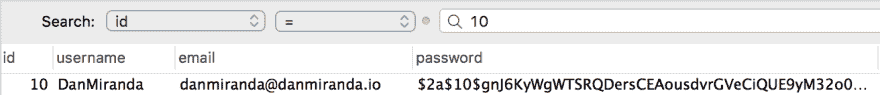
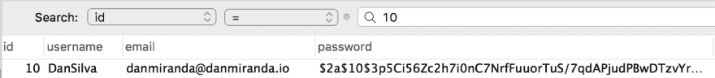
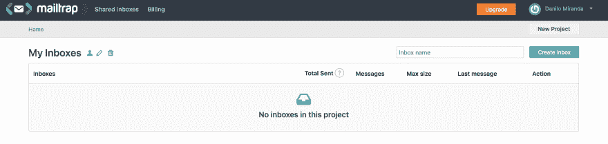
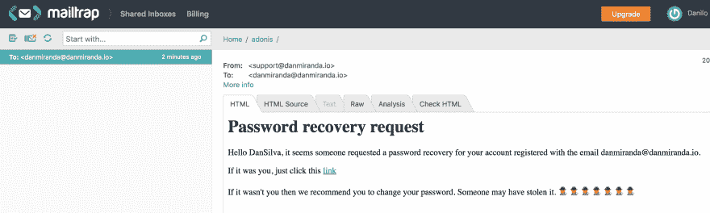

# 用 AdonisJS 构建 API(第 2 部分)

> 原文：<https://dev.to/nilomiranda/building-an-api-with-adonisjs-part-2-3p94>

这是关于使用 AdonisJS 创建 API 的系列文章的第二篇。如果你没有阅读第一部分，这里是链接[用 AdonisJS](https://dev.to/nilomiranda/creating-an-api-using-adonisjs-part-1-2mk0) 构建 API。

现在让我们继续第二部分。在这里，我们将学习如何:

*   更新用户信息(上传请求)
*   恢复用户密码
*   用 Adonis 发送电子邮件
*   使用迁移来更新表结构

## 更新用户信息

让我们从创建允许用户更新他的信息的控制器开始，比如他的用户名和密码(在这个应用程序中，不允许用户更新他的电子邮件)。

背后的逻辑非常简单:

*   用户将发送请求、他的新的期望用户名、他的当前密码和新的期望密码。
*   然后，我们将在数据库中搜索用户
*   然后我们检查当前提供的密码是否正确，然后用新提供的密码更新他的信息

为了创建一个新的控制器，我们需要运行下面的 Adonis 命令:

```
adonis make:controller UpdateUserInfo --type http 
```

Enter fullscreen mode Exit fullscreen mode

现在我们可以转到文件`app/controllers/http/UpdateUserInfoController.js`并开始编码:

让我们确保导入我们的`User`模型，我们还将使用一个叫做`Hash`的 Adonis 助手。

出于安全原因，Hash 将负责散列新提供的密码。

```
'use stric'

const User = use('App/Models/User')
const Hash = use('Hash') 
```

Enter fullscreen mode Exit fullscreen mode

我们的控制器只需要一个`update`方法，所以在我们的控制器`UpdateUserInfoController`中，让我们从创建我们的方法
开始

```
class UpdateUserInfoController {
  async update ({ request, response, params }) { 
```

Enter fullscreen mode Exit fullscreen mode

考虑到我们的逻辑，我们执行以下操作:

1.  让我们获取用户在请求中发送的新信息:

2.

```
 const id = params.id
       const { username, password, newPassword } = request
         .only(['username', 'password', 'newPassword']) 
```

Enter fullscreen mode Exit fullscreen mode

1.  现在在数据库中查找用户(使用 id):

```
 const user = await User.findByOrFail('id', id) 
```

Enter fullscreen mode Exit fullscreen mode

1.  检查提供的密码是否与当前密码匹配:

```
 const passwordCheck = await Hash.verify(password, user.password)

   if (!passwordCheck) {
         return response
           .status(400)
           .send({ message: { error: 'Incorrect password provided' } })
       } 
```

Enter fullscreen mode Exit fullscreen mode

1.  密码检查完成后，我们可以更新用户信息:

```
 // updating user data
       user.username = username
       user.password = newPassword 
```

Enter fullscreen mode Exit fullscreen mode

1.  为了完成这一切，我们只需要通过使用`.save()`方法将数据保存在数据库中。

```
 await user.save() 
```

Enter fullscreen mode Exit fullscreen mode

你的`UpdateUserInfoController.js`现在应该是这样的:

```
'use strict'

const User = use('App/Models/User')
const Hash = use('Hash')

class UpdateUserInfoController {
  async update ({ request, response, params }) {
    const id = params.id
    const { username, password, newPassword } = request
      .only(['username', 'password', 'newPassword'])

    // looking for user in DB
    const user = await User.findByOrFail('id', id)

    // checking if old password informed is correct
    const passwordCheck = await Hash.verify(password, user.password)

    if (!passwordCheck) {
      return response
        .status(400)
        .send({ message: { error: 'Incorrect password provided' } })
    }

    // updating user data
    user.username = username
    user.password = newPassword

    // persisting new data (saving)
    await user.save()
  }
}

module.exports = UpdateUserInfoController 
```

Enter fullscreen mode Exit fullscreen mode

完美！现在让我们测试我们的控制器。前往`start/routes.js`文件

这里真正重要的一点是，我们的一些路线将只有经过认证的用户才能访问，Adonis 的路由有一个完美的方法来处理这一点，称为`group()`。使用`group`你可以调用一个叫做`middleware`的方法，并作为参数传递一个数组，该数组包含在访问组方法中的路由之前应该运行哪些中间件。

```
Route.group(() => {
  // updating username and password
  Route.put('users/:id', 'UpdateUserInfoController.update')
}).middleware(['auth']) 
```

Enter fullscreen mode Exit fullscreen mode

在我们的例子中，我们只需要 auth 方法，这是 Adonis 默认提供的。稍后，我们将在用户未认证和认证的情况下测试该路由

首先，让我们在没有经过身份验证的情况下测试这条路由:

这是我想为我的用户保存的新信息:

```
{  "password":  "123456",  "newPassword":  "123",  "username":  "DanSilva"  } 
```

Enter fullscreen mode Exit fullscreen mode

> 我不会在这里展示如何使用失眠发送请求，因为我已经在第一部分中这样做了

如果我在没有被认证的情况下发送请求，我会收到一个 401 错误(未授权)。为了实现这一点，我必须在请求中提供一个 JWT 令牌，这是我在登录时得到的，所以请确保登录以测试此路由。

登录后，复制请求返回给您的令牌。在失眠症中创建一个新的 PUT 方法，在请求 URL 的正下方有一个名为“Auth”的选项卡。在打开的下拉菜单中选择`Bearer Token`，并在令牌字段中粘贴您刚刚复制的令牌。

在我们再次发送请求之前，让我们查看数据库中的用户数据，以确保它在我们的请求之后得到了更新。

[](https://res.cloudinary.com/practicaldev/image/fetch/s--snd5T4cv--/c_limit%2Cf_auto%2Cfl_progressive%2Cq_auto%2Cw_880/https://thepracticaldev.s3.amazonaws.com/i/oteis2ekm3kuhztaekw3.png)

完美。现在让我们发送请求。只要确保你的网址遵循这个结构

`base_url/users/YOUR_USER_ID_HEre`

现在发送请求。如果成功，请求将返回 204，因为我们没有设置任何要返回的消息。

[](https://res.cloudinary.com/practicaldev/image/fetch/s--y2BuiBXs--/c_limit%2Cf_auto%2Cfl_progressive%2Cq_auto%2Cw_880/https://thepracticaldev.s3.amazonaws.com/i/que6us5j2d4zj1skbecy.png)

看到了吗？新的用户信息保存在我们的数据库中！

## 用 AdonisJS 发送电子邮件

在我们继续这一部分之前，我们将创建控制器来请求 passsword 恢复，并为此恢复设置新密码，让我们看看如何配置 Adonis 来发送电子邮件。

默认情况下不会安装电子邮件提供程序，因此我们必须继续安装。为此，只需运行以下命令:

```
adonis install @adonisjs/mail 
```

Enter fullscreen mode Exit fullscreen mode

现在我们需要在应用程序中注册新的提供者。我们的提供商阵列位于`start/app.js`。打开文件，找到名为`providers`的变量。这个变量是一个数组，包含了使 adonis 正常工作所必需的所有提供程序。只需在这个数组的末尾添加以下提供者:

```
'@adonisjs/mail/providers/MailProvider' 
```

Enter fullscreen mode Exit fullscreen mode

在继续之前，我们还需要配置一些东西。我们需要一个客户端来测试发送电子邮件的功能，有一个适合这项任务的完美工具。

我们将使用[邮件陷阱](https://mailtrap.io/)。正如他们自己的网站所说，Mailtrap 是:

> Mailtrap 是一个**假 SMTP** 服务器，用于测试、查看和共享从开发和试运行环境发送的电子邮件，而不会向真实客户发送垃圾邮件。

当你创建你的账户并进入[https://mailtrap.io/inboxes](https://mailtrap.io/inboxes)时，你会看到一个页面说你没有收件箱。

[](https://res.cloudinary.com/practicaldev/image/fetch/s--aNTyljoW--/c_limit%2Cf_auto%2Cfl_progressive%2Cq_auto%2Cw_880/https://thepracticaldev.s3.amazonaws.com/i/r27z4excb0qmlab3hzel.png)

只需点击“创建收件箱”来创建一个新的。访问您的收件箱，您将被直接重定向到 SMTP 设置选项卡。这是一个重要的选项卡，因为我们将使用这里显示的信息来完成我们在 adonis api 中的配置。

```
Host:   smtp.mailtrap.io
Port:   25 or 465 or 2525
Username:   a218f0cd73b5a4
Password:   0a5b3c6c6acc17 
```

Enter fullscreen mode Exit fullscreen mode

我们将把上面的数据插入到我们的`.env`文件中，以正确设置我们的邮件服务:

```
MAIL_HOST=smtp.mailtrap.io
MAIL_PORT=465
MAIL_USERNAME=a218f0cd73b5a4
MAIL_PASSWORD=0a5b3c6c6acc17 
```

Enter fullscreen mode Exit fullscreen mode

确保`MAIL_USERNAME`和`MAIL_PASSWORD`与 mailtrap 提供给您的数据相匹配。

现在我们需要前往`app/mail.js`来完成我们的电子邮件设置。

因为我们将使用 SMTP，所以在文件的连接会话中，我们将保持原样。只要确保你的和我的一样就行了(如果你用的是 SMTP 的话):

```
connection: Env.get('MAIL_CONNECTION', 'smtp') 
```

Enter fullscreen mode Exit fullscreen mode

现在前往`smtp`对象，确保它看起来像这样:

```
smtp: {
    driver: 'smtp', // make sure here is as SMTP
    pool: true,
    // using Env (provided by Adonis) to retriev the .env variables
    port: Env.get('MAIL_PORT'),
    host: Env.get('MAIL_HOST'),
    secure: false,
    auth: {
      user: Env.get('MAIL_USERNAME'),
      pass: Env.get('MAIL_PASSWORD')
    },
    maxConnections: 5,
    maxMessages: 100,
    rateLimit: 10
  }, 
```

Enter fullscreen mode Exit fullscreen mode

太棒了，如果我们完成了所有这些来配置我们的应用程序发送电子邮件。实际上没有那么多工作要做。我们只走了三步:

1.  安装 Adonis 的邮件提供程序
2.  配置我们的环境变量来使用我们想要的邮件服务
3.  配置我们的`mail.js`文件以从我们的环境变量中获取信息

## 请求恢复密码

让我们从重新查询密码恢复开始。你知道当你点击“忘记密码”，然后你(通常)给你的电子邮件，然后你收到一封电子邮件与恢复密码的链接？这就是我们现在要做的。

为此，我们需要检查请求的有效性，我的意思是，假设你发送了第一个请求，然后你有，比如说，2 天的时间来点击发送给你的链接，否则它将不再有效。

为此，我将使用一个令牌，所以在开始之前，我们需要在数据库的用户表中有一个令牌字段。因为在应用程序的开始，我们已经运行了创建用户表的迁移，所以我们需要运行一个新的迁移来更新表结构，这样我们就可以添加令牌列。

要创建新的迁移，请运行命令:

```
adonis make:migration user --action select 
```

Enter fullscreen mode Exit fullscreen mode

在我们继续之前，让我们先来看看这个命令的结构:

```
adonis make:migration MIGRATION_NAME --action ACTION_NAME(create, select) 
```

Enter fullscreen mode Exit fullscreen mode

*   迁移名称:迁移的名称。在这里，我建议您输入将要更新的表的名称
*   ACTION_NAME:您必须选择:
    1.  创建:当您想要创建一个新表时使用
    2.  选择:当您想要更新现有表的结构时使用它

现在选择新创建的迁移文件，位于`database/migrations`

在您的迁移文件中，您将看到一个具有两种方法的类，`up`和`down`。现在让我们把注意力集中在`up`方法上，因为这个方法是用来创建更新的。`down`方法只是逆转你所做的改变

```
up () {
    this.table('users', (table) => {
      // make alterations
    })
  } 
```

Enter fullscreen mode Exit fullscreen mode

你可以看到`this.table()`使用了两个参数。第一个是表的名称。此处的值将根据您的迁移名称以复数形式自动设置。如果在创建迁移文件时设置名称为`user_update`，这里的第一个参数将是`user_updates`，由于没有表，您可能会遇到一些错误。

第二个参数是运行所有更新的函数。

如我之前所说，我们需要一个令牌字段，但是我们也需要一个`token_create_at`字段，这样我们就可以检查它的有效性。

我们将创建两列，一列作为`string`来存储我们的令牌，另一列作为`timestamp`来存储我们的令牌被创建的时刻。

```
up () {
    this.table('users', (table) => {
      table.string('token') // token
      table.timestamp('token_created_at') // date when token was created
    })
  } 
```

Enter fullscreen mode Exit fullscreen mode

只需运行我们的迁移:

```
adonis migration:run 
```

Enter fullscreen mode Exit fullscreen mode

太好了，现在我们已经更新了用户表，我们将开始创建控制器。我把这个叫做`ForgotPassword`。

```
adonis make:controller ForgotPassword --type http 
```

Enter fullscreen mode Exit fullscreen mode

让我们从创建`store()`方法开始，它将负责处理密码恢复请求。这将生成令牌并将电子邮件发送给用户。

首先，在我们的类之外，让我们导入我们需要的一切:

```
'use strict'

const User = use('App/Models/User') // user model
const Mail = use('Mail') // Adonis' mail

const moment = require('moment') // moment (RUN NPM INSTALL MOMENT)
const crypto = require('crypto') // crypto 
```

Enter fullscreen mode Exit fullscreen mode

我们需要获得用户的电子邮件，并在数据库中找到他:

```
// account request password recovery
const { email } = request.only(['email'])

// checking if email is registered
const user = await User.findByOrFail('email', email) 
```

Enter fullscreen mode Exit fullscreen mode

之后，我们将生成令牌。为了生成令牌，我们将使用 NodeJS 自带的原生特性`crypto`。(你可以在这里找到更多关于加密的信息:[https://nodejs.org/api/crypto.html](https://nodejs.org/api/crypto.html))

```
// generating token
const token = await crypto.randomBytes(10).toString('hex') 
```

Enter fullscreen mode Exit fullscreen mode

生成令牌后，我们使用`toString()`将它转换成一个字符串。

现在我们需要设置令牌的有效性。为此，我们需要存储令牌创建的时刻:

```
user.token_created_at = new Date() 
```

Enter fullscreen mode Exit fullscreen mode

然后，我们继续将令牌保存在数据库中，并持久保存所有信息:

```
user.token = token

// persisting data (saving)
await user.save() 
```

Enter fullscreen mode Exit fullscreen mode

完成所有这些后，我们将向用户发送电子邮件:

```
await Mail.send('emails.recover', { user, token }, (message) => {
    message
        .from('support@danmiranda.io')
        .to(email)
}) 
```

Enter fullscreen mode Exit fullscreen mode

`Mail.send()`使用三个参数:

1.  电子邮件模板(我们稍后会谈到)
2.  要发送到模板的变量
3.  回调函数来设置诸如:发件人，收件人，主题，附件等...

首先我们来谈谈模板。因为我们创建的 adonis 应用程序只是一个 api，所以我们需要在`start/app.js`
的 providers 列表中注册视图提供者

```
'@adonisjs/framework/providers/ViewProvider' 
```

Enter fullscreen mode Exit fullscreen mode

我们所有的视图，必须保存在目录`resources/views`中，所以在项目的根目录下创建文件夹`resources`并在文件夹内创建`views`文件夹。现在在这个文件夹中，你可以随心所欲地组织你的视图。例如，在我们的应用程序中，我将我们的电子邮件模板存储在一个`emails`文件夹中。到现在为止，你可能已经有了这样一个文件夹结构:

```
├── resources
│   └── views
│       └── emails
│           └── recover.edge 
```

Enter fullscreen mode Exit fullscreen mode

`recover.edge`是我们的模板文件。Edge 是为 AdonisJS 打造的官方模板引擎。它的语法看起来和 HTML 文件非常相似，所以这个模板没有任何学习曲线。

你可以用你喜欢的任何方式在这个模板中构建文本，但是我会把我正在使用的那个放在这里，让你跟随

```
<h1>Password recovery request</h1>
<p>
  Hello {{ user.username }}, it seems someone requested a password recovery
  for your account registered with the email {{ user.email }}.
</p>

<p>
  If it was you, just click this
<a href="http://127.0.0.1:3333/users/forgotPassword/{{token}}/{{user.email}}">link</a>
</p>

<p>
  If it wasn't you then we recommend you to change your password. Someone may
  have stolen it. 🕵️‍🕵️‍🕵️‍🕵️‍🕵️‍🕵️‍🕵️
</p> 
```

Enter fullscreen mode Exit fullscreen mode

这里需要注意的最重要的部分是双括号`{{}}`的使用。使用这个语法来访问传递给模板的变量。在上面的例子中，我们正在检索用户的用户名、电子邮件和令牌。

现在让我们来回顾一下我们的`Mail.send()`函数:

```
await Mail.send('emails.recover', { user, token }, (message) => {
    message
        .from('support@danmiranda.io')
        .to(email)
}) 
```

Enter fullscreen mode Exit fullscreen mode

正如我们之前所说，第一个参数是模板。由于 adonis 将直接读取目录`resources/views`，我们只需要指定这个`views`文件夹中的剩余目录。因为我们首先创建了一个名为`emails`的文件夹，然后存储了我们的模板，所以我们在第一个参数中指定了它，语法类似于访问 javascript 的对象属性，在我们的例子中是`emails.recover`。

第二个论点，我们的变量`{ user, token }`。这里我们将发送整个用户对象，所以我们不需要在这里传递很多变量。

最后，第三个参数，回调函数。在我们的例子中，我们将只设置`from()`地址和`to()`地址。如果您想查看其他可用选项，请点击[此链接](https://adonisjs.com/docs/4.0/mail#_message_api)。

现在，你的存储方法必须是这样的:

```
async store ({ request }) {
    try {
      // account request password recovery
      const { email } = request.only(['email'])

      // checking if email is registered
      const user = await User.findByOrFail('email', email)

      // generating token
      const token = await crypto.randomBytes(10).toString('hex')

      // registering when token was created and saving token
      user.token_created_at = new Date()
      user.token = token

      // persisting data (saving)
      await user.save()

      await Mail.send('emails.recover', { user, token }, (message) => {
        message
          .from('support@danmiranda.io')
          .to(email)
      })

      return user
    } catch (err) {
      console.log(err)
    } 
```

Enter fullscreen mode Exit fullscreen mode

让我们添加一个路由来处理这个请求。

```
Route.post('users/forgotPassword', 'ForgotPasswordController.store') 
```

Enter fullscreen mode Exit fullscreen mode

当您测试请求时，我们的请求将返回我们的用户，因此您将能够看到生成的令牌:

```
{  "id":  10,  "username":  "DanSilva",  "email":  "danmiranda@danmiranda.io",  "password":  "$2a$10$3p5Ci56Zc2h7i0nC7NrfFuuorTuS/7qdAPjudPBwDTzvYrZLbOa8i",  "created_at":  "2019-03-03 15:40:02",  "updated_at":  "2019-03-04 22:49:59",  "token":  "79ee3379e35eeabdbcca",  //  HERE  IS  THE  TOKEN  "token_created_at":  "2019-03-05T01:49:59.958Z"  } 
```

Enter fullscreen mode Exit fullscreen mode

此外，进入你的邮件陷阱的收件箱，你可能会看到发送的邮件

[](https://res.cloudinary.com/practicaldev/image/fetch/s--HBarnuai--/c_limit%2Cf_auto%2Cfl_progressive%2Cq_auto%2Cw_880/https://thepracticaldev.s3.amazonaws.com/i/kb7am5v1scnntbq73z23.png)

太好了！我们完成了创建控制器来处理恢复密码请求。在下一个也是最后一个部分，我们将创建一个方法，根据令牌以及它是否仍然有效来更新密码

## 更新和恢复密码

如果您查看电子邮件中发送的链接，您会看到如下内容:

`http://127.0.0.1:3333/users/forgotPassword/79ee3379e35eeabdbcca/danmiranda@danmiranda.io`

它基本上遵循这样的结构:

`base_url/users/forgotPassword/:token/:email`

我们将使用这个 url 来设置我们的路由，它将触发 ou 控制器的方法。

控制器的更新方法将遵循以下逻辑:

*   我们在 URL 请求中获得令牌和用户的电子邮件
*   我们得到用户想要的新密码
*   在数据库中查找用户(使用电子邮件)
*   检查来自 URL 的令牌在数据库中是否仍然相同(在用户请求新密码恢复并试图使用旧链接的情况下有用)
*   检查令牌是否仍然有效
*   更新密码并重置令牌

那我们开始工作吧...

为了获得 URL 中的参数，我们使用来自请求上下文的`params`。

```
async update ({ request, response, params }) {
    const tokenProvided = params.token // retrieving token in URL
    const emailRequesting = params.email // email requesting recovery 
```

Enter fullscreen mode Exit fullscreen mode

现在用户想要的新密码

```
const { newPassword } = request.only(['newPassword']) 
```

Enter fullscreen mode Exit fullscreen mode

让我们寻找用户

```
const user = await User.findByOrFail('email', emailRequesting) 
```

Enter fullscreen mode Exit fullscreen mode

现在我们使用令牌，首先检查链接是否没有使用旧令牌，然后检查当前令牌是否仍然有效

```
// checking if token is still the same
// just to make sure that the user is not using an old link
// after requesting the password recovery again
const sameToken = tokenProvided === user.token

if (!sameToken) {
    return response
        .status(401)
        .send({ message: {
            error: 'Old token provided or token already used'
        } })
}

// checking if token is still valid (48 hour period)
const tokenExpired = moment()
.subtract(2, 'days')
.isAfter(user.token_created_at)

if (tokenExpired) {
    return response.status(401).send({ message: { error: 'Token expired' } })
} 
```

Enter fullscreen mode Exit fullscreen mode

最后，对所提供令牌的所有检查都已完成，并成功通过，我们更新密码并重置令牌:

```
// saving new password
user.password = newPassword

// deleting current token
user.token = null
user.token_created_at = 0

// persisting data (saving)
await user.save() 
```

Enter fullscreen mode Exit fullscreen mode

你的`update()`方法现在应该是这样的:

```
async update ({ request, response, params }) {
    const tokenProvided = params.token // retrieving token in URL
    const emailRequesting = params.email // email requesting recovery

    const { newPassword } = request.only(['newPassword'])

    // looking for user with the registered email
    const user = await User.findByOrFail('email', emailRequesting)

    // checking if token is still the same
    // just to make sure that the user is not using an old link
    // after requesting the password recovery again
    const sameToken = tokenProvided === user.token

    if (!sameToken) {
      return response
        .status(401)
        .send({ message: {
          error: 'Old token provided or token already used'
        } })
    }

    // checking if token is still valid (48 hour period)
    const tokenExpired = moment()
      .subtract(2, 'days')
      .isAfter(user.token_created_at)

    if (tokenExpired) {
      return response.status(401).send({ message: { error: 'Token expired' } })
    }

    // saving new password
    user.password = newPassword

    // deleting current token
    user.token = null
    user.token_created_at = 0

    // persisting data (saving)
    await user.save()
  } 
```

Enter fullscreen mode Exit fullscreen mode

而你的整个`ForgotPassowrdController`应该是这样的:

```
'use strict'

const User = use('App/Models/User')
const Mail = use('Mail')

const moment = require('moment')
const crypto = require('crypto')

class ForgotPasswordController {
  /**
   * this method will store a new request made by the user
   * when he requires a password recover it'll generate a
   * token to allow him to reset his password
   */
  async store ({ request }) {
    try {
      // account request password recovery
      const { email } = request.only(['email'])

      // checking if email is registered
      const user = await User.findByOrFail('email', email)

      // generating token
      const token = await crypto.randomBytes(10).toString('hex')

      // registering when token was created and saving token
      user.token_created_at = new Date()
      user.token = token

      // persisting data (saving)
      await user.save()

      await Mail.send('emails.recover', { user, token }, (message) => {
        message
          .from('support@danmiranda.io')
          .to(email)
      })

      return user
    } catch (err) {
      console.log(err)
    }
  }

  async update ({ request, response, params }) {
    const tokenProvided = params.token // retrieving token in URL
    const emailRequesting = params.email // email requesting recovery

    const { newPassword } = request.only(['newPassword'])

    // looking for user with the registered email
    const user = await User.findByOrFail('email', emailRequesting)

    // checking if token is still the same
    // just to make sure that the user is not using an old link
    // after requesting the password recovery again
    const sameToken = tokenProvided === user.token

    if (!sameToken) {
      return response
        .status(401)
        .send({ message: {
          error: 'Old token provided or token already used'
        } })
    }

    // checking if token is still valid (48 hour period)
    const tokenExpired = moment()
      .subtract(2, 'days')
      .isAfter(user.token_created_at)

    if (tokenExpired) {
      return response.status(401).send({ message: { error: 'Token expired' } })
    }

    // saving new password
    user.password = newPassword

    // deleting current token
    user.token = null
    user.token_created_at = 0

    // persisting data (saving)
    await user.save()
  }
}

module.exports = ForgotPasswordController 
```

Enter fullscreen mode Exit fullscreen mode

现在让我们测试最后一个方法。首先，让我们按照我之前提到的结构添加路由:

`base_url/users/forgotPassword/:token/:email`并在我们的路由中添加一个 PUT 请求

```
Route.put('users/forgotPassword/:token/:email', 'ForgotPasswordController.update') 
```

Enter fullscreen mode Exit fullscreen mode

首先，我将测试令牌号不正确的情况:

对于这样的请求，我会收到一个 401 错误和下面的 JSON:

```
{  "message":  {  "error":  "Old token provided or token already used"  }  } 
```

Enter fullscreen mode Exit fullscreen mode

在我们测试成功之前，最后一个例子是一个无效的令牌。为了测试这一点，我将在数据库中手动更改令牌的生成日期，将其更改为两天前。

这样，我还会收到一个 401 错误和一个 JSON，告诉我令牌过期了

现在我们期待的测试。我再次更改了令牌的创建日期，以匹配 2 天的限制。我不会在正文中收到任何消息，只是一个`204`状态。在本例中，我将新密码设置为“12”。

如果我尝试使用旧密码“123456”登录，我会收到一个错误，但如果我尝试使用新密码“12”，一切都应该没问题。

哇！！这是一个很长的帖子，所以我现在就到此为止。下一篇文章将介绍用户创建一个新约会的步骤，我们在那里见！！