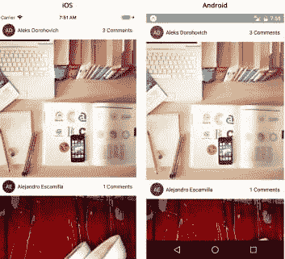
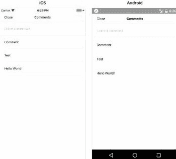
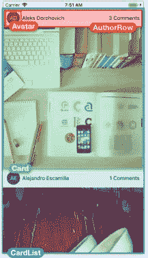
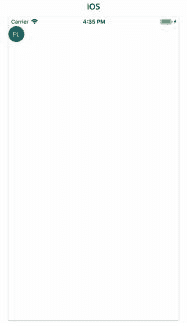
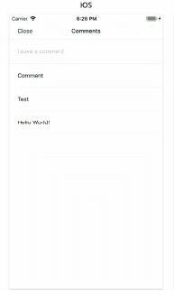
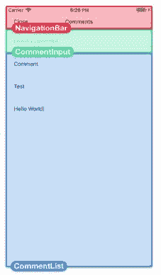

# 用 React Native 构建迷你 Instagram 克隆

> 原文：<https://dev.to/kpose/building-an-mini-instagram-clone-with-react-native-beg>

###### 为什么反应土人？

通过 React Native，我们可以使用 JavaScript 和 React 为多个平台构建原生移动应用程序。重要的是，我们构建的接口被翻译成本地视图。我们将能够在 iOS 和 Android 设备之间共享我们编写的大量代码，React Native 可以在需要时轻松编写特定于每个平台的代码。我们开始使用一种语言(JavaScript)、一个框架(React)、一个样式引擎和一个工具链来为两个平台编写应用程序。学习一次，在任何地方写作。

今天，我们将使用最常见的 React 原生组件来构建一个类似 Instagram 的应用程序。我们将用组件视图、文本、图像和平面列表构建主图像提要。我们还将使用 TextInput 和 ScrollView 构建一个评论屏幕。
这是我们将要构建的:
[](https://res.cloudinary.com/practicaldev/image/fetch/s--RCu_ZJau--/c_limit%2Cf_auto%2Cfl_progressive%2Cq_auto%2Cw_880/https://thepracticaldev.s3.amazonaws.com/i/atknj0gh5ua0sg7yamg8.jpg) 
当我们点击“注释”时，第二个屏幕打开，显示该图像的注释: [](https://res.cloudinary.com/practicaldev/image/fetch/s--QMfljPnM--/c_limit%2Cf_auto%2Cfl_progressive%2Cq_auto%2Cw_880/https://thepracticaldev.s3.amazonaws.com/i/x9c24oh2l2tcgnuphw3c.jpg)

如果你不熟悉用 expo 创建 react 原生应用，[看这里](https://facebook.github.io/react-native/docs/getting-started.html)。
我们必须将应用程序的用户界面分解成组件；我们将创建这些组件，然后将它们全部链接起来。让我们从分解图像提要页面开始。
[T6】](https://res.cloudinary.com/practicaldev/image/fetch/s--KI9j2-gu--/c_limit%2Cf_auto%2Cfl_progressive%2Cq_auto%2Cw_880/https://thepracticaldev.s3.amazonaws.com/i/jsegbwdiru0eszltz585.jpg)

完成后，我们必须创建四个组件:

*   头像-图片作者的个人照片或姓名首字母
*   AuthorRow——包含作者信息的水平行:他们的头像和名字
*   card——图片提要中的条目，包含图片及其作者的信息
*   CardList -提要中的卡片列表

###### 头像:

下面是单独渲染时头像的样子: [](https://res.cloudinary.com/practicaldev/image/fetch/s--tYL1kyNw--/c_limit%2Cf_auto%2Cfl_progressive%2Cq_auto%2Cw_880/https://thepracticaldev.s3.amazonaws.com/i/vxp9ba0cljtarwgz5vmh.JPG)

对于简单的应用程序，最简单的方法是将我们所有的组件放在一个组件目录中，让我们创建一个名为 **components** 的新目录，并在其中创建一个名为 *Avatar.js*
的新文件，我们的 Avatar 组件将呈现组件视图和文本。它将使用样式表，并用 PropTypes 验证字符串、数字和颜色属性。将下面的代码添加到 Avatar.js

```
import { ColorPropType, StyleSheet, Text, View } from 'react-native';
import PropTypes from 'prop-types';
import React from 'react';

export default function Avatar({ size, backgroundColor, initials }) {
  const style = {
    width: size,
    height: size,
    borderRadius: size / 2,
    backgroundColor,
  };

  return (
    <View style={[styles.container, style]}>
      <Text style={styles.text}>{initials}</Text>
    </View>
  );
}

Avatar.propTypes = {
  initials: PropTypes.string.isRequired,
  size: PropTypes.number.isRequired,
  backgroundColor: ColorPropType.isRequired,
};

const styles = StyleSheet.create({
  container: {
    alignItems: 'center',
    justifyContent: 'center',
  },
  text: {
    color: 'white',
  },
}); 
```

###### 作者行:

在同一个“Components”文件夹中，创建另一个文件 **AuthorRow.js** 。这是一个水平行组件，包含我们的头像和照片作者的全名。在这个文件中，我们将导入我们已经看到的大部分内容:样式表、视图、文本、属性类型和反应。我们还将导入一个 TouchableOpacity，这样我们就可以在“comments”文本上点击，将我们带到 Comments 屏幕。我们还需要导入我们刚刚制作的 Avatar 组件，以及我们在本章开始时复制到这个项目中的一些实用函数。将以下代码块添加到 AuthorRow.js

```
import { StyleSheet, Text, TouchableOpacity, View } from 'react-native';
import PropTypes from 'prop-types';
import React from 'react';

import Avatar from './Avatar';
import getAvatarColor from '../utils/getAvatarColor';
import getInitials from '../utils/getInitials';

export default function AutoRow ({ fullname, linkText, onPressLinkText }) {
    return (
        <View style = {styles.container}>
            <Avatar
                size={35}
                initials={getInitials(fullname)}
                backgroundColor =  {getAvatarColor(fullname)} 
                />
                <Text style = {styles.text} numberofLines={1}>
                    {fullname}
                </Text>
                {!!linkText && (
                    <TouchableOpacity onPress={onPressLinkText} >
                        <Text numberOfLines={1}>{linkText}</Text>
                    </TouchableOpacity> )}
        </View>
    )
}

const styles =StyleSheet.create({
    container: {
        height: 50,
        flexDirection: 'row',
        alignItems: 'center',
        paddingHorizontal: 10,
    },
    text: {
        flex: 1,
        marginHorizontal: 6,
    },
}); 
```

###### 卡片:

接下来，我们将制作包含 AuthorRow 和图像组件的卡片，我们将从 URI 下载图像。在 components 目录中创建一个新的文件 Card.js。将以下内容添加到该文件:

```
import { ActivityIndicator, Image, StyleSheet, View } from 'react-native';
import PropTypes from 'prop-types';
import React from 'react';

import AuthorRow from './AuthorRow';

export default class Card extends React.Component {
  static propTypes = {
    fullname: PropTypes.string.isRequired,
    image: Image.propTypes.source.isRequired,
    linkText: PropTypes.string.isRequired,
    onPressLinkText: PropTypes.func.isRequired,
  };

  state = {
    loading: true,
  };

  handleLoad = () => {
    this.setState({ loading: false });
  };

  render() {
    const { fullname, image, linkText, onPressLinkText } = this.props;
    const { loading } = this.state;

    return (
      <View>
        <AuthorRow
          fullname={fullname}
          linkText={linkText}
          onPressLinkText={onPressLinkText}
        />
        <View style={styles.image}>
          {loading && (
            <ActivityIndicator style={StyleSheet.absoluteFill} size={'large'} />
          )}
          <Image
            style={StyleSheet.absoluteFill}
            source={image}
            onLoad={this.handleLoad}
          />
        </View>
      </View>
    );
  }
}

const styles = StyleSheet.create({
  image: {
    aspectRatio: 1,
    backgroundColor: 'rgba(0,0,0,0.02)',
  },
}); 
```

我们使用图像组件在屏幕上呈现图像。我们还向图像组件的源属性传递了一个对象。图像组件将自动从 URI 下载数据，并在加载后显示。由于下载大图片需要一段时间，我们在下载完成前显示了一个加载指示器。我们在代码中呈现组件的顺序很重要:在内部视图中，我们在图像之前呈现 ActivityIndicator。代码中最后呈现的组件将在视觉上呈现在它的兄弟组件之上。

###### 卡片列表:

CardList 组件将呈现无限滚动的作者和图片列表，我们将使用 FlatList 组件呈现这个卡片列表。让我们在组件目录中创建新文件 CardList.js。我们将导入 FlatList、我们的卡、一个用于从 id 构建图像 url 的实用程序，以及文件顶部的一些其他东西。最终，我们将使用 [unsplash](https://unsplash.it) 为我们的提要获取数据。

```
import { FlatList } from 'react-native';
import PropTypes from 'prop-types';
import React from 'react';

import { getImageFromId } from '../utils/api';
import Card from './Card';

const keyExtractor = ({ id }) => id.toString();

export default class CardList extends React.Component {
  static propTypes = {
    items: PropTypes.arrayOf(
      PropTypes.shape({
        id: PropTypes.number.isRequired,
        author: PropTypes.string.isRequired,
      }),
    ).isRequired,
    commentsForItem: PropTypes.objectOf(PropTypes.arrayOf(PropTypes.string))
      .isRequired,
    onPressComments: PropTypes.func.isRequired,
  };

  renderItem = ({ item: { id, author } }) => {
    const { commentsForItem, onPressComments } = this.props;
    const comments = commentsForItem[id];

    return (
      <Card
        fullname={author}
        image={{
          uri: getImageFromId(id),
        }}
        linkText={`${comments ? comments.length : 0} Comments`}
        onPressLinkText={() => onPressComments(id)}
      />
    );
  };

  render() {
    const { items, commentsForItem } = this.props;

    return (
      <FlatList
        data={items}
        extraData={commentsForItem}
        renderItem={this.renderItem}
        keyExtractor={keyExtractor}
      />
    );
  }
} 
```

#### 添加屏幕:

我们的应用程序将有两个屏幕:
·Feed:图像 Feed
·Comments:特定图像的评论列表
在我们的顶级图像馈送目录中创建一个名为 ***screens*** 的新目录，并在名为 Feed.js 的屏幕中创建一个新文件，该文件将从 [unsplash](https://unsplash.it) 获取实时数据，并将数据传递到我们的 CardList 中。此外，我们需要考虑加载和错误状态。该屏幕将显示一个简单的装载指示器和错误状态。

```
import {
  ActivityIndicator,
  Text,
  ViewPropTypes,
  SafeAreaView,
} from 'react-native';
import PropTypes from 'prop-types';
import React from 'react';

import { fetchImages } from '../utils/api';
import CardList from '../components/CardList';

export default class Feed extends React.Component {
  static propTypes = {
    style: ViewPropTypes.style,
    commentsForItem: PropTypes.objectOf(PropTypes.arrayOf(PropTypes.string))
      .isRequired,
    onPressComments: PropTypes.func.isRequired,

  };

  static defaultProps = {
    style: null,
  };

  state = {
    loading: true,
    error: false,
    items: [],
  };

  async componentDidMount() {
    try {
      const items = await fetchImages();

      this.setState({
        loading: false,
        items,
      });
    } catch (e) {
      this.setState({
        loading: false,
        error: true,
      });
    }
  }

  render() {
    const { commentsForItem, onPressComments, style } = this.props;
    const { loading, error, items } = this.state;

    if (loading) {
      return <ActivityIndicator size="large" />;
    }

    if (error) {
      return <Text>Error...</Text>;
    }

    return (
      <SafeAreaView style={style}>
        <CardList
            items={items}
            commentsForItem={commentsForItem}
            onPressComments={onPressComments}
            />
      </SafeAreaView>
    );
  }
} 
```

###### 添加 FEED 到 APP

让我们更新 App.js 来呈现我们的新屏幕。首先，我们需要更新文件顶部的导入，然后我们可以在包装器视图中呈现我们的提要:

```
import { Platform, StyleSheet, View } from 'react-native';
import { Constants } from 'expo';
import React from 'react';
import Feed from './screens/Feed';

export default class App extends React.Component {
  render() {
   return (
    <View style={styles.container}>
     <Feed style={styles.feed} />
    </View>
   );
  }
}

const platformVersion =
  Platform.OS === 'ios' ? parseInt(Platform.Version, 10) : Platform.Version;

const styles = StyleSheet.create({
  container: {
    flex: 1,
    backgroundColor: '#fff',
   },
  feed: {
    flex: 1,
    marginTop:
      Platform.OS === 'android' || platformVersion < 11
        ? Constants.statusBarHeight
        : 0,
   },
}); 
```

由于我们的订阅源在顶层使用了安全区域视图，因此我们也将更新我们的样式。我们只希望在 Android 上，或者在 iOS 11 以下的版本上添加一个页边距，因为现在 iOS 11+上的 SafeAreaView 会自动添加页边距。

接下来，我们将为同一个应用程序添加一个新的屏幕来评论图像。下面是评论界面的样子: [](https://res.cloudinary.com/practicaldev/image/fetch/s--Rdfn2S41--/c_limit%2Cf_auto%2Cfl_progressive%2Cq_auto%2Cw_880/https://thepracticaldev.s3.amazonaws.com/i/xanpibi65fzv8ii8vpy2.JPG)

为了构建应用程序的这一部分，我们将使用 TextInput、ScrollView 和 Modal 组件。我们还将使用 AsyncStorage 在我们的设备上本地保存注释。[](https://res.cloudinary.com/practicaldev/image/fetch/s--ZmORs1RH--/c_limit%2Cf_auto%2Cfl_progressive%2Cq_auto%2Cw_880/https://thepracticaldev.s3.amazonaws.com/i/kbc33j95exr4nuujt77h.JPG)
navigation bar——屏幕顶部的一个简单导航栏，带有一个标题和一个“关闭”按钮
comment input——添加新评论的输入字段
comment list——可滚动的评论列表
应用程序组件将负责处理我们应用程序中的评论数据，因为提要屏幕和评论屏幕都需要呈现这些数据。我们将从 App 呈现评论屏幕组件，将所选卡片的评论数据作为道具传递。我们将呈现内置的模态组件，根据应用程序的状态打开和关闭这个新屏幕。

###### 注释输入:

在我们的组件文件夹中创建另一个文件 **CommentInput.js** 。我们希望这个组件有两个道具:
·onSubmit——当用户按下“return”键时，我们将使用评论文本调用它。
·placeholder——传递到 TextInput 的占位符属性。将以下内容添加到 CommentInput.js:

```
import { StyleSheet, TextInput, View } from 'react-native';
import PropTypes from 'prop-types';
import React from 'react';

export default class CommentInput extends React.Component {
  static propTypes = {
    onSubmit: PropTypes.func.isRequired,
    placeholder: PropTypes.string,
  };

  static defaultProps = {
    placeholder: '',
  };

  state = {
    text: '',
  };

  handleChangeText = text => {
    this.setState({ text });
  };

  handleSubmitEditing = () => {
    const { onSubmit } = this.props;
    const { text } = this.state;

    if (!text) return;

    onSubmit(text);
    this.setState({ text: '' });
  };

  render() {
    const { placeholder } = this.props;
    const { text } = this.state;

    return (
      <View style={styles.container}>
        <TextInput
          style={styles.input}
          value={text}
          placeholder={placeholder}
          underlineColorAndroid="transparent"
          onChangeText={this.handleChangeText}
          onSubmitEditing={this.handleSubmitEditing}
        />
      </View>
    );
  }
}

const styles = StyleSheet.create({
  container: {
    borderBottomWidth: StyleSheet.hairlineWidth,
    borderBottomColor: 'rgba(0,0,0,0.1)',
    paddingHorizontal: 20,
    height: 60,
  },
  input: {
    flex: 1,
  },
}); 
```

###### [评语列表:](#commentlist)

接下来，我们将为每张图片呈现一个评论列表:
我们将在一个 ScrollView 中呈现这些评论。一般来说，我们会使用一个平面列表，但由于应用程序的简单性，我们将使用 ScrollView。对于大量的条目，或者 ScrollView 的许多子视图都不在屏幕上的情况，您可能希望使用 FlatList 组件来获得更好的性能。

```
import { ScrollView, StyleSheet, Text, View } from 'react-native';
import PropTypes from 'prop-types';
import React from 'react';

export default class CommentList extends React.Component {
    static propTypes = {
        items: PropTypes.arrayOf(PropTypes.string).isRequired,
    };

    renderItem = (item, index) => (
        <View key={index} style={styles.comment}>
            <Text>{item}</Text>
        </View>
        );
        render() {
            const { items } = this.props;

            return <ScrollView>{items.map(this.renderItem)}</ScrollView>;
        }
}

const styles = StyleSheet.create({
    comment: {
        marginLeft: 20,
        paddingVertical: 20,
        paddingRight: 20,
        borderBottomWidth: StyleSheet.hairlineWidth,
        borderBottomColor: 'rgba(0,0,0,0.05)',
    },
}); 
```

###### 导航栏:

在真实的应用程序中，我们可能会为此使用导航库，但为了简单起见，让我们自己编写一些小程序。在组件目录下创建 *NavigationBar.js* 并添加以下内容:

```
import { StyleSheet, Text, TouchableOpacity, View } from 'react-native';
import PropTypes from 'prop-types';
import React from 'react';

export default function NavigationBar({ title, leftText, onPressLeftText }) {
    return (
        <View style={styles.container}>
            <TouchableOpacity style={styles.leftText} onPress={onPressLeftText}>
                <Text>{leftText}</Text>
            </TouchableOpacity>
            <Text style={styles.title}>{title}</Text>
        </View>
        );
}
NavigationBar.propTypes = {
    title: PropTypes.string,
    leftText: PropTypes.string,
    onPressLeftText: PropTypes.func,
};
NavigationBar.defaultProps = {
    title: '',
    leftText: '',
    onPressLeftText: () => {},
};

const styles = StyleSheet.create({
    container: {
        height: 40,
        borderBottomWidth: StyleSheet.hairlineWidth,
        borderBottomColor: 'rgba(0,0,0,0.1)',
        alignItems: 'center',
        justifyContent: 'center',
    },
    title: {
        fontWeight: '500',
    },
    leftText: {
        position: 'absolute',
        left: 20,
        top: 0,
        bottom: 0,
        justifyContent: 'center',
    },
    }); 
```

###### 评论画面:

在 screens 目录中创建一个新文件 Comments.js。在我们的新屏幕中，我们希望首先呈现导航栏，然后是 CommentInput，最后是 CommentList。我们希望这个屏幕有 4 个道具:
·comments——要显示的评论数组。
·onClose——当用户按下关闭按钮时调用的功能属性。
·onSubmitComment——用户添加新评论时调用的函数 prop。
·style——应用于该屏幕顶层视图的样式(就像我们对 Feed 所做的那样)将以下内容添加到 Comments.js:

```
import { SafeAreaView, ViewPropTypes } from 'react-native';
import PropTypes from 'prop-types';
import React from 'react';

import NavigationBar from '../components/NavigationBar';
import CommentList from '../components/CommentList';
import CommentInput from '../components/CommentInput';

export default function Comments({
    style,
    onSubmitComment,
    onClose,
    comments,
}) {
    return (
        <SafeAreaView style = {style}>
            <NavigationBar
                title="Comments"
                leftText= 'Close'
                onPressLeftText= {onClose}
                /> 
                <CommentInput placeholder = "Leave a Comment" onSubmit={onSubmitComment} />
                <CommentList items ={comments} />
        </SafeAreaView>
    );
}

Comments.propTypes = {
    style: ViewPropTypes.style,
    comments: PropTypes.arrayOf(PropTypes.string).isRequired,
    onClose: PropTypes.func.isRequired,
    onSubmitComment: PropTypes.func.isRequired,
 };

 Comments.defaultProps = {
    style: null,
 }; 
```

我们的屏幕代码相当简单，因为我们已经将 UI 的不同部分构建为单独的组件。

###### 包起来:

在更大的应用程序中，我们可能会使用导航库来导航我们的屏幕，而在这里，我们使用内置的模态组件。这有助于我们从之前创建的提要屏幕导航到新的评论
屏幕。我们在 App 组件的状态中维护模态的状态。我们还在应用程序组件上创建了一个函数属性 onSubmitComment，用于将新的注释保存到我们状态中的 commentsForItem 对象中。将我们的 **App.js** 更新为:

```
import { AsyncStorage, Modal, Platform, StyleSheet, View } from 'react-native';
import { Constants } from 'expo';
import React from 'react';

import Comments from './screens/Comments';
import Feed from './screens/Feed';

const ASYNC_STORAGE_COMMENTS_KEY = 'ASYNC_STORAGE_COMMENTS_KEY';

export default class App extends React.Component {
  state = {
    commentsForItem: {},
    showModal: false,
    selectedItemId: null,
  };

  async componentDidMount() {
    try {
      const commentsForItem = await AsyncStorage.getItem(
        ASYNC_STORAGE_COMMENTS_KEY,
      );

      this.setState({
        commentsForItem: commentsForItem ? JSON.parse(commentsForItem) : {},
      });
    } catch (e) {
      console.log('Failed to load comments');
    }
  }

  onSubmitComment = text => {
    const { selectedItemId, commentsForItem } = this.state;
    const comments = commentsForItem[selectedItemId] || [];

    const updated = {
      ...commentsForItem,
      [selectedItemId]: [...comments, text],
    };

    this.setState({ commentsForItem: updated });

    try {
      AsyncStorage.setItem(ASYNC_STORAGE_COMMENTS_KEY, JSON.stringify(updated));
    } catch (e) {
      console.log('Failed to save comment', text, 'for', selectedItemId);
    }
  };

  openCommentScreen = id => {
    this.setState({
      showModal: true,
      selectedItemId: id,
    });
  };

  closeCommentScreen = () => {
    this.setState({
      showModal: false,
      selectedItemId: null,
    });
  };

  render() {
    const { commentsForItem, showModal, selectedItemId } = this.state;

    return (
      <View style={styles.container}>
        <Feed
          style={styles.feed}
          commentsForItem={commentsForItem}
          onPressComments={this.openCommentScreen}
        />
        <Modal
          visible={showModal}
          animationType="slide"
          onRequestClose={this.closeCommentScreen}
        >
          <Comments
            style={styles.comments}
            comments={commentsForItem[selectedItemId] || []}
            onClose={this.closeCommentScreen}
            onSubmitComment={this.onSubmitComment}
          />
        </Modal>
      </View>
    );
  }
}

const platformVersion =
  Platform.OS === 'ios' ? parseInt(Platform.Version, 10) : Platform.Version;

const styles = StyleSheet.create({
  container: {
    flex: 1,
    backgroundColor: '#fff',
  },
  feed: {
    flex: 1,
    marginTop:
      Platform.OS === 'android' || platformVersion < 11
        ? Constants.statusBarHeight
        : 0,
  },
  comments: {
    flex: 1,
    marginTop:
      Platform.OS === 'ios' && platformVersion < 11
        ? Constants.statusBarHeight
        : 0,
  },
}); 
```

作为可选的最后一步，我们通过 AsyncStorage API 将写入设备的注释持久化。
运行我们的应用，[点击这里](https://facebook.github.io/react-native/docs/getting-started.html#running-your-react-native-application)

*参考文献*
全栈反应原生作者德文·阿博特