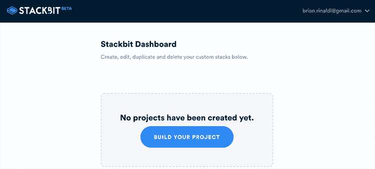
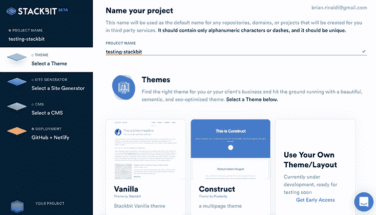
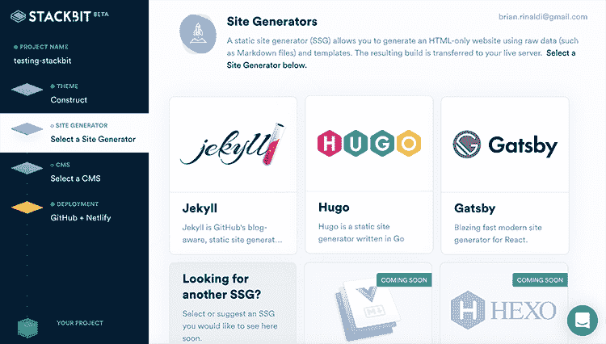
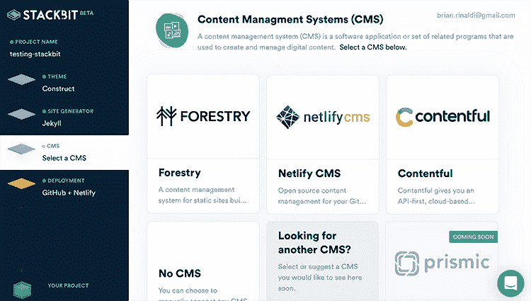
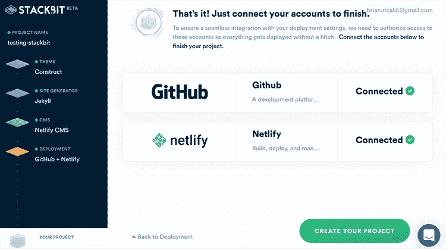
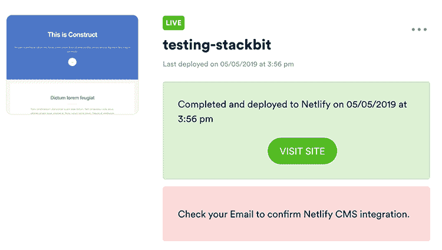

# 用 Stackbit 构建和部署 JAMStack 站点

> 原文：<https://dev.to/remotesynth/building-and-deploying-a-jamstack-site-with-stackbit-1gg0>

最近几周，我讨论了如何[用 Netlify CMS](https://dev.to/remotesynth/a-fresh-look-at-netlify-cms-part-1-136k) 从头开始创建一个新网站，以及如何[修改现有网站以使用 Netlify CMS](https://dev.to/remotesynth/a-fresh-look-at-netlify-cms-part-2-5694) 。然而，围绕 JAMStack 的工具也在不断改进，现在已经有了一些工具，可以进一步简化开发内容管理的 JAMStack 站点的过程。

在这篇文章中，我想看看目前处于早期测试版本的工具之一，名为 [Stackbit](https://www.stackbit.com/) 。正如我们将看到的，Stackbit 的好处是，您可以选择一个模板，部署一个与 CMS 集成的 JAMStack 站点，并将其部署到 Netlify，所有这些都不需要接触一个配置文件或编写一行代码。

> 请注意，我是作为 beta 用户获得 Stackbit 访问权限的，但我与该公司没有任何关系，也没有被要求任何形式的认可。

## 堆栈比特入门

首先，你需要请求一个 [beta 邀请](https://www.stackbit.com/beta/)来堆叠比特。一旦你有了这些，你就可以开始了。

一旦您有了帐户并登录，您将需要创建一个新项目。

你会想给它一个名字或坚持使用默认的，然后选择一个主题。在测试版中有一些不错的简单的主题，它们都包括一个现场预览。使用自定义主题是一个选项，但是，目前，您需要一个额外的 beta invite 来使用这个特性(但是，由于这都是部署到 GitHub 的，所以您可以在项目创建后对部署的代码做任何事情，包括自定义主题)。同样重要的是要注意，一旦创建了项目，就不能更改主题。

接下来，您选择想要使用哪个生成器来构建站点。目前 Stackbit 支持三个最流行的引擎:[杰基尔](https://jekyllrb.com/)、[盖茨比](https://www.gatsbyjs.org/)和[雨果](https://gohugo.io/)。Vuepress 和 Hexo 支持即将推出。

最后的选择是你的后端 CMS。同样，Stackbit 为最流行的选项提供支持，如[林业](https://forestry.io/)、[网络 CMS](https://www.netlifycms.org/) 和[内容丰富](https://www.contentful.com/)。Forestry 和 Contentful 是商业选项，根据您的要求，可能会产生额外费用。Netlify CMS 是免费的，但根据你的网站的不同，它可能不会像你所要求的那样功能齐全(例如，Contentful 有一个 API，允许你在移动应用程序上重复使用内容)。 [Prismic](https://prismic.io/) 支持即将到来。如果您愿意，也可以选择没有后端。

一旦你做了所有的选择，你需要做的就是连接相关的账户。您至少需要连接 Github 和 Netlify，尽管如果使用其他 CMS 服务，您也需要连接它们。

网站会自动创建，推送到 GitHub，连接并部署到 Netlify。如果你用的是 Netlify CMS，它会自动邀请你成为编辑。

## 下一步

恭喜你，你部署了一个完全内容管理的 JAMStack 站点！

此时，从 Stackbit admin，您可以转到 CMS admin 或该站点，但除了删除 Stackbit 上的站点，我应该注意，它不会删除 Github 或 Netlify 上的站点。然而，正如我之前提到的，您可以从 GitHub 中随意提取代码，并根据自己的意愿进行定制。

对于 Stackbit 来说现在还为时过早，但是作为一种快速建立和运行内容管理的 JAMStack 站点的选择，它确实显示了一些希望。我很期待看到他们如何继续改进这个工具。