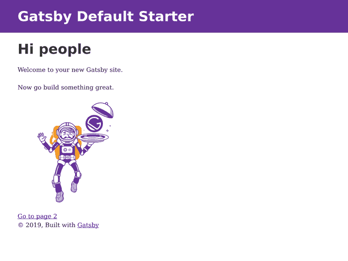

# 使用 Gatsby JS 和 Cosmic JS 构建和设计作品集网站

> 原文：<https://dev.to/jacobknaack/building-and-designing-a-portfolio-site-using-gatsby-js-and-cosmic-js-2de7>

如今，创建/更新我们的投资组合是一件必要的坏事。地点在变，人在变，因此内容创建和管理的循环不断地搅动。当你发现自己需要重新设计投资组合时，有大量的工具和服务可以考虑。目前最让你感兴趣的应该是 [Gatsby JS](https://www.gatsbyjs.org/) 静态站点生成器以及无头 CMS，比如 [Cosmic JS](https://cosmicjs.com/) 。今天，有了这两个工具，我们将创建一个可持续部署的工作组合，当内容发生变化时，可以重新构建。

TLDR:
[盖茨比作品集现场演示](https://cosmicjs.com/apps/gatsby-agency-portfolio)

[下载代码库](https://github.com/cosmicjs/gatsby-agency-portfolio)

## 开始前 0.0

我们正在创建一个主要使用静态数据的投资组合网站，但是如果能够方便地修改我们网站的内容而不需要修改大量的源代码，那就更好了。因此，我们正在构建一个客户端，它使用存储在内容管理服务上的内容，并以编程方式在我们选择的任何 URL 上显示它。

### 0.1 我们正在使用的工具

*   这是一个静态站点生成器，当我们的内容发生变化时，它会自动获取新数据并重建我们的站点文件。捆绑了数据获取魔法 GraphQL 和一直存在的 React JS 前端框架。

*   Cosmic JS -我们的内容管理服务，将存储我们需要的关于我们网站的所有信息。Cosmic JS 提供了非常灵活的数据模型定义，允许我们存储所有类型的信息，从可重复数据到简单的文本字段和 HTML 内容。注意！-为了跟随本教程，您需要在 Cosmic JS 上创建一个桶，并用适当的数据对象填充它。

*   RSuite -一个预样式组件库，它与 react 一起工作，为我们提供预样式组件。这将允许我们使用开箱后看起来很棒的组件，同时也给了我们根据需要进行调整的灵活性。

*   Netlify (可选)——一个部署服务，它将让我们直接连接到 git 存储库。使用它，我们可以配置 webooks 来重建静态文件，并在源代码发生变化时进行自动部署。
    让我们开始配置我们的设置。

## 1.0 安装和设置

我们只需要一些软件需求就可以开始构建了。主要是我们需要 npm 或 yarn 的节点 JS，如果你愿意，我们将使用 git 在 Netlify 上做一些部署工作。

### 1.1 初始化项目

一旦您安装了这些，我们就可以开始设置我们的开发环境了。Gatsby 使用了一个非常方便的漂亮的 CLI，允许我们用一个项目目录来引导我们的项目，这个项目目录可以在节点环境中构建和服务。

如果您没有 CLI，您可以用一个简单的 npm 终端命令来安装:

```
$npm install -g gatsby-cli 
```

这将需要一点时间来安装，但几秒钟后，您将可以访问 gatsby 终端命令，我们可以使用它来初始化我们的项目:

```
$gatsby new gatsby-portfolio 
```

现在我们在运行 gatsby 命令的位置有一个名为 gatsby-portfolio 的目录，转到该目录并列出其内容:

```
$cd gatsby-portfolio/ && ls -la 
```

您应该会看到类似以下内容的文件夹和文件列表:

。
node _ modules
src
。git ignore□□□□□。prettier RC
Gatsby 浏览器. js
Gatsby-config . js
Gatsby-node . js
Gatsby-SSR . js
许可证
package lock . JSON

打开 package.json，我们会看到我们有一些终端脚本，现在可以用来构建/服务我们的项目。尝试在您的终端中运行启动脚本:

```
$npm start 
```

或者

```
$yarn start 
```

几秒钟后，我们应该在我们的终端上看到一条成功消息，我们应该能够在我们的 [localhost](http://localhost:8000) 上查看我们的初始项目视图，您应该会看到类似这样的内容:

[](https://res.cloudinary.com/practicaldev/image/fetch/s--ggUnGqFR--/c_limit%2Cf_auto%2Cfl_progressive%2Cq_auto%2Cw_880/https://thepracticaldev.s3.amazonaws.com/i/kictrbj4n23fgkvdii1n.png)

很好，现在在您的终端中按 ctrl + C 来停止开发服务器，我们现在准备安装我们的节点库。

### 1.2 安装本库

我们需要 Gatsby 的一些插件来运行我们的 Graphql 查询，以及一些额外的环境配置和组件库 RSuite。在您的项目目录中，我们需要运行一些终端命令来获取我们的 js 库:

```
$yarn add rsuite dotenv gatsby-source-cosmicjs gatsby-plugin-sass gatsby-
plugin-less node-sass less 
```

让我们浏览一下这些内容，并在这里讨论一下我们要添加到项目中的内容:

*   我上面提到的组件库。安装这个让我们导入 js 类并插入预先设计的 React 组件。
*   dotenv -允许我们用敏感的 api 键、令牌来配置我们的源代码，无论这些东西在开发人员之间可能会改变，但在构建源代码时应该存在。
*   gatsby-source-cosmicjs -一个 gatsby 插件，它可以让我们轻松地向 Cosmic JS graphql API 发出 graphql 请求。
*   **gatsby-plugin-sass/Gatsby-plugin-less/node-sass/less**-让我们使用的 Gatsby 插件和样式库。scss 和。更少的文件。这将允许我们导入 rsuite 样式规范，并在构建时正确地捆绑它们。

### 1.3 配置盖茨比

为了让 Gatsby 能够构建我们的 html 文件，我们需要从 Cosmic JS 获取数据，并使用 graphql 获取的数据构建每个页面。让我们打开 gatsby-config.js 并添加我们已安装的软件包: