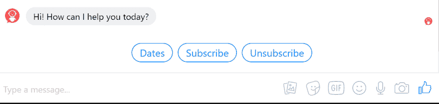
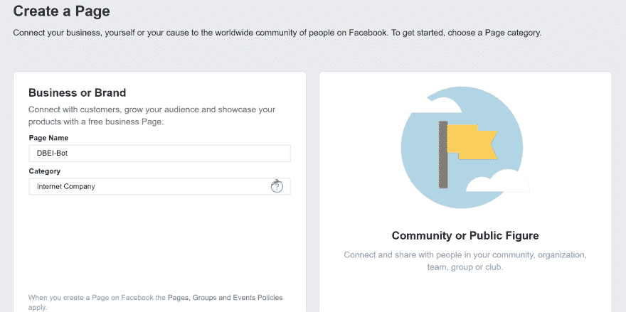
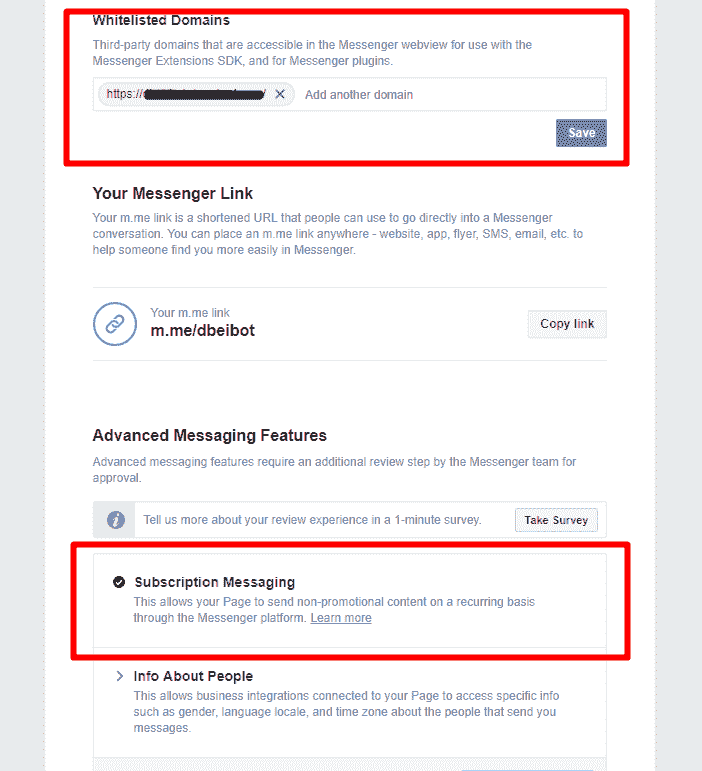
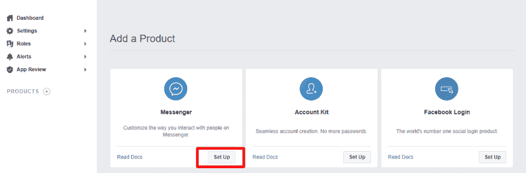
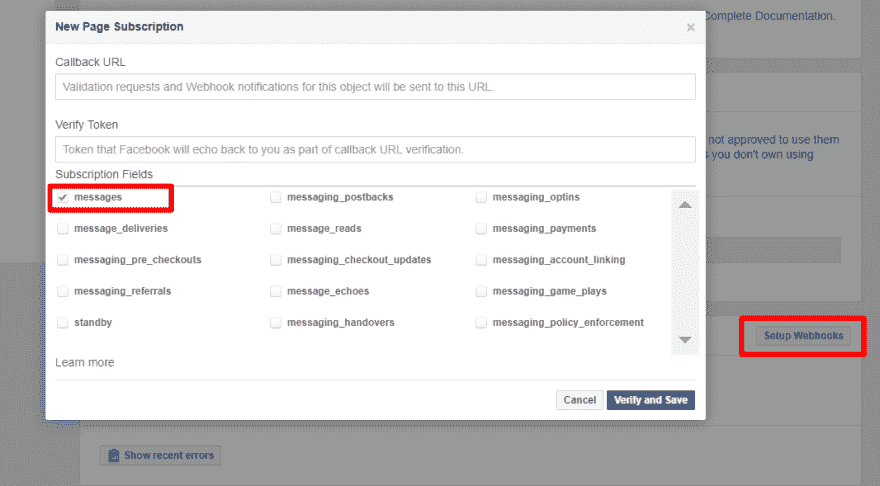
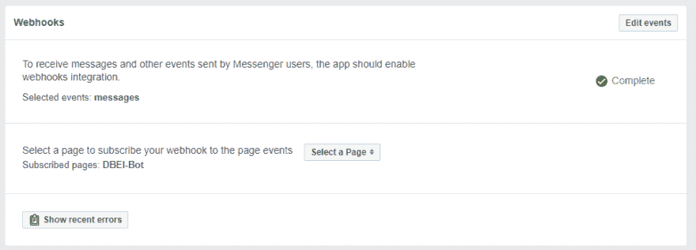
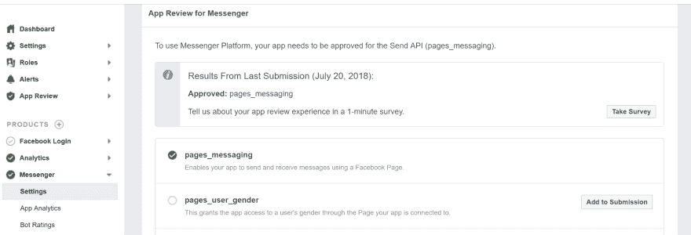

# 构建和发布您的 Messenger Bot

> 原文：<https://dev.to/harshadranganathan/building-and-publishing-your-messenger-bot-3fea>

最初发表于[rharshad.com](https://rharshad.com/building-publishing-facebook-messenger-bot/)

# 打造你的机器人

在这个例子中，我们将使用 Node.js 来构建我们的 bot，它将响应用户的消息。

## 新建一个 Node.js 项目

```
mkdir dbei-bot
cd dbei-bot

// create package.json file
npm init
touch index.js

// install project dependencies
npm install express body-parser --save // http server
npm install axios --save // promise based http client
npm install dotenv --save // loads environment variables from .env file 
```

## 配置一个环境文件

我们将创建一个包含以下条目的`.env`文件:

```
SEND_API=https://graph.facebook.com/v3.0/me/messages
VERIFY_TOKEN=<VERIFY_TOKEN>
PAGE_ACCESS_TOKEN=<PAGE_ACCESS_TOKEN> 
```

`VERIFY_TOKEN`

它可以是随机字符串。稍后，我们将在 messenger 平台中配置这个令牌。

目的- Messenger 平台将向我们的 webhook 发送一个挑战请求，我们必须验证它是否与配置的令牌匹配。只有这样，我们的 webhook 才会被订阅。

`PAGE_ACCESS_TOKEN`

我们将在稍后阶段在 messenger 平台中生成此令牌，并在此处替换它。

目的——我们需要这个令牌向 messenger 发送 API 请求。

## 创建一个 HTTP 服务器

我们将创建一个监听请求的 HTTP 服务器。在我们之前创建的`index.js`文件中，添加以下代码:

```
// configure dotenv so that process.env has the keys and values you defined in your .env file
require('dotenv').config();

const 
    express = require('express'),
    bodyParser = require('body-parser'),
    app = express().use(bodyParser.json());

app.listen(process.env.PORT || 1337, () => console.log('webhook is listening')); 
```

## 添加 webhook 验证端点

在`index.js`文件中，我们添加以下代码来公开`/webhook` GET 端点。

```
/**
 * Webhook challenge endpoint
 */
app.get('/webhook', (req, res) => {
    let VERIFY_TOKEN = process.env.VERIFY_TOKEN;
    let mode = req.query['hub.mode'];
    let token = req.query['hub.verify_token'];
    let challenge = req.query['hub.challenge'];
    if(mode && token) {
    // Checks the mode and token sent is correct
        if(mode == 'subscribe' && token == VERIFY_TOKEN) {
            res.status(200).send(challenge);
        } else {
            res.sendStatus(403);
        }
    }
}); 
```

我们稍后将在 messenger 平台中配置此端点，它将用于使用我们提供的`VERIFY_TOKEN`进行挑战验证。

如果 messenger 平台发送的令牌与我们配置的令牌匹配，那么我们需要发送`200`响应，否则发送`403`。

挑战验证成功后，messenger platform 将订阅我们的 webhook。

运行下面的命令来测试你的 web hook:

```
node index.js // starts the express HTTP server to serve at port 1337

curl -X GET "localhost:1337/webhook?hub.verify_token=<YOUR_VERIFY_TOKEN>&hub.challenge=CHALLENGE_ACCEPTED&hub.mode=subscribe" 
```

如果一切都设置正确，上面应该返回 HTTP 状态代码 200，响应为`CHALLENGE_ACCEPTED`。

## 添加 webhook 端点

在`index.js`文件中，我们添加了以下代码来公开`/webhook` POST 端点，Messenger 平台将使用该端点来发送 webhook 事件。

```
/**
 * Messenger webhook endpoint
 */
app.post('/webhook', (req, res) => {
    let body = req.body;
    // Checks this is an event from a page subscription
    if(body.object === 'page') {
        // Iterates over each entry - there may be multiple if batched
        body.entry.forEach(function(entry) {
            // entry.messaging is an array, but will only ever contain one message
            let webhook_event = entry.messaging[0];
            // A person is assigned a unique page-scoped ID (PSID) 
            // for each Facebook Page they start a conversation with. 
            // The PSID is used by your Messenger bot to identify a person when sending messages.
            let sender_psid = webhook_event.sender.id;
            messenger.handleMessage(sender_psid, webhook_event.message); 
        });
        res.status(200).send('EVENT_RECEIVED');
    } else {
        res.sendStatus(404);
    }
}); 
```

## 处理函数

之前我们提到过`messenger.handleMessage(sender_psid, webhook_event.message);`函数调用。我们现在将定义这个函数来处理和响应来自用户的文本消息。

```
/**
 * Incoming Message Handler
 */
function handleMessage(sender_psid, received_message) {
    // check if the input is text message
    // users might send smiley which can be filtered out
    if(typeof received_message.text !== "undefined") {
        let message = received_message.text.toLowerCase();
        callSendAPI(sender_psid, { text: message });
    }    
} 
```

我们将定义`callSendAPI`通过 SEND API 发送响应消息。

```
 // access environment variables
const PAGE_ACCESS_TOKEN = process.env.PAGE_ACCESS_TOKEN;
const SEND_API = process.env.SEND_API;

/**
 * Calls the Messenger API to send the message
 */
function callSendAPI(psid, message) {
    let data = { 
        "recipient": { "id": psid }, 
        "message": message 
    };
    return axios({
        method: 'POST',
        url: SEND_API,
        params: { access_token: PAGE_ACCESS_TOKEN },
        data: data
    })
    .catch((error) => {
        if (error.response) {
            console.log('PSID: ', psid);
            console.log('Status code: ', error.response.status);
            console.log('Response: ', error.response.data);
        } else if (error.request) {
            console.log('Request: ', error.request); 
        } else {
            console.log('Error: ', error.message);
        }
    });
} 
```

这里，

`recipient` -设置预期的消息接收人。在这种情况下，我们通过 PSID 来识别人。

`message` -设置要发送的消息的详细信息。

我们将我们的消息发送到发送 API，它的 URL 我们之前已经在一个`.env`文件中定义了。我们还在 URL 查询字符串的 access_token 参数中追加了`PAGE_ACCESS_TOKEN`。

如果您要发送订阅消息，您需要在数据请求中包含`NON_PROMOTIONAL_SUBSCRIPTION`标记。

```
let data = { 
    "recipient": { "id": psid }, 
    "message": message, 
    "messaging_type": "MESSAGE_TAG", 
    "tag": "NON_PROMOTIONAL_SUBSCRIPTION" 
}; 
```

## 发送结构化消息

Messenger Platform 提供了一组有用的消息模板，每个模板都支持不同的通用消息结构，包括列表、收据、按钮等。

下面是示例`templates.js`助手脚本，可用于向 Send API 发送结构化消息。

```
/**
 * link https://developers.facebook.com/docs/messenger-platform/reference/template/generic
 */
function genericTemplate(elements) {
    return {
        "attachment": {
            "type": "template",
            "payload": {
                "template_type": "generic",
                "elements": elements
            }
        }
    };
}

/**
 * link https://developers.facebook.com/docs/messenger-platform/reference/template/list
 */
function listTemplate(elements) {
    return {
        "attachment": {
            "type": "template",
            "payload": {
                "template_type": "list",
                "top_element_style": "compact",
                "elements": elements,
                "buttons": [
                    {
                        "title": "Donate", 
                        "type": "web_url", 
                        "url": 'https://www.paypal.me/harshadranganathan'
                    }
                ]
            }
        }
    };
}

/**
 * link https://developers.facebook.com/docs/messenger-platform/send-messages/quick-replies/
 */
function quickRepliesTemplate(text, quickReplies) {
    return {
        "text": text,
        "quick_replies": quickReplies
    }
}

module.exports = {
    genericTemplate: genericTemplate,
    listTemplate: listTemplate,
    quickRepliesTemplate: quickRepliesTemplate
}; 
```

Messenger 快速回复示例:

[](https://rharshad.com/assets/img/2019/01/messenger-quick-replies.png)

例如，要使用`quickRepliesTemplate`，导入模板脚本并传递引用模板文档的回复选项:

```
const _ = require('lodash');
const templates = require('./templates');

function quickReplyOptions(text) {
    let quickReplies = [];
    _.forEach(['Subscribe', 'Unsubscribe'], (option) => {
        quickReplies.push({ content_type: 'text', title: option, payload: option });
    });
    return templates.quickRepliesTemplate(text, quickReplies);
}   

callSendAPI(sender_psid, quickReplyOptions("Hi! How can I help you today?")); 
```

# 部署你的 webhook

既然我们已经构建了示例 bot，我们必须将它部署在具有有效 SSL 证书的服务器上，以便它可以通过 HTTPS 接受请求。

HTTPS 连接是整合我们的机器人与信使平台必须具备的。

我们有几个选择:

1.  如果你需要在本地集成和测试它，你可以使用 [ngrok](https://www.npmjs.com/package/ngrok) 。
2.  你可以在 [glitch](https://glitch.com/edit/#!/messenger-platform-quick-start?path=README.md:1:0) 上重新混合 messenger quick start 项目，它将为你的 webhook 提供一个通过 HTTPS 提供的公共 URL。
3.  您可以在 linux 实例中托管 node.js 应用程序，使用 [Nginx](https://www.nginx.com/) 作为代理，并使用[配置 SSL 证书，让我们加密](https://letsencrypt.org/)。

一旦您部署了您的应用程序并配置了 HTTPS 连接，如果您已经将一个域映射到您的服务器 IP，您的 webhook url 将是`https://<server-ip>/webhook`(或)`https://<domain>/webhook`。

继续下一步，将其与 Messenger 平台集成。

# 设置您的脸书应用程序

按照以下步骤设置您的 facebook 应用程序，以便与 Messenger 平台配合使用，并订阅您的 webhook 以接收事件。

## 脸书页

脸书页面将被用作您的机器人的身份。当人们与您的应用程序聊天时，他们会看到页面名称和页面个人资料图片。

首先为你的机器人创建一个 facebook 页面。

对于我们的机器人，我们将创建一个类别为`Internet Company`的业务页面。

[](https://rharshad.com/assets/img/2019/01/create-fb-page.png)

然后，您可以选择个人资料图片和封面。

其他页面配置:

*   创建一个自定义 url，人们可以使用它来搜索和访问您的页面。
*   您可以禁止页面上其他人的帖子。
*   您可以提供联系人的描述和电子邮件地址。
*   关闭消息通知，这样你就不会收到每条通过 messenger 发送给机器人的消息的提醒。
*   您可以添加一个联系人按钮，这样人们就可以从您的页面发送消息。

### 白名单域&订阅消息

我们将很快整合您的 webhook URL 与 messenger 平台。为了让你的 webhook 被 messenger 调用，你需要将你的域名加入白名单。

在`Messenger Platform`设置下的`Whitelisted Domains`部分添加您的域名。

[](https://rharshad.com/assets/img/2019/01/messaging-platform-features.png)

如果你的机器人需要向 Messenger 上的人发送常规内容，你需要在页面级别提升`Subscription Messaging`权限。

只有在此权限得到审核和批准后，您才能向`Standard Messaging`之外的人发送消息。

[https://developers . Facebook . com/docs/messenger-platform/policy/policy-overview/](https://developers.facebook.com/docs/messenger-platform/policy/policy-overview/)

## 脸书开发者账号

你需要一个开发者帐户来创建新的应用程序，作为你的页面和机器人之间的集成。

通过[脸书为开发者](https://developers.facebook.com/)平台创建开发者账户。

## 脸书 App

脸书应用包含您的 Messenger bot 的设置，包括访问令牌。

使用[应用仪表板](https://developers.facebook.com/apps)创建一个新应用。

您的新应用程序将在`Development Mode`中创建。

在`Development Mode`下，一旦我们完成与 messenger 的集成，只有在应用程序中被授予管理员、开发人员或测试人员角色的用户才能与机器人进行交互。

### 将 Messenger Platform 添加到您的应用

1.  在“产品”下的应用程序设置侧栏中，单击“+添加产品”。
2.  将鼠标悬停在“Messenger”上以显示选项。
3.  点击“设置”按钮。

[](https://rharshad.com/assets/img/2019/01/messenger-product-fb-app.png)

### Setup Webhook

在 Messenger 设置控制台的“Webhooks”部分，单击“设置 Webhooks”按钮。

配置回调 URL 并验证令牌。

这里，回调 URL 将是`https://<server-ip-or-domain>/webhook`，验证令牌将是您之前在`.env`文件中给定的值。

Messenger Platform 将使用您提供的验证令牌向您的 webhook 发送 GET 请求。如果您的 webhook 有效并正确设置以响应验证请求，您的 webhook 设置将被保存。

此外，在订阅字段中选择`messages`并保存 webhook 配置。

[](https://rharshad.com/assets/img/2019/01/setup-webhook.png)

### 订阅您的脸书页面

在 Messenger 设置控制台的“Webhook”部分，单击“选择页面”下拉菜单，然后选择您之前创建的 facebook 页面。

这将订阅您的应用程序，以便在 Messenger 上的人与您的页面聊天时接收事件，并将其转发到您的 webhook。

[](https://rharshad.com/assets/img/2019/01/webhooks-section.png)

### 生成页面访问令牌

1.  在 Messenger 设置控制台的“令牌生成”部分，单击“选择页面”下拉菜单，然后选择您之前创建的脸书页面。

2.  复制出现在“页面访问令牌”字段中的令牌。

3.  将这个令牌添加到我们在`.env`文件中定义的属性 PAGE_ACCESS_TOKEN。

生成的令牌不会保存在此用户界面中。每次您从下拉列表中选择一个页面，都会生成一个新的令牌。如果生成了新令牌，以前创建的令牌将继续发挥作用。

## 测试 App 订阅

从 facebook.com 或 Messenger 向您的页面发送消息。如果您的 webhook 接收到一个 webhook 事件，那么一切都已正确连接。

# 发布您的应用

在开发模式下，应用程序的所有登录权限、功能和特定于产品的功能都会自动获得批准。

但是，一旦您将应用程序切换到实时模式，您的应用程序就只能使用已获批准的权限和功能。

Messenger 平台需要以下审查和批准步骤:

1.  权限和功能审查
2.  业务信息和验证文件
3.  接受补充条款并签署技术提供商协议

## 权限和功能审核

一旦你准备好发布你的机器人，确保你的应用在`Development Mode`中。

在应用程序控制台的“设置”>“基本”下提供基本信息:

1.  应用程序图标
2.  隐私政策 URL
3.  种类
4.  商业用途

您可以使用这个机器人生成一个隐私策略。

### 选择 app 权限

在 messenger 设置的应用审查部分下请求 pages_messaging 权限，这允许您的 bot 在实时模式下发送消息。

[](https://rharshad.com/assets/img/2019/01/app-review-messenger.png)

一旦你选择了所有需要的权限，提交你的机器人进行审查。

然后，messenger 测试用户将审查您的机器人，他们会发布您在提交应用程序供审查时提到的命令。你的机器人应该在 20 秒内回复他们的信息。

如果在规定的时间内没有回复，您提交的应用程序将被退回。

[](https://rharshad.com/assets/img/2019/01/messenger-test-users.png)

陷阱:

1.  我向我的页面发送了一条消息，并收到了机器人的回复。然而，当测试用户发送消息时，他们没有得到任何响应。

这可能是一个[平台错误](https://developers.facebook.com/support/bugs/),因为我也遇到过同样的问题。当测试用户发送他们的第一条消息时，webhook 没有被调用，但是当同一个用户再次发送消息时，一切正常。我提出了一个错误报告，它被信使团队修复了。

## 业务信息及验证文件

如果您使用 messenger API，那么您的业务需要得到验证。

您需要创建一个[业务经理帐户](https://business.facebook.com)，并将其链接到您的应用程序。

一旦对您的 bot 的响应性、功能性和策略合规性进行了审查，您将收到一条消息，要求您在应用程序控制台的“警报”选项卡中完成业务验证。

然后你需要提供证据进行核实。如果你不是一个真正的企业，你可以提交你的家庭水电费账单(必须与你在企业经理账户上的名字相符)作为证明。

每个业务经理帐户都需要进行一次业务验证。

## 接受补充条款并签署技术提供商协议

提交您的业务信息和验证文件后，您将收到脸书法律团队的电子邮件，要求您对补充条款进行数字签名并申请审核。

一旦所有的审查完成，你的机器人将被批准。然后你可以让它活起来，任何人都可以发消息并从你的页面得到回复。

## 参考文献:

[https://developers . Facebook . com/docs/messenger-platform/getting-started/web hook-setup](https://developers.facebook.com/docs/messenger-platform/getting-started/webhook-setup)

[https://developers . Facebook . com/docs/messenger-platform/getting-started/quick-start](https://developers.facebook.com/docs/messenger-platform/getting-started/quick-start)

[https://developers . Facebook . com/docs/messenger-platform/getting-started/app-setup](https://developers.facebook.com/docs/messenger-platform/getting-started/app-setup)

[https://developers . Facebook . com/docs/messenger-platform/policy/policy-overview/](https://developers.facebook.com/docs/messenger-platform/policy/policy-overview/)

[https://developers.facebook.com/docs/apps/review/](https://developers.facebook.com/docs/apps/review/)

[https://developers . Facebook . com/docs/messenger-platform/app-review/](https://developers.facebook.com/docs/messenger-platform/app-review/)