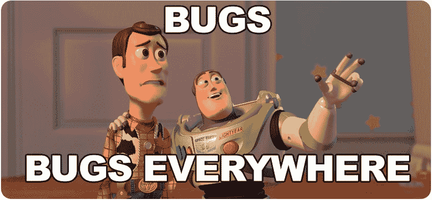
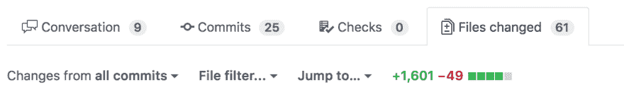
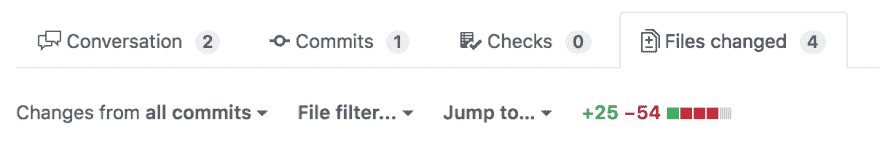
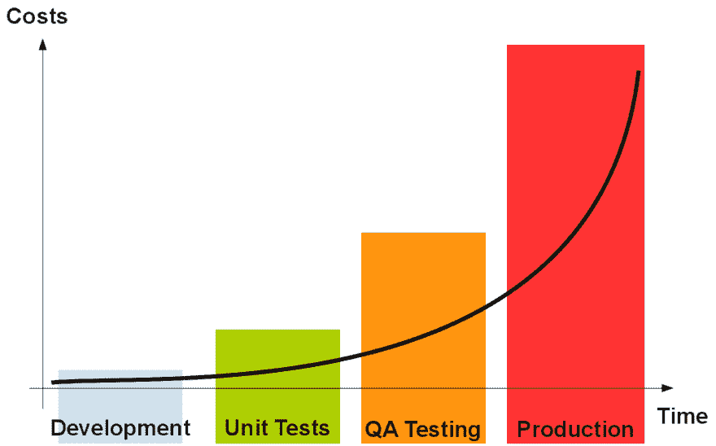

# 营造无可指责的工作环境

> 原文：<https://dev.to/sobolevn/building-blameless-working-environment--17hl>

曾经我在软件开发公司工作。这是一家普通的公司:没什么真正糟糕的，但也没什么特别的。它和其他类似的公司有着同样的问题:

*   低质量代码
*   未满足的截止日期
*   预算超支

最终导致客户失望。

当然，管理层的每个人都渴望知道，原因是什么(或“谁”)。在我们的工作日，听到这样的话是很正常的:“项目失败是因为你写了低质量的代码，现在客户正在远离我们”。

有什么帮助吗？不。在那里工作愉快吗？没有。所以，当我醒来后，我决定不再在这家公司工作了。

最丑陋的部分是我是这家公司的创始人。

## 我们能不能都同意指责不起作用？

在进一步描述我们是如何设法改变我们的环境以及它是如何影响我们的结果之前，我想直截了当地指出:因为任何事情责备某人是没有用的。为什么？

1.  这表明公司的工作流程中存在不完善的流程，但人们不是修复它们，而是指责并完全隐藏问题。所以，它永远不会被修复
2.  这会打击人们的积极性。你可能因此失去最好的工程师。有些公司的员工行为不同。我们，工程师，可以选择

我们能做些什么呢？我们可以用另一种方式构建我们的流程！

## 改进你的项目，而不是责怪任何人

你能想象出出问题时的情形吗？当您的产品因为依赖版本不匹配而停止工作时。或者因为你在你的`string`变量中犯了一个愚蠢的错别字。

这种情况经常发生，并不奇怪。

因此，我们必须准备好处理这种情况。我们必须创建一套有效的规则和实践来避免可能的错误，并处理那些我们未能及早发现的错误。

但是怎么做呢？

## 小任务，明确范围

通常很难定义需要几天甚至几周的大任务。这类任务没有明确的范围和“完成”标准。

所以，这就是事情可能出错的地方。由于范围更广，两个人会对这些任务有不同理解。他们会对不同的任务部分进行不同的优先级排序。最后，很容易说:“你做得不好，你没有完成任务”。

此外，审查和控制代码的质量也很困难。我们都知道审查 1000+行代码有多难。

我坚持认为，任务应该很小(不超过 4 小时)，应该有一个明确的范围。拥有五个明确定义的小任务比一个大任务要好。

这降低了误解的可能性。并允许双方轻松跟踪进度、控制截止日期和感受项目的脉搏。

## 让你的 CI 尽可能的严格

越早发现代码中的错误，对项目越有利。这个图表说明了允许 bug 流入产品的成本(在时间和金钱方面)有多高。

糟糕的代码不应该到达`master`分支，甚至不应该到达人类评审者那里。我们可以实现自动化！之前应该通过静态分析、林挺、不同种类的测试和其他指标。如果有什么东西坏了——你的代码不会到达`master`分支，评审者不会评审它，直到所有的检查都通过。

这种方式创建了应该满足的清晰透明的质量规则。那已经成为一条法律。

## 欢迎所有的 bug

但是错误还是会发生！这是一个可悲的现实。但是如何对待他们是你自己的选择。你可以因为他们而生气沮丧，也可以从中吸取教训。

我喜欢从自己和他人的错误中学习。这怎么可能呢？

每当生产中发生不好的事情，你需要跟踪你的质量关是如何允许这种事情发生的。我们错过了什么？

在你的团队找到答案后，你应该自动进行检查，以确保下次不会再发生这种情况。创建一个林挺规则或者写一个回归测试。

这里有一些我们如何做到这一点的真实世界的例子。

每当我们的`python` / `django`项目发生不好的事情，我们就给[的 CI 流程](https://github.com/wemake-services/wemake-django-template/blob/master/%7B%7Bcookiecutter.project_name%7D%7D/docker/ci.sh)添加一条新规则，或者为[的公司商标](https://github.com/wemake-services/wemake-python-styleguide)写一条新的林挺规则。这样我们保证这种事不会再发生。

对于[我们的前端](https://github.com/wemake-services/wemake-vue-template/blob/master/template/package.json#L28) `javascript` / `vue`项目也是如此。

## 让你的客户成为这个过程的一部分

有些情况下，你可能会失去你的客户，不是因为你的代码不好，而是因为你没能与你的客户建立一个清晰的沟通渠道。然后你会因为所有的坏事受到责备！

过去我们在这方面有很多问题。长时间的迭代和长时间的反馈周期正在杀死我们。我们未能足够快地解决 bug 和新需求。

这个问题的答案很简单:

1.  让你的客户成为你开发过程的一部分
2.  让你的迭代尽可能的小
3.  尽可能频繁地展示你的进步

我们通过几项有益的实践实现了所有这些目标:

1.  我们从第一天起就邀请我们的客户访问存储库
2.  微任务允许我们在一个工作日内进行多次迭代
3.  Gitlab 和 K8S 允许我们在需要时制作每个单独功能的演示

我们会尽快从客户那里收集反馈。客户总是了解项目中正在进行的事情:什么已经完成，什么正在进行中。

这样就很难指责任何人，也没有任何意义，协作并一起开发出令人敬畏的产品。最终，那才是我们追求的目标，不是吗？

## 结论

“不责备，但是修理”的方法彻底改变了我们的工作方式。

自从我们实践这些事情以来，我们没有一个项目失败过。我们没有因为冲突而损失一名工程师。

当然，这篇文章并没有涵盖我们日常生活中使用的所有特性和技巧，但是你可以在 [`RSDP`(可重复软件开发过程)主页](https://wemake.services/meta/)上阅读更多关于我们如何工作的内容。你可以[在 github](https://github.com/sobolevn) 上关注我，了解我们开发的工具。