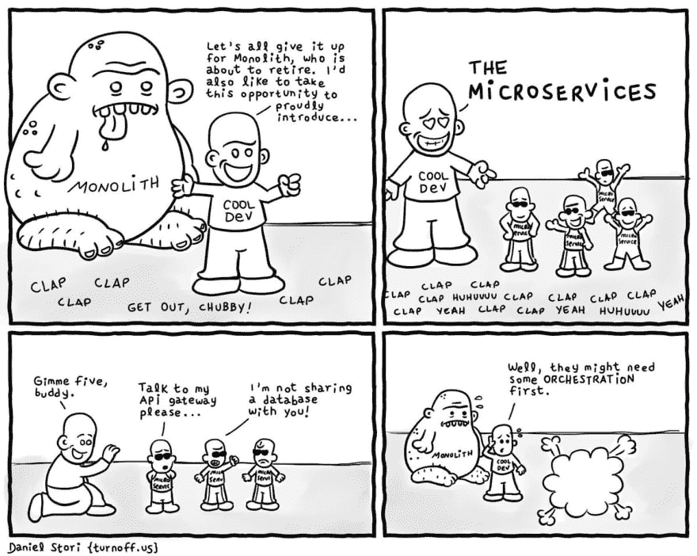
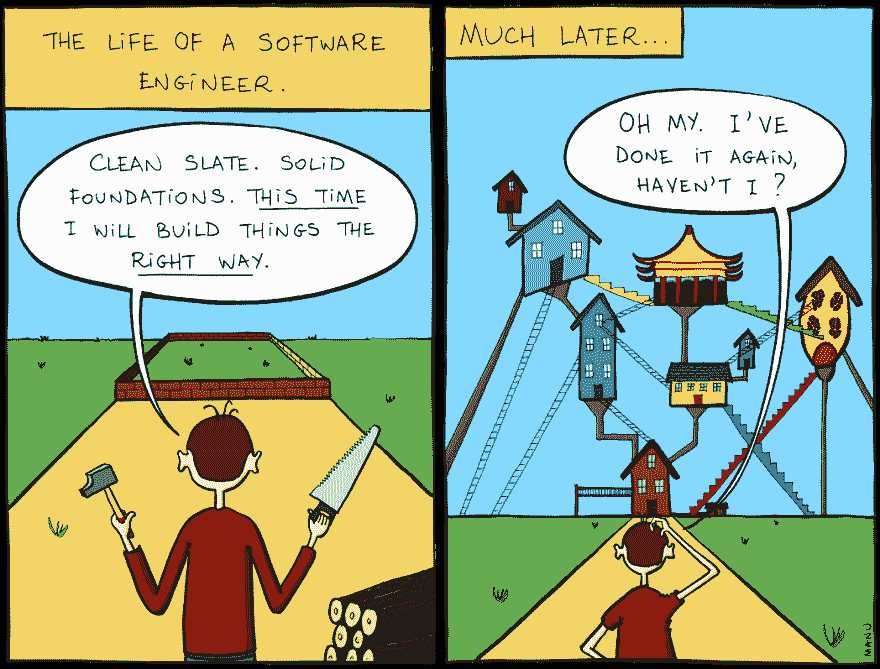

# 构建进化的建筑——书评

> 原文：<https://dev.to/jhotterbeekx/building-evolutionary-architectures---book-review-376i>

这是一本关于[构建进化架构:支持持续变化](https://www.amazon.com/Building-Evolutionary-Architectures-Support-Constant/dp/1491986360/)的书评。

前阵子我参加了一个关于微服务的基础讲座。虽然涵盖了这个架构的大部分基础知识，但在接近结尾的地方，演讲者提到了术语“进化架构”。不幸的是，他只能提到他认为这是一个重要的话题，但那天没有时间谈论它的实际内容。这让我有点吃惊，但我仍然对这个话题很感兴趣。我从来不喜欢传统的建筑师角色。在我看来，架构应该通过团队的协作来形成，如果你愿意的话，可以进化。你知道我的兴奋来自哪里吗？你看到里面的那个词了吗，直直地盯着你的灵魂？进化了的...现在听到有人说“进化架构”这个术语，这一定是同一件事，对吗？对吗？我现在已经为这种圣经比例的想法做好了准备，所以我决定读《构建进化的建筑》这本书。

## 结论

就像我以前的评论一样，也可能是接下来的评论，我从评论开始。如果我引起了你的兴趣，请继续阅读我的深度探索。如果没有，至少你知道我对这本书的看法。

合上书后，我百感交集。这本书的前半部分有点拖沓，但在第二部分变得更实际了。它不符合我的设想，也许它符合。这本书是在牢记传统架构师角色的基础上编写的，重点是他或她能够并且应该如何发展他们的架构。完成这项工作最重要的部分是定义你的产品和架构的关键特征。确保你有方法，最好是自动的，来验证你的系统是否符合这些特征，并在需要的时候进行调整。这本书的前半部分以一种深刻的理论方式涵盖了这一点，谈到了选择你的特征，将可进化性作为其中之一，以及如何使用它们。这本书的第二部分更深入实际的东西。像独石、微服务、增量变化和敏捷之类的东西都被谈到了。这部分对我来说更有用。自始至终，他们使用一个小部件公司作为例子，这使得它在实践中更容易理解。最后，这是一本非常短的书，将近 170 页，比我读过的大多数书都要短。总的来说，我给这本书打了 7 分，因为他们的进化架构观点的核心非常好。

准备好深潜了吗？我将浏览主要章节，谈谈最让我难忘的内容。

## 第一章。进化建筑

现在经常听到人们说，在开发软件时不应该制定任何 5 年计划，市场和行业的发展太快了。虽然过去它是有效的，或者至少大部分是这样，但是现在我们从敏捷工作中获益更多。这也转化为软件架构，认为今天的架构可以满足你未来 3-5 年甚至更长时间的想法是疯狂的。您应该考虑更多的短期问题，但是要确保您可以改进您的架构。在你的产品开发过程中，技术环境会发生变化，你应该能够处理这些变化。尽管架构在很多时候被定义为软件中“难以改变”的部分，但只要你将可演化性作为你的关键特征之一，情况就不一定如此。这给了我们进化的架构:“一个进化的架构支持跨多维度的引导的、增量的变化”。

引导是这个定义最重要的部分之一。随着时间的推移，我们需要一种方法来保护架构的重要特征。请记住，随着系统的增长，重要的特征数量通常也会随之增长。定义中的另一个关键是增量，您应该能够对您的架构进行更改。

## 第二章。健身功能

架构适应性功能允许您评估您的系统是否仍然满足您定义为重要的特征。这些方法给你指导，这就是进化建筑和反动建筑的区别。反应式是对性能问题、无法扩展或存在安全漏洞等实际问题做出响应。进化架构让你预先定义它们并保护它们。本章中提到的一个有趣的开发方法是监控驱动开发。在生产环境中使用监视器来评估技术和业务健康状况。有一个明显的偏好自动化的健身功能，所以很容易运行它们。谈到的一个风险是，当您没有预先定义架构特征时，您最终会将责任分散到您的整个代码库中，这使得任何影响分析都难以理解变更。

## 第三章。工程增量变更

任何合理的架构计划都必须包括演进性的变化，没有它，你注定会停滞不前。开发人员和架构师共同负责适应度函数的定义和维护。很多关于架构的东西都是可测试的，有很多工具可以测试(比如 JDepend 和 NDepend)。提到的其他支持库有 Chaos Monkey、Similan Army 和 compliance Monkey，它们是创建整体适应性测试的方法。例如，混沌猴随机关闭服务，并评估系统处理服务的能力。一致性猴子评估 RESTful APIs 的最佳实践。

## 第四章。建筑耦合

关于架构的讨论经常归结为耦合:架构的各个部分如何相互连接和依赖。许多架构师谴责耦合是不可避免的，但是如果不依赖(和耦合)其他组件，很难构建复杂的软件。演进架构关注于适当的耦合——如何识别架构的哪些维度应该被耦合，从而以最小的开销和成本提供最大的收益。有界上下文是防止紧密耦合的一种非常有用的方法，微服务是一种非常适合应用这种方法的架构。这种架构被设计成允许增量变化，这使得它非常适合可演进性。无论您选择哪种架构模式，都建议定义量程大小。或者通俗地说，进入系统一部分的内容。小量子意味着更快的变化。讨论了几种架构，其中包括:

### 分层建筑的独石

开发人员发现在这种架构中进行更改很容易，尽管跨层的更改需要一些协调。编写适应度函数也被认为是很容易的，因为这种整体结构更加透明，耦合也非常容易查看和维护。

### 模块化独石

架构师在微服务中看到的许多好处——隔离、独立、变更的小单元——可以在整体架构中实现。如果开发人员对耦合非常自律。这可以用健身功能来保护。改变和编写适应度函数就像在分层架构中一样容易，具有适当耦合的好处。

在开始一个项目时，这两种整体架构都是常见的选择，因为它易于理解。最终你可能需要发展成另一种架构，现在通常是微服务。但是请记住，如果一个开发团队很难构建一个最简单的架构，那么转移到一个更复杂的架构将如何解决他们的问题呢？

### 微服务

如果你能成功地拉微服务，它是最适合可演化性的架构。只要保持服务之间的通信完整，您就可以针对每个服务进行改进。

### 基于服务的架构

一种更常用的迁移架构风格是基于服务的架构，它在三个重要方面与微服务相似但不同:服务粒度、数据库范围和集成中间件。基于服务的架构仍然是以领域为中心的，但是解决了开发人员在将现有的应用程序向更进化的架构重构时所面临的一些挑战。例如，数据库通常是单一的，因为对于许多应用程序来说，重新构建多年的数据库模式是不可行或不可能的。

## 第五章。进化数据

架构师如何构建支持进化但仍然使用关系数据库等传统工具的系统？进化数据库设计的关键在于进化模式和代码。连续交付解决了如何使传统的数据仓库适应现代软件项目的连续反馈循环的问题。开发人员必须像对待源代码一样对待数据库结构的变更:经过测试的、版本化的和增量的。粒度级别也很重要。架构师有时试图构建一个粒度级别比业务的自然粒度级别更小的架构。例如，微服务架构并不特别适合大量事务处理的系统，因为目标服务量非常小。基于服务的架构往往工作得更好，因为对量程大小的要求不太严格。我们还应该考虑应用程序的耦合特征:类、包/名称空间、库和框架、数据模式和事务上下文。当试图发展一个架构时，忽略这些维度中的任何一个(或者它们的交互)都会产生问题。

虽然系统经常无法避免事务，但我们应该尽可能地限制事务上下文，因为它们形成了一个紧密耦合的结，阻碍了在不影响其他组件或服务的情况下更改组件或服务的能力。更重要的是，在考虑架构变更时，我们应该考虑事务边界等方面。当将整体架构风格迁移到更细粒度的架构风格时，首先从少量更大的服务开始。在构建绿地微服务架构时，开发人员应该注意限制服务和数据上下文的大小。然而，不要把微服务这个名字看得太重——每个服务不必很小，而是要捕捉有用的有界上下文。

## 第六章。构建可进化的建筑

我们可以使用这些技术分三步构建一个进化架构:

1.  确定维度
    我们必须确定随着体系结构的发展，我们想要保护体系结构的哪些维度。这总是包括技术架构，通常还有数据设计、安全性、可伸缩性和其他我们认为重要的东西。这必须涉及组织内的其他相关团队，包括业务、运营、安全和其他受影响方。

2.  为每个维度定义适应度函数
    一个维度通常包含许多适应度函数。例如，我们通常将代码度量的集合连接到部署管道中，以确保代码库的架构特征，例如防止组件依赖循环。

3.  使用部署管道来自动化适应性功能
    最后，我们必须鼓励项目的增量变更，定义部署管道中应用适应性功能的阶段，并管理部署实践，如机器供应、测试和其他开发运维问题。增量变化是演进架构的引擎，允许通过部署管道和高度自动化对适应性功能进行积极的验证，以使部署等日常任务变得不可见。支持演进架构的项目的开发人员的部分责任是保持良好的周期时间。周期时间是增量变更的一个重要方面，因为许多其他指标都是从它派生出来的。例如，新一代架构出现的速度与其周期时间成正比。换句话说，如果一个项目的周期时间延长了，它会减慢项目交付新的世代的速度，这会影响可演化性。

虽然这个建议似乎显而易见，但我们经常看到选择了最闪亮的新架构模式而不是最合适的模式的团队遭受损失。选择架构的一部分在于理解问题和物理架构的结合点。我们必须理解我们为什么要执行迁移，并且它必须是一个比“这是当前趋势”更好的理由将架构分成域，以及更好的团队结构和操作隔离，允许更容易的增量变更，这是演进架构的构建块之一，因为工作的焦点与物理工作工件相匹配。当分解整体架构时，找到正确的服务粒度是关键。创建大型服务缓解了事务上下文和编排等问题，但却无助于将整体分割成更小的部分。过于细粒度的组件会导致过多的编排、通信开销以及组件之间的相互依赖。

他们更深入地开发一个进化架构，谈论让你的决定可逆，意识到你不知道未来会带来什么，意识到数据损坏的风险，并远离将一切都推到技术债务的陷阱。最后但同样重要的是，不要低估原型的力量，不要害怕事后抛弃它！

## 第七章。进化架构陷阱和反模式

本章深入探讨了几种反模式和陷阱。我不会一一细说，只是列举几个引起我注意的例子:

具有讽刺意味的是，开发人员越努力使代码可重用，代码就越难使用。使代码可重用包括添加额外的选项和决策点，以适应不同的用途。开发人员添加越多钩子来实现重用，他们对代码基本可用性的损害就越大。换句话说，代码的易用性通常与代码的可重用性成反比。当开发人员构建可重用的代码时，他们必须添加特性来适应开发人员最终将使用代码的无数方式。所有这些面向未来的措施使得开发人员更难将代码用于单一目的。这并不意味着您应该避免代码的重用，但是您应该不断地评估您是否仍然需要它，并且当它变得更好时不要害怕断开链接。

越来越多的努力投入到假设中，即使它们在六个月后被证明是错误的，也会导致对它们的强烈依赖。简而言之，一个人在某件事情上投入了越多的时间和精力，就越难放弃它。在软件中，这是以非理性工件附件的形式出现的。

## 第八章。将进化架构付诸实践

当涉及到演化架构时，围绕领域而不是技术能力构建的团队有几个优势，并表现出一些共同的特征。以领域为中心的团队往往是跨职能的，这意味着每个项目角色都由项目中的某个人负责。以领域为中心的团队的目标是消除操作上的摩擦。换句话说，团队拥有设计、实现和部署他们的服务所需的所有角色，包括传统上独立的角色，如操作。

通过围绕领域对架构和团队进行建模，常见的变更单元现在在同一个团队中处理，减少了人为的摩擦。以领域为中心的架构可能仍然使用分层架构的其他好处，例如关注点的分离。例如，一个特定微服务
的实现可能依赖于一个实现分层架构的框架，允许团队轻松地替换掉一个技术层。微服务封装了领域内的技术架构，颠覆了传统的关系。

另一个有用的程序是从项目转移到产品思维，因为它真的增加了参与度。产品团队对其产品的长期质量负责。因此，开发人员获得质量度量的所有权，并且更加关注缺陷。这种视角也有助于为团队提供长期愿景。也要保持你的团队规模小，大的团队往往会有更多的问题，并且不能很好的合作。

尝试应用三振出局和重构规则。第一次做一件事，就去做。第二次，不要重复，但还是要做。第三次做类似的事情时，重构。不要害怕尝试，尝试新的想法，这样你就会不断成长。

## 最后的想法

他们谈论很多事情。大部分都不是新的，它只是被应用到建筑中，并与被称为“进化建筑”的概念相联系。这些都是很好的概念，作为开发人员，我们在开发和设计我们的项目时应该真正意识到这一点。最后，这一切都归结为在这些领域创造意识，不要只是追逐我们行业中有很多闪亮的新钻石，而是在构建软件时做出有意识和深思熟虑的选择。

