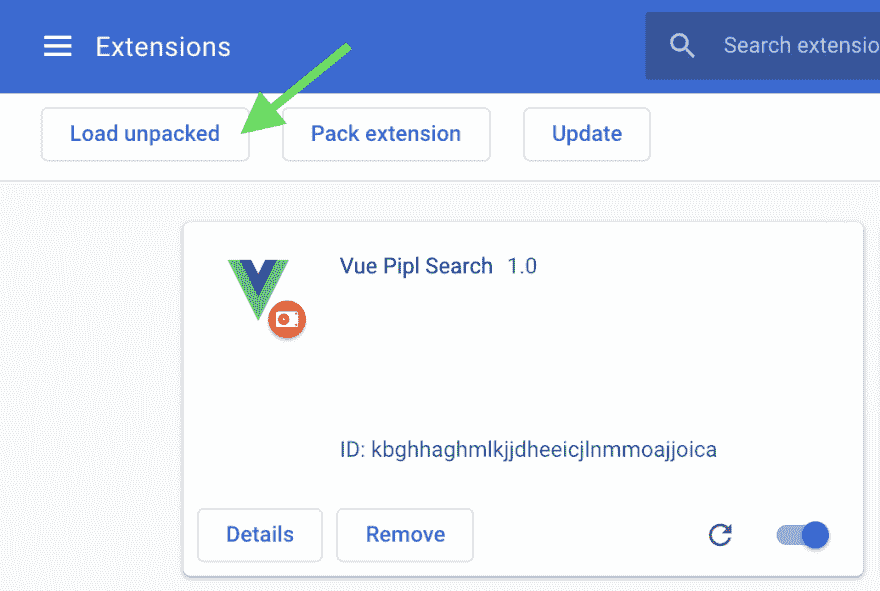
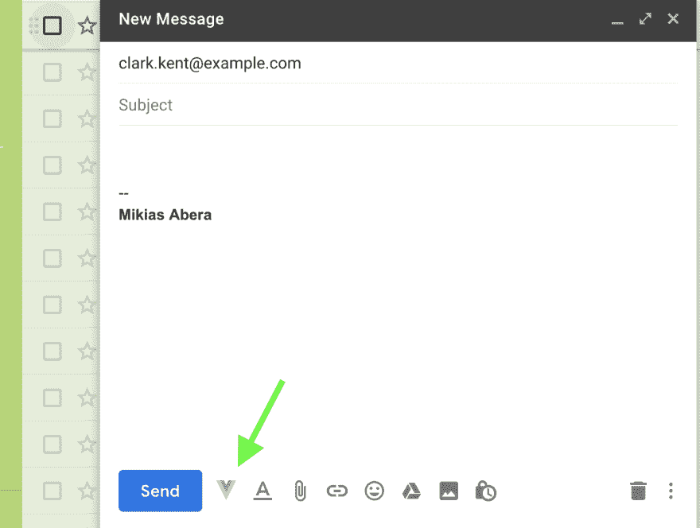
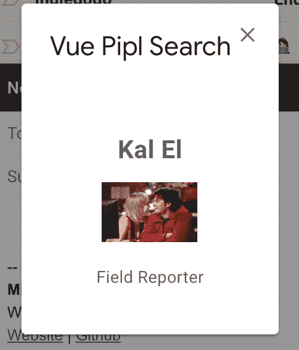

# 用 Vue.js 和 InboxSDK 构建 Gmail/Chrome 扩展

> 原文：<https://dev.to/mikeeus/building-gmailchrome-extension-with-vuejs-and-inboxsdk-20ah>

我们将创建一个小型的 Chrome 扩展，使用 [InboxSDK](https://www.inboxsdk.com) 和 [Pipl](https://pipl.com) 让你在我们的 Gmail 中搜索用户信息的电子邮件地址。您可以更改这个演示来使用您喜欢的任何 Api。例如，您可以:

*   使用像 [aylien](https://aylien.com/text-api/) 这样的 API 进行情感分析
*   使用[垃圾邮件检查](https://spamcheck.postmarkapp.com/)检查您电子邮件的垃圾邮件分数

您可以用
克隆演示的 [git 库](https://github.com/mikeeus/vue-demo-inboxsdk)

```
git clone git@github.com:mikeeus/vue-demo-inboxsdk.git 
```

### 创建 Chrome 执行

创建一个 Chrome 扩展非常简单。首先，我们需要一个`manifest.json`文件来描述我们的扩展。你可以在这里找到 [Chrome 清单文档](https://developer.chrome.com/extensions/manifest)

```
//  manifest.json  {  "manifest_version":  2,  "name":  "Vue Pipl Search",  "version":  "1.0",  "permissions":  [  "https://mail.google.com/",  "https://inbox.google.com/",  "https://api.pipl.com/",  "https://cdn.jsdelivr.net/npm/vue@2.5.17/dist/vue.js",  "https://cdnjs.cloudflare.com/ajax/libs/axios/0.18.0/axios.min.js"  ],  "content_scripts"  :  [  {  "matches":  ["https://mail.google.com/*",  "https://inbox.google.com/*"],  "js":  ["inboxsdk.js",  "app.js"]  }  ],  "web_accessible_resources":  [  "icon.png"  ],  "icons":  {"128":  "icon.png"}  } 
```

我们想使用清单的`2.0`版本。我们将称我们的扩展为“Vue Pipl Search”并使其成为版本`1.0`。

因为我们希望我们的扩展能够在 Gmail 上工作，所以我们将把`https://mail.google.com/`和`https://inbox.google.com/`添加到我们的权限中。我们还将添加`pipl.com`以及我们的`vue.js`和`axios.min.js` cdn 链接，因为我们将在我们的应用程序中使用它们。

接下来我们将添加一个`content_scripts`键，告诉 Chrome 当浏览器打开`mail.google.com`或`inbox.google.com`时，我们想要运行`inboxsdk.js`和我们的`app.js`脚本。

最后，我们将在`web_accessible_resources`数组中声明`icon.png`，并将其作为扩展的`icon`。将它声明为 web 可访问允许我们稍后使用 InboxSDK 加载它。

### InboxSDK

在我们使用 InboxSDK 之前，我们需要一个 AppId，我们[可以从这里](https://www.inboxsdk.com/register)得到它。我们还将包含可以从这里下载的`inboxsdk.js`文件。

现在让我们创建我们的`app.js`文件，它将使用 InboxSDK 将我们的扩展添加到 Gmail。

```
// app.js

InboxSDK.loadScript('https://cdn.jsdelivr.net/npm/vue@2.5.17/dist/vue.js')
InboxSDK.loadScript('https://cdnjs.cloudflare.com/ajax/libs/axios/0.18.0/axios.min.js')

// Load InboxSDK 1.0 using our AppID
InboxSDK.load('1.0', 'INBOX_SDK_APP_ID').then(function(sdk){
  // the SDK has been loaded
  // We want to register a view handler on the Compose view
  sdk.Compose.registerComposeViewHandler(function(composeView){
    // a compose view has come into existence, do something with it!
    composeView.addButton({
      title: "Vue Pipl Search",
      iconUrl: chrome.extension.getURL('icon.png'),
      onClick: function(event) {
        sdk.Widgets.showModalView({
          title: 'Vue Pipl Search',
          'el': `<div id="vue-pipl-search"></div>`,
        });

        // new Vue(...)
      },
    });
  });
}); 
```

一旦用`InboxSDK.load`加载了 InboxSDK 的更新版本，我们就可以使用`sdk.Compose`来注册一个视图处理程序，并在撰写电子邮件视图上添加一个按钮来启动我们的 Vue 组件。在弹出窗口中，我们将呈现一个带有`id='vue-pipl-search'`的 div，它将被 Vue 组件选中。

### Vue 组件

现在我们可以定义我们的 Vue 组件了。我们在`onClick`处理程序中这样做，以便在页面上存在`#vue-pipl-search`元素之后定义它。我们还需要一个来自 Pipl 的[样本 Api 密匙。](https://pipl.com/api/demo)

为了让 Vue 组件获得电子邮件的收件人，我们可以使用 [InboxSDK 的 composeView](https://www.inboxsdk.com/docs/#ComposeView) 方法。`composeView.getToRecipients()`将返回一个收件人数组，所以我们可以用`recipients[0].emailAddress`得到电子邮件地址。

将这些放在一起，我们得到以下结果。

```
// app.js

InboxSDK.load('1.0', 'INBOX_SDK_APP_ID').then(function(sdk){
  sdk.Compose.registerComposeViewHandler(function(composeView){
    composeView.addButton({
      // ...
      onClick: function(event) {
        // ...

        const vuePiplSearch = new Vue({
          el: '#vue-pipl-search',
          template: `
            <div>
              <template v-if="recipients.length">
                <div v-if="person" style="text-align: center;">
                  <h2 style="text-align: center">
                    {{person.names[0].display}}
                  </h2>
                  
                  <p v-if="person.jobs[0]">{{person.jobs[0].title}}</p>
                </div>
                <div v-else>
                  Person was not found.
                </div>
              </template>
              <div v-else>
                Add an email recipient to search Pipl Api.
              </div>
            </div>
          `,

          data() {
            return {
              recipients: composeView.getToRecipients(),
              person: null
            }
          },

          created() {
            if (this.recipients.length) {
              this.loading = true

              axios.get(`https://api.pipl.com/search/v5/?email=${this.recipients[0].emailAddress}&key=[PIPL_SAMPLE_KEY]`)
                .then(res => {
                  if (res.status === 200) {
                    this.person = res.data.person;
                    this.loading = false
                  }
                })
            }
          }
        })
      },
    });
  });
}); 
```

当组件被创建时，我们检查接收者，然后向 Pipl 发出请求。我们将结果存储在将在模板中呈现的数据属性中。

这非常简单，但是我们可以对其进行扩展，添加错误处理或对多个接收者的支持。

如果我们想使用不同的 Api 或者有不同的用例，我们可以使用像`composeView.getHTMLContent()`这样的方法来获取电子邮件正文并将其发送给 Api。

查看[文档了解更多想法](https://www.inboxsdk.com/docs/#ComposeView)。

### 加载扩展

要运行我们的扩展，我们需要加载它。我们可以压缩我们的项目并以这种方式加载它，但是对于本教程，我们将只加载解压缩的文件夹。从 [Chrome 的扩展页面](https://dev.tochrome://extensions/)选择左上角的“Load Unpacked ”,导航到扩展文件夹，然后选择 ok。这将为 chrome 添加扩展。

[](https://res.cloudinary.com/practicaldev/image/fetch/s--2t0EfP-n--/c_limit%2Cf_auto%2Cfl_progressive%2Cq_auto%2Cw_880/https://thepracticaldev.s3.amazonaws.com/i/hg35muq31qeyhpf92cqo.png)

现在，如果你导航到`gmail.com`并撰写一封电子邮件，你会看到 Vue 图标。

[](https://res.cloudinary.com/practicaldev/image/fetch/s--_A707s0N--/c_limit%2Cf_auto%2Cfl_progressive%2Cq_auto%2Cw_880/https://thepracticaldev.s3.amazonaws.com/i/pkcd07guuv3tpqor61p5.png)

添加“[clark.kent@example.com](mailto:clark.kent@example.com)”作为电子邮件收件人，并点击图标。一个模态应该打开，其中包含我们的 Vue 组件，万岁！它搜索 Pipl Api 并返回这个人。

[](https://res.cloudinary.com/practicaldev/image/fetch/s--1dh0Bsxc--/c_limit%2Cf_auto%2Cfl_progressive%2Cq_auto%2Cw_880/https://thepracticaldev.s3.amazonaws.com/i/46uz9f2ma0xu8gae22k2.png)

神奇！现在你可以像老板一样开始你的 PI 生涯了！

不要忘记喜欢如果你喜欢这个教程。如果你有任何问题，请在下面留言。:)