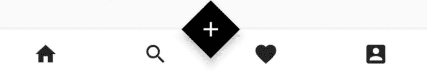
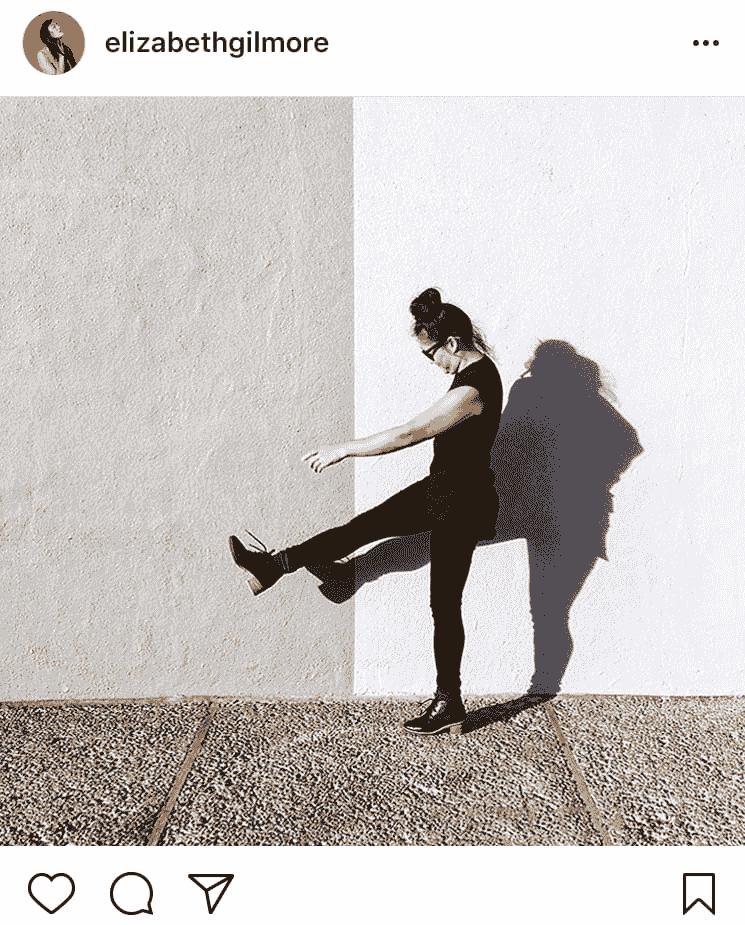

# 用 Flutter - UI 脚手架构建 Instagram

> 原文：<https://dev.to/preetjdpdev/building-instagram-with-flutter---ui-scaffold-iik>

# 首页

嘿你好吗？？在这篇文章中，我将建立主页。
主页将是一个[自定义滚动视图。](https://docs.flutter.io/flutter/widgets/CustomScrollView-class.html)
为什么？？你问？自定义滚动视图允许您使用 Slivers，它实际上是一个视口的一部分，这意味着您可以拥有一个由不同小部件组成的[可滚动页面。](https://medium.com/flutter-io/slivers-demystified-6ff68ab0296f)

```
class HomePage extends StatelessWidget {
  @override
  Widget build(BuildContext context) {
    return CustomScrollView(
      slivers: <Widget>[],
    );
  }
} 
```

提示:-要在 slivers 中使用普通的小部件，只需使用 SliverToBoxAdapter()。

## 应用栏

[](https://res.cloudinary.com/practicaldev/image/fetch/s--juohVo-7--/c_limit%2Cf_auto%2Cfl_progressive%2Cq_auto%2Cw_880/https://thepracticaldev.s3.amazonaws.com/i/f3pofavowtwggxf11pfc.jpg)
App 栏是 HomePart 的一部分，因为每个页面(个人资料、搜索等)都不一样。).
我们使用 Flutter 原生提供的 SliverAppBar，可以作为一个银条。
应用程序栏被设置为固定的，因此即使上下滚动也保持不变，但这可以针对一些有趣的用户界面/UX 进行更改。

```
SliverAppBar(
          pinned: true,
          backgroundColor: new Color(0xfff8faf8),
          elevation: 0.0,
          centerTitle: true,
          title: SizedBox(
            height: 35.0,
            child: Image.asset("asseimg/insta_logo.png"),
          ),
          leading: IconButton(
            onPressed: () {},
            icon: Icon(
              Icons.camera_alt,
              color: Colors.black,
            ),
          ),
        ), 
```

[链接到 instagram 标志](https://thepracticaldev.s3.amazonaws.com/i/9dgus6e6o80pv1gx8y7t.png)

## 底栏

[](https://res.cloudinary.com/practicaldev/image/fetch/s--td6CSFme--/c_limit%2Cf_auto%2Cfl_progressive%2Cq_auto%2Cw_880/https://thepracticaldev.s3.amazonaws.com/i/3a4lhiq9fjtalggaf8fr.jpg) 
底部应用栏是支架小部件下 main.dart 文件的一部分。
这是因为底部栏应该在所有页面/路径中保持不变。并且将起到导航栏的作用。
新的发布按钮是一个菱形的 FAB，与底部的应用程序栏对接。

```
floatingActionButtonLocation: FloatingActionButtonLocation.centerDocked,
        floatingActionButton: FloatingActionButton(
          backgroundColor: Colors.black,
          child: new Icon(Icons.add),
          onPressed: () {},
          shape: new BeveledRectangleBorder(
              borderRadius: new BorderRadius.circular(50.0)),
        ),
bottomNavigationBar: BottomAppBar(
          notchMargin: 6.0,
          child: Row(
            mainAxisAlignment: MainAxisAlignment.spaceAround,
            children: <Widget>[
              IconButton(
                icon: Icon(Icons.home),
                onPressed: () {},
              ),
              IconButton(
                icon: Icon(Icons.search),
                onPressed: () {},
              ),
              IconButton(
                icon: Icon(Icons.favorite),
                onPressed: () {},
              ),
              IconButton(
                icon: Icon(Icons.account_box),
                onPressed: () {},
              )
            ],
          ),
        ), 
```

## 岗位

Instagram 帖子由多个部分组成

# 这就是 instagram 的样子，也是我们想要复制的

[](https://res.cloudinary.com/practicaldev/image/fetch/s--ZzNTZy9i--/c_limit%2Cf_auto%2Cfl_progressive%2Cq_auto%2Cw_880/https://thepracticaldev.s3.amazonaws.com/i/rdixs1wib5vsfqhzxx2n.png)

post 小部件将包含一个包含三个孩子的列。

1.  第一个子项包含一行以容纳个人资料图像、海报名称和菜单按钮。
2.  第二个孩子将是主图像，可以是任何大小。
3.  第三个子节点将是一组操作，如喜欢按钮、评论、发送到和书签按钮。

你必须添加 [font_awesome_flutter](https://pub.dartlang.org/packages/font_awesome_flutter) 并将其包含在文件
中

```
class Post extends StatelessWidget {
  @override
  Widget build(BuildContext context) {
    return Column(
      children: <Widget>[
        Padding(
          padding: const EdgeInsets.fromLTRB(16.0, 8.0, 16.0, 8.0),
          child: Row(
              mainAxisAlignment: MainAxisAlignment.spaceBetween,
              children: <Widget>[
                Row(
                  children: <Widget>[
                    Container(
                      height: 40.0,
                      width: 40.0,
                      decoration: BoxDecoration(
                          shape: BoxShape.circle,
                          image: DecorationImage(
                              fit: BoxFit.fill,
                              image: new NetworkImage(
                                  "https://pbs.twimg.com/profile_images/877903823133704194/Mqp1PXU8_400x400.jpg"))),
                    ),
                    SizedBox(width: 10.0),
                    Text(
                      "The Verge",
                      style: TextStyle(fontWeight: FontWeight.bold),
                    )
                  ],
                ),
                IconButton(
                  icon: Icon(Icons.more_vert),
                  onPressed: () {},
                )
              ]),
        ),
        Container(
          child: Image.network(
            "https://scontent-bom1-1.cdninstagram.com/vp/bbe7af06973ff08e40c46e78b6dbae1b/5CD2BC37/t51.2885-15/e35/49480120_356125811610205_2312703144893486280_n.jpg?_nc_ht=scontent-bom1-1.cdninstagram.com",
            fit: BoxFit.cover,
          ),
        ),
        Padding(
          padding: EdgeInsets.all(16.0),
          child: Row(
            mainAxisAlignment: MainAxisAlignment.spaceBetween,
            children: <Widget>[
              Row(
                mainAxisAlignment: MainAxisAlignment.spaceBetween,
                children: <Widget>[
                  IconButton(
                    icon: Icon(Icons.favorite_border),
                  ),
                  SizedBox(width: 16.0),
                  Icon(FontAwesomeIcons.comment),
                  SizedBox(width: 16.0),
                  Icon(FontAwesomeIcons.paperPlane)
                ],
              ),
              Icon(FontAwesomeIcons.bookmark)
            ],
          ),
        ),
      ],
    );
  }
} 
```

[](https://res.cloudinary.com/practicaldev/image/fetch/s--qlUzHk5s--/c_limit%2Cf_auto%2Cfl_progressive%2Cq_auto%2Cw_880/https://thepracticaldev.s3.amazonaws.com/i/h3lfdnd2vmq1uqvtzwzg.jpg)

### 结论

我已经建立了一个类似于 Instagram 的 UI，并且非常喜欢 Flutter 提供的开发者体验和 UI 优先的方法。

有什么问题要问吗？？！