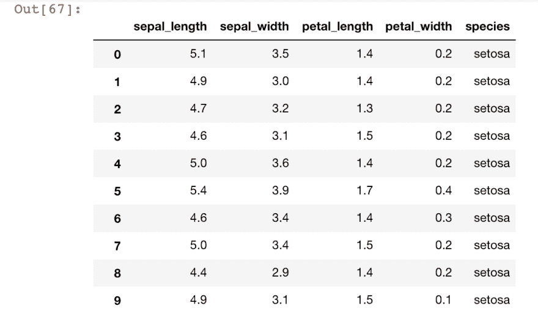

# 构建我们的第一个机器学习模型(Pt。4)

> 原文：<https://dev.to/benprax/building-our-first-machine-learning-model-5dig>

[](https://res.cloudinary.com/practicaldev/image/fetch/s--627q-fxa--/c_limit%2Cf_auto%2Cfl_progressive%2Cq_auto%2Cw_880/https://thepracticaldev.s3.amazonaws.com/i/mpoilk4uvr418ny1v16w.png)

在这篇文章中，我将向你展示一个快速简单的例子，将机器学习应用于数据集，并用我们的模型进行预测。

我们将使用:

*   计算机编程语言
*   熊猫，它在数据结构和数据分析或可视化方面帮助我们
*   Scikit-Learn，以及
*   虹膜数据集。

我不会深入研究如何使用这些工具。但是对于我将在这篇文章中介绍的内容，应该足以让你了解大多数数据集。

我们开始吧！

# 获取数据

首先让我们下载虹膜数据集。您可以在此下载虹膜数据集[并保存为 CSV 格式。](https://gist.github.com/curran/a08a1080b88344b0c8a7)

让我们导入熊猫并读取我们的 csv 文件。：

```
import pandas as pd
dataset = pd.read_csv("./iris.csv")
# let’s see a sample of our data dataset.head() 
```

`.head()`函数向我们显示了数据集中的前几行。
您可以看到包含我们数据的列和行。

[](https://res.cloudinary.com/practicaldev/image/fetch/s--627q-fxa--/c_limit%2Cf_auto%2Cfl_progressive%2Cq_auto%2Cw_880/https://thepracticaldev.s3.amazonaws.com/i/mpoilk4uvr418ny1v16w.png)

查看我们的数据集，我们可以看到

```
["sepal_length",  "sepal_width",  "petal_length",  "petal_width",  "species"] 
```

我们希望让我们的**目标**(我们试图预测的东西，也称为 **y** )成为`species`列，其余的列`[sepal_length, sepal_width, petal_length, petal_width]`成为我们的**特征**(也称为 **X** )。

```
y = dataset["species"]

features = ["sepal_length", "sepal_width", "petal_length", "petal_width"]
X = dataset[features] 
```

* * *

# 拆分数据

接下来，我们需要**分割我们的数据**。通常，我们需要将数据分成 3 部分。一个用于**培训**，第二个用于**验证**，第三个用于**测试**。

*   用于训练我们的模型的训练数据
*   验证数据来验证我们的模型
*   测试数据来测试我们的模型

我们需要一个验证数据集，因为我们的训练数据的生命周期会在每次训练中消失。本质上，我们的模型过于熟悉我们的训练数据集，这可能会形成偏见，并影响我们的模型对新的、看不见的数据的性能。验证数据确保我们的模型即使在看不见的数据上也表现良好。

测试数据集是指在使用验证数据进行测试后，我们希望看到模型的“最终”性能。然而，没有什么是“最终”的。机器学习是一种持续的改进，但正因为如此，我们才能确保我们的模型即使在看不见的数据上也能表现良好，这些数据就是我们的测试数据。

Scikit-Learn 使用`train_test_split`函数将我们的数据分割为训练和验证*。

** *我目前不确定它是否也可以拆分测试😅✌🏽但这对于我们的小项目来说已经足够了。* *

```
from sklearn.model_selection import train_test_split

#splitting our dataset for training and validation
#random_state to shuffle our data train_X, val_X, train_y, val_y = train_test_split(X, y, random_state=1) 
```

* * *

# 转换数据

太棒了。然而，机器学习并不理解字母。机器学习是由引擎盖下的一堆数学公式和运算组成的。在数学中我们不说，一+一=二。肯定是 1+1=2。

我们的 **y(目标变量)**目前是用字符或字母表示的。`[‘Versicolor’, ’Setosoa’, ‘Verginica’]`。我们需要以某种方式将其转换为机器学习可以理解的有意义的数字。

做[0，1，2]可能更容易，对吗？
**但这种方法的问题是，机器学习可能会认为标签的顺序存在相关性，并可能因该顺序而形成偏差。**

推荐的方法是使用 **[一键编码](https://medium.com/@michaeldelsole/what-is-one-hot-encoding-and-how-to-do-it-f0ae272f1179)** 。幸运的是，熊猫有一个内置的一键编码功能，我们可以方便地使用。

```
train_y = pd.get_dummies(train_y)
val_y = pd.get_dummies(val_y) 
```

太棒了。让我们开始训练我们的模型。我们将使用 Scikit-Learn 的`RandomForestClassifier`,因为我们试图**对**植物进行分类。

```
from sklearn.ensemble import RandomForestClassifier

random_forest = RandomForestClassifier(random_state=1)
random_forest.fit(train_X, train_y) 
```

这基本上是打乱我们的数据，以避免我们的数据出现任何看似有序的情况。这确保了我们的模型不会偏向给定训练数据的顺序。

* * *

# 测试我们的模型

现在让我们使用验证数据来验证我们的模型。

```
from sklearn.metrics import mean_absolute_error

preds = random_forest.predict(val_X)
mae = mean_absolute_error(val_y, preds)

print("Mean absolute error is: {:,.5f}".format(mae * 100))
print(random_forest.score(val_X, val_y) * 100) 
```

**平均绝对误差**是我们模型的基本平均误差。平均绝对误差越低，我们模型的性能越好。
`.score()`函数给出了我们的模型在验证数据上的性能得分。

目前平均绝对误差(我认为)太低。而且`.score()`太高了。在我们的模型上有**数据泄露**，甚至**过度拟合**的可能。

我不会深入研究这个问题，但最好避免数据泄漏和模型中的过度拟合，因为这些会严重影响我们模型的性能。

让我们测试一下我们的模型，好吗？我已经手动在我们的模型中放置了一个测试数据，看看它会预测什么。

```
preds = random_forest.predict([[2.0, 1.9, 3.7, 2]])
print(preds) 
```

它给了我们结果:

```
[[0.  1.  0.]] 
```

用`print(y)`检查我们的 y 变量，我们可以看到它看起来像这样:

| 感觉很好 | 杂色的 | Virginica |
| --- | --- | --- |
| Zero | one | Zero |

查看我们的预测，我们可以得出结论，基于我们给定的测试数据，我们的模型返回了`versicolor`。

检查数据，我们可以从逻辑上得出结论，它实际上是非常正确的！！

* * *

太棒了。！我们刚刚训练了一个预测模型的新模型。难以置信！！给自己一个喝咖啡的休息时间。☕️祝贺你🎉🎉🎉

希望你喜欢我的机器学习之旅系列。我希望你也学到了一些东西😅我对你可能有的任何反馈都持开放态度，或者如果有什么可能是错误的，请在下面评论。

对于那些试图遵循这些代码的人，我有一个关于这个例子的工作笔记本。

谢谢大家！

附:我刚刚在我的 Youtube 频道上传了我的 Hello World 视频- [编码 Prax](https://www.youtube.com/watch?v=oOOlcpEh2fQ) ！顺便过来打个招呼😄喜欢和订阅，如果你想✌🏽