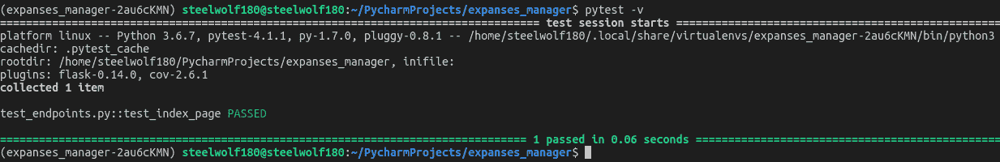

# 用 Flask、Postman 和 PyTest 构建 Restful API 第 3 部分(阅读时间:20 分钟)

> 原文：<https://dev.to/steelwolf180/building-restful-api-with-flask-postman--pytest---part-3-read-time-20-mins-26ha>

[](https://res.cloudinary.com/practicaldev/image/fetch/s--0XfsjAQv--/c_limit%2Cf_auto%2Cfl_progressive%2Cq_auto%2Cw_880/https://thepracticaldev.s3.amazonaws.com/i/x0j4u0q0fm8twxlshtt4.jpg)

## 简介

今天，在 3 部分系列的最后一部分中，我将介绍如何用 PyTest 创建实际的 REST APIs。

对于这些新的系列，您可以查看第 1 部分来了解我将用来创建 expanses manager 的 REST API 端点的各种工具。

除此之外，看看[第 2 部分](https://dev.to/steelwolf180/building-restful-api-with-flask-postman--pytest---part-2-read-time-10-mins-1d6d),模仿 API 设计原型的 API 端点。

## 工具

*   [PyTest](https://docs.pytest.org/en/latest/)
*   [邮递员](https://www.getpostman.com/)
*   [去](https://git-scm.com/)
*   [Visual Studio 代码](https://code.visualstudio.com/)

## 源代码

*   [扩展管理器回购](https://github.com/steelwolf180/expanses_manager)

## 端点创建

现在是本系列的最后一部分，我们将介绍只使用 **GET** HTTP 请求方法的 **CRUD** 函数。

既然**放**、**贴**和**删**端点的创建是一样的，那就不如介绍一下 **Pytest** 的使用。

### 端点和 API 文档最后部分:

[Postman 中的 API 文档](https://documenter.getpostman.com/view/4542874/RztitA2G)

*   获取交易列表- **获取**
*   创建新的交易- **过账**
*   更新单个交易- **PUT**
*   删除单笔交易- **删除**

## 项目设置

### 创建项目文件夹

通过创建一个名为 **expanses_manager** 的文件夹，在 **Linux** 中创建您的项目。

接下来使用 **pipenv** 创建虚拟环境，并切换到 python 虚拟环境。

```
pipenv install
pipenv shell 
```

Enter fullscreen mode Exit fullscreen mode

### 安装 Python 包

现在，您需要通过键入下面的命令来安装以下内容。

```
pipenv shell
pipenv install Flask flask-cors pytest pytest-cov pytest-flask requests pylint 
```

Enter fullscreen mode Exit fullscreen mode

安装了基本的 python 包后，我们将继续创建我们的第一个 Flask 应用程序。

## 创建你的第一个烧瓶应用程序

创建一个名为 **expanses_manager.py** 的文件，然后打开您选择的 IDE 或编辑器对文件内容进行更改。

**expanses_manager.py**

```
from flask import Flask # Import the flask web server
app = Flask(__name__) # Single module that grabs all modules executing from this file

@app.route('/') # Tells the flask server on which url path does it trigger which for this example is the index page calling "hello_world" function.
def hello_world():
    return 'Hello, World!' 
```

Enter fullscreen mode Exit fullscreen mode

### 执行您的 Flask 应用程序

现在，一旦你将代码添加到文件中，我们需要运行下面的命令来启动这个 flask 应用程序:

```
export FLASK_APP=expanses_manager.py
flask run 
```

Enter fullscreen mode Exit fullscreen mode

祝贺你刚刚创建了你的第一个 flask 应用程序。您可以打开浏览器，在浏览器中键入以下 URL“127 . 0 . 0 . 1:5000”。要取消，你需要按下 **ctrl + c** 退出服务器。

[](//images.ctfassets.net/ly2f59p4unnn/76Ku1K7YENHrA550LOPLAU/0ea27c050c07c43c7bb1dbe7331ad510/happy_giphy.gif)

### 烧瓶中的发育模式

键入以下命令，这样我们将启用**开发**模式。

在这种模式下，您的 flask 应用程序有一个调试器，每当代码发生变化时，它会自动重启。

```
export FLASK_ENV=development
flask run 
```

Enter fullscreen mode Exit fullscreen mode

## 了解路由

路由是您为特定网页分配的加载方式。可以是下面这样一个简单的例子:

```
@app.route('/') # Routes you to the index page
def index():
    return 'Index Page'

@app.route('/hello') # Routes you to the page with http://127.0.0.1:5000/hello/
def hello():
    return 'Hello, World'

@app.route('/projects/') # URL with trailing slash
def projects():
    return 'The project page'

@app.route('/about') # URL without a trailing slash
def about():
    return 'The about page' 
```

Enter fullscreen mode Exit fullscreen mode

它可能非常简单，也可能非常复杂，我就不多讲了，因为我们正专注于构建**expansions manager**的 **GET** 函数。

为了更好地理解路由，我将在链接部分为您附加一个参考链接。

一定要注意，如果你不包含一个带有**结尾斜线**的 url，默认为，也就是这个 **/** 。

当你添加一个网址末尾有 **/** 的页面时，Flask 会**自动**重定向你一个 **404** 。

## 创建您的第一个 REST API 端点

如果您没有阅读本系列的前几部分，请阅读第 2 部分或第 3 部分，了解什么是 **HTTP 方法**和**状态代码**。

您可以通过将您的 **expanses_manager.py** 代码更改为以下代码来查看下面的示例，以了解它是如何工作的。

```
from flask import Flask, request, jsonify # Imports the flask library modules
app = Flask(__name__) # Single module that grabs all modules executing from this file

@app.route('/login', methods=['GET', 'POST']) # HTTP request methods namely "GET" or "POST"
def login():
    data = []
    if request.method == 'POST': # Checks if it's a POST request
        data = [dict(id='1', name='max', email='max@gmail.com')] # Data structure of JSON format
        response = jsonify(data) # Converts your data strcuture into JSON format
        response.status_code = 202 # Provides a response status code of 202 which is "Accepted" 

        return response # Returns the HTTP response
    else:
        data = [dict(id='none', name='none', enmail='none')] # Data structure of JSON format
        response = jsonify(data) # Converts your data strcuture into JSON format
        response.status_code = 406 # Provides a response status code of 406 which is "Not Acceptable"

        return response # Returns the HTTP response 
```

Enter fullscreen mode Exit fullscreen mode

现在您可以打开您的 **Postman** 来创建一个名为**的测试登录请求**。

将这个 URL**[http://127 . 0 . 0 . 1:5000/log in](http://127.0.0.1:5000/login)**输入到您的请求中，并将 HTTP 方法设置为 **GET** 或 **POST** 请求，然后单击 **send** 获得响应结果。

[](//images.ctfassets.net/ly2f59p4unnn/4J8cA5UWpCyxyNiofVcdO1/830f9326a4a7903cb21f067ccfd5f91a/mic_drop_giphy.gif)

## 为配置设置创建 Bash 脚本

我们将创建一个 **bash** 脚本，允许执行上述设置，而不需要不断地输入命令。

创建一个名为 **env.sh** 的文件，并用下面的代码填充文件的内容。

**env . sh**T2】

```
#!/usr/bin/env bash
pipenv shell
export FLASK_ENV=development FLASK_APP=expanses_manager.py
flask run 
```

Enter fullscreen mode Exit fullscreen mode

一旦创建了名为 **env.sh** 的文件，您需要使用以下命令来更改文件权限:

```
$ chmod 775 env.sh 
```

Enter fullscreen mode Exit fullscreen mode

要运行 bash 脚本，您需要使用下面的命令位于项目的根文件夹。

```
$ ./env.sh 
```

Enter fullscreen mode Exit fullscreen mode

## 创建你的第一个测试用例

现在我们将开始为您的 flask API 端点创建第一个测试用例。

我们将通过检查 **index.page** 是否提供 HTTP 响应来测试 flask 应用程序是否正在运行。

### 创建 test_endpoints.py

因此，让我们创建测试脚本调用 **test_endpoints.py** ，并将以下代码添加到您新创建的文件中:

**test_endpoints.py**

```
import pytest
import requests

url = 'http://127.0.0.1:5000' # The root url of the flask app

def test_index_page():
    r = requests.get(url+'/') # Assumses that it has a path of "/"
    assert r.status_code == 200 # Assumes that it will return a 200 response 
```

Enter fullscreen mode Exit fullscreen mode

### 执行 test_endpoints.py

让烧瓶 app 在**的第一个**终端**运行**。然后创建一个**第二个**终端并使用下面的命令运行**pytest**:

```
$ pytest 
```

Enter fullscreen mode Exit fullscreen mode

[](//images.ctfassets.net/ly2f59p4unnn/2HwQC1oQFu1LkzUtGZT4Ez/3f3b4d42900bf4a53486a9d8f40af17c/sad_giphy.gif)

[](//images.ctfassets.net/ly2f59p4unnn/31VfT8yB4gryosbrlv0aSX/07f297cf539e71f8de50b426ad3218e9/pytest1.png)

你有没有看到在你的 **test_endpoints.py** 旁边有一个 **F** 表示你的测试用例**失败了**。

请不要被打扰，因为这是我们第一次尝试的预期行为，因为我们没有包括**返回**响应**的**索引端点**。**

要修复您的测试脚本，您可以选择遵循 pytest 建议，将状态代码更改为 **400** 而不是 **200** ，并再次执行测试。

测试确实通过了并获得了**。”**然而如果你的 flask app 在**根文件夹**下**运行**并返回 **HTTP 200** 响应，这将无法**检查**。

因此，我们需要创建索引端点，而不是修复我们的测试用例。

### 创建你的索引端点

由于 **test_index_page** 中的测试用例需要一个路径为 **/** 的端点和一个 **200** 的 HTTP 响应。

我们将在我们的 **expanses_manager.py** 中添加索引页面:

**expanses_manager.py**

```
@app.route('/', methods=['GET'])
def index_page():
    response = jsonify('Hello World!!!')
    response.status_code = 200

    return response 
```

Enter fullscreen mode Exit fullscreen mode

现在在你的**第一终端**执行 flask app 的同时，在**第二终端**中输入 **pytest -v** 。

命令 **pytest -v** 为您提供了更多关于测试用例的信息，这对于调试您的测试用例以及 python 端点都很有用。

现在，在执行了前面的命令之后，您应该看到您的测试用例通过了。干得好！！！！创建您的第一个端点和测试用例。

让我们好好休息一下，当你准备好继续潜水时，再进入下一部分。

[ ](//images.ctfassets.net/ly2f59p4unnn/3wjoHfbNiV7N4WUFmhhdm7/ac0e91696436e819cb9f5da62259977d/pytest2.png) [ ](//images.ctfassets.net/ly2f59p4unnn/3NQcfgJZ1CxNspBPkS3eBz/4f5a92c82b156560d247ee8b7375ded0/happy_giphy.gif)

## 创建费用管理器端点

因为您已经开始使用 **Pytest** 在 **Flask** &测试用例中创建您的第一个端点。

让我们回顾一下创建 expanses manager 需要创建的 API 列表:

### 要创建的 API 列表:

*   获取交易列表- **获取**
*   创建新的交易- **过账**
*   更新单个交易- **PUT**
*   删除单笔交易- **删除**

### 获取交易列表

现在从第一个 **GET** 端点开始，它提供了一个事务列表。

我们需要创建什么样的**最小测试**来检查它是否有效？

#### 创建用户故事

[](//images.ctfassets.net/ly2f59p4unnn/2IQ1LTkNyWQihoFSlIS4NR/1a9ae6b1daf415383ecdd90b4e146c66/foo_fighters_storie.gif)

**用户故事**有助于确定在实施之前需要创建什么。

我们将采用这个**用户故事脚本**来构建用户测试用例:

```
As (role of the user), I want to (the activity) so that  (desired result) 
```

Enter fullscreen mode Exit fullscreen mode

因此，在创建用户故事时，它看起来会像这样

作为一名**用户**，我想拥有一张**我的支出快照**，这样**就知道我把钱花在哪里了**

#### 在费用管理器中创建平衡测试用例

有了这个**用户故事**，我们可以构建一个最简单的测试用例。这是为了显示我们账户上的 T2 余额。

**test_endpoints.py**

```
def test_get_balance_in_transacations():
    r = requests.get(url+'/transactions/')

    assert r.status_code == 200 
```

Enter fullscreen mode Exit fullscreen mode

现在让我们运行您新创建的**test _ get _ balance _ in _ transactions**测试用例。

因为您没有创建一个**事务**端点，所以它不会要求您将测试用例更改为 **404** 。

为了让它通过，我们需要在 **expanses_manager.py** 中调用一个名为 **transactions** 的端点。

**expanses_manager.py**

```
@app.route('/transactions/', methods=['GET'])
def list_of_transactions():
    response = jsonify({})
    response.status_code = 200
    return response 
```

Enter fullscreen mode Exit fullscreen mode

这样你就通过了第一次测试。现在让我们创建另一个测试用例，它检查响应的内容，使**平衡**为 **0** 。

**test_endpoints.py**

```
def test_get_balance_in_transacations():
    r = requests.get(url+'/transactions/')
    assert r.status_code == 200

    data = r.json()
    assert data[balance'] == 0 
```

Enter fullscreen mode Exit fullscreen mode

如果您运行上述代码，预计您的测试用例会失败。我们需要修改 **expanses_manager.py** 才能通过。

**expanses_manager.py**

```
@app.route('/transactions/', methods=['GET'])
def list_of_transactions():
    response = jsonify({'balance': 0})
    response.status_code = 200
    return response 
```

Enter fullscreen mode Exit fullscreen mode

当您再次运行它时，您将看到它**通过了这个测试用例的**。

#### 用户故事完成了吗？

所以现在我的问题是，对于这个测试用例，我们完成了我们的**用户故事**了吗？

如果不是，还缺少什么？一个很好的猜测是您在第 2 部分中创建的模拟端点。

因为我们知道除了费用管理器的**余额**之外，我们还需要获得在端点中发现的**交易数量**。

在此之前，我们需要清理这个**test _ get _ balance _ in _ transactions**端点的代码。

**test_endpoints.py**

```
def test_get_balance_in_transacations():
    r = requests.get(url+'/transactions/')
    data = r.json()

    assert r.status_code == 200
    assert data['balance'] == 0 
```

Enter fullscreen mode Exit fullscreen mode

#### 获取交易端点中的交易数量

完成这段代码后，创建一个新的测试用例，测试**事务**端点中的事务数量。

**test_endpoints.py**

```
def test_get_number_of_transacations():
    r = requests.get(url+'/transactions/')
    data = r.json()

    assert r.status_code == 200
    assert len(data['transactions']) != 0 
```

Enter fullscreen mode Exit fullscreen mode

这个测试用例测试**的总交易数**必须大于 **0** 。

你的**测试用例** **再次失败**，所以让我们为**通过**的测试用例创建一个事务。

**expanses_manager.py**

```
@app.route('/transactions/', methods=['GET'])
def list_of_transactions():
    response = jsonify({'balance': 0, 
    'transactions': [ 
        {}
    ]})
    response.status_code = 200
    return response 
```

Enter fullscreen mode Exit fullscreen mode

#### 检查单笔交易的字段

[](//images.ctfassets.net/ly2f59p4unnn/5IWyUCc83CrmrSvlcVaOqw/8ff28ccab673a056463302b528b2ccef/book_checking_efteling.gif)

正如您到目前为止所做的那样，我们只检查了它是否有超过 **0** 个事务。

我们未能检查事务是否具有与系列文章的中的**模拟端点**相同的字段。

现在让我们创建这些测试来检查事务中的字段。

**test_endpoints.py**

```
def test_individual_transaction_fields():
    r = requests.get(url+'/transactions/')
    data = r.json()
    fields = list(data['transactions'])

    assert r.status_code == 200
    assert fields[0]['amount'] >= 0.00
    assert fields[0]['current_balance'] < 240
    assert 'jean' in fields[0]['description']
    assert 0 < fields[0]['id'] 
    assert 300 == fields[0]['inital_balance'] 
    assert "2019-01-12 09:00:00" == fields[0]['time']
    assert fields[0]['type'] != 'income' 
```

Enter fullscreen mode Exit fullscreen mode

同样，当您最初运行它时，它会失败，所以现在是添加各个事务的时候了。

**expanses_manager.py**

```
@app.route('/transactions/', methods=['GET'])
def list_of_transactions():
    response = jsonify({'balance': 0, 
    'transactions': [ 
        {'amount': 0.0, 'current_balance': 230, 'description': 'blue jean', 'id':2, 'inital_balance': 300, 'time': "2019-01-12 09:00:00", 'type': 'expense'}
    ]})
    response.status_code = 200
    return response 
```

Enter fullscreen mode Exit fullscreen mode

#### 对单个类进行重构

现在我们将重构你的 **4** 测试用例，并且**将**整合到一个类中，以便于运行测试，我们称之为**测试套件**。

其中你可以输入这个命令来测试那个特定的**测试套件**

```
pytest -v test_endpoints.py::NameOfTheSuite 
```

Enter fullscreen mode Exit fullscreen mode

**test_endpoints.py**

```
class TestTransactions():
    def test_index_page(self):
        r = requests.get(url+'/')
        assert r.status_code == 200

    def test_get_balance_in_transacations(self):
        r = requests.get(url+'/transactions/')
        data = r.json()

        assert r.status_code == 200
        assert data['balance'] == 0

    def test_get_number_of_transacations(self):
        r = requests.get(url+'/transactions/')
        data = r.json()

        assert r.status_code == 200
        assert len(data['transactions']) != 0

    def test_individual_transaction_fields(self):
        r = requests.get(url+'/transactions/')
        data = r.json()
        fields = list(data['transactions'])

        assert r.status_code == 200
        assert fields[0]['amount'] >= 0.00
        assert fields[0]['current_balance'] < 240
        assert 'jean' in fields[0]['description']
        assert 0 < fields[0]['id'] 
        assert 300 == fields[0]['inital_balance'] 
        assert "2019-01-12 09:00:00" == fields[0]['time']
        assert fields[0]['type'] != 'income' 
```

Enter fullscreen mode Exit fullscreen mode

### 测试驱动开发的基础

[](//images.ctfassets.net/ly2f59p4unnn/01lKoShJbMJQYoEs44XtoQ/f8f8e819316599990d13108b01b412b2/practice_makes_perfect.gif) 
如果你没有注意到**不断失败**和**重构**到**通过**你的测试用例是一种软件开发实践，叫做**测试驱动开发**。

可以用 Pytest 来补充它，为您未来的项目创建各种测试用例。

#### TDD 的基本流程

*   创建一个**失败的**测试用例
*   执行**代码**通过
*   重构代码并从头开始

### 剩余端点故事

以下是剩余的端点**用户故事**供您创建，我将在两周内在我的 GitHub repo 中为这个配套教程系列提供源代码:

*   **创建一个新的交易** -作为一个**用户**，我希望有一个**记录我的支出**，这样**我就知道我的钱去了哪里**

*   **更新单笔交易** -作为**用户**，我想**编辑一笔具体的交易**，以便**我有正确的余额**

*   **删除单个交易** -作为一个**用户**，我想**删除一个交易**，以便**我在我的费用管理器中有正确的余额**

## 结论

如果你已经和我一起看完了这个系列，我想感谢你花时间看完这个 3 部分的系列，因为写它不是一件容易的事。

请记住，我将在大约**两周**的时间内发布针对 **POST** 、**PUT**&**DELETE**HTTP 请求的这一系列剩余端点的解决方案。

很荣幸能够撰写这个 **3** 部分系列，我希望你所学到的能够帮助你使用 **PyTest** 、 **Postman** 和 **TDD** 技术在 **Flask** 中创建 **RESTful API** 端点。

## 链接

### [Expanses Manager 源代码](https://github.com/steelwolf180/expanses_manager)

### [邮递员中的 API 文档](https://documenter.getpostman.com/view/4542874/RztitA2G)

### [根据验收标准编写测试用例形成用户故事](https://blog.testlodge.com/writing-test-cases-from-user-stories-acceptance-criteria/)

### [用户故事](https://www.scaledagileframework.com/story/)

### [测试驱动开发:是什么，不是什么。](https://medium.freecodecamp.org/test-driven-development-what-it-is-and-what-it-is-not-41fa6bca02a2)

### [用 Pytest 测试 Python](https://www.amazon.com/Python-Testing-pytest-Effective-Scalable/dp/1680502409)

### [烧瓶](http://flask.pocoo.org/)

### [PyTest](https://docs.pytest.org/en/latest/)

### [HTTP 请求方式](https://developer.mozilla.org/en-US/docs/Web/HTTP/Methods)

### [HTTP 状态码](https://www.restapitutorial.com/httpstatuscodes.html)

如果你喜欢我的文章，要么注册 [Max 的每周简讯](http://eepurl.com/dOUoUb)或者你可以**关注**来获取我在 **Dev** 上的文章的最新更新

这篇文章最初发表在 max 的博客上 [Building Restful API with Flask，Postman & PyTest - Part 3(阅读时间:20 分钟)](https://www.maxongzb.com/building-restful-api-with-flask-postman-and-pytest-part-3-read-time-20-mins/)和图片来自[图片由 Rachael Gorjestani 在 Unsplash 上拍摄](https://unsplash.com/photos/X6CZGpJBi8U/info)