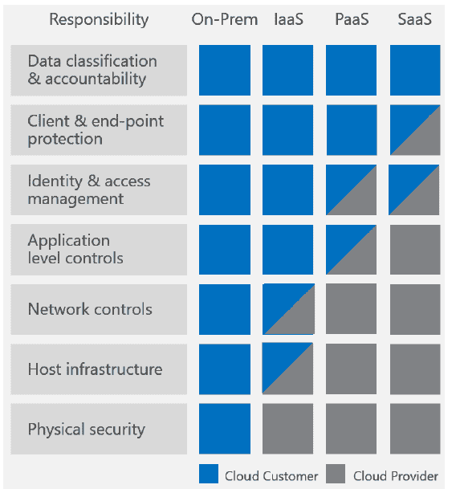
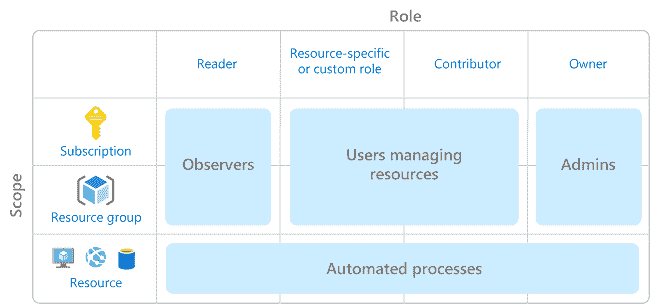

# 构建无根的应用程序和服务

> 原文：<https://dev.to/azure/building-rootless-applications-and-services-12if>

## 了解基于角色的资源管理的复杂性

*我们已经选出了我们最喜欢的由[迈克尔·克伦普](https://twitter.com/mbcrump)创造的技巧和窍门，以及计划整个四月在 Azure 上发布的新技术内容！错过一天(或更多)？[赶上系列](https://dev.to/t/azureapril/latest)。*

**没有天蓝色？** [抢免费订阅](https://azure.microsoft.com/en-us/free?&WT.mc_id=azureapril_devto-blog-cxa)。

有很多关于如何编写你的第一个应用程序的文章，或者如何开始使用特定的技术，这些都是非常棒的资源。有一个隐藏的危险，我们并不经常谈论它，它是事物如何工作或彼此交谈的粘合剂。

经常被引用的格言之一是“不要以 root 用户身份登录”，所以我们没有登录，但是我们经常做一些非常接近的事情。

### 为什么不是根？(或管理员)

Unix 和 Linux 环境中的 Root 和 Windows 环境中的 Administrator 是指系统上的提升权限帐户。当我们使用提升的权限运行一个应用程序时，我们使用提升的权限运行所有应用程序。删除整个文件系统？当然，没问题！不小心运行了一些恶意软件？当然可以！我还帮助攻击者访问了所有数据和硬件控制。

换句话说，不使用提升的权限运行某些东西，可以限制事故的影响，也可以限制攻击的范围和影响。

### 为什么不是我？

您可能有也可能没有提升的特权，所以以您自己的身份运行可能“没问题”。您不希望成为组织的单点故障，因为人们不得不联系您来解决需要您的凭据的问题，或者在代码中或与其他人共享您的凭据时产生潜在问题。最常见的违规行为之一是[泄露凭据](https://www.verizondigitalmedia.com/blog/2018/11/10-takeaways-from-the-2018-verizon-dbir/)，因此限制账户接管的影响是有帮助的。

### 云原生环境

让我们回到许多 how-to 文章中存在的基本问题。许多文章通过在云环境中创建或使用现有的根级访问键来简化事情。当从个人账户进行操作时，这是危险的，但影响程度是有限的。对于组织来说，这可能会带来灾难性的后果，并对消费者的信任产生持久的影响。

您的系统在云中有共同的安全责任。根据服务的具体选择，云提供商会处理一些安全性问题。云提供商对服务的管理越多，涉及的安全问题就越多。例如，在 Azure 上使用 MySQL 的托管数据库，MySQL 的所有升级和安全补丁都将与存储加密、加密备份和加密网络连接一起为您处理。但是，如果您要在一个实例上安装 MySQL，您必须自己管理所有的升级、补丁和加密。

无论您使用基础架构即服务、软件即服务还是无服务器，您都要对您的数据、帐户和访问管理完全负责。换句话说，当考虑如何设计和创建系统时，要考虑您拥有的所有不同的数据，访问这些数据的方式，以及应该授予哪些权限。

### 蔚蓝色的建筑

让我们来谈谈 Azure 如何让你能够实现对数据和服务的控制。当您登录 Azure 时，您的帐户是一个唯一的全局实体，它允许您访问 Azure 服务以及您可以使用该身份访问的任何订阅。订阅是你支付 Azure 使用费用的方式。每个订阅都与一种支付方式相关联。您可以创建订阅，并通过您的身份获得访问订阅的权限。

Azure 中的一切都可以被认为是资源，比如虚拟机、数据库、网络都是资源。资源可以被分组到资源组中，从而允许一起管理资源。资源通常通过资源组与特定的订阅相关联。

Azure 的每个特性都有一个[资源提供者](https://docs.microsoft.com/en-us/azure/azure-resource-manager/resource-manager-supported-services?WT.mc_id=azureapril_devto-blog-cxa)，它是你可以对这些资源采取的一组动作。我已经描述了这个功能的一个简化模型，为您提供了足够的工作环境。

安全主体是 Azure 中的一个对象，代表用户、组、[服务主体](https://dev.to/azure/you-gotta-keep-privileges-separated-509)或受管理的身份。

角色是资源提供者权限的集合。Azure 附带了一组[内置角色](https://docs.microsoft.com/en-us/azure/role-based-access-control/built-in-roles?WT.mc_id=azureapril_devto-blog-cxa)，其中三个适用于所有资源类型:

*   物主
*   捐助者
*   读者

“所有者”角色是通配符权限，有效地授予所有资源“根”级权限，包括管理资源授权的权利。“贡献者”角色接近于“所有者”，因为它授予所有资源“根”级权限，但不允许更改对资源的授权。“读者”角色允许对资源进行除机密以外的所有查看操作。

有超过 60 个内置的角色，可以针对特定的资源进行更好的调整。也可以定制和构建特定的角色来满足您的需求，但是通常内置的角色正好提供了您所需要的。

在授予对资源的访问权时，安全主体在特定的范围内被分配了一个角色。该范围可以是特定的资源、资源组或订阅。目标是将分配的权限限制在需要的范围内。

考虑如何分配您可能想要的授权的一种简单方法可以被认为是如图所示，其中观察者被授予订阅/资源组范围的特权，例如“Reader”角色。
[T3】](https://res.cloudinary.com/practicaldev/image/fetch/s--ZgK8bxIg--/c_limit%2Cf_auto%2Cfl_progressive%2Cq_auto%2Cw_880/https://thepracticaldev.s3.amazonaws.com/i/9huwspo0xsh4s03e72ou.png)

### 实用 RBAC

我还可以写一整篇文章，介绍在整个应用程序或服务中思考设计和实现治理的设计过程。在最基本的层面上，考虑以下几点:

*   您正在收集或生成哪些数据？
*   创建、访问或修改它的方式有哪些？(包括你是怎么备份的！)
*   记录了哪些信息？您是否正在分离个人身份信息，以便您的日志不会成为数据泄露的来源？

让我们看一个简单的例子:想一想您将如何自动安装一个自定义域名的 SSL 证书到您的 API 网关？SSL 证书可以存储在密钥库中，然后仅由被授权访问的安全主体访问，这简化了安装过程并防止证书需要被传递。

一旦您对数据和围绕数据需要的控制有了大致的了解，就要确定您需要的一组安全原则。对于应用程序来说，[服务主体](https://dev.to/azure/you-gotta-keep-privileges-separated-509)或[管理身份](https://docs.microsoft.com/en-us/azure/active-directory/managed-identities-azure-resources/overview?WT.mc_id=azureapril_devto-blog-cxa)是必经之路。托管身份是对 RBAC 的一个极好的补充，因为它们简化了资源的认证过程，Azure 管理身份方面(包括定期滚动凭证！).它还不适用于所有资源。

想知道您的订阅中已经存在哪些角色吗？查看如何[看待 Azure 门户](https://docs.microsoft.com/en-us/azure/role-based-access-control/role-assignments-portal/?WT.mc_id=azureapril_devto-blog-cxa)中的角色。可以查找特定的角色，或者在订阅级别查看授予的所有权限。使用托管身份，会自动为您创建一些角色，这非常有用，因为它们会随着资源组的删除而自动删除。

## 附加资源

查看这些额外的资源来提升你的 RBAC 知识。

*   【Azure 资源的内置角色
*   [托管身份](https://docs.microsoft.com/en-us/azure/active-directory/managed-identities-azure-resources/overview?WT.mc_id=azureapril_devto-blog-cxa)
*   [使用 Azure 门户查看和分配角色](https://docs.microsoft.com/en-us/azure/role-based-access-control/role-assignments-portal/?WT.mc_id=azureapril_devto-blog-cxa)
*   [使用 Azure CLI 查看 Azure 资源并为其分配角色](https://docs.microsoft.com/en-us/azure/role-based-access-control/role-assignments-cli?WT.mc_id=azureapril_devto-blog-cxa)

我期待着在我的 [OATS](https://dev.to/azure/building-solid-foundations-for-operable-applications-tools-and-services-2ake) 系列中通过具体的 Azure 漫游来分享更多关于 RBAC 的信息。你如何看待你的应用和服务的治理？

* * *

我们将在 4 月份每天发布文章，所以请继续关注或提前查看更多提示和技巧[现在](http://azuredev.tips)。