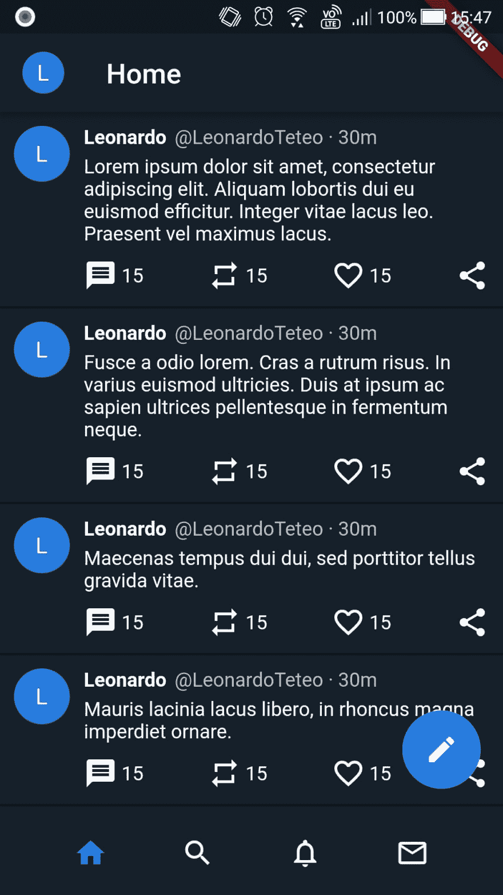

# 用 Flutter 构建 Twitter 布局

> 原文：<https://dev.to/leoat12/building-twitter-layout-with-flutter-363g>

Flutter 是 Google 为移动开发开发的新的闪亮框架，它于去年首次发布，本月达到了 1.0 版本。我知道 Flutter 已经有几个月了，但是自从它达到 1.0 以后，我决定对它进行更深入的研究。在使用 Java 的原生 Android 和 Xamarim 和 NativeScript 的跨平台之前，我开发过移动应用程序，这并不严重，但我觉得这是一个有趣的领域，有些人可能会说，这是不久的将来。

陈述完毕，现在让我们来看有趣的细节。在我看来，Flutter 最显著的特点是理解它的布局机制是多么容易。基本上，一切都是一个小部件，你可以把它放在任何你想放的地方。这些小部件非常具有描述性，其属性涵盖了几乎所有常见的用法，构建一个布局非常容易和简单。因为一切都是一个小部件，框架是非常宽松的，动态的和逻辑的，你不用担心做错什么，只要做就行了，通过热重装，你可以很容易地测试一切。

我对 Flutter 的经验是业余水平，我在 [Flutter 网站](https://flutter.io)上做了最基础的教程，读了一些关于 Flutter 如何处理布局的东西，主要是[这篇很棒的文章](https://flutter.io/docs/development/ui/layout)总结了你需要知道的关于 Flutter 布局结构的一切。我从来不敢尝试在上述任何一个框架中复制 Twitter 布局，但是有了 Flutter，我有足够的信心去做，因为我不怕失败。

所以我们有这样的东西:

[](https://res.cloudinary.com/practicaldev/image/fetch/s--rgtb-ulj--/c_limit%2Cf_auto%2Cfl_progressive%2Cq_auto%2Cw_880/https://thepracticaldev.s3.amazonaws.com/i/bfokh6aufn6kj23f8a40.jpg)

为了使它更简单，我只考虑了简单的 tweets 的布局，这意味着只有文本，没有图像，引用等。只是开始。然而，其余的将会出现，顶部的应用程序栏，发布推文的浮动按钮和底部的标签栏。是不是看起来太复杂了？分而治之是最好的方法！

首先，让我们看看顶部的应用程序栏。我们可以看到，我们有一个圆形的头像和一个写着“家”的文字。应用程序栏是 Android 应用程序中一个非常常见的设计模式，Flutter 知道这一点，因为 Flutter 有一些小部件可以轻松构建一个应用程序栏。为此，我们使用`Scaffold`小部件，它有一个名为`appBar`的参数，该参数接受一个`AppBar`小部件，如下所示:

```
return MaterialApp(
      title: "Twitter Layout",
      theme: new ThemeData(
        primaryColor: Color.fromRGBO(21, 32, 43, 1.0),
        accentColor: Colors.blueAccent[200],
      ),
      home: new Scaffold(
          appBar: new AppBar(
            title: Row(
              children: <Widget>[
                Container(
                  child: CircleAvatar(
                    child: new Text("L"),
                    radius: 15.0,
                  ),
                  margin: EdgeInsets.only(right: 30.0),
                ),
                new Text("Home")
              ],
            ),
            elevation: 4.0,
          ),
          body: _buildBody(context)
      ),
    ); 
```

如你所见，`Scaffold`小部件被一个`MaterialApp`小部件包裹，使得使用[材料设计](https://material.io)构建应用程序变得容易，这是谷歌为 Android 应用程序设计的指令，Twitter 应用程序显然使用了这一指令。`AppBar`小部件有一个接受任何小部件的`title`参数，尽管通常它只是一个`Text`小部件。因此，我创建了一个`Row`小部件，它负责按照我们在本例中想要的方式水平对齐放置其子部件。我们将`Row`小部件的子部件添加到一个`children`参数中。在这种情况下，小部件有一个`Container`和`Text`作为子部件。`Container`小部件是一个非常方便的小部件，因为它使您能够定制间距、定位和为其子部件绘制配置。在这种情况下，我添加了一个`CircleAvatar`小部件作为其子部件，并在圆圈右侧添加了 30 个像素的空白，以便与“Home”文本分开。`CircleAvatar`小部件的子部件可以是任何小部件，但我们通常使用文本或图像，为了简单起见，我使用了带字母“L”的`Text`。半径表示圆的大小。如果你注意到，应用程序栏上的圆圈比推文上的小一点，所以我必须配置它。`AppBar`小部件上的`parameter`表示应用程序栏的高度，这是其下方阴影的来源。最后，没有必要从头开始做一个应用程序栏，一个圆形的头像和所有的空间配置，Flutter 可以很容易地使用普通的图案达到你想要的效果。`Scaffold`小部件也有一个`body`参数，在这里，所有的应用程序内容都驻留在这里。让我们开始吧。

为了组织布局，我在一个`_buildBody()`方法上制作了身体构建逻辑，如下:

```
Widget _buildBody(context){
    return new Container(
      child: new Column(
        children: <Widget>[
          new Flexible(
              child: Scaffold(
                body: new ListView.builder(
                  itemBuilder: (_, int index) => _tweets[index],
                  itemCount: _tweets.length,
                  reverse: false,
                ),
                floatingActionButton: FloatingActionButton(
                    onPressed: null, child: Icon(Icons.edit)),
              )),
          new Container(
            decoration:
            new BoxDecoration(color: Theme.of(context).cardColor),
            child: _buildTabsBar(context),
          ),
        ],
      ),
    );
  } 
```

`_buildBody()`返回一个`Widget`，在本例中是一个`Container`。容器有一个`Column`小部件作为子部件，所有神奇的事情都会发生。在上面用作基础的图像中，我们可以看到，除了浮动按钮之外，我们还有推文列表和标签栏。`Column`小部件的子部件按照它们在屏幕上出现的方式放置。首先，我们有一个`Flexible`小部件，顾名思义，它是灵活的，这意味着在这种情况下，它将占用父控件的剩余空间，这就是我们的列表和浮动按钮所在的位置。`Flexible`小部件子部件是一个`Scaffold`小部件。没有人说它只能像我们以前使用的应用程序的主要窗口部件一样使用，尽管这种方式很常见。这里使用它是为了方便创建浮动按钮，因为它有一个`floatingActionButton`属性，该属性将一个带有编辑图标的`FloatingActionButton`小部件作为子部件。它还有一个`onPressed`属性来配置事件，但是因为这里的目标只是进行布局，所以现在是`null`。只有这样，浮动按钮才会准确地出现在我们想要的位置。和以前一样，在`Scaffold`小部件的`body`参数上，我们有主要内容，tweets 列表，它是使用`ListView`实现的，这是一种特殊的列，当内容不完全适合小部件时，它可以滚动。它只是从 tweets 列表中构建列表，我们稍后会看到。

现在，让我们关注一下`Column`的另一个子容器，这个容器将方法`_buildTabsBar()`作为子容器。让我们看看选项卡是如何构成的。

```
Widget _buildTabsBar(context) {
    return Container(
      height: 60,
      color: Color.fromRGBO(21, 32, 43, 1.0),
      child: new Row(
        mainAxisAlignment: MainAxisAlignment.spaceEvenly,
        children: <Widget>[
          Icon(Icons.home, color: Theme.of(context).accentColor),
          Icon(Icons.search, color: Colors.grey[100]),
          Icon(Icons.notifications_none, color: Colors.grey[100]),
          Icon(Icons.mail_outline, color: Colors.grey[100])
        ],
      ),
    );
  } 
```

制作吧台非常简单，这就是它的奇妙之处。它只是一个有一个作为孩子的`Row`的`Container`,有作为孩子的图标，就是这样。我配置容器的高度和颜色。然后，在`Row`中，我使用了`mainAxisAlignment`属性来使图标之间的空间均匀分布，看起来像原始布局。我仍然记得使用 HTML 和 CSS 使事物居中是多么痛苦，更不用说使空间均匀了。

那么，让我们看看最后一部分，推文。它看起来像是需要考虑更多元素的部分，这是正确的，但是如果你把它想象成行和列的集合，它并不比布局的其余部分复杂多少。为了使 tweet 在`ListView`中可重用和易于使用，我创建了一个包含 tweet 所有布局的`Tweet`类:

```
class Tweet extends StatelessWidget {

  Tweet({this.user, this.userHandle, this.text});

  final String user;
  final String userHandle;
  final String text;

  @override
  Widget build(BuildContext context) {
    return Container(
      padding: EdgeInsets.all(10.0),
      decoration: BoxDecoration(
          color: Color.fromRGBO(21, 32, 43, 1.0),
          border: Border(bottom: BorderSide())),
      child: new Row(
        mainAxisAlignment: MainAxisAlignment.start,
        crossAxisAlignment: CrossAxisAlignment.start,
        children: <Widget>[
          CircleAvatar(
            child: Text(user.substring(0, 1)),
          ),
          _tweetContent()
        ],
      ),
    );
  }

...

} 
```

简单来说，它是无状态的，只获取用户、用户句柄和 tweet 文本来构建 tweet。一条成熟的推文可能是 statetul，因为它有赞数、转发数和回答数，还有更多参数。`build()`方法返回一个容器，该容器具有基本的布局配置、填充和底部的边框，作为 tweets 的分隔符，然后它有一个`Row`作为子元素。该行包含发 tweet 的用户的圆形头像和 tweet 内容，这是为了便于组织而通过一种方法构建的。`mainAxisAlignment`和`crossAxisAlignment`设置为`start`非常重要，因为它可以根据需要将圆形头像放置在左上角。

当然，`_tweetContent()`方法返回 tweet 的内容。下面是整个方法，因为通过查看所有元素可以更容易地将点连接起来，之后我将解释代码。

```
Widget _tweetContent(){
    return Flexible(
      child: Container(
        margin: EdgeInsets.only(left: 10.0),
        child: Column(
          crossAxisAlignment: CrossAxisAlignment.start,
          mainAxisAlignment: MainAxisAlignment.start,
          children: <Widget>[
            Row(
              children: <Widget>[
                Text(user,
                    style: TextStyle(
                        color: Colors.white,
                        fontWeight: FontWeight.bold)),
                Container(
                  margin: EdgeInsets.only(left: 5.0),
                  child: Text(userHandle + " · 30m",
                      style: TextStyle(color: Colors.grey[400])),
                )
              ],
            ),
            Container(
                margin: EdgeInsets.only(top: 5.0),
                child: Text(text, style: TextStyle(color: Colors.white))),
            Container(
              margin: EdgeInsets.only(top: 10.0),
              child: Row(
                mainAxisAlignment: MainAxisAlignment.spaceBetween,
                children: <Widget>[
                  Row(
                    children: <Widget>[
                      Icon(Icons.message, color: Colors.white),
                      Container(
                        margin: EdgeInsets.only(left: 3.0),
                        child: Text("15",
                            style: TextStyle(color: Colors.white)),
                      )
                    ],
                  ),
                  Row(
                    children: <Widget>[
                      Icon(Icons.repeat, color: Colors.white),
                      Container(
                        margin: EdgeInsets.only(left: 3.0),
                        child: Text("15",
                            style: TextStyle(color: Colors.white)),
                      )
                    ],
                  ),
                  Row(
                    children: <Widget>[
                      Icon(Icons.favorite_border, color: Colors.white),
                      Container(
                        margin: EdgeInsets.only(left: 3.0),
                        child: Text("15",
                            style: TextStyle(color: Colors.white)),
                      )
                    ],
                  ),
                  Icon(Icons.share, color: Colors.white)
                ],
              ),
            )
          ],
        ),
      ),
    );
  } 
```

父元素是一个`Flexible`小部件，它允许元素占用剩余的可用空间，即上面的`build`方法创建的行上的空间。然后，我们有一个`Container`，它允许在内容的左边配置必要的空白，以将其与圆形头像分开。最后，我们有一个`Column`，有趣的事情开始了。

同样，我们用`crossAxisAlignment`和`mainAxisAlignment`作为`start`，使内容定位在左上角。该列的第一个子列是一个`Row`，它包含用户名、句柄和 tweet 的时间。为了使用户句柄与用户名稍微分开，我们像以前一样将`Text`包装成一个`Container`。该列的第二个子列是一个`Container`,它将 tweet 的实际文本换行，并在顶部留有空白。最后，我们有另一个容器，以`Row`作为子容器来构建回复、转发、喜欢和分享按钮。`mainAxisAlignment`被设置为`spaceBetween`，这样所有图标之间将具有相等的间距，并且将在整个行的宽度上均匀分布。在其他框架中，非常方便的配置、定位和间距对我来说总是非常麻烦。每个图标都是一个`Row`本身，包含图标和它旁边的回复数、RTs 等。很简单，不是吗？

所以我们来看看下面的最终结果:

[](https://res.cloudinary.com/practicaldev/image/fetch/s--FqBiJvDp--/c_limit%2Cf_auto%2Cfl_progressive%2Cq_auto%2Cw_880/https://thepracticaldev.s3.amazonaws.com/i/r3fppzy2rezs40yh6yv3.jpg)

除了可能是 Twitter 独有的图标之外，它已经足够接近了。推文只是一个例子。

我希望这篇文章对那些想看看 Flutter 和如何开始的人有用。对我来说，这是一见钟情，当谈到布局创作，除非它是有限的交互性，我仍然需要实验，我相信它会很快流行起来！