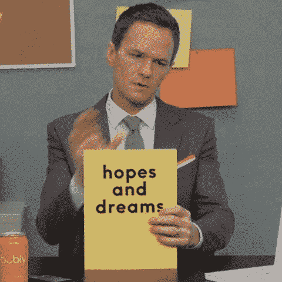

# 筋疲力尽是当你不充电时发生的事情

> 原文：<https://dev.to/kylegalbraith/burnout-is-what-happens-when-you-dont-recharge-your-batteries-83e>

对于那些刚接触职业发展的人来说，有些事情你应该知道。倦怠。

## 文章不再可用

上周，莫莉与我们分享了她精疲力竭的故事，她的故事并不独特。许多开发人员在他们的职业生涯中会精疲力竭，包括我自己。

对我来说，它很快就来了。

### 我的燃尽故事

在我精疲力尽之前，我在事业上蒸蒸日上。学习一切可能的东西，尽我所能做出贡献，并在必要时填补任何空白。这是一家初创公司，你尽可能填补空白。这就是我在这家公司五年多时间里一直在做的事情。

这是我作为软件工程师工作的第一家公司。正因为如此，我把它的成功视为我自己的成功。我觉得有责任不择手段帮助公司取得成功。

当我不在工作中为我们面临的问题编写解决方案时，我在家为自己的项目编写解决方案，以进一步扩展我的知识库。作为开发者和企业家，这是有益的。这也使公司受益，因为我可以将我学到的东西应用到我工作中面临的问题上。

这是一项繁重的工作，但也很有趣

直到我被提升到管理层，我的职业倦怠才开始。很奇怪吧？有一个普遍的印象，管理意味着你把你的焦点转向人而不是代码。但我并没有这样。事后看来，我的职业倦怠故事从我成为经理的那天就开始了，这一点也不奇怪。

从个人技术贡献者到管理者的转变是一个不小的飞跃。这是一个巨大的变化，我低估了我跳的距离。

当我进入管理角色时，我仍然试图做我在管理一个八人团队之前做的所有事情。我试着做我以前做的所有事情，但是把管理团队和产品待办事项加到我的清单上。

六个月后，我感到筋疲力尽。

我的身心承受了太多。我无法管理一个如此庞大的团队，一个如此复杂的产品，还能在技术层面做出贡献。光是上下文切换就足以让我晕头转向。

这让我不再像以前那样以热情和激情看待工作。此外，我对自己落后于技术曲线的事实感到非常焦虑。我无法同时掌控所有的技术方面、人员方面和产品方面。

所以我做了我唯一能想到的事，我寻求帮助。

很明显，管理技术远景并为代码库做贡献是不可能的。尽管我很喜欢这些事情，但我知道我必须把它们委派出去。我知道我需要把时间花在团队和产品上，而不是每个技术决策上。因此，我将这些职责交给团队中的开发人员，让他们来负责。

这解放了我，让我专注于团队和定期交付产品。我可以与团队成员交谈，支持他们的职业生涯。我可以专注于业务对产品的需求，并帮助将它融入到我们的工作中。一旦我授权了，这些方面的事情就开始活跃起来。

问题解决了对吗？

但是，问题没有解决，伤害已经造成了。

委派技术方面的工作让我不再操心，但是已经太晚了。精疲力竭已经开始，过了一段时间，我开始渴望技术方面的东西。

管理与作为个人贡献者是非常不同的。如果你的团队有正确的文化，你可以两者兼得。但是对于我的情况，技术和管理任务是非常不同的，所以我不能两者兼顾。

我扮演了一个我并不讨厌的角色，但它错过了我喜欢做的所有事情。我不能为对我有价值的事情做出贡献。指导他人、编码、设计架构和调试是我喜欢做的事情，但我不再做这方面的事情了。

这在短期内是可以的，但长期来看，会导致你心力交瘁。因为精疲力尽不仅仅是因为试图做所有的事情。虽然这是一个很大的百分比，但还有另一个因素需要考虑。在某个特定的时刻，没有做你想做的事情是一个额外的负担。

试图为你的团队做每件事是令人疲惫的。试图为你的团队做所有的事情，却不能从你的角色中得到满足，这是很烦人的。

这就是导致我自己倦怠的原因。我喜欢在那家公司工作，在那里我学到了很多东西。但是，我最终扮演了一个我不喜欢的角色。所有我曾经热爱的事情我都没有去做，因为我不能做那些事情和我的新责任。于是一切都遭殃了。

### 将自己从倦怠中拉出

我的第一步是寻求帮助。

我要求团队成员接管技术愿景，这样我就可以专注于团队以及他们需要我做什么。当你担任管理角色时，这似乎是正确的做法。你必须选择你要专注于什么。所以很可能会有一些事情你不得不委派。

通过尝试在阳光下做任何事情来防止烧毁。但是，这并没有阻止最终会发生的倦怠，因为在我所做的和我想要做的之间存在冲突。

那么，我是如何摆脱困境的呢？长话短说，我离开了公司。

我需要一些时间来关注我感兴趣的事情。所以我请了几个月的假。在那几个月里，我做了很多不同的事情。我写了关于我所学的所有东西的博客。我启动了 [parler.io](https://parler.io/) ，通过使用 It 课程向我的 [Learn AWS 添加了更多内容，并且去了法属🇫🇷.](https://kylegalbraith.com/learn-aws/)

不是每个人都足够幸运，能够这样做 2-3 个月。我很幸运，因为在休假的几个月里，我可以专注于自己的项目/想法。这让我可以重新充电，做我喜欢的事情。

这也让我能够坐下来思考，当我的下一个职位到来时，有哪些事情是没有商量余地的。我知道我不想全职研究自己的想法，至少现在还不想。于是我坐下来，列了一张我下一份工作想要的东西的清单。

1.  我的工作应该有影响力。这是我的长时间休息帮助我揭示的缺失环节。我之前的摩擦是因为我觉得我的工作没有产生影响。因此，我的下一个职位必须对业务产生影响，最好是对世界产生影响。
2.  我现在和将来都不用担心的补偿。加入一家新公司时，协商你的薪酬可不是一件容易的事。但是，这是 100%必要的，所以如果你对此感到害怕，寻求帮助！
3.  极致灵活性。我喜欢旅行，在咖啡店工作，完成工作，去滑雪。远程工作对我来说是必须的。

这三件事简短、简明、切中要害。但是我花了相当多的时间来制作。我想到了我过去的职位中缺少的东西，以及我是如何在这些公司中筋疲力尽的。

通过停下来喘口气、集中精力、反思和做我感兴趣的事情，我能够确定我需要从一家公司得到什么。一旦我准备好了名单，我就开始申请我认为很有可能符合这些标准的公司。

### 结论

从事软件开发工作是一个有利可图的机会，但也比大多数人预期的更加繁重。我们不断致力于新事物，学习新技术，并改进我们的代码库。别误会，这很有趣，我不会改变什么。

但重要的是要记住这项工作会对你的身心造成的伤害。我们需要休息一下，给自己充电。这段休息时间可以让我们重新评估我们想要从职业生涯中得到什么，因为这肯定会随着时间的推移而改变。

所以，相信我的话，倦怠是真的会发生的事情。要知道你并不孤单，许多人已经经历过或者正在经历。求助，休息，充电。

### 您是否渴望了解更多关于亚马逊网络服务的信息？

如果你想开始你的 AWS 之旅，但却不知道从哪里开始，可以考虑查看我的课程。我们专注于在 AWS 上托管、保护和部署静态网站。让我们在使用时能够了解超过 6 种不同的 AWS 服务。在你掌握了基础知识之后，我们可以进入**的两个额外章节**来讨论更高级的主题，比如基础设施代码和持续部署。