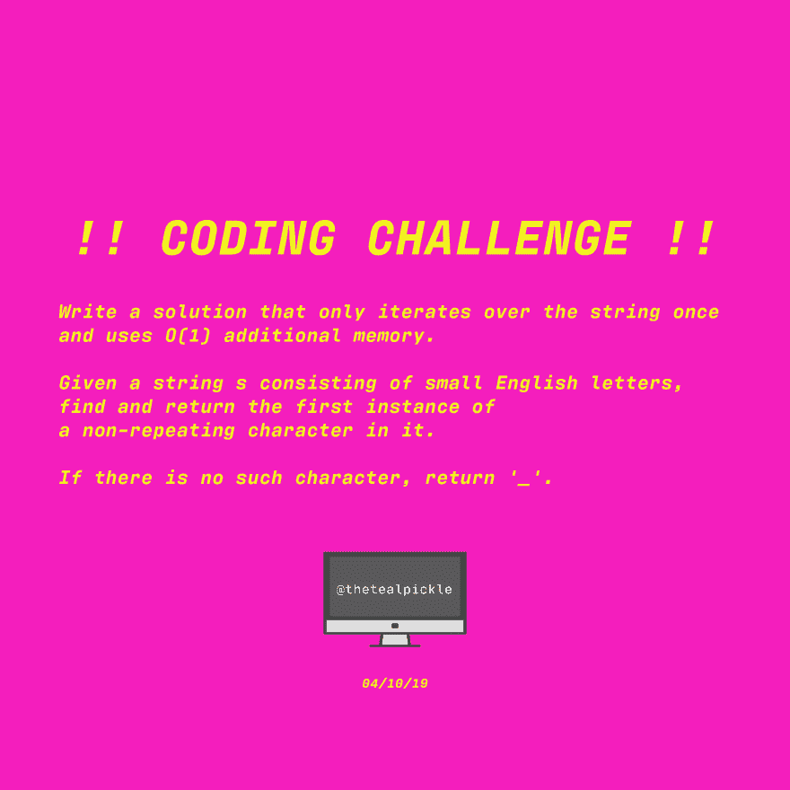
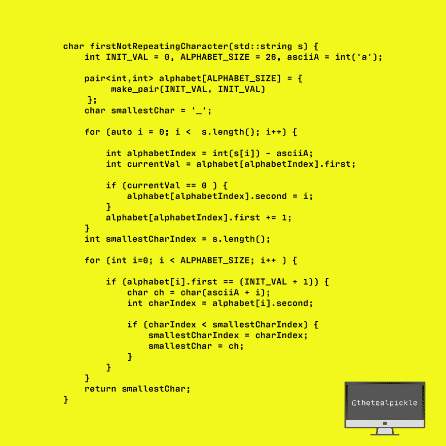

# [C++代码]字符串中第一个不重复的字符

> 原文：<https://dev.to/thetealpickle/c-code-first-non-repeating-char-in-string-3bdg>

TEAL PICKLE 编码挑战！！查找字符串中第一个不重复的字符。我用 bae (C++)解决了这个问题。

尝试👀，查看我的解决方案，分享！！
链接到问题，你可以在这里测试样本案例[:](https://app.codesignal.com/interview-practice/task/uX5iLwhc6L5ckSyNC/description %0A)

我的解决方案运行时间为 O(n ),使用 O(1)额外的内存。

