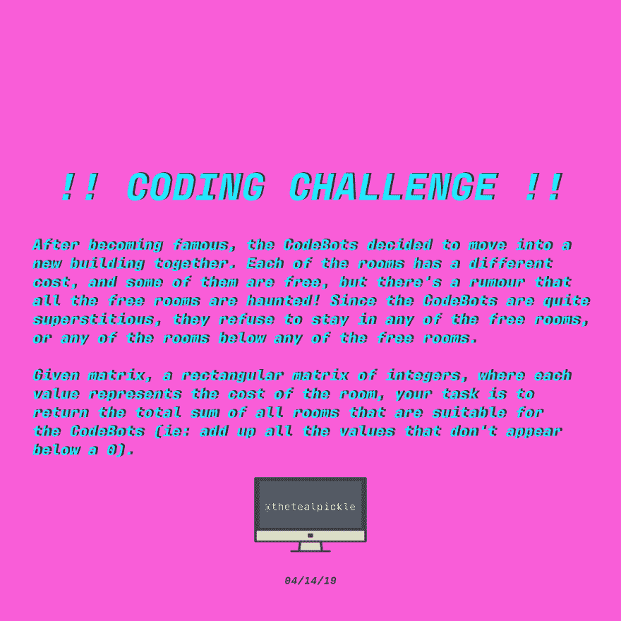
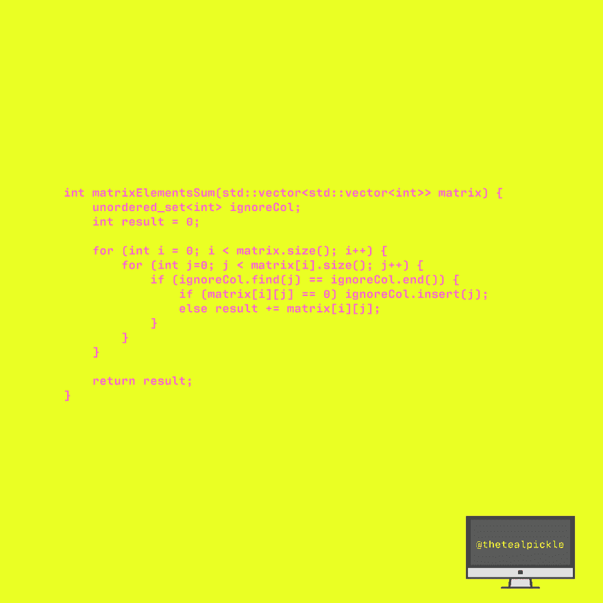

# [C++代码]闹鬼的矩阵元素总和

> 原文：<https://dev.to/thetealpickle/c-code-haunted-matrix-elements-sum-2h88>

TEAL PICKLE 编码挑战！！给定矩阵，一个矩形的整数矩阵，其中每个值代表房间的成本，你的任务是返回所有适合代码机器人的房间的总和。我用 bae (C++)解决了这个问题。尝试👀

查看我的解决方案并分享您的解决方案！！~💻 💻

