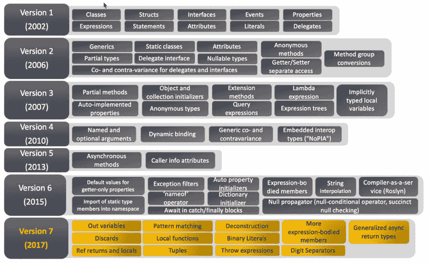
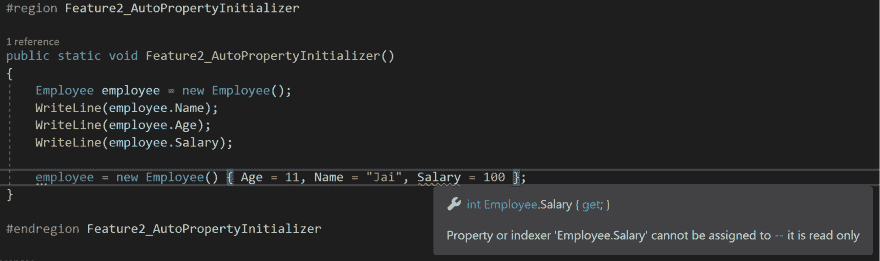
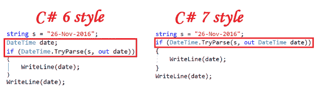

# 5.0、6.0 和 7.0 中的 C#功能

> 原文：<https://dev.to/jai00271/c-features-from-5-0-6-0-and-7-0-2ldn>

正如我们所知，最近 c # 8.0 版本发布了，在我写这篇文章的时候，它还在预览中。它的最终版本将与一起发布。网芯 3.0。与目前为止该语言的所有版本不同，C# 8.0 的所有特性在。NET 框架。一旦 8.0 版本可用，我将更新这个博客。

我想到了列出 c#从 5.0、6.0 到 7.0 的一些关键特性。我还添加了 Github 链接，以便参考所有功能的实现。

[https://github.com/jai00271/CSharpFeatures](https://github.com/jai00271/CSharpFeatures)

在开始之前，我真诚地感谢微软和各种网站/博客。

仅供参考*我正在使用 asp。适用于所有项目的 Net core 2.2。*

让我们看看 C#这些年是如何发展的。

[](https://res.cloudinary.com/practicaldev/image/fetch/s--UzBHPtfn--/c_limit%2Cf_auto%2Cfl_progressive%2Cq_auto%2Cw_880/http://strive2code.net/image.axd%3Fpicture%3D/Azure/CSharp/CSharp_versions_min.jpg)

[鸣谢:图片来源](http://strive2code.net/image.axd?picture=/Azure/CSharp/CSharp_versions_min.jpg)

### C# 5.0 的功能

*   异步和等待

异步ˌ非同步(asynchronous)

关键字对于异步函数很有用。如果用户在函数之前指定 async 关键字，用户需要异步调用函数。

等待

当用户异步调用函数时，await 关键字很有用。

```
private static async void Feature1_AsyncAwait()
{
    await DBProcess();
}

private static Task DBProcess()
{
    return Task.Run(() =>
                    {
                        System.Threading.Thread.Sleep(7000);
                    });
} 
```

*   呼叫者信息

您可以使用呼叫者属性获取呼叫者信息。这对于调试、跟踪等目的是有用的。

呼叫者信息中使用了三种不同的属性类型。

1.  CallerFilePath:用于设置调用者源代码文件的信息
2.  CallerMemberName:用于设置调用者成员名称的信息
3.  CallerLineNumber:用于设置呼叫者的线路号码信息

```
public static void Feature2_CallerInformation([CallerMemberName] string name = null, [CallerLineNumber] int line = -1, [CallerFilePath] string path = null)
{
    Console.WriteLine("Caller Name: {0}", name);
    Console.WriteLine("Caller FilePath: {0}", path);
    Console.WriteLine("Caller LineNumber: {0}", line);
}

Output:
-------------------------------------------------------------------
Caller Name: Main
Caller FilePath: C:\Users\User_Name\CSharp5\Program.cs
Caller LineNumber: 13 
```

* * *

### C# 6.0 的特性

*   使用静电

现在要使用任何静态方法，我们不必使用类名。我们可以用静态关键字为该类声明名称空间。

```
using static System.Console;

public static void Feature1_UsingStatic()
{
    //Check namespace declaration: using static System.Console;
    WriteLine("We are using Console.WriteLine() to print this line!");
} 
```

*   自动属性初始值设定项

而不是用默认 get 创建属性；并设置；我们可以通过分配默认值来更好地组织它们。我们也可以通过移除 set 来使属性成为只读的；而财产申报。

```
public class Employee
{
    public Employee()
    {
        Salary = 111;
    }
    public string Name { get; set; } = "Jai";
    public int Age { get; set; } = 30;
    public int Salary { get; } = 222;
} 
```

在上面的例子中，Salary 是只读的，除了 Employee 构造函数之外不能修改。

```
public static void Feature2_AutoPropertyInitializer()
{
    Employee employee = new Employee();
    WriteLine(employee.Name);
    WriteLine(employee.Age);
    WriteLine(employee.Salary);
} 
```

现在，如果你试图设置工资值，你会得到以下错误:

[](https://res.cloudinary.com/practicaldev/image/fetch/s--98aDcG0W--/c_limit%2Cf_auto%2Cfl_progressive%2Cq_auto%2Cw_880/https://thepracticaldev.s3.amazonaws.com/i/5ozkh82ka2ynwamt9898.png)

*   字典初始值设定项

当使用字典时，有时你想用值来初始化它们，就像你用“=”来初始化数组和列表一样。我们现在可以用一种叫做字典初始化器的东西来做这件事，它的工作方式非常类似于数组初始化器。

```
public static void Feature3_DictionaryInitializer()
{
    Dictionary<int, string> dictionary = new Dictionary<int, string>()
    {
        [1] = "Amar",
        [2] = "Akbar",
        [3] = "Anthony"
    };
    dictionary[4] = "Siddhu";
    foreach (var item in dictionary)
    {
        WriteLine("Dictionary key is: {0} and value is: {1}", item.Key, item.Value);
    }
}
Output:
-------------------------------------------------------------------
Dictionary key is: 1 and value is: Amar
Dictionary key is: 2 and value is: Akbar
Dictionary key is: 3 and value is: Anthony
Dictionary key is: 4 and value is: Siddhu 
```

*   表达式的名称

这个特性对开发者来说非常有用。如果你注意到上面的内容，在所有的 WriteLine 方法中，我们一直在 string 中提到 Id，并试图打印值。为什么不使用物业名称本身，让我们的生活变得简单。

```
public static void Feature4_NameOfExpression()
{
    Employee employee = new Employee();
    WriteLine("{0} : {1}", nameof(employee.Name), employee.Name);
    WriteLine("{0} : {1}", nameof(employee.Age), employee.Age);
    WriteLine("{0} : {1}", nameof(employee.Salary), employee.Salary);
}
Output:
-------------------------------------------------------------------
Name : Jai
Age : 30
Salary : 111 
```

*   异常过滤器

异常过滤器允许我们在 catch 块中指定一个条件，所以如果条件返回 true，那么 catch 块将被执行，否则它不会被执行。

```
public static void Feature5_ExceptionFilters()
{
    int denominator = 0;

    try
    {
        WriteLine(3 / denominator);
    }
    catch (DivideByZeroException exception) when (denominator == 2)
    {
        WriteLine("If catch executed");
    }
    catch (Exception exception)
    {
        WriteLine(exception.Message);
    }
} 
```

*   等待捕捉并最终阻塞

现在，您可以从 catch 和 finally block 进行异步调用。这是非常有用的，因为有时我们可能希望在不阻止执行的情况下执行一些操作，如写日志、缓存、数据库调用。

```
public static async void Feature6_AwaitInCatchAndFinallyBlock()
{
    int denominator = 0;

    try
    {
        WriteLine(3 / denominator);
    }
    catch (DivideByZeroException exception)
    {
        await FromCatch();
    }
    finally
    {
        await FromFinally();
    }
}

private static async Task FromCatch()
{
    WriteLine("Inside Catch Async call");
}

private static async Task FromFinally()
{
    WriteLine("Inside Finally Async call");
}
Output:
-------------------------------------------------------------------
Inside Catch Async call
Inside Finally Async call 
```

*   空条件运算符

我们可以使用内嵌的空条件操作符，而不是用传统的方法检查空条件。这个运算符有助于删除大量的空条件和 if 条件。

```
public class Customer
{
    public int ItemNo { get; set; } = 123;
    public string Name { get; set; } = "Jai";
    public Order Order { get; set; } = new Order();
}
public class Order
{
    public int OrderId { get; set; } = 321;
    public string ProductName { get; set; } = "TShirt";
    public string Description { get; set; } = null;
}
public static void Feature7_NullConditionalOperator()
{
    Customer customer = new Customer();
    WriteLine(customer?.Name);
    WriteLine(customer?.Order?.ProductName);
    WriteLine(customer?.Order?.Description ?? "No description provided");
}
Output:
-------------------------------------------------------------------
Jai
TShirt
No description provided 
```

*   表达-主体方法

如果您方法只包含一行，您可以使用 lambda 表达式来使用表达式体方法。

```
public static void Feature8_ExpressionBodiedMethods()
{
    WriteLine(PrintMessage());
}
private static string PrintMessage() => "Have a great day!"; 
```

*   使用插值格式化字符串

现在你不需要使用 string 来格式化 string。格式()。相信我，这个特性节省了我很多时间，我不用担心用代码编写日志语句时的格式维护问题。

```
public static void Feature9_FormatStringsUsingInterpolation()
{
    Employee employee = new Employee();
    WriteLine($"Name is: {employee.Name}, age is: {employee.Age}");
} 
```

* * *

### C# 7.0 的功能

*   输出变量

您可以将值内联声明为使用它们的方法的参数。

[](https://res.cloudinary.com/practicaldev/image/fetch/s--wMiaIQCM--/c_limit%2Cf_auto%2Cfl_progressive%2Cq_auto%2Cw_880/https://csharpcorner-mindcrackerinc.netdna-ssl.com/article/top-10-new-features-of-c-sharp-7-with-visual-studio-20img/10.png)

鸣谢:[图片来源](https://csharpcorner-mindcrackerinc.netdna-ssl.com/article/top-10-new-features-of-c-sharp-7-with-visual-studio-20img/10.png)

```
public static void Feature1_OutVariable()
{
    string s = "28-May-2019";
    if (DateTime.TryParse(s, out DateTime date))
    {
        WriteLine(date);
    }
    WriteLine(date);
} 
```

*   本地功能

现在我们可以拥有本地函数，而不是多个独立的私有函数。

```
public static void Feature2_LocalFunctions()
        {
            void PrintHi()
            {
                WriteLine("Hi");
            }
            void PrintHello()
            {
                WriteLine("Hello");
            }
            PrintHi();
            PrintHello();
        } 
```

*   元组(带类型和文字)

从一个方法返回多个值现在是一种常见做法，我们通常使用自定义数据类型、输出参数、动态返回类型或元组对象，但这里 C# 7.0 为您带来了**元组类型**和**元组文字**，它只是返回元组对象的多个值/多种类型信息。

```
public static void Feature3_Tuples()
{
    (string, string, string) PrintDetails()
    {
        //read EmpInfo from database or any other source and just return them
        string name = "Jai";
        string address = "India";
        string moto = "learning";
        return (name, address, moto); // tuple literal
    }

    var empInfo = PrintDetails();
    WriteLine($"employee info is {empInfo.Item1}  {empInfo.Item2}  {empInfo.Item3}");
} 
```

元组是非常有用的东西，你可以很容易地替换哈希表或字典，甚至可以为一个键返回多个值，此外，你可以使用它来代替列表，在列表中，你可以在单个位置存储多个值。

。NET 也有一个 Tuple 类型([参见这里的](https://msdn.microsoft.com/en-us/library/system.tuple))，但是它是一个*引用类型*，这导致了性能问题，但是 C# 7.0 带来了一个具有*值类型*的 Tuple，它的性能更快，并且是一个可变类型。

*   模式匹配

模式匹配是一个新特性，可用于检查条件。模式匹配支持许多模式，如类型模式、常量模式、变量模式、递归模式、属性模式和属性子模式、开关语句、匹配表达式、事例表达式、抛出表达式、去结构化赋值、测试可空性、算术简化、元组分解、复杂模式、通配符模式等。

```
public static void Feature4_PatternMatching_If()
{
    int denominator = 0;

    if (denominator is 0)
    {
        WriteLine("Inside If");
    }
} 
```

*Switch 模式*非常有用，因为它使用任何数据类型进行匹配，此外,“case”子句也可以有其模式，因此实现起来有点灵活。在下面的示例中，开关盒检查模式并调用“乘法”方法

```
public class Employee
    {
        public string Name { get; set; }
        public int Age { get; set; }
        public string Gender { get; set; }
    }
    public class Department : Employee
    {
        public string DeptName { get; set; }
        public int Year { get; set; }
    }

    public class Performance : Employee
    {
        public string Comment { get; set; }
        public string Bonus { get; set; }
    }
    public static void Feature4_PatternMatching_Switch()
        {
            Employee p = new Employee();
            Department d = new Department()
            {
                DeptName = "IT",
                Year = 2006
            };
            Performance a = new Performance()
            {
                Name = "Jai",
                Age = 30,
                Gender = "Male",
                Bonus = "Sometimes",
                Comment = "generic Comment"
            };

            SwitchCase(a);
            SwitchCase(d);
            SwitchCase(p = null);

            void SwitchCase(dynamic instance)
            {
                switch (instance)
                {
                    case Employee performer when (performer.Age == 30):
                        WriteLine($"The performer {performer.Name}");
                        break;
                    default:
                        WriteLine("Not found");
                        break;
                    case null:
                        WriteLine("Argument Null Exception");
                        //throw new ArgumentNullException(nameof(a));
                        break;
                }
            }            
        }
Output:
-------------------------------------------------------------------
The performer Jai
Not found
Argument Null Exception 
```

*   引用返回和本地

之前，我们只能选择在向方法传递参数时使用“ref”关键字。现在在 C# 7.0 中，我们也可以使用“ref”从方法中返回变量，即方法可以通过引用返回变量。我们也可以用引用存储一个局部变量。

```
public static void Feature5_RefLocalsAndReturns()
        {
            int[] arr = { 2, 4, 6, 8, 9 };
            ref int oddNum = ref GetFirstOddNumber(arr);

            WriteLine($"Odd Number: {oddNum}");

            ref int GetFirstOddNumber(int[] numbers)
            {
                for (int i = 0; i < numbers.Length; i++)
                {
                    if (numbers[i] % 2 == 1)
                    {
                        return ref numbers[i];
                    }
                }
                throw new Exception("odd number not found");
            }
        } 
```

*   抛出表达式

您可以在代码结构中抛出异常，这在以前是不允许的，因为`throw`是一个语句。没必要试着接住，万岁！

```
public static void Feature6_ThrowExpressions()
        {
            var denominator = 0;
            WriteLine(Divide(denominator));

            double Divide(int denom)
            {
                var numerator = 3;
                return denom != 0 ? numerator / denom : throw new DivideByZeroException();
            }
        } 
```

*   通用异步返回类型

用`async`修饰符声明的方法可以返回除了`Task`和`Task<T>`之外的其他类型。

从异步方法返回一个`Task`对象会在某些路径中引入性能瓶颈。`Task`是一个引用类型，所以使用它意味着分配一个对象。在用`async`修饰符声明的方法返回缓存的结果，或者同步完成的情况下，额外的分配在代码的性能关键部分会成为一个显著的时间成本。如果这些分配发生在严格的循环中，成本会变得很高。

新的语言特性意味着异步方法返回类型不限于`Task`、`Task<T>`和`void`。返回的类型必须仍然满足异步模式，这意味着一个`GetAwaiter`方法必须是可访问的。作为一个具体的例子，`ValueTask`类型已经被添加到。NET framework/ Core 来利用这一新的语言特性:

```
public static void Feature7_GeneralizedAsyncReturnTypes()
        {
            NoReturn();
            WriteLine("Returned value is: " + WithReturn().Result);

            async ValueTask NoReturn()
            {
                await Task.Delay(1);
            }

            async ValueTask<int> WithReturn()
            {
                await Task.Delay(1);
                return 1;
            }
        } 
```

`Task`和`ValueTask`有一个很大的区别。`Task`是一个引用类型，需要堆分配。`ValueTask`是值类型，由值返回——这意味着没有堆分配。当一个方法很可能不需要等待`async`操作时，建议使用`ValueTask`。例如，如果方法返回缓存或预定义的结果。这可以显著减少分配的数量，从而大幅提高性能。

*   表情丰富的成员

C# 6 为成员函数引入了[表达式体成员](https://docs.microsoft.com/en-us/dotnet/csharp/whats-new/csharp-6#expression-bodied-function-members)，以及只读属性。C# 7.0 扩展了可以作为表达式实现的允许成员。在 C# 7.0 中，你可以在*属性*和*索引器*上实现*构造器*、*终结器*以及`get`和`set`访问器。

```
// Expression-bodied constructor
public ExpressionMembersExample(string label) => this.Label = label;

// Expression-bodied finalizer
~ExpressionMembersExample() => Console.Error.WriteLine("Finalized!");

private string label;

// Expression-bodied get / set accessors.
public string Label
{
    get => label;
    set => this.label = value ?? "Default label";
} 
```

感谢阅读。