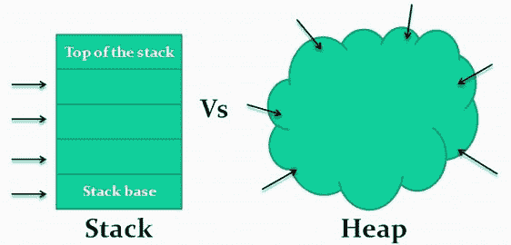

# C# OOP:数据类型、结构和类

> 原文：<https://dev.to/aromig/c-oop-data-types-structs-and-classes-453p>

跳转到:

*   [数据类型](#data-types)
*   [结构](#structs)
*   [类](#classes)
*   [值类型 vs 引用类型](#value-types-vs-reference-types)
    *   [内存分配](#memory-allocation)

面向对象编程(OOP)是一种编程模式，在这种模式中，所有东西都被分组为*对象*，从而允许程序员获得可重用性以及它们之间的协作。OOP 中的对象是一组代码，可以执行一组相关的活动，例如:

*   储存信息
*   执行操作
*   描述行为

对象可以对应于现实世界中的事物(例如形状、设备、产品)，也可以对应于概念(例如购物车、支付系统)。

我们如何制造这些物品？

## 数据类型

数据类型用于创建变量和对象。每种语言都有自己的一套基本的内置数据类型。当我们想要创建一个新的变量时，它们被它们的保留关键字调用。

C#中的原始数据类型有:

*   *布尔型*:真或假- **布尔型**
*   *字符*:单个 Unicode 字符- **字符**
*   *整数*:有不同的整数类型，有各自的取值范围。无符号整数只允许整数(不允许负数)。
    *   签名: **sbyte** ， **short** ， **int** ， **long**
    *   无符号:**字节**、 **ushort** 、 **uint** 、 **ulong**
*   *浮点*:以二进制值形式存储在内存中的单精度或双精度(小数点右边的位数)的实数。- **浮动**，**双**
*   *十进制*:类似浮点，十进制精度更高，但范围更小。十进制存储为十进制值，而不是二进制值。非常适合金融计算。——**十进制**

> **资源:** [C#类型和变量](https://docs.microsoft.com/en-us/dotnet/csharp/tour-of-csharp/types-and-variables) @微软

变量初始化示例:

```
bool isCoding = true;
char first_initial = 'A';
int x = 12;
float pi = 3.14f;
double fraction = 5.25;
decimal money = 300.5m;
// Real numbers assigned to a variable default to a double data type.
// Use the f & m suffixes to cast the type as float and decimal, respectively.

string FirstName = "Adam";
// Not actually a primitive but very common to use no less. 
```

Enter fullscreen mode Exit fullscreen mode

> 原语是语言中内置的主要值类型，它们可用于构建其他数据类型，如结构、类和其他对象。

您可能已经注意到，**字符串**数据类型不在原语列表中。这是因为字符串是*引用类型*，可以被认为是字符数组。值&引用类型之间的区别将在本文末尾讨论。

* * *

## 结构

一个**结构**是一个*值类型*(一种在内存中存储值的数据类型)，用于封装相关变量的小组。

> 封装:将相关元素封装在容器中，创建新的结构

struts 可以:

*   包含字段、属性和方法等内容。
*   拥有带参数的构造函数。

把结构想象成一个定制数据类型！

```
struct Book
{
  public string title;
  public double price;
  public string author;
}

struct Coords
{
  public int x;
  public int y;

  // constructor
  public Coords(int p1, int p2) {
    x = p1;
    y = p2;
  }
}

public static void Main()
{
  Book myFavBook;
  myFavBook.title = "The Fellowship of the Rings";
  myFavBook.author = "J.R.R. Tolkien";
  myFavBook.price = 29.99;

  Coords point = new Coords(42, 69);

  Console.WriteLine(myFavBook.title); // outputs: "The Fellowship of the Ring"
  Console.WriteLine("x = {0}, y = {1}", point.x, point.y); // outputs: x = 42, y = 69
} 
```

Enter fullscreen mode Exit fullscreen mode

[→网络游戏](https://dotnetfiddle.net/vfjHGA)

当我们创建一个变量或对象时，我们说它被**实例化了**。这意味着我们采用了结构(或类)的概念，并使它成为我们可以在程序中使用的真实对象。

这两个结构以不同的方式被实例化。通过使用所谓的用于坐标结构(`Coords point = new Coords(42, 69);`)的[构造器](https://docs.microsoft.com/en-us/dotnet/csharp/programming-guide/classes-and-structs/constructors)来创建*点*对象，该构造器直接向该结构提供值，该值将被传递给其 x & y 字段。

> 有两种方法可以创建结构——有构造函数或没有构造函数

myFavBook 是以不同的方式创建的——没有构造函数。当以这种方式针对结构创建对象时，所有字段都将被赋予默认值。不过，通常我们会希望在结构体中设置自己的默认值，以确保我们(和其他程序员)知道它们将会是什么。

* * *

## 类

一个**类**是诸如字段、属性、&方法等项目的集合，这些项目共享相同的属性和动作。这些项目以合乎逻辑的方式相互关联。如果这听起来很像一个结构，那是因为它们是相似的，但它们在使用的规模上有所不同。类用于建模比结构所能允许的更复杂的结构和行为。

> 把一个类想象成我们希望我们的对象如何看起来和行为的蓝图，设计它的特征和动作。

示例类:

```
public class Person
{
  private string name;
  private int age;

  public Person(string name, int age)
  {
    this.name = name;
    this.age = age;
  }

  public void SayHello()
  {
    Console.WriteLine("Hello");
  }
}

public static void Main()
{
  // Create a new Person object named Bob
  Person Bob = new Person("Bob", 35);

  // Invoke Bob's SayHello() method
  // Say hello, Bob. "Hello" he'll say.
  Bob.SayHello();
} 
```

Enter fullscreen mode Exit fullscreen mode

[→网络游戏](https://dotnetfiddle.net/VneOF9)

像结构一样，类必须被实例化为对象。上面，对象*鲍勃*是通过实例化*人*类创建的，如下:`Person Bob = new Person();`。然后`Bob`就可以作为一个对象使用了。一个类可以被实例化多次，以创建所需数量的对象。这里还有更多的事情要做，但是这些将会在初级读本的下一节中介绍。

* * *

## 值类型 vs 引用类型

### 一个类和一个结构有多大的不同？

虽然它们看起来很相似，都可以作为数据结构的蓝图，但是结构和类之间还是有一些主要的区别。

#### 结构是值类型

当从结构实例化一个对象时，分配给它的变量保存该结构的实际数据。

当一个 struct 对象被赋给一个新变量时，它被**复制**——结构、数据，所有的一切。这两个变量在各方面都是独立的，并且包含相同数据的自己的副本。对一个副本所做的更改不会影响另一个副本。

#### 类是引用类型

当从一个类实例化一个对象时，分配给它的变量**只保存一个对存储实际数据的内存位置的引用**。该参考通常被称为**指针**。

当一个类对象被赋给一个新变量时，唯一被复制的就是那个引用。所以两个变量引用同一个对象。对一个对象的更改会影响另一个对象，因为它们指向同一个对象。

结构也不像类那样支持更复杂的行为，比如继承和多态(将在下一次解释)。

通常，对于主要包含创建后不打算更改的数据的小型数据结构，使用结构。

下面是它们之间区别的一个例子:

```
// Point is a *struct*, which allocates a value in memory
Point p1 = new Point();

// Form is a *class*
// which allocates the object (new Form) in memory
// and a reference (f1)
Form f1 = new Form();

// p2 is a copy of p1 but a seperate value in memory
Point p2 = p1;

// f2 is a copy of the reference f1,
// still pointing to the first object that was created
Form f2 = f1;

// a new value type variable
Point myPoint = new Point(0, 0);
// a new reference-type variable
Form myForm = new Form();

// Test() is a method defined below
Test(myPoint, myForm);

void Test(Point p, Form f)
{
  // No effect on myPoint since p is a copy
  p.X = 100;
  // myForm.Text is changed to "Hello, World" since myForm
  // and f point to the same object
  f.Text = "Hello, World";
  // f is now null (erased) but no effect on myForm
  // because f is only a copy of the reference
  f = null;
} 
```

Enter fullscreen mode Exit fullscreen mode

然而，如果参数通过引用传递(使用`ref`修饰符)，会有不同的结果。ref 将原始变量传递给方法，而不是副本。

```
// a new value type variable
Point myPoint = new Point(0, 0);
// a new reference-type variable
Form myForm = new Form();

// pass myPoint and myForm by reference
Test(ref myPoint, ref myForm);

void Test (ref Point p, ref Form f); {
  // myPoint.X is changed to 100
  p.X = 100;
  // myForm.Text is changed to "Hello, World"
  f.Text = "Hello, World";
  // Both f and myForm are null (erased)
  f = null;
} 
```

Enter fullscreen mode Exit fullscreen mode

### 内存分配

这一部分变得更专业一些，但是在稍微深一点的层次上理解它是如何工作的是有用的。

内置数据类型(如 string、int、double、struct)用于声明**值类型**的变量。当创建值类型实例时，会在内存中分配一个空间来存储其值。当程序访问一个值类型时，它是在直接访问它的底层数据。

**引用类型**(比如一个类)的处理方式不同。在内存中创建一个对象，类实例化是对该对象的引用。当我们“访问对象”时，我们实际上是在访问一个指针，这个指针在内存的另一部分找到实际的对象。

* * *

的。Net CLR(公共语言运行时)在两个地方为对象分配内存:堆栈**和 T2 堆**。

[](https://res.cloudinary.com/practicaldev/image/fetch/s--qgGJkNA5--/c_limit%2Cf_auto%2Cfl_progressive%2Cq_auto%2Cw_880/https://romig.dev/asseimg/blog/stack-v-heap.jpg)

堆栈是一种“后进先出”(LIFO)的内存结构。当一个方法被调用时，CLR 标记栈顶，然后*在执行时将*数据压入栈中。当该方法完成时，CLR 重置回之前的状态，本质上是*从中弹出*该方法的内存分配。

然而，堆更好地描述为对象的随机混乱。这允许以任何顺序分配和取消分配对象。内存管理器和垃圾收集器有助于保持这部分内存的整洁。

> 值类型将实际数据放入堆栈。
> 
> 引用类型在堆栈中放置一个指针，该指针引用包含实际数据的堆中的一个位置。

#### 举例

```
void CreateTextBox()
{
  string txt = "Hello World";
  TextBox myTextBox = new TextBox(txt);
} 
```

Enter fullscreen mode Exit fullscreen mode

在这个例子中，这里是什么属于哪里:

*   变量`txt` →堆栈
*   `myTextBox`参考→堆栈
*   `myTextBox` *对象*(其属性如文本、大小、颜色等)→堆

堆栈存储:

*   引用类型局部变量和参数的引用部分(即 myTextBox 引用)
*   值类型局部变量和方法参数(structs、int、string、bool、char、DateTime 等)

堆存储:

*   引用类型对象的内容
*   引用类型对象内部的任何结构(例如类内部的变量)

#### 为什么我们会有栈和堆？

该堆栈的结构简单，速度非常快。然而，它的大小非常有限，程序使用的内存量是在编译时分配的。

> 如果使用 macOS 或 Linux，通过键入命令`ulimit -s`检查您自己机器的最大堆栈大小，其输出将以千字节为单位。数量会因您的 CPU 和操作系统而异。
> 
> ```
> $ ulimit -s
> 8192 
> ```
> 
> 您可以从上面看到，我的结果显示我的系统的最大堆栈大小为 8 兆字节。

觉得没有太大的发挥空间？对于正常操作，应该是。但这也是为什么我们小心翼翼地避免出现无限循环的情况，因为这将导致[堆栈溢出](https://en.wikipedia.org/wiki/Stack_overflow)。

栈也总是使用 LIFO 结构。为了释放某个变量或方法所使用的内存(在它的使用结束之后)，程序需要在处理那个变量或方法之前，解决释放在之后*分配的内存的问题。*

这堆东西看起来乱七八糟。对象在内存中被分配到看似随机的位置。对这些位置的访问比在堆栈中要慢。那么为什么要有一堆呢？来解决斯塔克斯的问题。程序可以使用它所需要的内存，并且它可以在任何时候释放内存对象，而不需要等待其他对象在轮到它的时候离开。

使用 C#，我们可以让 CLR 处理内存分配的技术问题，因为它被抽象掉了，所以我们可以专注于编写其他代码。不过，当我们计划数据结构或调试应用程序时，最好记住这类信息。

* * *

## 呼！

感谢您的阅读！这可不容易。我希望这篇文章能帮助你理解数据类型、结构和类的基础知识。在下一本书里，我们将更多地讨论类以及如何用它们构建更复杂的对象。