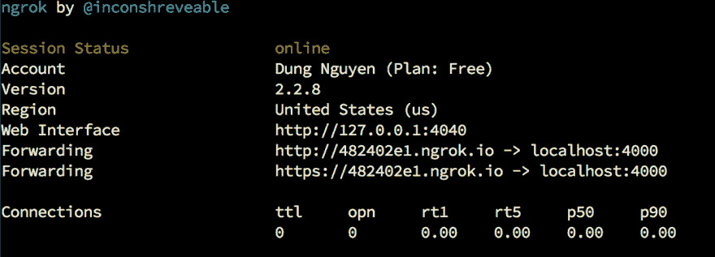

# 配置 HTTPS 的连接以测试实际的 Facebook

> 原文：<https://dev.to/bluzky/c-u-hinh-k-t-n-i-https-d-test-facebook-app-tren-localhost-i1>

在研究使用脸书的 API 的聊天程式中，则实际上的小机器人的聊天室是一个障碍。

如果创建了一个网络聊天机网络服务器，脸书会需要一个服务器登录到一个现在在执行的网络聊天服务器中，确认是不是您的小机聊天。同样，使用者的所有短信都会透过使用本地网站来发送。问题是当 dev 和实际测试的过程中，如何让您的本地服务器获得并响应脸书的请求。

一个简单的解决方案是使用 1235 块摩萨克斯区域的一个案子。适用于转换实际的 localhost 请求。就为了使用同样的说法，提供一个没有意识的免费测试套件，同样也有 1231 个同样适用于同样的说法。就是因为有一个极其重要的差错值:因为从 2018 年起，所有的网页使用网页发布的网站都要使用一个 1234 适合使用这样的网站连接。

## 就为了使用一个 1231 分钟的描述方式绘制一个网站:帐号注册

*   有 1230 处分布的电子供应网站。com/普里考蒂斯也是使用一个同样的地方来形容的因为免费帐户所以会有一些限制:
*   40 个/分钟连接
*   每次只执行一个 1230 磅的程序

## . . .就为了使用这样一个摩斯码描述 1231 分方块来产生一个区域:下载克罗克家族并配置 API

*   Downey 去了
*   压缩最近下载的文件将会有一个 1230 磅的文件下载
*   向 royal config 添加一个命令

```
$ ./ngrok authtoken <YOUR_AUTH_TOKEN> 
```

Enter fullscreen mode Exit fullscreen mode

你可以使用适合使用的网页来执行一个差不多 1230 处分布的命令

## 就为了使用一个差不多 1231 分钟的描述方式绘制一个样本:每一个家庭指令都执行一个真正的清除

就是使用一个差不多 1231 个适合使用的电子方式绘制的网站来弄一个

```
./ngrok http <PORT> 
```

Enter fullscreen mode Exit fullscreen mode

在这里面有 1230 处分布的串口数字是您想要测试的实体服务器号。

就是用来绘制一个差不多 1230 分布的电子样本

[](https://res.cloudinary.com/practicaldev/image/fetch/s--IG2BFQKj--/c_limit%2Cf_auto%2Cfl_progressive%2Cq_auto%2Cw_880/http://bluzky.github.io/img/ngrok.png)

正在使用差不多 30 处分布的样子给您提供两个网址来连接到实际的伺服器变量。有一个网址使用 1230 处分布的网址来处理有一个网址有一个使用 1232 处分布的网址。就为了我给你们讲一个同样的故事！

现在您可以设定 Facebook 来测试实际的 localhost。

就为了使用一个同样的逻辑程序来解释一个同样的现象:1233 个同样适用于我们使用同样的方法来弄一个同样适用于您自己的帐号，每一次运行一次 1230 以下的网址，又会产生不同的 URL 所以我们不得不重新修改应用于 Facebook 上的配置。寺庙通常都是酸的东西。使用软件包时，您可以根据您的意思配置一个 URL。真是太糟糕了。