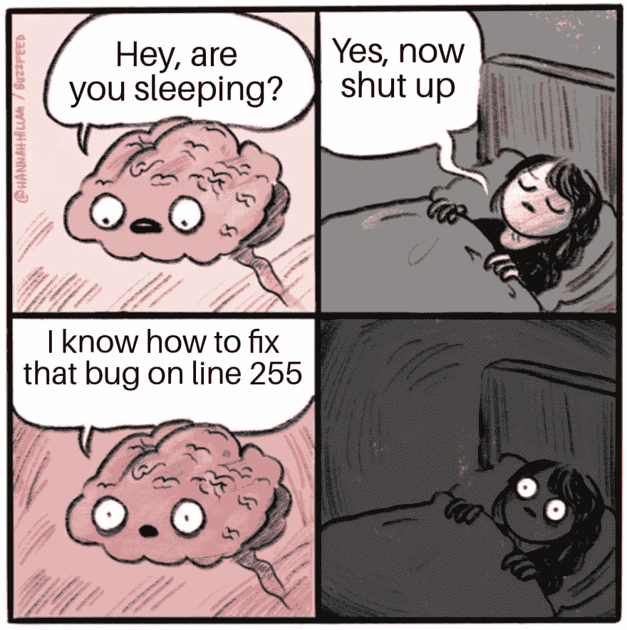

# 作为开发人员，关注您的健康

> 原文：<https://dev.to/wangonya/caring-for-your-health-as-a-developer-3m7l>

> “当健康不在时，智慧无法显现，艺术无法显现，力量无法战斗，财富变得无用，智慧无法应用。”―赫罗菲拉斯

让我们面对现实吧。作为开发人员，在健康方面很容易让事情变得有点失控。很多时候，我们发现自己在屏幕前一呆就是几个小时。我们有时睡得很晚(或者根本不睡)。除非你足够自律地遵守时间表，否则你可能会发现自己没有时间吃正餐，所以吃零食成了一种习惯。所有这些通常都是为了修复某个 bug 或找到某个问题的最有效解决方案而做出的牺牲。通常，我们的健康会因此受损。虽然这在目前看起来很好，但我们没有看到更大的图景——它将如何影响我们的未来。

我认为，如果采用更健康的实践，开发人员将会更有效率，并且能够在更短的时间内完成一些任务，因为大脑更加清晰。我可以在这里引用一些调查和研究来证明这一点，但简单的个人经验就足够了。当你感冒的时候，做任何事情都很难。精神和身体之间有着密切的联系，当一方遭受痛苦时，另一方无疑会感受到。如果你想保持身心健康，下面是一些需要注意的要点。

## 注意饮食🥘

就像你的汽车没有合适的燃料就无法行驶一样，我们的身体也需要合适的燃料才能高效工作。确保你有时间吃一顿营养均衡的饭——最好是一顿丰盛的早餐，给你一天足够的能量，一顿好的午餐和一顿清淡的晚餐。当然，这是假设一个正常的朝九晚五的时间表。在非正常工作时间，你可以做相应的调整。

## 进行一些锻炼🏃🏽‍♂️

我不会走到有些人不得不说[坐着会杀死](https://edition.cnn.com/2017/09/11/health/sitting-increases-risk-of-death-study/index.html)的地步😄但醒来后每小时至少做一两次伸展运动绝对是个好主意。番茄工作法对此很有帮助，因为你可以休息五分钟，离开你的椅子。我发现散步是提神醒脑的好方法，尤其是当你在纠结某件事的时候。你也可以利用清晨慢跑的新鲜空气。

## 保持水分💧

如果你等到感到口渴的时候，你已经等得太久了。随身携带一瓶水，帮助全天保持水分。[事实证明](https://www.zipwater.com/zip-experiments)，保持水分可以提高我们的反应时间，使我们更加专注和警觉，并提高我们解决问题的技能。

## 休息一下

我们都经历过。有时候，当我们远离这一切，休息一下时，我们的大脑工作得最好。再说一次，散步很有效！不久前，我在 Coursera 上参加了一个名为“学习如何学习”的课程，该课程解释了这一过程背后的科学原理。可以[查看一下](https://www.coursera.org/lecture/learning-how-to-learn/introduction-to-the-focused-and-diffuse-modes-75EsZ)。

## 获得充足的睡眠🛌💤

根据这项研究，睡眠有助于清除我们清醒时大脑中积累的毒素。剥夺自己的睡眠只会积累这些毒素，你的大脑变得模糊不清。这只会导致花更多的时间试图弄清楚一些事情，从而导致更多的睡眠不足，这就变成了一个恶性循环。每个人都需要不同的睡眠时间，但是如果你能睡 7 到 8 个小时，那就足够了。同样，这假定了一个正常的朝九晚五的时间表。我理解有些人觉得深夜工作更容易，这很酷。我自己是个早起的人，所以我宁愿早睡早起。

我可能会在本系列的后续文章中更详细地介绍这些步骤。感兴趣的话题包括仔细观察咖啡和能量饮料，看看它们是否真的让我们更有效率。可能还会有一些讨论帖子出现！