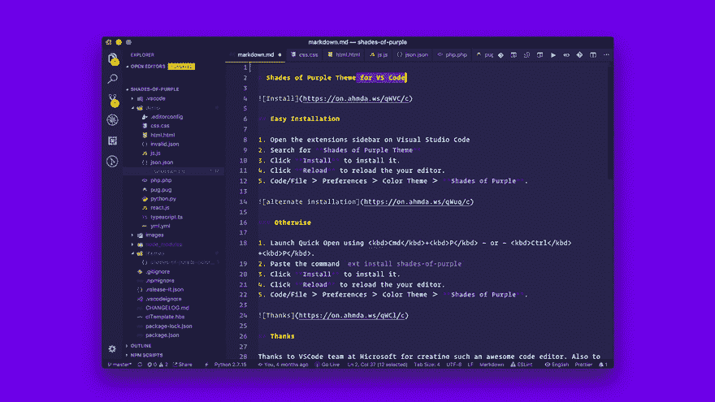
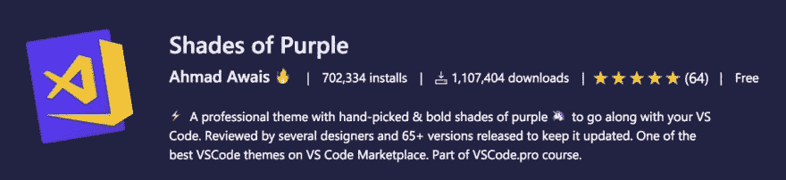

# 🎨庆祝我的 VSCode Shades of Purple 主题的 100 多万开发者用户

> 原文：<https://dev.to/vscode/celebrating-1-million-developer-users-of-my-shades-of-purple-theme-4dn4>

> 本帖是我 [2018 年回顾的一部分:开源，Node.js，&开发者关系](https://ahmadawais.com/2018-year-in-review/)。这就是你应该阅读的内容。

没错。去年发生了不可思议的事情。切换到 [VSCode](https://VSCode.pro/?utm_source=aacom) 之后，我努力寻找一个真正为 VSCode 构建的好主题，而不仅仅是从另一个编辑器移植过来的主题。

于是，我为 [VSCode](https://marketplace.visualstudio.com/items?itemName=ahmadawais.shades-of-purple) 、 [iTerm2](https://github.com/ahmadawais/shades-of-purple-iterm2) 、 [Hyper Terminal](https://github.com/ahmadawais/shades-of-purple-hyper) 、 [Slack](https://github.com/ahmadawais/shades-of-purple-slack) 、 [AlfredApp](https://github.com/ahmadawais/shades-of-purple-alfred) 、 [HighlightJS](https://github.com/ahmadawais/Shades-of-Purple-HighlightJS) 、 [Prism React](https://github.com/FormidableLabs/prism-react-renderer/blob/master/themes/shadesOfPurple.js) 、 [Code Surfer](https://code-surfer.netlify.com/theming/#8) 打造了这套名为`🦄 Shades of Purple`的主题，甚至以相同主题被移植给 [Cygwin](https://github.com/ahmadawais/Shades-of-Purple-Cygwin) 和[的形式得到了社区贡献引以为豪啊！](https://github.com/ahmadawais/shades-of-purple-konsole)

✅:当你开发一些东西来解决你自己的问题并与他人分享时(尤其是作为一个自由开源软件)，很有可能会得到他们的好评。这正是这里发生的事情。

🤔我正在构建 LMS 平台来托管我的 [VSCode.pro](https://VSCode.pro) 课程。我会在 JavaScript、PHP、Go-lang、CSS 和 HTML 中编写与视频结束事件相同的逻辑。所以，像`videoEnd`这样的变量在所有这些语言中都有表达。有意思？！

❌猜怎么着？每种编程语言都会给变量涂上不同的颜色。有一次，我用黄色、蓝色、粉色、红色和绿色作为不同语言中同一个该死的变量的语法高亮显示。那会搞乱我的大脑。

🤯所以，我继续构建了一个主题，它在 30 多种语言中足够一致，并且受到了许多伟大主题的启发。我找了几个设计师朋友来审查主题的设计，并致力于它的可访问性。

⚡️这个项目很快成为我最喜欢的副业，并帮助我成为一名更好的程序员。我知道数据类型的颜色(所以当事情出错时，我的大脑可以比 linter 先发现)。太神奇了！

😮紫色阴影项目所发生的事情超出了我所见过的开源软件的任何增长。也许这是令人敬畏的 VSCode 社区，或者也许这一次我创造了真正有用的东西。谁知道呢。查看统计数据:

*   我的主题有超过一百万的开发者用户——哇，这才是正确的。我的意思是严重-f***-ly(原谅我的法语)。
*   我已经发布了超过 100 个版本更新给整个紫色主题套件。所有这些都发生在一年之内。#千真万确！
*   我觉得我每天都和这么多开发人员联系在一起。一个简单的主题更新就能让他们的生活变得更轻松。他们知道我在乎。
*   一个普通的开发人员每天花几个小时写代码。所以，成千上万的开发者每天使用我的主题几个小时。
*   感觉好像我创造了一个脸书(当然没有令人毛骨悚然的隐私问题)，在那里我的所有用户都是我的人(我指的是开发人员)。以敏捷的方式不断改进感觉很好。
*   看看我用我的[表情日志](https://github.com/AhmadAwais/Emoji-Log) git commit spec 为潜在的时间旅行准备的一小段魔法，来构建一个[自动化变更日志](https://marketplace.visualstudio.com/items/ahmadawais.shades-of-purple/changelog)，它实际上值得一读(原谅课程广告，必须支持所有这些免费和开源的工作才能把食物放在桌子上)。

> 哇！好吧，也许那太多了。但是，嘿，我喜欢。《紫色的阴影》主题创造了一种极客风格。每个人都知道我喜欢紫色。**紫色是天才**。

和平！✌️

> 继续安装🦄[紫色阴影 VSCode 主题](https://marketplace.visualstudio.com/items?itemName=ahmadawais.shades-of-purple) →

> awais . dev@ mrahmadawais😇憋屈！
> 
> 我的开源🦄紫色阴影 VS @Code 主题现在被 702，335+开发者使用&，下载量为 1，107，405+百万。
> 
> 我为我的[vs code . pro](https://t.co/Dam4TeERKD)power user course+love for💜
> 现在第四热门 VSCode 主题
> 
> 安装→[AhmdA.ws/VSCSOP](https://t.co/Lhnq0QnSSI)20:20PM-08 2019 年 1 月