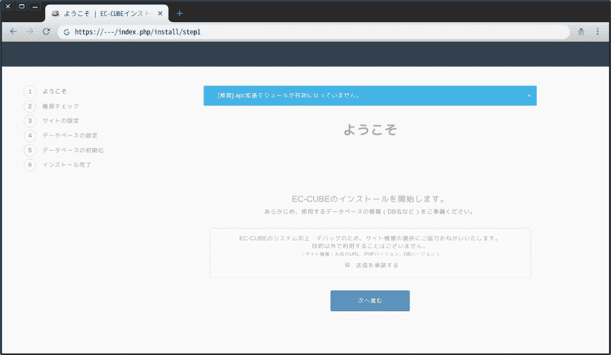
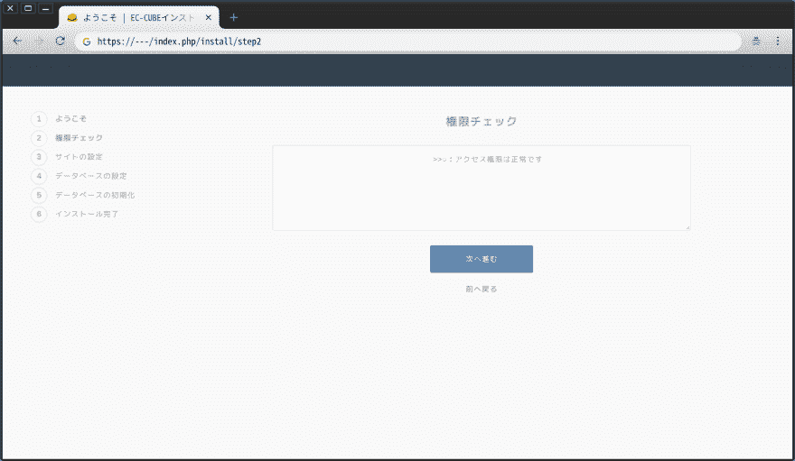
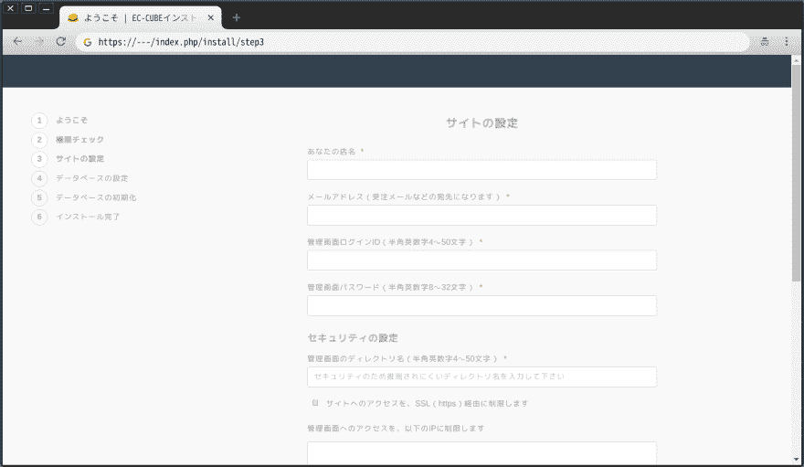
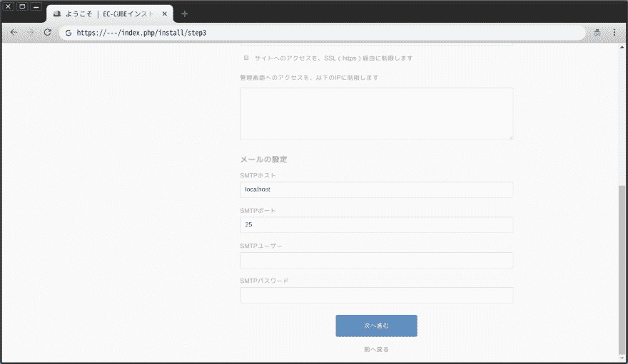
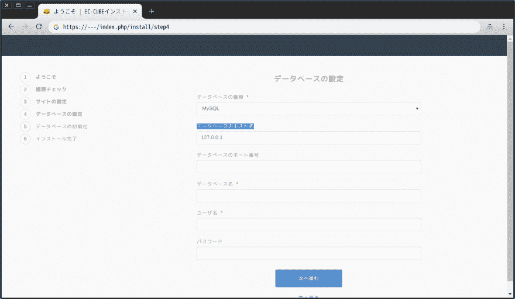
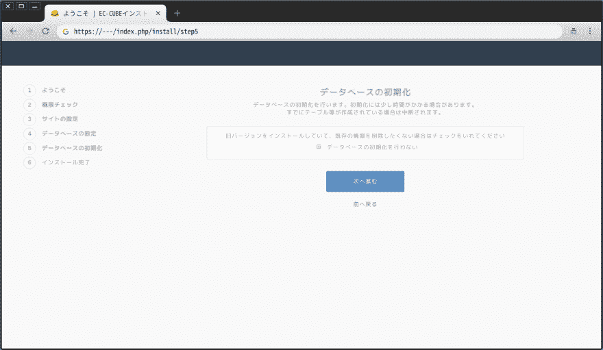
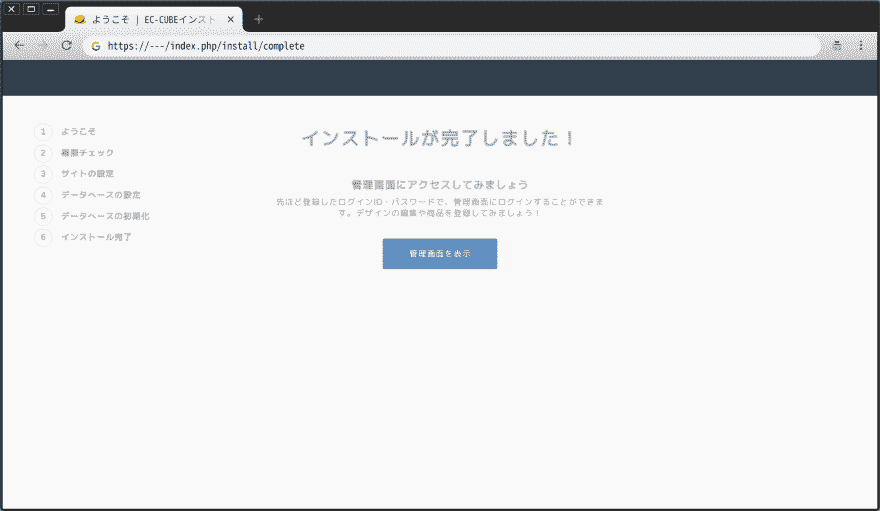
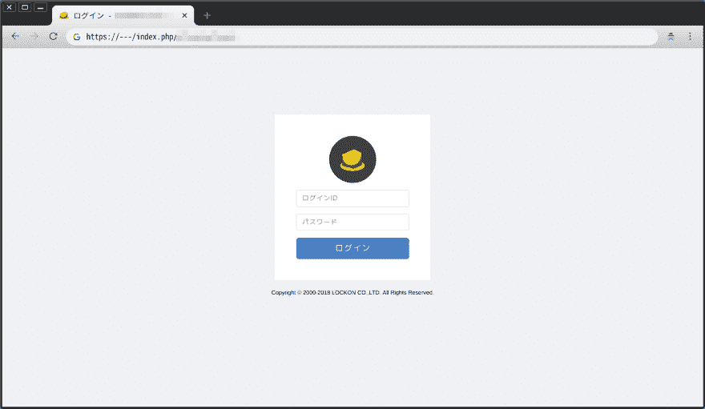
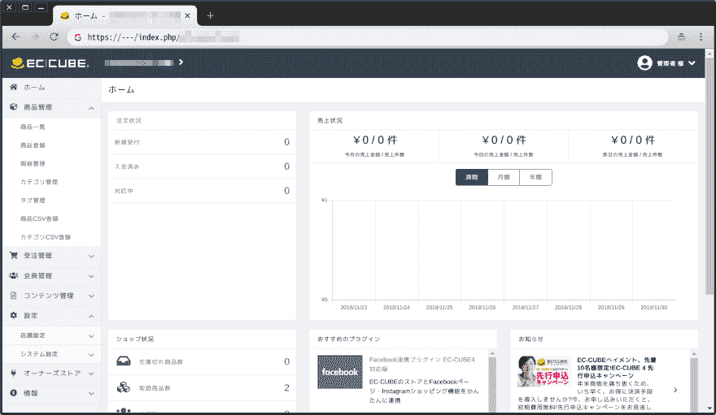

# 在 OpenBSD 6.4 上安装 EC-CUBE 4

> 原文 https://dev.to/nabbisen/ec-cube-4-openbsd-64-30pd

# 前言

[EC-CUBE](https://www.ec-cube.net/) 是开源的“网店构建系统”。
是日本发行的产品，由[株式会社 lockon](https://www.lockon.co.jp/company/info/)开发。
是兼具低学习成本和高功能性以及定制性的有魅力的软件。
由以 PHP 的[Symfony](https://symfony.com/) 为基础的[Silex](https://silex.symfony.com/) 框架构建。 模板引擎采用了[Twig](https://twig.symfony.com/) ，另外 Alt-CSS 采用了[Sass](https://sass-lang.com/) 。

[OpenBSD](https://www.openbsd.org/) 是 Unix 类操作系统之一，也是开源系统。
作为操作系统，以安全性高而闻名。 T3 )另外，开发[OpenSSH](https://www.openssh.com/) / [LibreSSL](https://www.libressl.org/) / [OpenSMTPD](https://www.opensmtpd.org/) / [PF](https://www.openbsd.org/faq/pf/) 等坚固的软件
也是实现追求清洁的软件许可证，每半年定期发布操作系统的优秀项目。

这次，一边参考[官方教程](http://doc4.ec-cube.net/quickstart_install)，一边在 OpenBSD 上安装了 EC-CUBE。
我来介绍一下其步骤。

### environment

*   操作系统:OpenBSD 6.4 amd64
*   网页サーバー: OpenBSD [httpd](https://man.openbsd.org/httpd.8)
*   购物车系统: EC-CUBE 4.0.0
*   DB: [马里亚 DB](https://mariadb.org) 10.0

<center>✿ ✿ ✿</center>

# EC-CUBE 的安装

### Ordinary cases

*   以`#`开头的行中的命令以超级用户权限执行。
*   以`$`开头的行的命令以一般用户权限执行。
*   `%`栏中的词语，如%word%，用抽象的词语表示随环境变化的值。
*   eccube-4 .？ .？ 的`?`表示任意一个字符。 在本文的情况下，具体是 eccube-4.0.0。

* * *

### premise

前提是为 Web 服务器/ PHP 7.2 构建了 PHP-FPM / MariaDB 环境。

(参考)**参考文章都是英语。*

*   Web 服务器

在`# rcctl enable httpd`中启用 OpenBSD httpd 守护进程:

[](/nabbisen) [## 设置 OpenBSD 的 httpd Web 服务器

### hed di nab bisen Oct 5 ' 183 分钟读取

#httpd #webserver #openbsd](/nabbisen/setting-up-openbsds-httpd-web-server-4p9f)

由于有在 Web 安装程序中输入密码的场面，所以本文在进行 HTTPS 通信的前提下进行记述。
可以用 httpd 指定用 Let's Encrypt 发行的 SSL/TLS 证书:

[](/nabbisen) [## 让我们加密:Certbot For OpenBSD 的 httpd

### hed di nab bisen 12 月 14 日 184 分钟阅读

#security #letsencrypt #certbot #openbsd](/nabbisen/lets-encrypt-certbot-for-openbsds-httpd-3ofd)

*   PHP-FPM

`php`添加软件包(`php-7.2`)后，通过设定 ini 文件和启用守护程序来构建环境:

[](/nabbisen) [## PHP-OpenBSD 6.4 上的 FPM 7.2

### hed di nab bisen 12 月 13 日 182 分钟阅读

#php #phpfpm #httpd #openbsd](/nabbisen/php-fpm-on-openbsd-2iof)

*   MariaDB

`mariadb-server`添加软件包后，通过运行守护进程的启用和初始化命令来构建环境:

[](/nabbisen) [## 在 OpenBSD 上安装 MariaDB 服务器

### hed di nab bisen 12 月 9 日 184 分钟阅读

#mariadb #mysql #openbsd](/nabbisen/installing-mariadb-server-on-openbsd-5lm)

然后，必须创建要在 EC-CUBE 中使用的数据库和用户。

* * *

### 安装步骤

#### #1.下载和配置 APP 应用文件

从官方网站的[免费下载](https://www.ec-cube.net/download/)获取最新版的 zip 文件。

```
#  pkg_add unzip
  $  # zip ファイルをダウンロードする
$  wget %eccube-zip%
  #  # Web サーバーのルートディレクトリに配置する
#  mv %eccube-zip% /var/www/%eccube-parent-dir%
$  cd /var/www/%eccube-parent-dir%
#  unzip %eccube-zip%
  #  # update vendor
#  cd eccube-4.?.?
#  chown -R %dev-user%:www vendor
#  php-7.2 /usr/local/libexec/composer.phar install
#  php-7.2 /usr/local/libexec/composer.phar update
#  cd ../
  #  # ファイルおよびディレクトリの所有者を httpd 用に変更する
#  chown -R www:www eccube-4.?.?
#  # in order to develop plugins
#  chown -R %dev-user%:www eccube-4.?.?/app
#  chown -R %dev-user%:www eccube-4.?.?/var 
```

#### #2.准备执行环境

[根据系统要求](http://doc4.ec-cube.net/quickstart_requirement)，在系统上安装所需的软件包。

```
#  # PHP Composer (PHP 7.0 ver.)
#  pkg_add composer
  #  # PHP 拡張モジュール
#  pkg_add php-intl php-pdo_mysql 
```

**补充:在开发环境中使用 SQLite3 时，安装`php-pdo_sqlite`而不是`php-pdo_mysql`。 (在生产环境中不推荐使用！ )*

[编辑 PHP 的 ini 文件](http://php.net/manual/ja/configuration.file.php)，使必要的[扩展](http://php.net/manual/ja/extensions.php)有效。

```
#  nvim /etc/php-7.2.ini 
```

```
extension=curl
extension=fileinfo
extension=intl
extension=mbstring
; ... extension=mysqli
extension=pdo_mysql
;extension=pdo_sqlite 
```

**补充:使用 SQLite3 时，去掉`pdo_sqlite`的注释代替`pdo_mysql`。*

关于`mysqli`的启用，也有代替的方法。
在 PHP 7.2 安装过程中，会在`/etc/php-7.2.sample`目录中创建一些扩展的 conf 文件。
也可以使用那边启用`mysqli`。

```
#  ln -sf /etc/php-7.2.sample/mysqli.conf /etc/php-7.2/` 
```

重新启动`php72_fpm`。

```
#  rcctl restart php72_fpm 
```

#### #3.启动 web 服务器

在[`/etc/httpd.conf`](https://man.openbsd.org/httpd.conf.5)中添加 EC-CUBE 网站用的定义。
`block`定义和`pass`定义的一部分以 EC-cube APP 应用程序文件中存在多个的`.htaccess`的内容为基础。

```
server "%host%" {
        listen on $ext_addr port 80
        block return 301 "https://$SERVER_NAME$REQUEST_URI"
}
server "%host%" {
        listen on $ext_addr tls port 443
        tls {
                certificate "/etc/letsencrypt/live/%host%/fullchain.
pem"
                key "/etc/letsencrypt/live/%host%/privkey.pem"
        }
        root "/%eccube-parent-dir%/eccube-4.?.?"
        directory auto index

        location ".git"                 { block }
        location "/composer"            { block }
        location "/COPYING"             { block }
        location "/.env"                { block }
        location "/.maintenance"        { block } # （後日） 4.0.1 アップデート時に追加した行
        location "/Procfile"            { block }
        location "/app.json"            { block }
        location "/gulpfile.js"         { block }
        location "/package.json"        { block }
        location "/package-lock.json"   { block }
        location "web.config"           { block }

        location "/src/*"                               { block }
        location "/bin/*"                               { block }
        location "/vendor/tecnickcom/tcpdf/tools/*"     { block }
        location "/app/*"                               { block }

        location "*.gif"        { pass }
        location "*.png"        { pass }
        location "*.jpg"        { pass }
        location "*.jpeg"       { pass }
        location "*.css"        { pass }
        location "*.ico"        { pass }
        location "*.js"         { pass }
        location "*.svg"        { pass }
        location "*.map"        { pass }

        location "/" {
                block return 301 "https://$SERVER_NAME/index.php/"
        }
        location "/*.php*" {
                fastcgi socket "/run/php-fpm.sock"
        }
        location match "^/(.*)$" {
                fastcgi socket "/run/php-fpm.sock"
                request rewrite "/index.php/%1"
        }
} 
```

* * *

**补充:如果只是移动安装程序，以下定义就足够了。 但是不能用于通常运用。 进行 HTTPS 通信时，需要明确指定 https://...和 URL。 且安装后的首页的 URL 浏览仍存在问题。*

```
server "%host%" {
        listen on $ext_addr port 80
        listen on $ext_addr tls port 443
        tls {
                certificate "/etc/letsencrypt/live/%host%/fullchain.pem"
                key "/etc/letsencrypt/live/%host%/privkey.pem"
        }
        root "/%eccube-parent-dir%/eccube-4.?.?"

        location match "/html/.*" {
                directory index index.html
        }
        # todo: location "/index.php/" => show /index.php
        location match "(/?|/index.php/?)" {
                directory index index.php
        }
        location match "/index.php/.+" {
                fastcgi socket "/run/php-fpm.sock"
        }
        location "*" {
                block return 302 "https://$HTTP_HOST/index.php$REQUEST_URI"
        }
} 
```

* * *

对应于 httpd 的`chroot`使 etc 目录实际上为`/var/www/etc`:

```
#  mkdir /var/www/etc
#  cp /etc/{hosts,resolv.conf,localtime} /var/www/etc/ 
```

重新启动 httpd。

```
#  rcctl restart httpd 
```

您已准备好使用 Web 安装程序安装 EC-CUBE。

#### #4.用 web 安装程序安装 EC-CUBE

访问在 httpd 中指定的主机的根目录( https://%host%/)。
会显示 Web 安装程序，按照画面进行。

[](https://res.cloudinary.com/practicaldev/image/fetch/s--scsXPdD1--/c_limit%2Cf_auto%2Cfl_progressive%2Cq_auto%2Cw_880/https://thepracticaldev.s3.amazonaws.com/i/pca87lwvfuofl4cxrmvr.png)

检查访问权限:

[](https://res.cloudinary.com/practicaldev/image/fetch/s--n7CbMWz_--/c_limit%2Cf_auto%2Cfl_progressive%2Cq_auto%2Cw_880/https://thepracticaldev.s3.amazonaws.com/i/16ezxrmmonyl61c1423h.png)

站点设置:

[](https://res.cloudinary.com/practicaldev/image/fetch/s--_KGuSWng--/c_limit%2Cf_auto%2Cfl_progressive%2Cq_auto%2Cw_880/https://thepracticaldev.s3.amazonaws.com/i/jbxoa7thuotkz2vmz0dy.png)
[T6】](https://res.cloudinary.com/practicaldev/image/fetch/s--AtjJKx2---/c_limit%2Cf_auto%2Cfl_progressive%2Cq_auto%2Cw_880/https://thepracticaldev.s3.amazonaws.com/i/zsk4092bw6otj3v3g4k6.png)

数据库设置:

[](https://res.cloudinary.com/practicaldev/image/fetch/s--XaXto5S6--/c_limit%2Cf_auto%2Cfl_progressive%2Cq_auto%2Cw_880/https://thepracticaldev.s3.amazonaws.com/i/u6o6uanawtwr5xnmu1wn.png)

**补充:[对于 EC-CUBE 4.0.0，数据库用户密码中必须不包含“#”。](https://dev.to/nabbisen/ec-cube-400-malformed-parameter-url-9l6) 已在 4.0.1 中消除。*

初始化数据库:

[](https://res.cloudinary.com/practicaldev/image/fetch/s--uffkH-GE--/c_limit%2Cf_auto%2Cfl_progressive%2Cq_auto%2Cw_880/https://thepracticaldev.s3.amazonaws.com/i/4uhmaydvrvcu02g6sce2.png)

显示完成画面:

[](https://res.cloudinary.com/practicaldev/image/fetch/s--uPF6inWq--/c_limit%2Cf_auto%2Cfl_progressive%2Cq_auto%2Cw_880/https://thepracticaldev.s3.amazonaws.com/i/oib3pfcmqc5exp9b06wz.png)

显示管理画面的登录画面。
可以使用在“站点设置”中注册的管理员信息登录。

[](https://res.cloudinary.com/practicaldev/image/fetch/s--KNMDfdNG--/c_limit%2Cf_auto%2Cfl_progressive%2Cq_auto%2Cw_880/https://thepracticaldev.s3.amazonaws.com/i/856fbfwygt74kc7em8ds.png)
[T6】](https://res.cloudinary.com/practicaldev/image/fetch/s--_ezykWA8--/c_limit%2Cf_auto%2Cfl_progressive%2Cq_auto%2Cw_880/https://thepracticaldev.s3.amazonaws.com/i/xifjlc92jh445q10ttye.png)

安装完成后，访问主机的根目录( https://%host%/)将显示购物网站的首页。

<center>✿ ✿ ✿</center>

到此为止。
谢谢您的阅读。

* * *

### * Memories

日后更新为 4.0.1 :

[](/nabbisen) [## 更新到 EC-CUBE 4.0.0 - >4.0.1@ openbsd

### hed di nab bisen 12 月 26 日 184 分钟阅读

#eccube #ecommerce #openbsd #migration](/nabbisen/ec-cube-400---401---openbsd-5g8m)