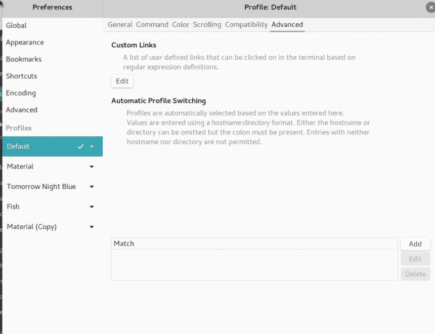

# 当连接到 SSH 主机时，在 Tilix 中自动更改配置文件

> 原文：<https://dev.to/abdallah/change-profiles-automatically-in-tilix-when-connecting-to-ssh-hosts-58a8>

我使用 [Tilix](https://gnunn1.github.io/tilix-web/) 作为我在 Ubuntu 上的主要终端应用。我喜欢它，主要是因为它易于使用，并在磁贴和标签中显示多个会话，因此很容易在多个服务器之间切换，无需太多麻烦

Tilix 也是非常可定制的。我只需要让“配置文件”根据我切换到的服务器/机器自动切换。这可以根据 https://gnunn1.github.io/tilix-web/manual/profileswitch/的文档来完成，但是我想要在本地配置，而不是发送到远程系统。

所以我只是添加了一个包装我的 ssh 命令的函数。这是它在我的。bashrc

```
ssh() { SSHAPP=`which ssh`; ARGS=$@; echo "switching to $ARGS"; printf "\033]7;file://%s/\007" "$ARGS"; $SSHAPP $ARGS; } 
```

这会将您登录的机器的主机名设置为标题。那是你的导火索。剩下的工作是创建一个配置文件，并指定该配置文件在设置触发器(主机名:目录，也可以添加用户)时自动切换。

转到配置文件>编辑配置文件>高级(选项卡)，并在匹配下添加主机名。

<figure>[](https://res.cloudinary.com/practicaldev/image/fetch/s--PNYXeD3B--/c_limit%2Cf_auto%2Cfl_progressive%2Cq_auto%2Cw_880/https://deeb.me/wp-content/uploads/image-1024x787.png) 

<figcaption>
</figcaption>

</figure>

大概就是这样。我现在要为我的生产机器添加一个红色背景的新配置文件！太多了？