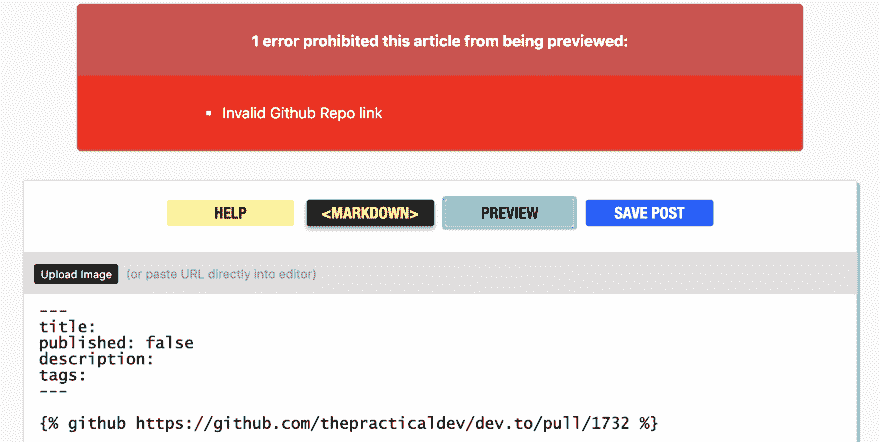
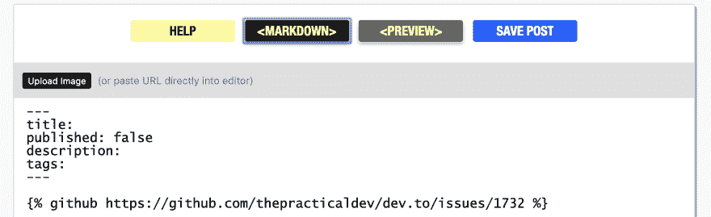
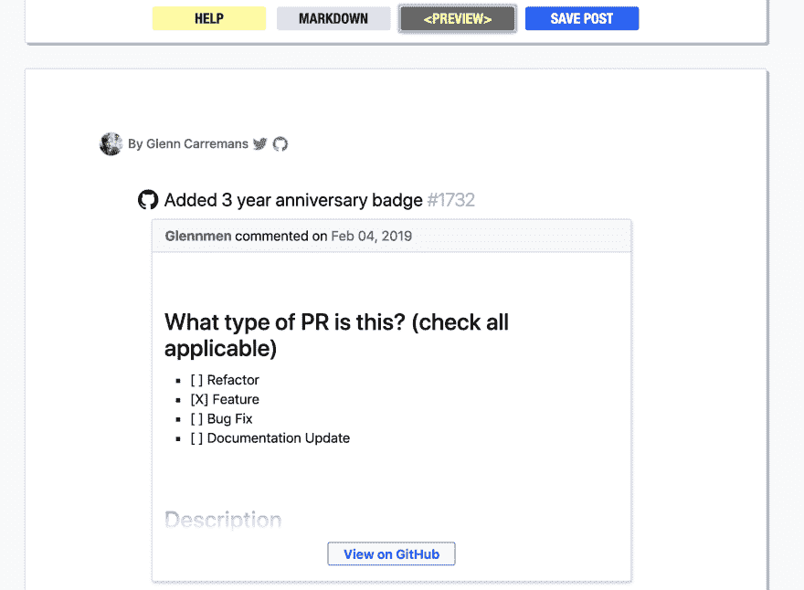
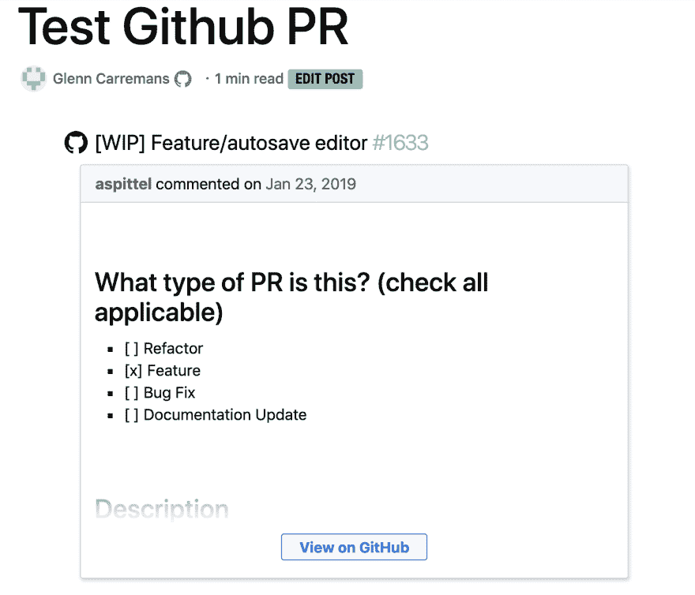

# 变更日志:Github PR 液体标签支持

> 原文：<https://dev.to/glennmen/changelog-github-pr-liquid-tag-support-3m1b>

上周，我在 Github 上发表了一个问题，认为 Github liquid 标签有一个错误，因为当我试图嵌入 Github Pull 请求时，它给了我一个错误。

# [ 错误 Github PR Embed# 1760](https://github.com/thepracticaldev/dev.to/issues/1760)

 **[Glennmen](https://github.com/Glennmen)** posted on [<time datetime="2019-02-07T20:58:25Z">Feb 07, 2019</time>](https://github.com/thepracticaldev/dev.to/issues/1760)

**您的功能请求是否与某个问题相关？请描述一下。**当试图嵌入 Github PR 时，显示一条错误消息:`Invalid Github Repo link`

**描述您想要的解决方案** Github Pull 请求也应该像 Github 问题一样正确嵌入。

**描述你考虑过的替代方案**在 url 中用`issues`替换`pull`是一个肮脏的变通方法，我假设在 Github 链接验证器中添加`/pull/`应该足以增加对此的支持。

**附加上下文**

*   PR 网址错误: 

*   使用变通方法时没有错误: 

*   应用变通方法后的正确结果: 

[View on GitHub](https://github.com/thepracticaldev/dev.to/issues/1760)

然后， [@andy](https://dev.to/andy) 告诉我这实际上不是一个错误，而是 Github liquid 标签不支持 PR URL。对我来说这很奇怪，因为 Github 的问题和 PR 非常相似，我希望 liquid 标签也能支持它。

* * *

周日我开始设置我的 Ruby 环境，我以前没有使用 Ruby 的经验，所以这是一个挑战，但是有了 Google 和遵循 [DEV 安装文档](https://docs.dev.to/installation/mac-os/)，我能够让它全部启动并运行。
然而，当我在`config/application.yml`中得到错误时，我感到困惑，我完全按照文档中的说明复制了样本文件，但我不知道你必须删除空的/未使用的配置变量。

从那以后，我开始不断地修改。这更多的是一种尝试和错误，而不是实际的开发，我不得不看看如何在 Ruby 中完成简单的事情，也做了很多尝试(改变一些东西，看看会发生什么，大部分都坏了，哈哈)。最终我得到了预期的结果，而且我似乎没有打破 Github 液体标签的旧习惯。所以在这一点上，我对自己相当满意，称之为成功。

* * *

现在(对我来说)最大的惊喜是当我试图提交时，Husky lint-staged pre-commit hook 运行了代码，并给了我错误。现在你可能会想为什么这是一个惊喜？每个人以前都有过构建/lint 失败的经历。最令人惊讶的是，它给了我一些我从未接触过的代码错误。

所以我假设过去有人使用`--no-verify`提交变更，而没有运行预提交钩子，也没有遵循项目标准。我修复了大部分错误，但有一个问题是，当我将代码块更改为有效的 html(以解决错误)时，它将解析 html，而不是在代码块中显示它，这可能是那个人跳过预提交挂钩(以及之后每个人)的原因。

* * *

最后，尽管这是一个小小的改变，但我很高兴我能够做这个公关，并再次为开发社区做出贡献，我希望人们认为这是一个有用的改变，并将在他们的帖子中使用它。

*现在我在等待，直到拉请求被审查和合并，这样我就可以发布这篇文章，而不会出现`Invalid Github Repo link`错误。*

``

# [ 新增 GitHub PR 液态标签支持 #1784](https://github.com/thepracticaldev/dev.to/pull/1784) 

 **[Glennmen](https://github.com/Glennmen)** posted on [<time datetime="2019-02-11T18:39:37Z">Feb 11, 2019</time>](https://github.com/thepracticaldev/dev.to/pull/1784)

## 这是什么类型的公关？(勾选所有适用选项)

*   [ ]重构
*   [x]功能
*   [ ]错误修复
*   [ ]文档更新

## 描述

通过 markdown 中的 liquid 标签添加对 Github pull 请求的支持。``

这是我第一次设置 Ruby 环境，并在 Ruby 中进行实际开发，所以请告诉我，我是否应该以不同的方式来做事情。

我还修复了几个预提交错误，奇怪的是抛出的错误来自我没有编辑的部分。所以我假设很多人用`--no-verify`跳过提交前检查。无论如何，我无法修复的唯一错误是这一部分，因为它将解析 html 而不是在代码块中显示它:[https://github . com/thepracticaldev/dev . to/blob/7c 369 facf 183 FB 236 f 47333 e 0 Fe 913 e 565 b 12d 2 a/app/views/pages/_ editor _ guide _ text . html . erb # L192-L194](https://github.com/thepracticaldev/dev.to/blob/7c369facf183fb236f47333e0fe913e565b12d2a/app/views/pages/_editor_guide_text.html.erb#L192-L194)

## 相关车票&单据

关闭#1760

## 手机&桌面截图/录音(如有 UI 改动)

## 添加到文档中？

*   降价编辑器中的[x]帮助选项卡
*   [ ]文档开发到
*   [ ]自述文件
*   [ ]不需要文档

## 【可选】哪个 gif 最能描述这个 PR 或者给你的感觉？

[View on GitHub](https://github.com/thepracticaldev/dev.to/pull/1784)

* * *

你对预提交钩子有什么看法？它应该被删除(因为人们似乎已经跳过了)还是应该更严格地执行？也许开发团队的某个人可以对此发表评论并展开讨论。