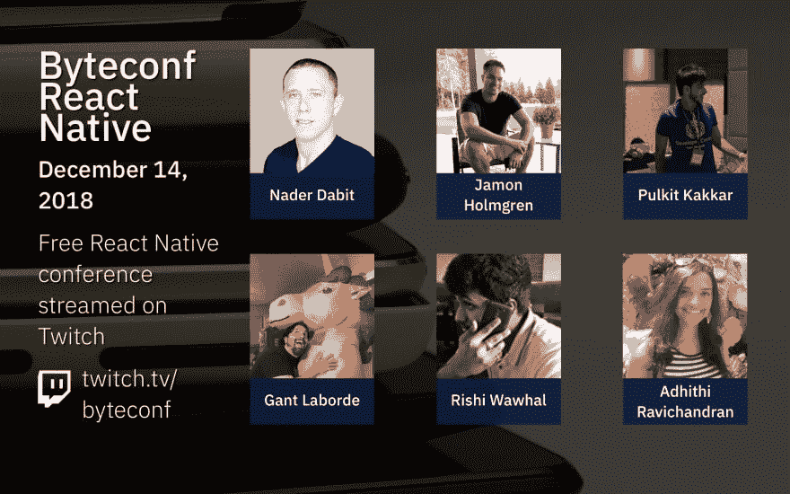

# Byteconf React Native 将于 12 月推出——这是一个为期一天的免费 React Native 会议，在 Twitch 上播放

> 原文：<https://dev.to/bytesizedcode/check-out-byteconf-react-native---a-free-one-day-react-native-conference-streamed-on-twitch-1nbe>

嘿大家好！

几个月前，我与 dev.to 社区分享了一个免费的 React 会议。我非常兴奋地分享我们的下一个大事件: **Byteconf React Native，将于 2018 年 12 月 14 日举行**。

Byteconf 会议在 Twitch 上播放，可以免费参加。同样地，我们试图建立一个地方，让开发人员可以学习和成长他们的技能和职业生涯！(BTW，我是 dev.to 的超级粉丝——嗨 Ben 和 Jess！👋👋)

Byteconf React Native 会带六个(！)来自世界各地的优秀演讲者聚集在一起，谈论诸如 React Native、GraphQL 和 AWS Amplify 等工具，以及对 AR/VR、机器学习等的探索。这是一个有趣的各种经验水平的讲座阵容:无论你是一个经验丰富的 React 本地开发人员，还是还没有编写一行 RN 代码，我们都希望你能参加。

Byteconf 会议总是免费的，并通过我们的 Twitch 在线播放、[。我们还会在](https://www.byteconf.com/s/twitch)[我们的 YouTube 频道](https://www.byteconf.com/s/youtube)上发布这些视频:请务必关注我们！

现在是时候介绍我们的演讲者了——确保在 Twitter、GitHub 等网站上关注他们:在过去的几周里，我已经有幸与他们聊过他们的演讲，我很高兴能与他们一起工作。

[**纳德达比特**](https://twitter.com/dabit3) [将](https://www.byteconf.com/nader-dabit)返回给 Byteconf，帮助我们完成**使用 React Native & AWS** 构建实时离线就绪的移动应用。

[**贾蒙·霍尔姆格伦**](https://twitter.com/jamonholmgren) 将在他的演讲**中向我们展示他改善 React 原生 CLI 体验的项目 Ignite** 。

[**Gant Laborde**](https://twitter.com/GantLaborde) 将会给我们写机器学习的“为什么”和“如何”与 React Native，与他的对话**笼子对抗机器**。

[**Pulkit Kakkar**](https://twitter.com/pulkitkkr0) 将通过他的演讲向我们展示如何在 React Native 内部构建 VR 和 ar 应用**沉浸式跨平台 AR &使用 React-Native 的 VR 用户体验**。

[**阿迪西·拉维钱德拉**](https://twitter.com/AdhithiRavi) 将通过她的演讲**构建 React 原生应用——我在途中学到的 10 件事**，为我们概述编写 React 原生应用的最佳实践、技巧和诀窍。

[**Rishichandra Wawhal**](https://twitter.com/_rishichandra)将在他的演讲**中讨论如何在 React Native apps** 中使用 GraphQL 来提高开发者体验和生产力。

**Byteconf React Native 发生在 2018 年 12 月 14 日。**如果你想在会议前加入社区，请查看[我们的不和](https://www.byteconf.com/discord)！我们有来自世界各地的开发人员谈论编程、开发人员生活等等。

最后，如果您的公司正在招聘 React 本地开发人员，或者您想向全球活跃的开发人员群体展示您的产品，请考虑成为会议的赞助商！您可以在我们的赞助页面上找到更多详细信息。