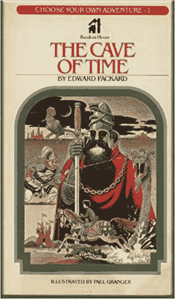

# 选择你自己的冒险

> 原文：<https://dev.to/leekeith/choose-your-own-adventure-5ak0>

## 允许我自己介绍...我自己

这是我在 dev.to 上的第一篇帖子，我想我应该说几句关于我自己的话。我是一名电脑工程师。我在一家叫 Gumstix 的硬件设计公司工作。我开始从事 maker 式的项目，开发兼容 Arduino 的嵌入式 Linux 产品，并为我们的在线设计工具开发后端自动化服务。

我是三个孩子的父亲，一个丈夫，一个兄弟和一个儿子。我是多方面的，但最重要的是，我总是在学习和发现。

在这个社交媒体平台的背景下，我一直在学习如何成为一名更好的开发者。我从小就开始断断续续地研究这个。

## 早期开端

振作起来，我要和自己约会了。

我父母在我 7、8 岁的时候买了我们的第一台个人电脑。这是一台二手 IBM PCjr，棒极了！我们有 Lotus AmiPro 和 123，数学历险记和洛基的靴子！你会相信吗？你可以输入一个转义序列来加载一个很酷的内置打字游戏。你按下一个键，这个看起来像马里奥的小家伙就会下来，从屏幕上的键盘上拿走它。

[https://www.youtube.com/embed/hkhDaD2zwzk](https://www.youtube.com/embed/hkhDaD2zwzk)

我不太确定我在那块特殊的小宝石上积累了多少时间，但确实很多。

但是有一件事，我最有兴趣在这里讨论，就是**基础**。现在 BASIC 是这种编程语言*(纯粹主义者会认为它是一种脚本语言。【T4 呻吟声】。即...嗯，基本的。来，让我给你展示一下必修课`Hello World`。*

```
10: CLS
20: PRINT "Hello World!"
30: INPUT "Continue"; in$
40: IF in = "y" OR in = "Y" THEN GOTO 20
50: END 
```

Enter fullscreen mode Exit fullscreen mode

*对了，`INPUT`行的分号会保证在`Continue`后插入一个问号。

现在看来，这一切都是在*万维网*出现之前，除了用户手册和我妈妈的编程知识*(她还没有告诉我这些，但当她在大学时，她用穿孔卡和 FORTRAN 编程)*，我没有任何东西可以帮助我。但我还是挺过来了。

## 冒险

那么，一个三年级学生计划做什么呢？游戏！我在一学年的大部分时间里给一些很棒的孩子当家教，发现了一个重要的细节:你不能让一个 8 岁的孩子相信让 LED 闪烁就像让一只小猫在屏幕上跳来跳去一样令人满意。所以我试着做了一些游戏。

现在，当我在小学的时候，“选择你自己的冒险”的书真的很受欢迎。现在你不得不去二手书店的角落里找一本。这些天我还没遇到过 20 岁以下听说过他们的人。

那么它们是如何工作的呢？

[](https://res.cloudinary.com/practicaldev/image/fetch/s--PmAgkeSS--/c_limit%2Cf_auto%2Cfl_progressive%2Cq_auto%2Cw_880/https://images-na.ssl-images-amazon.cimg/I/511a-0534PL._SX291_BO1%2C204%2C203%2C200_.jpg)

大概是这样的:

1.  翻到第一页，读这个故事
2.  在这一页的底部，将会有一个决定。
3.  对于每个选择，都有一个相关联的页面，显示您的决策结果和另一组选择。
4.  重复，直到您:
    *   完成这个故事
    *   在与洞穴巨魔的可怕战斗中迎接你的死亡

这有点像“虚构的编程语言”

所以在读完学校图书馆里的每一本书后，我决定用 BASIC 语言写一本。

### 准备工作

好的，现在我是三年级学生，所以我的计划阶段是这样的:

“好吧，让我们做这个游戏。它开始了...在空荡荡的豪宅里！”

检查！

“太好了，我们来编码吧！”

完成了。

### 发展

请允许我提醒我的听众，这一切都发生在源代码管理和互联网出现之前，事实上，也就是商用硬盘出现之前。我的进度必须保存在 5.25 英寸的软盘上。记得那些吗？基本的“IDE”(如果你可以这样称呼它的话)在外观和操作上与 *nano* 相似，完全没有上下文突出显示，没有调试器，完全没有帮助。一个简单的老式文本编辑器。

我开始编码，从一些打印语句开始。(实际出处早就没了。即使我保留了存储它的磁介质，它现在也已经消磁了，所以任何代码都会被解释。)

```
1  PRINT "    The Something Something Mansion"
2  PRINT "    -------------------------------"
3  PRINT "By Keith" 
```

Enter fullscreen mode Exit fullscreen mode

因此，在这一点上，我看着我的代码，并将其与我在 PCjr 用户手册中看到的进行比较，我在想:“这是可行的，但他们所有的行都以 10、20、30 等开始。我不明白……”

我继续说:

```
4  PRINT "You are standing at the closed front door.  There is a doorbell and a newspaper here."
5  PRINT "you can [O]pen the door, [P]ick up the newspaper, [R]ing the doorbell."
6  INPUT "What do you do"; action 
```

Enter fullscreen mode Exit fullscreen mode

在这一点上，我意识到我需要在可能的行动列表之上的另一行描述。因此...我回去写更多。

```
5  PRINT "Something something blah blah loreum ipsum..." 
```

Enter fullscreen mode Exit fullscreen mode

或者类似的东西。“哦，不，”我想，“现在我必须改变下两行的数字！”然后我明白了...这就是为什么线上升了十个！那样的话，我可以给这条新线编号`41`,而不用碰其他两条线。所以我修正每一行并继续下去。在这个过程中，我面临着条件句、分支、创建库存系统等挑战。我在游戏中走得足够远，花了 15 分钟才完成游戏，它有几个“死胡同”和一个交替的结局。

很好，如果我自己这么说的话。我不确定我给其他人看过。

## 要进一步探索这个新的数字世界，请翻到第 55 页

在我小学余下的日子里，我涉猎。我熟读了 C 语言编程，编写了一些小玩具程序，还参加了一门关于 Turbo Pascal 的课外课程(我再也没用过它)，并广泛吸收了编程知识。

在这段时间里，我还开始拆卸和重新组装电脑，对硬盘驱动器的外观、CPU 的安装支架如何工作、IDE 电缆的作用(前 SATA 驱动器连接器电缆)等感到好奇。我安装了 PCI 声卡、AGP 视频卡、前置 USB 接口和冷阴极照明。

我正在拆卸遥控汽车，用更大的扬声器重新连接唱歌的生日贺卡(为什么？当然是为了激怒我的父母！).我会折磨 Windows 3.1，然后 95，直到它崩溃，然后玩它，直到它再次工作。我对科技、电脑和视频游戏的各个方面都很适应。

一路上，互联网来到我家。我父母确保我们很早就上船了。你们中的一些人可能还记得以 14.4 Kbps 的速度搜索*网络爬虫*寻找超级马里奥世界的提示和秘密是多么痛苦。每次电话响的时候，你都得等妈妈挂了电话再拨。

## 未完待续...

我的起源故事到此结束。我希望你喜欢它。在我成为今天的软件工程师的漫长旅程中，我一定会在某个时候对它进行补充，并努力让大众跟上时代。在那之前，继续吧...