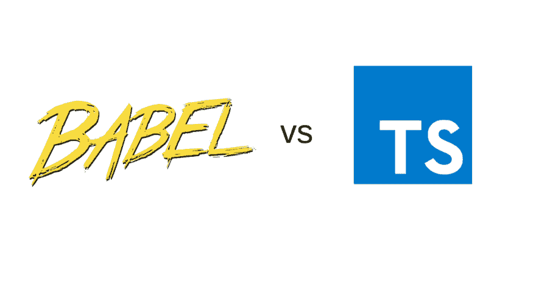

# 在巴别塔和打字稿之间选择

> 原文：<https://dev.to/bnevilleoneill/choosing-between-babel-and-typescript-1lja>

[](https://res.cloudinary.com/practicaldev/image/fetch/s--ubIVOjwC--/c_limit%2Cf_auto%2Cfl_progressive%2Cq_auto%2Cw_880/https://cdn-images-1.medium.com/max/1024/1%2A_5aQ6zHEfTrrNP_rohrkSQ.png)

Babel 7 大约在六个月前发布，内置了 TypeScript 语法支持。这意味着使用 Babel 的项目现在可以使用 TypeScript，而不需要用 TypeScript 编译器来复杂化它们的构建。

但是使用 Babel 和使用 TypeScript 编译器有什么区别呢？你的下一个项目应该使用 Babel 还是 TypeScript？

[](https://logrocket.com/signup/)

### 巴别塔和打字稿的区别

使用 TypeScript 和将 TypeScript 与 Babel 一起使用有一些主要区别。

在这篇文章中，我们将看看四个最重要的区别。

#### 1。没有类型检查

巴贝尔不关心你的花式打字稿类型。它只是把它们扔进垃圾桶，而不检查它们是否正确。下面的例子用 Babel 编译时没有任何错误或警告，但用 TypeScript 编译时没有:

```
const myCoolString : string = 9; 
```

*9 绝对不是一串巴别塔。*

移除类型对于您希望代码编译的快速原型开发来说是非常好的，即使您的类型不是正确的。

如果你正在努力输入东西，在某些时候你可能会想检查它们是否正确。幸运的是这没什么大不了的。您可以让您的编辑器来处理它，或者运行 TSC-no MIT 来检查您的项目，而不编译任何东西。

#### 2。常数枚举

默认情况下，TypeScript 一次编译整个项目，而 Babel 一次只编译一个文件。

这意味着 Babel 不支持需要读取多个文件的 TypeScript 特性。好消息是没有太多的功能。最普遍的可能是常数。

const 枚举是 TypeScript 编译成 nothing 的枚举。我们来看看怎么用，transpiled 的代码是什么:

```
// This is the const enum. Notice the const in front.
const enum FRUITS {
   APPLE = 'APPLE',
   PEAR = 'PEAR',
}

if (someString === FRUITS.APPLE){
   console.log("This is an apple!"
} 
```

编译后的代码是这个非常短的片段:

```
if (someString === "APPLE" /* APPLE */) {
   console.log("This is an apple!");
} 
```

嘭！整个枚举结构都消失了，TypeScript 只是简单地内联了水果。苹果对“苹果”的价值。

但是，如果我们导出这个常量枚举并试图在另一个文件中使用它，会发生什么呢？巴别塔不能内嵌水果。苹果从另一个文件，因为它一次只能访问一个文件。相反，它只会抛出一个错误。

这不是太严重的限制。Const enums 通常只用于优化正则 enum 的性能，Babel 对此支持得很好。除非你绝对确定你需要额外的果汁，否则我不会太担心这个。

#### 3。装饰者&元数据

TypeScript 对装饰者来说有点早(如果你不确定装饰者是什么，[这个](https://www.sitepoint.com/javascript-decorators-what-they-are/)是一个很好的介绍)。在 TypeScript 实现 decorator 之后，decorator 提案已经更改了多次，但仍然没有最终确定。

这意味着目前 ECMAScript 规范和 TypeScript 在装饰者应该如何表现的问题上没有达成一致。Babel 的插件遵循 ECMAScript 规范，这意味着 Babel 不会像 TypeScript 那样编译 decorators。幸运的是，Babel 有一个遗留模式，用旧的行为来编译装饰者。

只需添加巴别塔插件

`“@babel/plugin-proposal-decorators”`

将`legacy`选项设置为 **`true`** 。

然而，有一个装饰器特性是 TypeScript 提供的，而 Babel 没有: **emitDecoratorMetadata** 。

TypeScript 通常会清除所有类型信息，使其在运行时不存在。emitDecoratorMetadata 是一个为应用了装饰器的类和方法保留类型的特性。

在运行时拥有该类型允许我们做各种各样有趣的事情，比如依赖注入，以及将 TypeScript 类型映射到 SQL 数据库中的类型。

该特性在这两个领域得到了大量使用，诸如 TypeORM、TypeGoose、inversifyJS 等库，甚至 Angular 的依赖注入系统都依赖于该特性。

缺少 emitDecoratorMetadata 可能是我使用 Babel 的最大问题。依赖于这个特性的一些库非常有用，但是你不能在 Babel 中使用它们。

#### 4。自定义转换

Babel 比 TypeScript 更具可扩展性。有大量的插件可以优化你的代码，帮助你去除无用的输入，内联常量等等。

虽然 TypeScript 有自己的 Transformer API，允许自定义转换，但 Babel 生态系统在插件选择方面更丰富，也更容易访问。

如果你需要自定义转换，你需要使用巴别塔。好消息是，大多数 TypeScript 工具都允许您同时使用 TypeScript，然后通过 babel 运行代码，这样可以两全其美。但是这显然会增加构建链的复杂性。

### 其他不兼容&不一致

还有一些其他的不兼容性，主要与语法限制和遗留的 TypeScript 特性有关。他们不应该成为任何人的障碍，但他们在这里的公告中列出了。

#### 表现

我试图用 TypeScript 和 Babel 7 编译一个 React 应用程序，无论是实时重载还是从热缓存，我都无法看出任何显著的差异。基准测试是针对 [ts-loader](https://github.com/TypeStrong/ts-loader) 进行的，它在历史上是两个 web pack TypeScript 加载器中最慢的(另一个是[awesome-TypeScript-loader](https://github.com/s-panferov/awesome-typescript-loader))。

当然，任何试图配置 webpack 的人都知道，JavaScript 工具链非常复杂。你有源映射插件，缓存，选择你应该使用多少线程——还有很多。没有一个简单的基准可以考虑全部情况，但是如果您期望使用 Babel 比使用 TypeScript 编译器有多倍的性能提升，您将不得不从其他地方寻找性能提升。

#### 你该选择什么

和许多 JavaScript 开发人员一样，我喜欢闪亮的新事物。当我开始写这篇文章时，我希望切换到 Babel 既能简化我们的构建链，又能提供一个更高性能的构建，而且缺点很少。

不幸的是，我的结论恰恰相反。没有显著的性能改进，而且负面影响也比我最初预期的要大得多。

特别是，Babel 没有发出装饰元数据对我来说是一个巨大的障碍。仅仅因为这个原因，如果你有一个正在运行的 TypeScript 项目，我不建议你转而使用 Babel。

如果您刚刚开始使用 TypeScript，或者您希望逐步迁移一个项目，那么 Babel 可以作为训练轮。在某些时候，你可能会想把辅助轮拿掉。

如果您需要一些只有 Babel 提供的自定义转换，最好的构建管道仍然是将 TypeScript 文件传递给 TypeScript 编译器，然后再传递给 Babel。

对我来说这有点太复杂了，但是嘿——没有人说过 JavaScript 构建工具链是容易的。

你有使用 TypeScript 和 Babel 的经验吗？我很想听听。 [*@GeeWengel*](https://twitter.com/GeeWengel)

* * *

### Plug: [LogRocket](https://logrocket.com/signup/) ，一款适用于网络应用的 DVR

[](https://logrocket.com/signup/)

<figcaption>[https://logrocket.com/signup/](https://logrocket.com/signup/)</figcaption>

LogRocket 是一个前端日志工具，可以让你回放问题，就像它们发生在你自己的浏览器中一样。LogRocket 不需要猜测错误发生的原因，也不需要向用户询问截图和日志转储，而是让您重放会话以快速了解哪里出错了。它可以与任何应用程序完美配合，不管是什么框架，并且有插件可以记录来自 Redux、Vuex 和@ngrx/store 的额外上下文。

除了记录 Redux 操作和状态，LogRocket 还记录控制台日志、JavaScript 错误、堆栈跟踪、带有头+正文的网络请求/响应、浏览器元数据和自定义日志。它还使用 DOM 来记录页面上的 HTML 和 CSS，甚至为最复杂的单页面应用程序重新创建像素级完美视频。

免费试用。

* * *

帖子[在巴别塔和打字稿之间选择](https://blog.logrocket.com/choosing-between-babel-and-typescript-4ed1ad563e41/)最先出现在[博客](https://blog.logrocket.com)上。