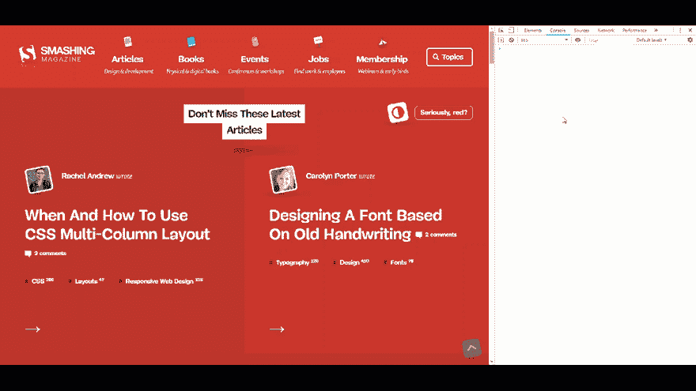
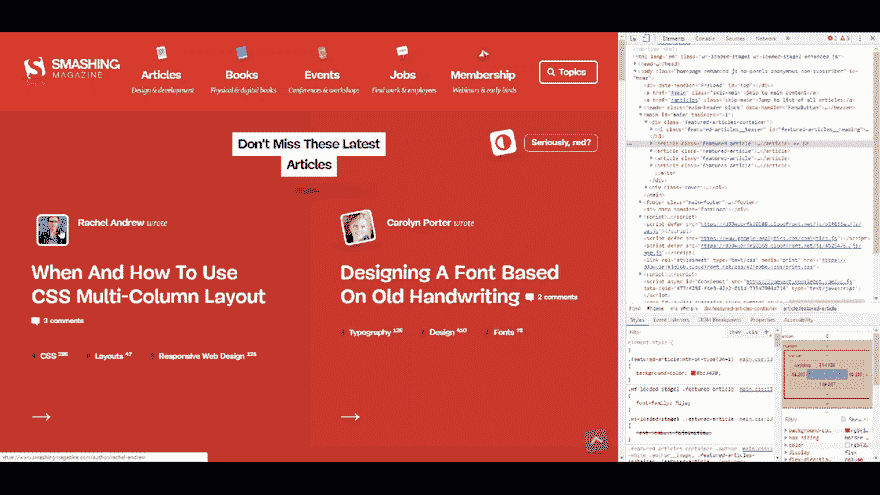
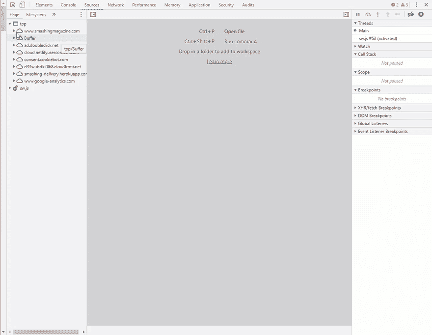
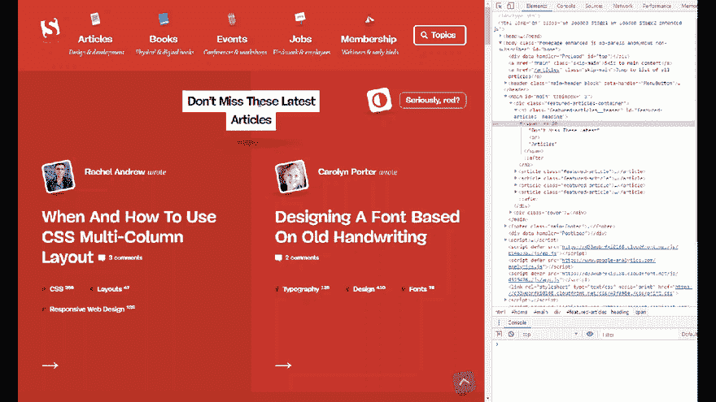
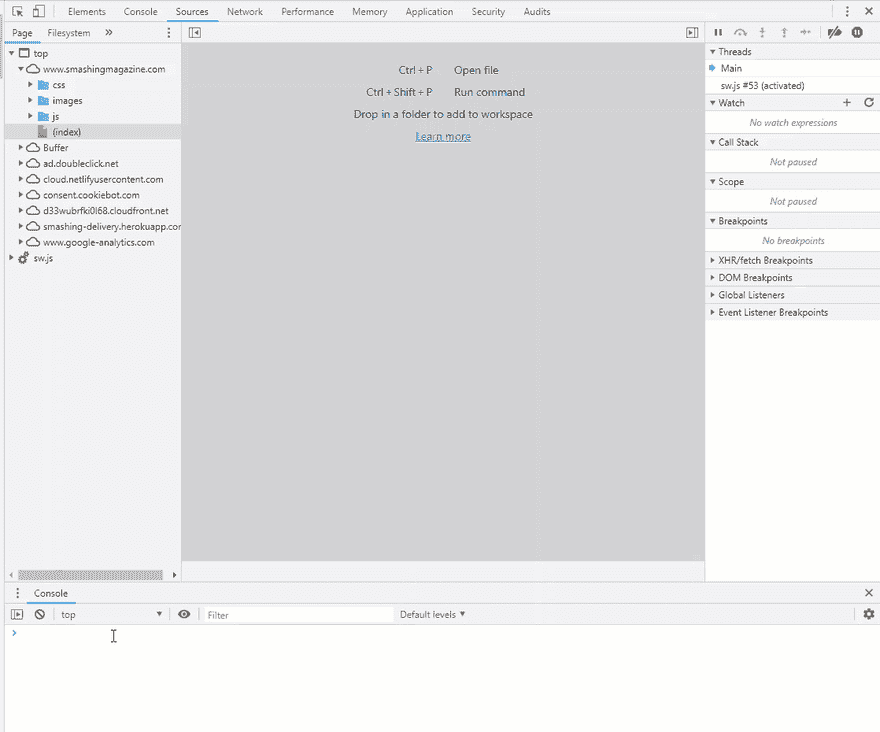
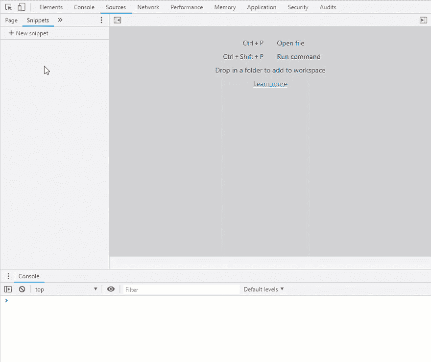
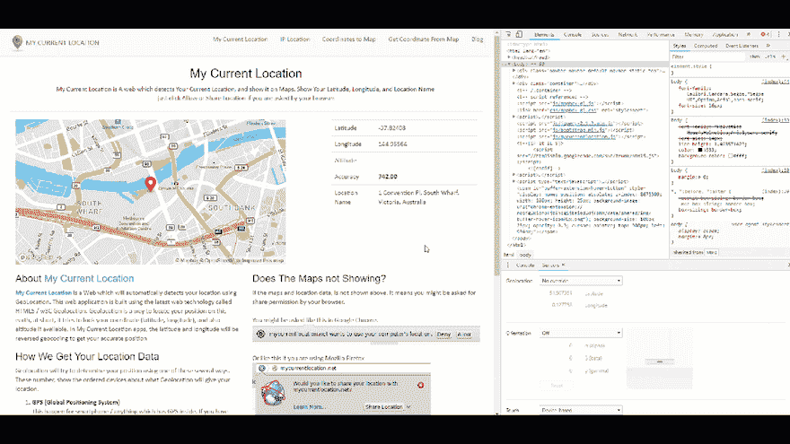

# Chrome DevTools 能做到？

> 原文：<https://dev.to/yashints/chrome-devtools-can-do-that-4a8l>

Google Chrome 是目前开发者使用的最流行的浏览器之一。 [Chrome DevTools](https://developers.google.com/web/tools/chrome-devtools/) 可以帮助你在浏览器中开发、测试和调试你的网站，从而极大地改善你的工作流程。

然而，有很多我们不知道的提示和技巧可以帮助我们更进一步。仅仅因为我们在菜单中没有看到它们，并不意味着我们不应该使用它们来提高我们的生产力。

所以我从[伯克·霍兰德](https://twitter.com/burkeholland)和[莎拉·德拉斯纳](https://twitter.com/sarah_edo)的 [VS 代码可以做](https://vscodecandothat.com/)系列中得到灵感，并决定在这里写下这些。希望它能帮助你，就像它每天帮助我和许多其他人一样👌。

你准备好了吗？我们开始吧:

## 屏幕截图

您可以捕获整个页面的屏幕截图或屏幕中的内容，而无需任何扩展。只需按下`CTRL` + `Shift` + `P`用于 windows，按下`Cmd` + `Shift` + `P`用于 Mac 用户，打开命令托盘，键入`screenshot`即可看到三个选项的菜单:

*   捕捉全尺寸截图
*   截图
*   捕获节点屏幕截图

选择这些选项中的任何一个都会将网站的图像保存到您的计算机上。

## 在元素面板中拖拽

我直到上周才知道，这太棒了。你可以将元素拖放到元素面板中任何你想要的地方，它会反映页面中的变化。如果你想快速看到一些小的变化，这是非常好的。

## {漂亮打印}缩小版源代码

有时您希望看到源代码像原始代码一样格式化。这对于 CSS 规则或代码来说更有意义。这个内置特性在调试 CSS 规则时节省了我一些时间。只需按下页面底部的`{}`。

## 引用控制台中选中的元素

有时，您可能希望使用 JavaScript 操作元素，而不是在元素面板中更改 HTML。

## 观看表情

很多时候你想观察一个特定的表情，看看它在特定的环境下是如何变化的。这真的很简单，只需将表达式添加到 watch 部分:

正如你看到的，你可以看到最后一个使用`$_`的表达式。

## 片段

我们都有一些反复使用的代码。从点击处理程序的模板到文档就绪函数，它可以是任何东西。这就是代码片段部分派上用场的地方。你可以储存一个片段，并很容易地使用它。只需打开片段部分，点击`new`。写下您的代码片段，无论何时您想使用它，windows 用户按下`Ctrl` + `Enter`，Mac 用户按下`Cmd` + `Enter`，或者右击并按下`run`。'

## 覆盖位置

如果您正在编写一个 web 应用程序，其中的信息取决于用户的位置，那么您可能希望检查该应用程序在用户的位置方面的行为是否符合预期。这就是 Chrome DevTools 中位置覆盖非常有用的地方。只需按下`Ctrl` + `Shift` + `P`用于 windows，按下`Cmd` + `Shift` + `P`用于 Mac 用户，打开命令托盘，键入`sensors`，然后从覆盖位置下拉列表中选择不同的位置。如果你有的话，你甚至可以设置一个自定义的纬度和经度。

## 编辑屏幕上的任何文本

有时你有一个有限的宽度，想看看一个长文本在页面上是什么样子。或者您只是检查文本是否足够长，省略号是否出现。Chrome DevTools 有一个名为设计模式的功能，你可以在控制台中设置它，然后更改任何你想要的文本，并动态观察这些更改。超级酷吧？😎

这个帖子到此为止。留意下一个帖子👀。