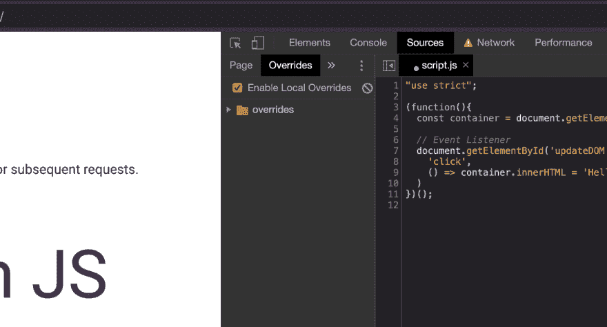

# Chrome DevTools:内容覆盖

> 原文：<https://dev.to/apvarun/chrome-devtools-content-overrides-3e79>

你调试过生产中的 bug 吗？或者进行多次部署来验证一个特定问题？

Web 开发人员可能会遇到或已经遇到过无数次这样的情况。所以，让我们来看看如何用 Chrome DevTools 缓解这种情况。

为了找出问题，可以在代码中断之前记录值，或者更进一步，在几行之前添加断点，更新中断的代码并继续执行。(特别是对于在页面加载时运行的代码)

> 是的，这是一种痛苦！

但是，还有另一种更简单的方法。

Chrome 在其源代码面板中支持一个名为覆盖的功能。该功能允许用您自己的副本覆盖从网络接收的任何文件。

为了使用这个，

*   你必须在本地机器上为 chrome 选择一个文件夹来保存文件的修改版本
*   一旦选中，编辑任何文件并点击 *CMD + S* 或 *Ctrl = S* 将文件保存到覆盖文件夹

文件保存后，重新加载页面，以便 chrome 可以在页面加载时使用被覆盖的文件。这有助于您在推出修复之前，在生产中修改和测试代码。🥳

*预览(覆盖文件内容):*
[https://www.youtube.com/embed/yI-id_VukJk](https://www.youtube.com/embed/yI-id_VukJk)

**亲自尝试** [课程:内容优先](https://learndevtools.now.sh/docs/guides/sources/3.-content-overrides/)(演示页面)

您也可以复制下面的 repo 并在您的本地机器上运行。

## [apvarun](https://github.com/apvarun) / [学习工具](https://github.com/apvarun/learndevtools)

### 使用 DevTools 更好地调试

<article class="markdown-body entry-content container-lg" itemprop="text">

# 学习开发工具

用于学习在浏览器中使用开发人员工具的演练集合。在这里阅读更多

## 入门指南

访问[https://learndevtools.now.sh/](https://learndevtools.now.sh/)了解并尝试 devtools 的各种功能，帮助您提高工作效率。

## 贡献的

欢迎拉取请求。对于重大更改，请首先打开一个问题，讨论您希望更改的内容。

## 许可证

麻省理工学院

</article>

[View on GitHub](https://github.com/apvarun/learndevtools)

Previous Post: [Logging Without console.log](https://dev.to/apvarun/chrome-devtools-logging-without-console-log-2b7i)