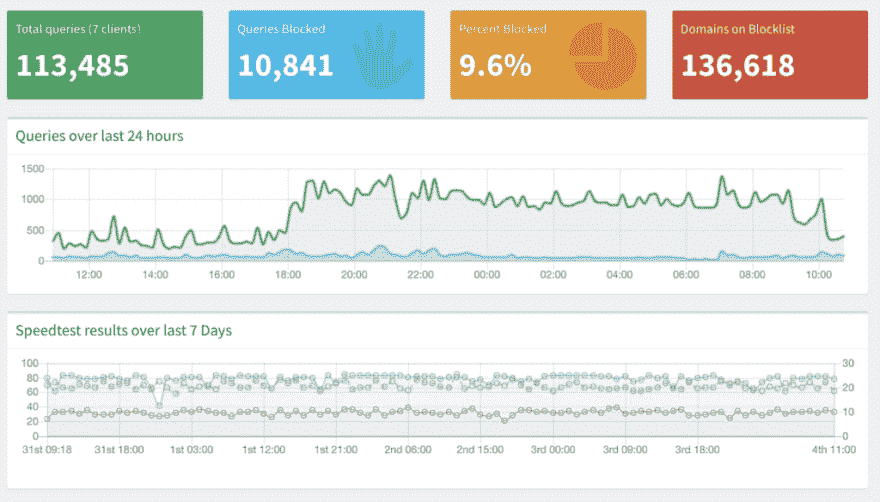
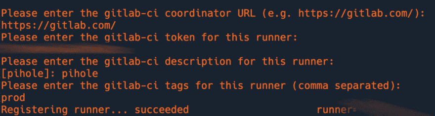
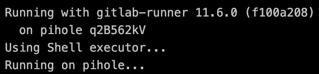

# CI/CD 所有的东西:PiHole

> 原文：<https://dev.to/olearycrew/ci-cd-all-the-things-pihole-4023>

<figure>[](https://res.cloudinary.com/practicaldev/image/fetch/s--kvjy7qw1--/c_limit%2Cf_auto%2Cfl_progressive%2Cq_auto%2Cw_880/https://cdn-images-1.medium.com/max/1024/0%2A5kVeCxUk4wY4Ge4g) 

<figcaption>照片由 [rawpixel](https://unsplash.com/@rawpixel?utm_source=medium&utm_medium=referral) 上 [Unsplash](https://unsplash.com?utm_source=medium&utm_medium=referral)</figcaption>

</figure>

### CI/CD 所有的东西:Pi-hole

我花了一些时间探索如何将 CI/CD 的概念应用到日常生活中。在[我的第一篇帖子](https://dev.to/olearycrew/ci-cd-all-the-things-introducing-auto-breakfast-from-gitlab-sort-of-ldn-temp-slug-5187764)中，我全力以赴——在 GitLab CI/CD 的指挥下做早餐。在这篇文章中，我将告诉你我在假期中进行的一个家庭项目:在我家建造一个[pie-hole](https://pi-hole.net/)并运行。(mmmm🥧)

Pi-hole 是一个很棒的小型[开源](https://github.com/pi-hole)工具，可以让您在网络上运行自己的 DNS 服务器，并向 0.0.0.0 的“黑洞”发送广告和跟踪请求，提供网络级广告拦截…而不是在家里的每个设备、浏览器和物联网项目上安装广告拦截器。

Pi-hole 甚至附带了一个很棒的仪表板，并且有许多扩展点可以定制它。我增加了一个每小时速度测试，只是为了让我的 ISP 保持诚实😉。

<figure>[](https://res.cloudinary.com/practicaldev/image/fetch/s--VckF299R--/c_limit%2Cf_auto%2Cfl_progressive%2Cq_auto%2Cw_880/https://cdn-images-1.medium.com/max/1024/1%2AwwR_IBlOfTguthA00Ha7bQ.png) 

<figcaption>PiHole 仪表盘带 Speedtest 插件</figcaption>

</figure>

### 安装墩孔

安装 Pi-hole 相对简单，有[简单明了的指令](https://github.com/pi-hole/pi-hole/#method-1-clone-our-repository-and-run)，我唯一需要注意的是 DHCP。由于我的路由器为家长控制提供了来自 Disney 的 Circle，它必须保留 DNS/DHCP 服务器，但我仍然可以将其上游 DNS 映射到 Pi-hole。这意味着我失去了日志中的一些粒度，因为大多数请求来自我的路由器，而不是单个设备，但是一旦我设置好了，Pi-Hole 就按设计工作了。

### Pi-hole 的源控制

对于 Pi-hole 有很多很好的资源，包括像[通常被列入白名单的域](https://discourse.pi-hole.net/t/commonly-whitelisted-domains/212)这样的东西，以确保一些一般服务不会受到它的负面影响。互联网上还有许多[附加黑名单](https://firebog.net/)，这取决于你关注的内容。而且，由于 [FTL](https://github.com/pi-hole/FTL) 是可扩展的，它甚至有可能被用作一个轻量级的本地 DNS 服务器。

因为所有这些元素都以这样一种方式呈现，“这是你如何在终端中运行一个命令，”或者“这是你如何在 UI 中添加它，”我的内部“必须对所有事情进行源代码控制”标记被激活了…所以我[在 GitLab](https://gitlab.com/olearycrew/pihole/) 上创建了一个存储库。

我添加了几个脚本来自动化公共和自定义域的白名单，还添加了一个文件来包含我的网络上的主机。但是这仍然意味着我必须在我的 Raspberry Pi 上手动检查存储库并手动运行脚本。这就是 [GitLab CI/CD](https://about.gitlab.com/product/continuous-integration/) 的用武之地！幸运的是，它在我们的免费层上可用，因为我用我的[个人账户](https://gitlab.com/oleary)做所有这些，而我在度假时用的是[。](https://about.gitlab.com/handbook/paid-time-off/#a-gitlabbers-guide-to-time-off)

### 启用 CI/CD 至 Pi-hole

现在我已经有了一个现成的存储库，我只需要两步就可以访问我的小心脏所渴望的所有 CI/CD。

1.  让我的树莓派成为 GitLab Runner，这样 GitLab.com 的变化就可以进入我的家庭网络，而不会在我的防火墙上留下漏洞。
2.  设置一个[。gitlab-ci.yml](https://docs.gitlab.com/ee/ci/yaml/) 在发生变化时运行更新。

#### 在我的树莓 Pi 上安装 GitLab Runner

在任何支持 Golang 的平台上安装 GitLab Runner 都很容易，包括 [Linux](https://docs.gitlab.com/runner/install/linux-manually.html) 、 [OSX](https://docs.gitlab.com/runner/install/osx.html) 、 [Windows](https://docs.gitlab.com/runner/install/windows.html) 、 [FreeBSD](https://docs.gitlab.com/runner/install/freebsd.html) 、 [Kubernetes](https://docs.gitlab.com/runner/install/kubernetes.html) 甚至(很快)还有 [z/OS](https://gitlab.com/gitlab-org/gitlab-runner/issues/3263) 。

树莓派有 ARM 芯片，所以我用 ARM 二进制安装:

```
sudo wget -O /usr/local/bin/gitlab-runner [https://gitlab-runner-downloads.s3.amazonaws.com/latest/binaries/gitlab-runner-linux-arm](https://gitlab-runner-downloads.s3.amazonaws.com/latest/binaries/gitlab-runner-linux-arm) 
```

然后我用:
制作了 gitlab-runner 二进制可执行文件

```
sudo chmod +x /usr/local/bin/gitlab-runner 
```

之后，我用这些命令将其安装为服务:

```
sudo gitlab-runner install --user=pi
sudo gitlab-runner start 
```

一旦安装完毕，[在我的项目中注册跑步者](https://docs.gitlab.com/runner/register/)成为私人跑步者就很容易了。我还添加了一个 prod 的[标签](https://docs.gitlab.com/ee/ci/runners/#using-tags)，以确保它只运行我标记为在“产品”上运行的代码，也就是实际上在我的家庭网络上运行的代码。我希望这能保护我免受一个我称之为“未来的布兰登”的人的伤害，他在打碎东西的时候可能有也可能没有最好的记忆。

<figure>[](https://res.cloudinary.com/practicaldev/image/fetch/s--liXhd5wn--/c_limit%2Cf_auto%2Cfl_progressive%2Cq_auto%2Cw_880/https://cdn-images-1.medium.com/max/1024/1%2ALOnN2a7R4gh0klcdIcG4cQ.png) 

<figcaption>注册 GitLab runner</figcaption>

</figure>

我选择了一个 [shell](https://docs.gitlab.com/runner/executors/shell.html) [executor](https://docs.gitlab.com/runner/executors/README.html) 以便于理解。基本上，运行者只需执行我放在我的 YAML 的脚本部分中的命令。就好像我自己登录并运行它们一样。

#### 设置了。gitlab-ci.yml

在设置部署管道时，我有一些想法。有些脚本需要重启 Pi-hole 上的 DNS 服务，所以我不想让它们一直运行。为了防止这种情况，我使用了一些 GitLab CI/CD 特性:

*   仅:refs :确保我们仅在主服务器上运行此功能——因此，如果我在一个分支上尝试一些东西(*向未来的 Brendan*挥舞拳头),我不会破坏任何东西。
*   [only:changes](https://docs.gitlab.com/ee/ci/yaml/#onlychanges-and-exceptchanges) :这允许我将运行范围限制为只需要更改。例如，白名单的变化不会触发本地 DNS 列表的更新，反之亦然。
*   [标签](https://docs.gitlab.com/ee/ci/yaml/#tags):我之前提到过这个标签，但这也意味着我添加的任何作业在生产中运行之前都必须有 prod 标签(也称为 live Pi-hole)。

作为一个例子，让我们来看一下白名单的自动化。我已经创建了一个脚本([whitelime . sh](https://gitlab.com/olearycrew/pihole/blob/master/whitelistme.sh))在运行时自动执行。所以让它在 GitLab CI/CD 中运行就像这个脚本一样简单:

```
whitelist:
  stage: deploy-prod
  script: 
    - echo "Run whitelist.sh"
    - ./whitelistme.sh
  only:
    refs:
      - master
    changes:
      - whitelistme.sh
  tags:
    - prod 
```

让我们来分解脚本每个部分:

*   对于 stage，我创建了自己的定制 stage，名为 deploy-prod。
*   这个脚本非常简单，它回显了将要做的事情，并使用。/white time . sh。
*   唯一的部分实现了我前面提到的两个控件。refs: — master 表示这只在存储库的主分支上运行。changes:—whitelime . sh 表示这只在 whitelime . sh 脚本发生更改时运行，而不是在存储库发生每次更改时运行。这确保了脚本只在需要时运行。
*   “标记”确保它在一个有标记的跑道上运行——在这个例子中，是在家里的球洞上。

成功！在我的家庭网络上运行我的作业——全部由 GitLab 协调。😺

[](https://res.cloudinary.com/practicaldev/image/fetch/s--wFeI_kuI--/c_limit%2Cf_auto%2Cfl_progressive%2Cq_auto%2Cw_880/https://cdn-images-1.medium.com/max/654/1%2AhIWxVZ3SHPcsk4ApqJRwnQ.png)

### DNS 为代码

由于 FTL 大部分只是 dnsmasq，对 Pi-hole 做了一些定制，所以定制起来相对容易。事实上，默认情况下，它在/etc/pihole/local.list 中包含一个额外的本地文件(以及 Pi-hole 本身的主机名)，如下所示:

```
10.0.0.xx pihole
10.0.0.xx pi.hole 
```

同样，我想确保这是源代码控制的——源代码控制的 DNS 的梦想现在对我来说是现实。我实现它的方式是:

创建一个 [localDNS](https://gitlab.com/olearycrew/pihole/blob/master/localDNS) 文件，其中包含我想要的所有本地 DNS 条目:

```
10.0.0.xx pihole
10.0.0.xx pi.hole

10.0.0.1 orbi.local

10.0.0.xx pirack0.local 
```

然后，我使用 GitLab CI/CD 在/etc/pihole/local.list 文件发生变化时自动替换它:

```
local-DNS:
  stage: deploy-prod
  script: 
    - echo "Copy localDNS to /etc/pihole/local.list"
    - sudo cp ./localDNS /etc/pihole/local.list
    - echo "Restart Pi-hole DNS"
    - pihole restartdns
  only:
    refs:
      - master
    changes:
      - localDNS
  tags:
    - prod 
```

瞧！源代码控制和自动化的 DNS as-code(DaaS)

### 常见问题

考虑到你可能会提出的问题，我准备了一份简短的介绍如下:

1.  是的，在我修修补补的时候，我确实让整个房子的网络瘫痪了大约 20 分钟。是的，当时我所有的姻亲都在这里打电话。是的，我为此很难过
2.  是的，这将重启 DNS，因为它正在运行，因此我只想运行上面限制的作业
3.  DNS 条目中的 pirack0 是什么东西？！那只能等下一篇文章了😉

* * *