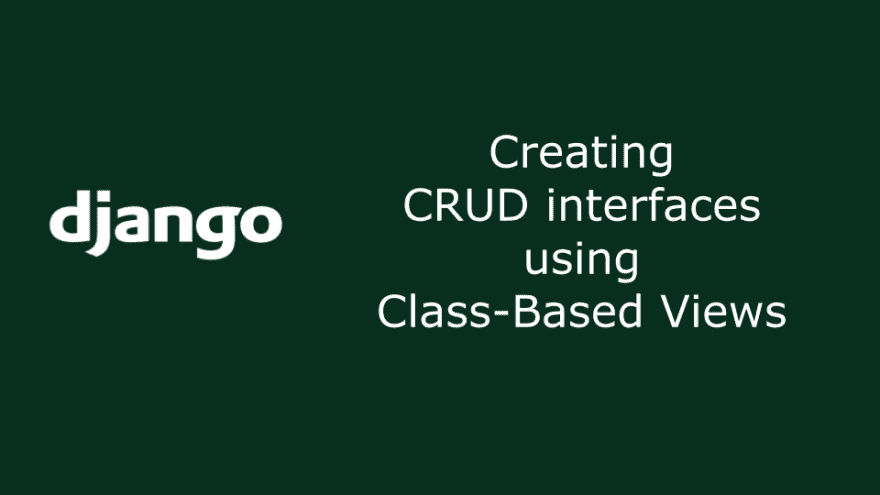
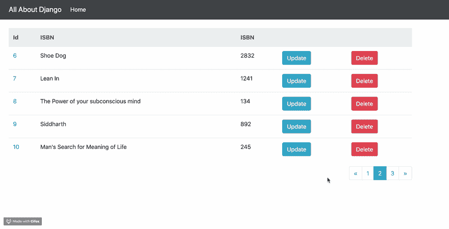

# Django 中基于类的视图

> 原文：<https://dev.to/taranjeet/class-based-views-in-django-3bc>

在 Django 中用 DRY 模式创建 CRUD 接口。

在本教程中，我们将学习如何使用基于类的视图为任何模型创建 CRUD 接口。

在本教程结束时，我们将能够添加、列出、查看、更新和删除特定的模型(此处为`Book`，项目基于`library`)。本教程可以扩展到为任何模型创建基于 CRUD 的接口。

<figure> 

<figcaption>Gif 展示书籍模型的 CRUD 接口
</figcaption>

</figure>

Django 有 5 个[基于类的视图](https://docs.djangoproject.com/en/2.2/topics/class-based-views/)

*   ListView —查看对象列表
*   创建视图—创建特定对象
*   详细视图
*   更新视图—更新特定对象
*   删除评论

让我们假设我们正在创建一个库项目。我们将在一个名为`store`的应用程序中拥有一个图书模型。