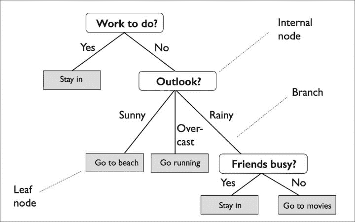
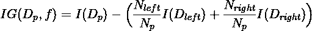
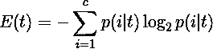
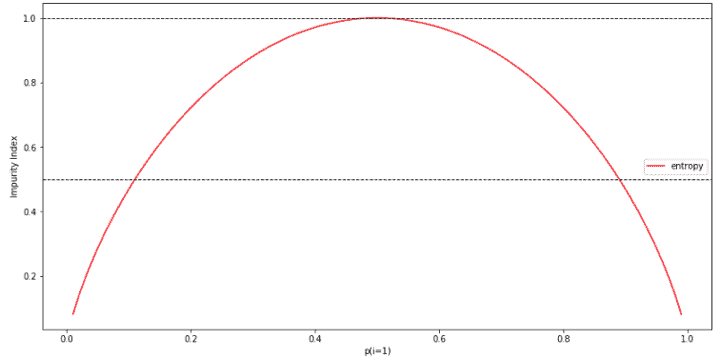
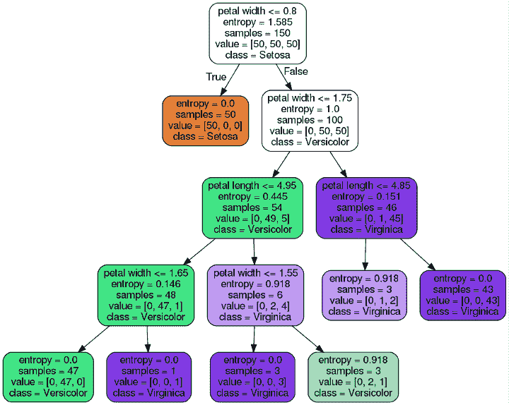
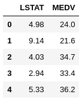
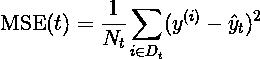
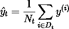
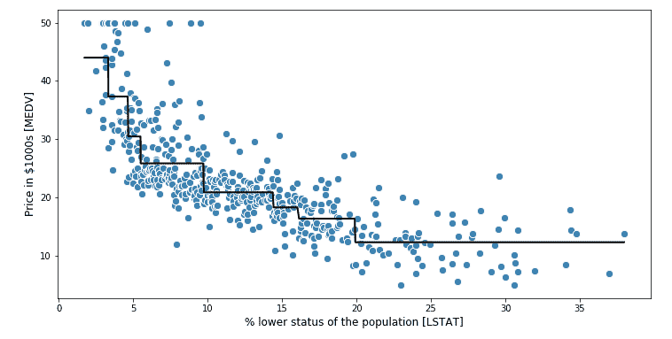

# 用决策树进行分类和回归分析

> 原文：<https://dev.to/nexttech/classification-and-regression-analysis-with-decision-trees-jgp>

**决策树**是一种受监督的机器学习模型，用于通过从特征中学习决策规则来预测目标。顾名思义，我们可以把这个模型看作是通过提出一系列问题来做出决定，从而分解我们的数据。

让我们考虑下面的例子，其中我们使用决策树来决定某一天的活动:

[](https://res.cloudinary.com/practicaldev/image/fetch/s--NFD01EmD--/c_limit%2Cf_auto%2Cfl_progressive%2Cq_auto%2Cw_880/https://cdn-images-1.medium.com/max/720/1%2AWerHJ14JQAd3j8ASaVjAhw.jpeg)

基于我们训练集中的特征，决策树模型学习一系列问题来推断样本的类别标签。正如我们所见，如果我们关心可解释性，决策树是有吸引力的模型。

虽然上图说明了基于分类变量的决策树的概念(**分类**)，但是如果我们的特征是实数(**回归**，那么同样的概念也适用。

在本教程中，我们将讨论如何用 Python 的`scikit-learn`库构建决策树模型。我们将涵盖:

*   决策树的基本概念
*   决策树学习算法背后的数学原理
*   信息增益和杂质测量
*   分类树
*   回归树

我们开始吧！

##### *本教程改编自 Next Tech 的 **Python 机器学习**系列，带你通过 Python 从 0 到 100 的机器学习和深度学习算法。它包括一个浏览器内沙盒环境，预装了所有必要的软件和库，以及使用公共数据集的项目。这里可以开始[！](https://c.next.tech/2HkQ7tG)*

* * *

## 决策树的基本原理

通过**递归划分**构建决策树——从根节点(被称为第一个**父节点**)开始，每个节点可以被拆分成左右**子节点**。然后，这些节点可以被进一步拆分，并且它们自己成为其结果子节点的父节点。

例如，看上面的图片，根节点是`Work to do?`，并根据是否有工作要做而分成子节点`Stay in`和`Outlook`。`Outlook`节点进一步分成三个子节点。

那么，我们如何知道每个节点的最佳分裂点是什么呢？

从根开始，数据在导致最大**信息增益** ( **IG** )的特征上被分割(下面更详细地解释)。在迭代过程中，我们然后在每个**子节点**处重复该分裂过程，直到叶子是纯的——即，每个节点处的样本都属于同一类。

在实践中，这会导致树非常深，有很多节点，这很容易导致过度拟合。因此，我们通常希望**通过设置树的最大深度来修剪**树。

## 信息增益最大化

为了在最具信息性的特征处分割节点，我们需要定义一个目标函数，我们希望通过树学习算法来优化该目标函数。这里，我们的目标函数是最大化每次分裂的信息增益，我们定义如下:

[](https://res.cloudinary.com/practicaldev/image/fetch/s--zqQ2YggF--/c_limit%2Cf_auto%2Cfl_progressive%2Cq_auto%2Cw_880/https://cdn-images-1.medium.com/max/720/1%2ACHsongM23EQUzvzzcWa2Pg.png)

这里， *f* 是执行拆分的特征，*D<sub>p</sub>T5， *D <sub>左</sub>T9， *D <sub>右</sub>* 是父节点和子节点的数据集， *I* 是**杂质度量**， *N <sub>p</sub>* 是父节点的样本总数，是**

我们将在下面的例子中更详细地讨论分类和回归决策树的杂质度量。但就目前而言，只要明白信息增益简单来说就是父节点杂质和子节点杂质之和的差——子节点杂质越低，信息增益越大。

注意，上面的等式是针对二元决策树的——每个父节点只被分成两个子节点。如果你有一个有多个节点的决策树，你可以简单地将所有节点的杂质相加。

## 分类树

我们先来说说分类决策树(也称为**分类树**)。对于这个例子，我们将使用机器学习领域的经典产品 [*虹膜*](https://archive.ics.uci.edu/ml/datasets/iris) 数据集。它包含了来自三个不同物种 *Setosa* 、 *Versicolor* 和 *Virginica* 的 150 朵*鸢尾*花的尺寸。这些将是我们的目标。我们的目标是预测一朵鸢尾花属于哪一类。以厘米为单位的花瓣长度和宽度存储为列，我们也称之为数据集的**特征**。

让我们首先导入数据集，并将特征指定为`X`，将目标指定为`y` :

```
from sklearn import datasets

iris = datasets.load_iris()                        # Load iris dataset 
X = iris.data[:, [2, 3]]                           # Assign matrix X y = iris.target                                    # Assign vector y 
```

使用`scikit-learn`，我们现在将训练一个最大深度为 4 的决策树。代码如下:

```
from sklearn.tree import DecisionTreeClassifier    # Import decision tree classifier model 
tree = DecisionTreeClassifier(criterion='entropy', # Initialize and fit classifier
    max_depth=4, random_state=1)
tree.fit(X, y) 
```

注意，我们将`criterion`设置为**熵**。这一标准被称为杂质测量(在前一节中提到)。在分类中，熵是最常见的杂质测量或分裂标准。其定义如下:

[](https://res.cloudinary.com/practicaldev/image/fetch/s--iMXI4MFr--/c_limit%2Cf_auto%2Cfl_progressive%2Cq_auto%2Cw_880/https://cdn-images-1.medium.com/max/720/1%2ATrGRS0Y7nokqAggvbdEClA.png)

这里， *P(i|t)* 是属于特定节点 *t* 的类别 *c* 的样本的比例。因此，如果一个节点上的所有样本都属于同一个类别，则熵为 0，如果我们具有均匀的类别分布，则熵最大。

为了更直观地理解熵，让我们为类别 1 的概率范围[0，1]绘制杂质指数。代码如下:

```
import numpy as np
import matplotlib.pyplot as plt

def entropy(p):
    return - p * np.log2(p) - (1 - p) * np.log2(1 - p)

x = np.arange(0.0, 1.0, 0.01)                      # Create dummy data e = [entropy(p) if p != 0 else None for p in x]    # Calculate entropy 
plt.plot(x, e, label='entropy', color='r')         # Plot impurity indices for y in [0.5, 1.0]:
    plt.axhline(y=y, linewidth=1,
                color='k', linestyle='--')
plt.xlabel('p(i=1)')
plt.ylabel('Impurity Index')
plt.legend()
plt.show() 
```

[](https://res.cloudinary.com/practicaldev/image/fetch/s--N6RievBz--/c_limit%2Cf_auto%2Cfl_progressive%2Cq_auto%2Cw_880/https://cdn-images-1.medium.com/max/720/1%2A8BIEFvLcFv6e2WDC_P8gMA.png)

可以看到，如果 *p(i=1|t) = 1* ，熵为 0。如果类以 *p(i=1|t) = 0.5* 均匀分布，熵为 1。

现在，回到我们的 *Iris* 例子，我们将可视化我们训练好的分类树，看看熵如何决定每个分裂。

`scikit-learn`中一个很好的特性是它允许我们在训练后将决策树导出为一个`.dot`文件，例如，我们可以使用 [GraphViz](http://www.graphviz.org/) 来可视化它。除了 GraphViz，我们将使用一个名为`pydotplus`的 Python 库，它具有与 GraphViz 类似的功能，允许我们将`.dot`数据文件转换为决策树图像文件。

您可以通过在您的终端中执行以下命令来安装`pydotplus`和`graphviz`:

```
pip3 install pydotplus
apt install graphviz 
```

下面的代码将创建一个 PNG 格式的决策树图像:

```
from pydotplus.graphviz import graph_from_dot_data
from sklearn.tree import export_graphviz

dot_data = export_graphviz(                           # Create dot data
    tree, filled=True, rounded=True,
    class_names=['Setosa', 'Versicolor','Virginica'],
    feature_names=['petal length', 'petal width'],
    out_file=None
)

graph = graph_from_dot_data(dot_data)                 # Create graph from dot data graph.write_png('tree.png')                           # Write graph to PNG image 
```

[](https://res.cloudinary.com/practicaldev/image/fetch/s--_QNKnaTy--/c_limit%2Cf_auto%2Cfl_progressive%2Cq_auto%2Cw_880/https://cdn-images-1.medium.com/max/720/1%2Az4zWVweDtHJzq4Ky5eOAHg.png)

查看保存在图像文件`tree.png`中的结果决策树图，我们现在可以很好地追溯决策树从我们的训练数据集确定的分裂。我们从根部的 150 个样本开始，使用**花瓣宽度**截止值≤ 1.75 厘米，将它们分成两个子节点，分别包含 50 个和 100 个样本。第一次拆分后，我们可以看到左边的子节点已经是纯的，只包含来自`setosa`类的样本(熵= 0)。右边的进一步分割用于从`versicolor`和`virginica`等级中分离样品。

查看最终的熵，我们看到深度为 4 的决策树在分离花类方面做得非常好。

## 回归树木

我们将使用 [*波士顿住宅*](https://www.cs.toronto.edu/~delve/data/boston/bostonDetail.html) 数据集作为回归示例。这是另一个非常受欢迎的数据集，包含波士顿郊区的房屋信息。共有 506 个样本和 14 个属性。出于简单和直观的目的，我们将只使用两个目标值— `MEDV`(以千美元计的自有住房的中值)和`LSTAT`(人口中较低地位的百分比)作为特征。

让我们首先将必要的属性从`scikit-learn`导入到`pandas`数据帧中。

```
import pandas as pd
from sklearn import datasets

boston = datasets.load_boston()            # Load Boston Dataset df = pd.DataFrame(boston.data[:, 12])      # Create DataFrame using only the LSAT feature df.columns = ['LSTAT']
df['MEDV'] = boston.target                 # Create new column with the target MEDV df.head() 
```

[](https://res.cloudinary.com/practicaldev/image/fetch/s--S03agUJw--/c_limit%2Cf_auto%2Cfl_progressive%2Cq_auto%2Cw_880/https://cdn-images-1.medium.com/max/720/1%2A1pSpTGA6A1rY4WCgIBUm0g.png)

让我们使用在`scikit-learn`中实现的`DecisionTreeRegressor`来训练一棵回归树:

```
from sklearn.tree import DecisionTreeRegressor    # Import decision tree regression model 
X = df[['LSTAT']].values                          # Assign matrix X y = df['MEDV'].values                             # Assign vector y 
sort_idx = X.flatten().argsort()                  # Sort X and y by ascending values of X X = X[sort_idx]
y = y[sort_idx]

tree = DecisionTreeRegressor(criterion='mse',     # Initialize and fit regressor
                             max_depth=3)         
tree.fit(X, y) 
```

请注意，我们的`criterion`与我们用于分类树的不同。熵作为杂质的量度是分类的有用标准。然而，为了使用决策树进行回归，我们需要适用于连续变量的杂质度量，因此我们使用子节点的**加权均方误差** ( **MSE** )来定义杂质度量:

[](https://res.cloudinary.com/practicaldev/image/fetch/s--glYq_tmV--/c_limit%2Cf_auto%2Cfl_progressive%2Cq_auto%2Cw_880/https://cdn-images-1.medium.com/max/720/1%2A6wRtInhGhxoX_Y7W9OR14Q.png)

这里，*n<sub>t</sub>T3】为节点 *t* 的训练样本数，*d<sub>t</sub>T9】为节点 *t* 的训练子集， *y <sup>(i)</sup>* 为真实目标值， *ŷ <sup>t</sup>* 为预测目标值(样本均值):**

[](https://res.cloudinary.com/practicaldev/image/fetch/s--CF3PSom4--/c_limit%2Cf_auto%2Cfl_progressive%2Cq_auto%2Cw_880/https://cdn-images-1.medium.com/max/720/1%2ADylF2sjY6k3Cw7HE8vtYrA.png)

现在，让我们对`MEDV`和`LSTAT`之间的关系建模，看看回归树的直线拟合看起来像什么:

```
plt.figure(figsize=(16, 8))
plt.scatter(X, y, c='steelblue',                  # Plot actual target against features
            edgecolor='white', s=70)
plt.plot(X, tree.predict(X),                      # Plot predicted target against features
         color='black', lw=2)
plt.xlabel('% lower status of the population [LSTAT]')
plt.ylabel('Price in $1000s [MEDV]')
plt.show() 
```

[](https://res.cloudinary.com/practicaldev/image/fetch/s---RSxMHSQ--/c_limit%2Cf_auto%2Cfl_progressive%2Cq_auto%2Cw_880/https://thepracticaldev.s3.amazonaws.com/i/7g9yosjrnkbhatnldelw.png)

正如我们在结果图中看到的，深度为 3 的决策树捕捉到了数据的总体趋势。

* * *

我希望你喜欢这个关于决策树的教程！我们讨论了决策树的基本概念，最小化杂质的算法，以及如何为分类和回归构建决策树。

在实践中，知道如何为树的深度选择一个合适的值以避免数据过拟合或欠拟合是很重要的。了解如何组合决策树以形成集合**随机森林**也很有用，因为由于随机性，它通常比单个决策树具有更好的泛化性能，这有助于减少模型的方差。它对数据集中的异常值也不太敏感，并且不需要太多的参数调整。

* * *

*我们将在 **Python 机器学习**系列中介绍这些技术，并深入研究其他机器学习模型，如感知器、Adaline、线性和多项式回归、逻辑回归、支持向量机、核支持向量机、k-最近邻、情感分析模型、k-均值聚类、DBSCAN、卷积神经网络和递归神经网络。*

我们还关注其他主题，如正则化、数据处理、特征选择和提取、降维、模型评估、集成学习技术以及部署机器学习模型。

*这里可以开始[！](https://c.next.tech/2HkQ7tG)*