# 清理所有的抖动！

> 原文：<https://dev.to/andrious/clean-up-all-the-flutter-92f>

*飘动杂乱难读！去清理一下！*

你知道我不喜欢 Flutter 什么吗？非常少。然而，我不得不习惯于阅读那些长长的垂直的参数列表。大多数情况下，它们不仅仅是参数，它们是作为参数传递的匿名函数列表，这使得阅读起来更加困难。还有男人！有时，有很多杂乱！很多乱七八糟的东西！

当然，一个人可以适应。它确实有它的优点，但我决定清理一下。下面是“之前和之后”的图片。你怎么想呢?

[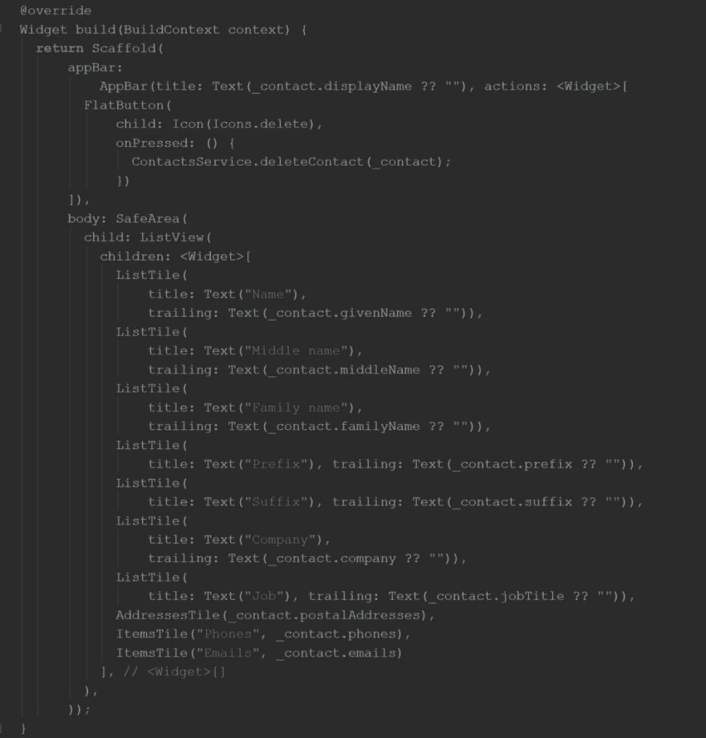](https://github.com/fluttercommunity/flutter_contacts/blob/master/example/lib/main.dart#L80)

<figure>[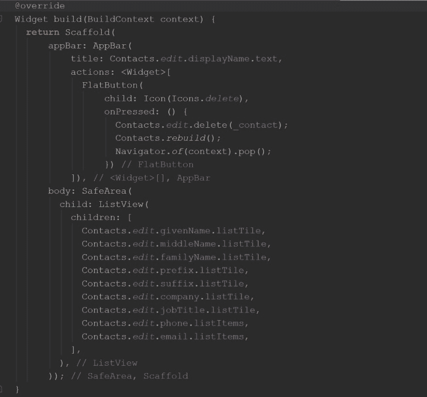](https://github.com/Andrious/contacts_service_example/blob/master/lib/src/view/ContactDetailsPage.dart#L48) 

<figcaption>原[联系人详细信息页面](https://github.com/fluttercommunity/flutter_contacts/blob/master/example/lib/main.dart#L80) vs .新[联系人详细信息页面](https://github.com/Andrious/contacts_service_example/blob/master/lib/src/view/ContactDetailsPage.dart#L48)</figcaption>

</figure>

### 以身作则

我在用回购。、 [**【联系人 _ 服务】**](https://github.com/fluttercommunity/flutter_contacts) 为例。我随意挑的。我不是在挑剔那些特定的开发者或任何东西。碰巧的是，它本身演示了 [**联系人 _ 服务插件**](https://pub.dartlang.org/packages/contacts_service) 的使用，但是我的版本不是关于“插件”而是关于“外观和感觉”。更多的是关于组织。更多关于 MVC 设计模式的细节。

那么，你喜欢吗？你看到了什么？我看到干净。我很容易看到“数据”来自一个名为 Contacts 的类中的静态引用。具体来说，它来自联系人类“编辑引用”。这毕竟是应用程序的编辑屏幕，因此我们可以看到，类 Contact 处于编辑模式！下面是近距离的观察。

例如，您可以看到下面的 *AppBar.title* 属性从联系人的*显示名称*引用中获取数据。您知道 AppBar 的 title 属性接受一个小部件，因此您将正确地猜测到项目“Contacts.edit.displayName.text”因此返回一个文本小部件。干净。

<figure>[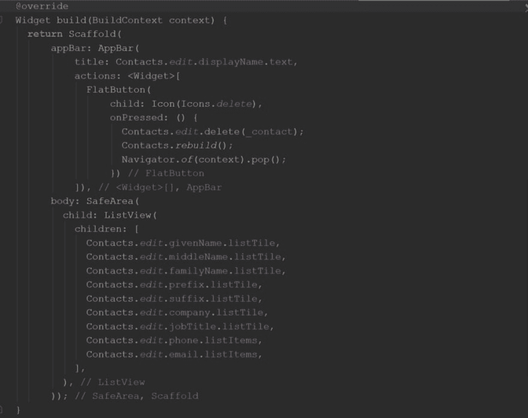](https://github.com/Andrious/contacts_service_example/blob/master/lib/src/view/ContactDetailsPage.dart)

<figcaption>[contact details page . dart](https://github.com/Andrious/contacts_service_example/blob/master/lib/src/view/ContactDetailsPage.dart)</figcaption>

</figure>

### MVC 正在播放

在我所有的[文章](https://medium.com/@greg.perry)中，最受欢迎的一直是 [**终于扑+ MVC 了！**](https://dev.to/andrious/flutter--mvc-at-last-2jd3) 至此。它谈到了在 Flutter 中实现 MVC 设计模式，您将很快看到 MVC 也在这里发挥作用。让我们看一下 Contacts 类。

<figure>[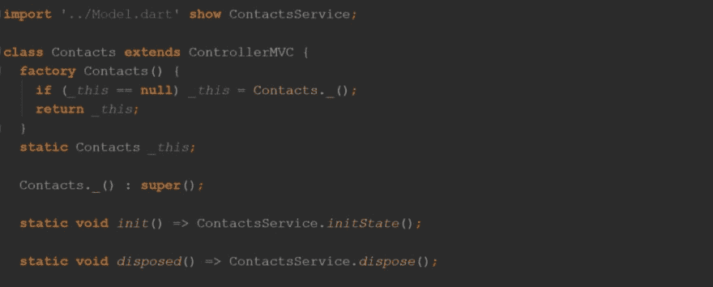](https://github.com/Andrious/contacts_service_example/blob/master/lib/src/controller/Contacts.dart#L53) 

<figcaption>[联系人.镖](https://github.com/Andrious/contacts_service_example/blob/master/lib/src/controller/Contacts.dart#L53)</figcaption>

</figure>

如果你熟悉我在 Flutter 中的 MVC 实现，你会意识到 Contacts 类是 MVC 设计中的一个控制器，因为它扩展了 ControllerMVC 类。您还可以看到它实现了一个静态工厂:Joshua Bloch 现在著名的 2001 年原始出版物中的第一项， [Effective Java](https://www.goodreads.com/work/quotes/101316-effective-java-programming-language-guide) 。您可以看到它导入了类 contacts service——这个应用程序的模型部分。

最后，你可能已经猜到了这个类中引用的所有东西都是静态的(与 Joshua Bloch 的《有效的 Java 第二版》的第 22 条保持一致)。)，再说一遍，你是对的。

<figure>[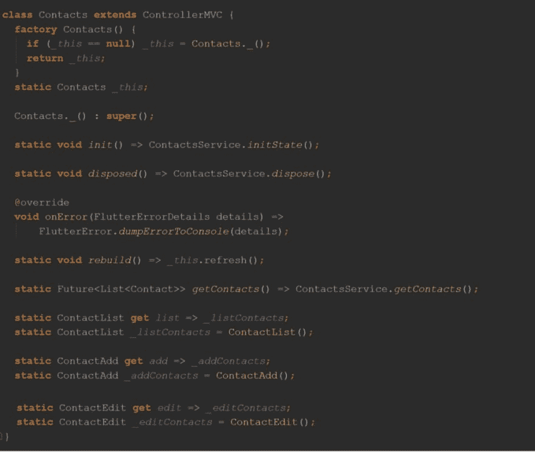](https://github.com/Andrious/contacts_service_example/blob/master/lib/src/controller/Contacts.dart#L53) 

<figcaption>[联系人.镖](https://github.com/Andrious/contacts_service_example/blob/master/lib/src/controller/Contacts.dart#L53)</figcaption>

</figure>

### MVC 内外

甚至应用程序的目录结构也反映了这个应用程序开发时采用的 MVC 方法。遵循一个设计模式(任何设计模式)提供了一个指导方针，一个结构，关于你如何组织你的逻辑，你如何组织你的代码，甚至你如何组织你的文件和文件夹。

例如，对这种结构保持一致和勤奋，可以让开发人员在从一个项目转到另一个项目时“迅速进入状态”。例如，一目了然，他们可以在下面看到构成这个特定项目的“视图”、“控制器”和“模型”的位置和内容。

我已经拿了[原始回购。并以这种选择的方式组织起来。我怀疑一个甚至不熟悉 MVC 的开发人员可以在相当短的时间内理解“一切都在哪里”。好的设计模式考虑到了这一点。](https://github.com/fluttercommunity/flutter_contacts)

详细介绍这个目录结构的后续文章在我的“待办事项”列表中。

<figure>[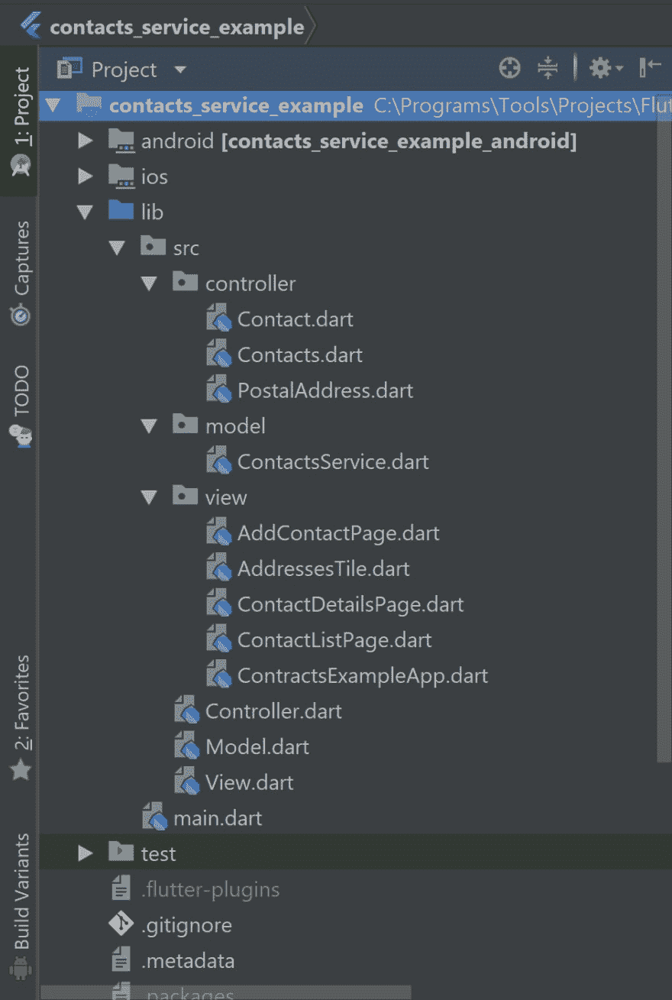](https://res.cloudinary.com/practicaldev/image/fetch/s--9ePelNRl--/c_limit%2Cf_auto%2Cfl_progressive%2Cq_auto%2Cw_880/https://cdn-images-1.medium.com/max/943/1%2Amtxv6VtxXvuiDEeht0tPJg.png) 

<figcaption>本项目的目录结构及其内容</figcaption>

</figure>

### 明白了吗？明白了。很好！

现在，回过头来看看班上的最后一名[*吸气者*](https://medium.com/p/69cb308382f4#99eb) ，联系人。它被称为 edit，它引用了一个“库私有”变量，这个变量又引用了实例化的类 [ContactEdit](https://medium.com/p/69cb308382f4#d4f8) 。还记得那个*吸气剂*吗？你以前见过。是编辑模式下的联系人！还有两个类: [ContactList](https://medium.com/p/69cb308382f4#cc0d) 和 [ContactAdd](https://medium.com/p/69cb308382f4#a821) 。明白我的意思了吗？

你可能已经猜到这里有三样东西:这个应用程序有三种“模式”。如果你已经猜到这个应用程序有三个屏幕:一个用于添加联系人，一个用于编辑联系人，一个用于列出联系人。再说一次，你是对的。

### 一个接一个

让我们从最后开始。我们来看看这个类， [ContactAdd](https://medium.com/p/69cb308382f4#a821) 。但是，请注意，您会发现它是从类 [ContactEdit](https://medium.com/p/69cb308382f4#d4f8) 扩展而来的。然后我们会看到这个类，它扩展了这个类，[联系人列表](https://medium.com/p/69cb308382f4#cc0d)。然后我们会看到它，它扩展了另一个名为 [ContactFields](https://medium.com/p/69cb308382f4#3b0c) 的类。我们很快就会看到它们，但首先，帮助在应用程序中“添加”联系人的类。

<figure>[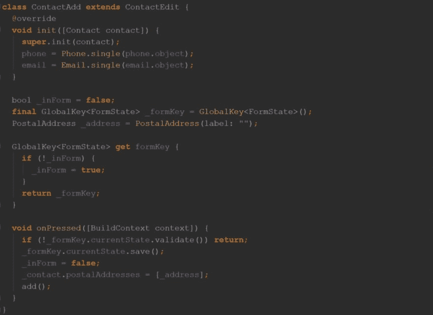](https://github.com/Andrious/contacts_service_example/blob/master/lib/src/controller/Contacts.dart#L84) 

<figcaption>[类联系人添加](https://github.com/Andrious/contacts_service_example/blob/master/lib/src/controller/Contacts.dart#L84)</figcaption>

</figure>

### 加起来。

看看上面的类，你会发现这个类， [ContactAdd](https://medium.com/p/69cb308382f4#a821) ，扩展了类， [ContactEdit](https://medium.com/p/69cb308382f4#d4f8) 。你可以看到这不是一个很大的班级，但是做了很多有趣的事情。首先，它在第一个名为 **init()** 的方法中有选择地接受一个“联系人”对象。然后，它为两个名为 phone 和 email 的属性赋值。因为它们没有在这个类中定义，我们可以假设它们是在它的父类中定义的，或者在层次结构中的另一个继承类中定义的。您可以看到, **init()** 方法调用其父方法的 **init()** 方法，并传入该 Contact 对象…如果有的话。

有一个“library private”变量被分配了一个名为 PostalAddress 的类。有一个名为 formKey 的 *getter* 提供的 *GlobalKey* ，还有一个名为 onPressed 的方法。

现在我已经错过了一些细节，但我现在真正想让你看的是这个类是如何在这个应用程序的“添加联系人”屏幕中使用的。

在下面的所有代码中查找' Contacts.add' *getter* 。我会在这里等。(下面有红色小箭头可以帮助你。毕竟不是考试。)看看这个类中的属性和方法， [ContactAdd](https://medium.com/p/69cb308382f4#a821) ，当你在下面看到它们被应用的时候，它们现在是如何有意义的。

<figure>[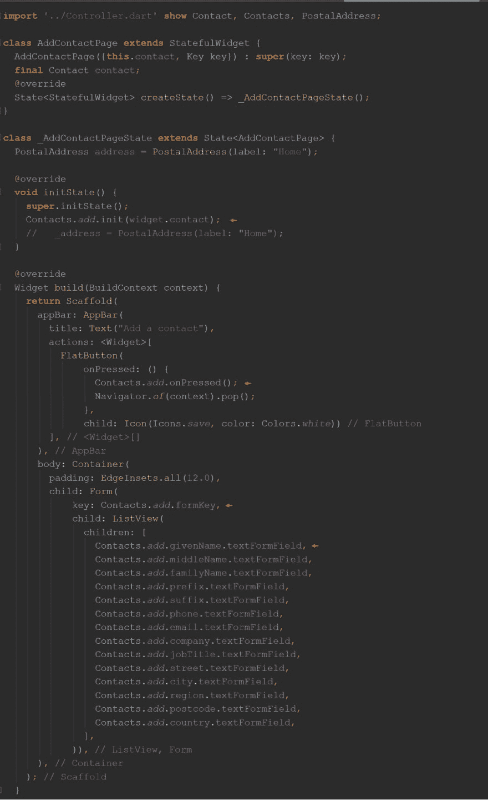](https://github.com/Andrious/contacts_service_example/blob/master/lib/src/view/AddContactPage.dart#L46)

<figcaption>[addcontactpage . dart](https://github.com/Andrious/contacts_service_example/blob/master/lib/src/view/AddContactPage.dart#L46)</figcaption>

</figure>

### 确实加起来了！

“添加联系人”屏幕的表单需要一个“表单键”。那么，它从哪里得到表单密钥呢？回头看一下 [ContactAdd 类](https://medium.com/p/69cb308382f4#a821)，您会很容易看到表单键来自哪里。干净。

当 FlatButton 小部件的 *onPressed* 方法被调用时(当用户按下屏幕的‘保存’按钮时)，你要调用什么方法？再一次，回头看看[的 ContactAdd 类](https://medium.com/p/69cb308382f4#a821)，我会说你应该调用它自己的‘on pressed’方法。这种方法有一个“更大的目的”。你可以看到 **build()** 函数实际上规定了控制器要使用的 api，不是吗？

另一篇详细介绍这一点的文章也在我的“待办事项”列表中。这个名单越来越长了。

添加新联系人时，查看要显示的数据。你能猜出要输入什么数据吗？打赌你能！(提示:givenName、middleName、familyName 等。)您还可以很容易地看到，数据也将被输入到一个由 *TextFormField* 小部件组成的列表中。下面我们来看一下[原图](https://github.com/fluttercommunity/flutter_contacts/blob/master/example/lib/main.dart#L180)。看到“数据”和“接口”是如何分开的了吗？

<figure>[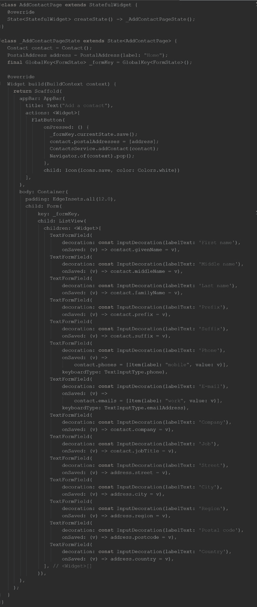](https://github.com/fluttercommunity/flutter_contacts/blob/master/example/lib/main.dart#L180)

<figcaption>[addcontactpage . dart](https://github.com/fluttercommunity/flutter_contacts/blob/master/example/lib/main.dart#L180)</figcaption>

</figure>

### 编辑一个联系人

接下来我们有什么？接下来，我们要编辑一个联系人。我们可以很容易地看到， [ContactEdit](https://medium.com/p/69cb308382f4#d4f8) 类扩展了 [ContactList](https://medium.com/p/69cb308382f4#cc0d) 类。一个人通常对联系人列表中的联系人做什么？我们通常会添加、编辑和删除联系人，不是吗？如果我们改变主意，我们甚至可以“取消删除”联系人。看下面。你看到了什么？

<figure>[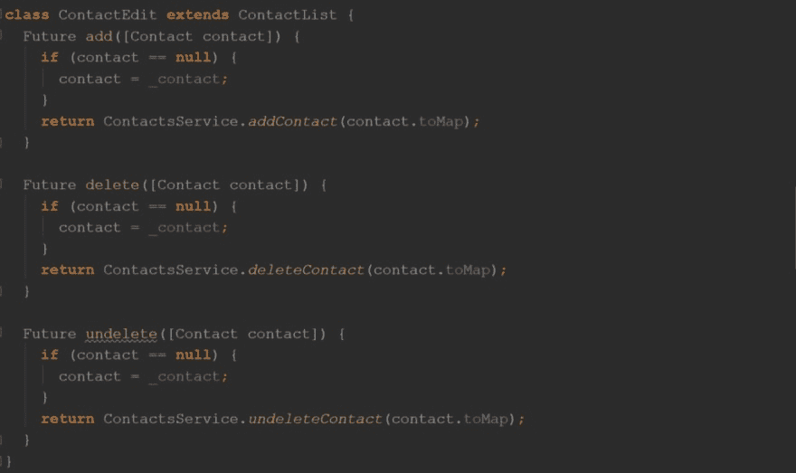](https://github.com/Andrious/contacts_service_example/blob/master/lib/src/controller/Contacts.dart#L112) 

<figcaption>[班级联系人编辑](https://github.com/Andrious/contacts_service_example/blob/master/lib/src/controller/Contacts.dart#L112)</figcaption>

</figure>

您可以看到， [ContactEdit](https://medium.com/p/69cb308382f4#d4f8) 类调用 ContactService 类的静态方法(应用程序的模态方面)来添加联系人、删除联系人和“取消删除”联系人。您可以看到，传递给这些方法的 contact 对象首先被更改为“map”对象。您还可以看到，contact 对象参数是可选的，如果为 null，则分配“库私有”变量 _contact。注意，该变量来自父类[联系人列表](https://medium.com/p/69cb308382f4#cc0d)。

### 联系人！

联系类有 *getter* ， **toMap** 。如下图所示，它还有一个名为 Contact.fromMap 的命名构造函数。您在这里看不到它们，但是该构造函数将映射条目分配给一个以联系人的字段名命名的*setter*列表。然而，你可以看到那些*设置器*分配的‘库私有’变量列表。最后，您会看到 getter getter toMap，它将联系人的属性转换回地图。你会猜对“后端”直接处理地图对象。干净。

<figure>[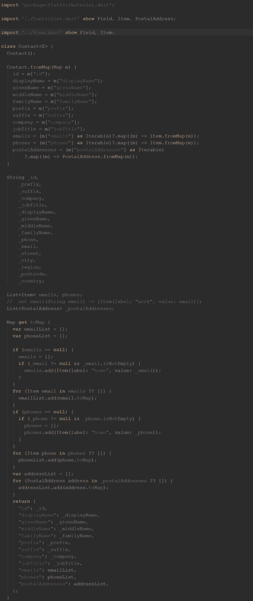](https://github.com/Andrious/contacts_service_example/blob/master/lib/src/controller/Contact.dart#L30) 

<figcaption>[联系人.镖](https://github.com/Andrious/contacts_service_example/blob/master/lib/src/controller/Contact.dart#L30)</figcaption>

</figure>

### 列出联系人

下一个类是前两个的父类。它有一个单独的方法叫做 **init()** 。你可以看到一堆“库私有”变量被分配给各种“字段”类。所有这些变量显然都是从父类 [ContactFields](https://medium.com/p/69cb308382f4#3b0c) 中定义的。如果没有 Contact 对象传递给 **init()** 方法，就会创建一个“新的”Contact 对象。注意，对象被分配给变量 _contact，我们在前面的类中看到过， [ContactEdit](https://medium.com/p/69cb308382f4#d4f8) 。

<figure>[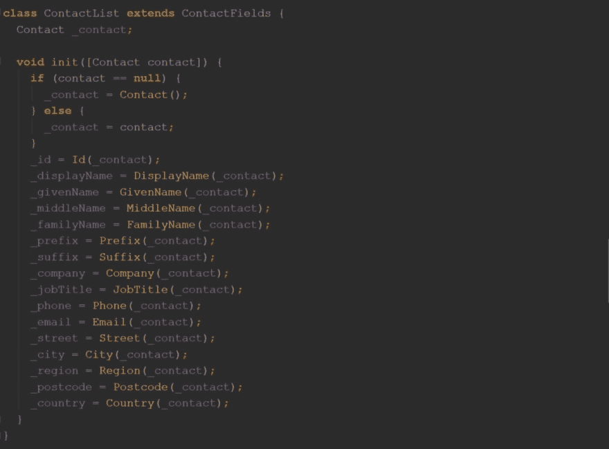](https://github.com/Andrious/contacts_service_example/blob/master/lib/src/view/ContactListPage.dart#L32) 

<figcaption>[类联系人列表](https://github.com/Andrious/contacts_service_example/blob/master/lib/src/view/ContactListPage.dart#L32)</figcaption>

</figure>

### 你是什么领域的？

让我们快速浏览一下其中一个“字段”类。上面列出的第一个是类 DisplayName。这一个和其他的非常相似，但是和其他的一样，它必须是特定的，并且提供它特定的字段名称，displayName。注意，变量 value 来自父类 Field。

<figure>[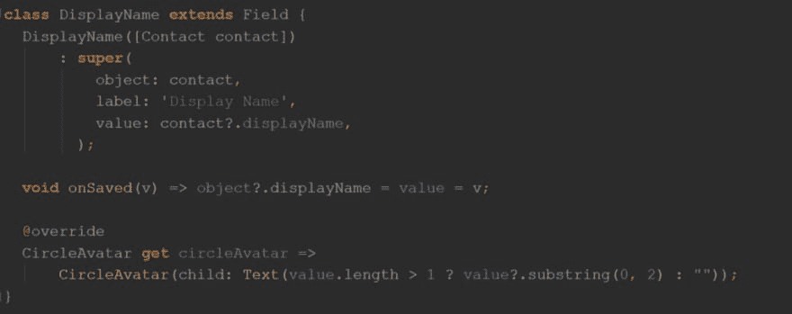](https://github.com/Andrious/contacts_service_example/blob/master/lib/src/controller/Contact.dart#L239) 

<figcaption>[类显示名称](https://github.com/Andrious/contacts_service_example/blob/master/lib/src/controller/Contact.dart#L239)</figcaption>

</figure>

注意， **onSave()** 是在保存联系人时调用的，例如在 [**AddContactPage**](https://medium.com/p/69cb308382f4#a821) 方法下，*_ formkey . current state . save()*。而 circleAvatar 当然是在主屏幕 [**联系人列表页**](https://medium.com/p/69cb308382f4#9c31) 中找到的。

### 一个领域的联系人

这个层次结构中的第一个类是我们要看的最后一个类， [ContactFields](https://medium.com/p/69cb308382f4#3b0c) 。你已经看到了每个职业是如何在某种程度上建立在前一个职业的基础上的。这个课程提供了什么？它提供了 field 类型的“字段”变量，以及它们相关的*获取器*和*设置器*。见下文。

<figure>[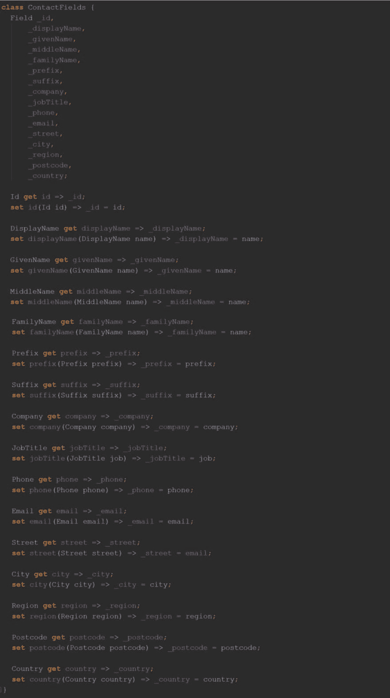](https://github.com/Andrious/contacts_service_example/blob/master/lib/src/controller/Contacts.dart#L163) 

<figcaption>[类联系人字段](https://github.com/Andrious/contacts_service_example/blob/master/lib/src/controller/Contacts.dart#L163)</figcaption>

</figure>

### 列出您的联系人

下面是这个应用程序的第一个或“主”屏幕的构建功能。那些熟悉我在 Flutter 中实现的 [MVC 的人知道，我认为应用程序“主”屏幕的小部件的 build()函数(实际上是任何小部件的 build()函数)是 MVC 实现中的“视图”。记得吗？](https://medium.com/flutter-community/flutter-mvc-at-last-275a0dc1e730#5874)

对于这个应用程序，显示在“视图”中的任何数据都是通过控制器访问的。所以在这种情况下，联系人是这个应用程序的控制器。在下面，只要你看到单词“contacts”，你就知道它的值是从控制器中提取出来的。例如，您在这里看不到它，但是“私有”变量 _contacts 从控制器中的一个方法中获取其值:[**contacts . get contacts()**](https://medium.com/p/69cb308382f4#99eb)

<figure>[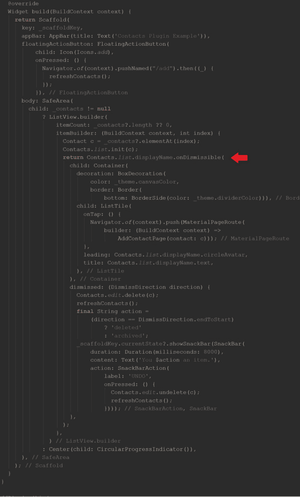](https://github.com/Andrious/contacts_service_example/blob/master/lib/src/view/ContactListPage.dart#L72)

<figcaption>[ContactListPage Build()函数是 app 的视图](https://github.com/Andrious/contacts_service_example/blob/master/lib/src/view/ContactListPage.dart#L72)</figcaption>

</figure>

我会放上它的原始版本，但你会迷失在代码中。如果你想做个比较，就去看看它的原版 [Github](https://github.com/fluttercommunity/flutter_contacts/blob/master/example/lib/main.dart#L37) 。注意，我在我的版本中放了一个不允许的小工具(红色箭头),这样可以很容易地删除联系人。原版没有删除联系人的手段，而在我的版本中你一眼就能看到，显示的是什么字段，轻轻一扫就‘删除’了！

### 这不屑一顾的辩别在哪里？

我可能有点超前了，但是那个红色的箭头向你介绍了这里应用的一个非常重要的方法:控制器不仅决定显示“什么”,而且决定你可以用它“做什么”。在某种程度上，这种方法让控制器承担视图的工作，并以某种方式呈现数据(例如，在 TextFormField 中，在文本中，和/或以可忽略的方式。)

正如你在类 [ContactFields](https://medium.com/p/69cb308382f4#3b0c) 中看到的，有一大堆‘Field’类正在被定义。正是在这个阶层、领域里，你会发现方法，**。**

 **<figure>[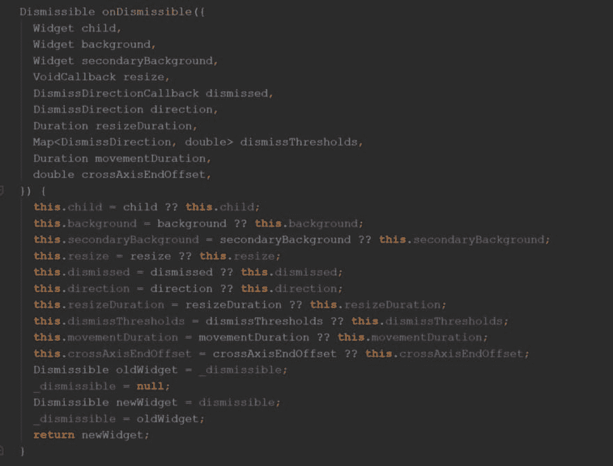](https://github.com/AndriousSolutions/mvc_application/blob/master/lib/src/view/utils/fields.dart#L618)

<figcaption>[on dismissible()](https://github.com/AndriousSolutions/mvc_application/blob/master/lib/src/view/utils/fields.dart#L618)</figcaption>

</figure>

### 吸气剂搞定

上面的方法实际上调用了 *getter* ，可忽略。是 *getter* 将所需的小部件(在本例中是一个可忽略的)返回给上面列出的变量 newWidget。

<figure> 

<figcaption>[得到不允许](https://github.com/AndriousSolutions/mvc_application/blob/master/lib/src/view/utils/fields.dart#L598)</figcaption>

</figure>

### 谈扑杂波

正如你在上面看到的，发生了很多事情。库旨在使开发人员的生活变得更容易，但结果是，他们自己也变得混乱(后台有很多事情在进行。)在这种情况下，用户可以使用或不使用与小部件相关的所有参数。如果没有，库提供其他值或函数。这样做允许选择，开发人员喜欢选择。

例如，这样做可以让用户稍微“清理”一下上面例子中的代码(在红色大箭头旁边。)注意，该示例有两个匿名函数被传递给函数， [onDismissible](https://medium.com/p/69cb308382f4#9c31) 。一个用于命名参数 child，另一个用于命名参数 dismissed。

我的意思是，整个练习是为了减少将匿名函数作为参数传递的做法，还记得吗？嗯……就这么办吧。嘣！

<figure>[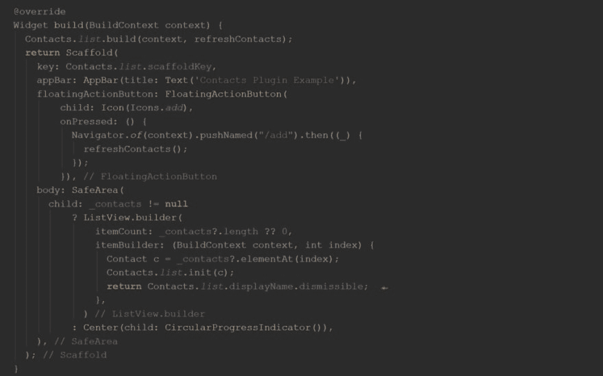](https://github.com/Andrious/contacts_service_example/blob/fdf2a09e8f2db00bdf3ec50bc05ca55a1822faf8/lib/src/view/ContactListPage.dart#L72)

<figcaption>[ContactListPage build()函数](https://github.com/Andrious/contacts_service_example/blob/fdf2a09e8f2db00bdf3ec50bc05ca55a1822faf8/lib/src/view/ContactListPage.dart#L72)</figcaption>

</figure>

### 大家都去哪里了？？

上图是第一次用方法 [onDismissible](https://medium.com/p/69cb308382f4/edit#9c31) 显示的同一个 **build()** 函数。它与它的命名参数一起使用:child 和 discovered，但现在它们都消失了？！现在替换为项目“contacts . list . display name . diss missible”。他们去哪里了？猜猜看。如果您猜测它们现在在类 [DisplayName](https://medium.com/p/69cb308382f4#d22e) 中，由*getter*display name 访问，那么您就猜对了。

<figure>[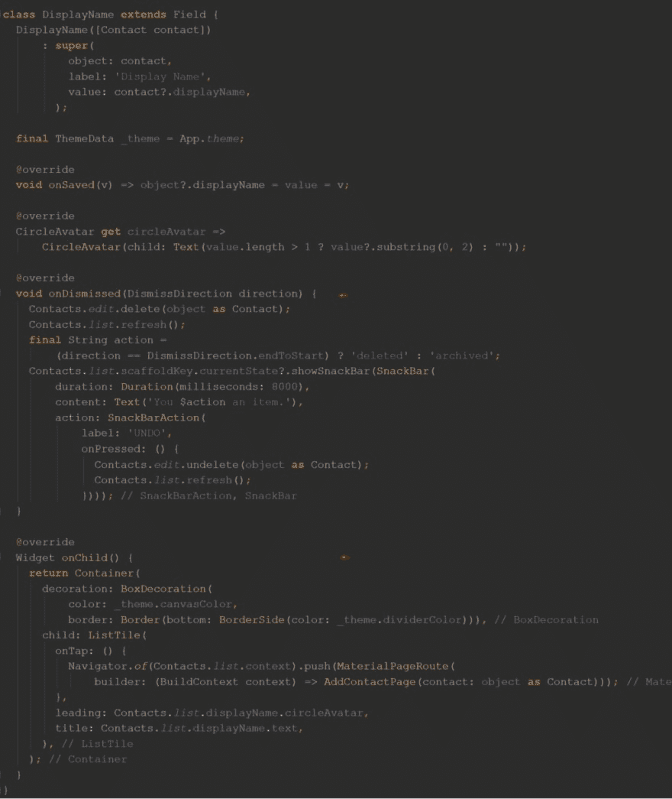](https://github.com/Andrious/contacts_service_example/blob/fdf2a09e8f2db00bdf3ec50bc05ca55a1822faf8/lib/src/controller/Contact.dart#L234) 

<figcaption>[类显示名称](https://github.com/Andrious/contacts_service_example/blob/fdf2a09e8f2db00bdf3ec50bc05ca55a1822faf8/lib/src/controller/Contact.dart#L234)</figcaption>

</figure>

首先向您介绍的类 [DisplayName](https://medium.com/p/69cb308382f4#f0b6) 现在有了两个新的实现方法。来自父类的每个重写方法，字段:**on dismiss()**和 **onChild()** 。这种特殊的“逻辑”现在嵌入到了“控制器端”

### MVC 意味着可管理性

这导致了“工作分离”想象一下，一个开发团队正在开发这个应用程序，一个开发人员被分配了这个应用程序的“联系人数据”部分。他甚至没有获得访问 build()函数的权限！他在控制器中工作，因为控制器负责向视图提供数据(即[视图可以与控制器](https://medium.com/flutter-community/flutter-mvc-at-last-275a0dc1e730#b671)对话)。因此，他只需向“UI”团队提供访问“联系人数据”所需的 API(公共属性和函数)没问题。例如，在这种特殊情况下，他给他们这样的信息:“contacts . list . display name . dismissible”。

完成了。

这需要更多的编码，但你在这里。事实上，我更喜欢前一个实现，而不是这个。它只是一个很小的应用程序，我觉得逻辑的分离不必那么明显。不管怎样，关键是你有选择，我们开发人员喜欢选择。对吗？

### 字段类

那么让我们进一步看看这个类，Field。你可能已经猜到了。这是我创建的一个库，让我作为开发人员的生活变得更加轻松。这使得我的代码(我的 **build()** 函数中的代码)更加干净。当控制器要提供特定的数据字段时，它可以使用最适合这种情况的小部件来完成。它可以是 TextFormField、Text、ListTile、CheckBox 和其他一些类型。小部件的列表是有限的，但是正在增长。像任何好的库文件一样，它为您做了许多繁重的工作。

### 讽刺

看着我。我开始写这篇文章的时候可能对 Flutter 中的参数列表有一点抱怨，最后我创建了一个接受大约 77 个参数的类库。而且很可能还会有更多！爆笑！

<figure>[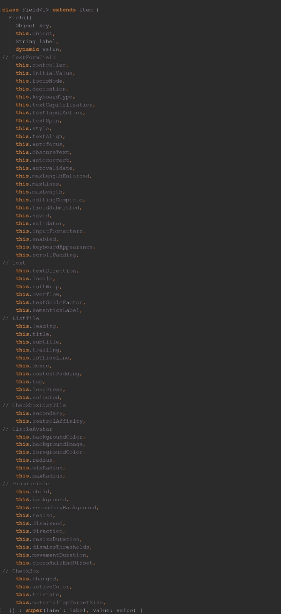](https://github.com/AndriousSolutions/mvc_application/blob/master/lib/src/view/utils/fields.dart)

<figcaption>[. dart](https://github.com/AndriousSolutions/mvc_application/blob/master/lib/src/view/utils/fields.dart)</figcaption>

</figure>

### 指向这一切

不管怎样，你明白我为什么这么做了吗？在你的下一个项目中，你将有一个来自数据库的数据字段，你将在一个 TextFormField，一个 ListTile，一个 CircleAvatar，甚至可能在一个 CheckBox 中显示该数据字段。除此之外，还将实现一个可忽略的，这样在其他屏幕上用手指轻轻一划就可以删除数据字段。

重点是，定义一个 Field 对象，为所有这些小部件传递所有必要的参数，这样就完成了。明白了吗？现在，您有了一个可以应用于整个应用程序中许多屏幕的字段对象。你怎么想呢?

### Widgets？有多少部件？

在撰写本文时，Field 类包含以下小部件。同样，可能会增加更多。

> TextFormField
> 
> Text
> 
> rich Text
> 
> list tile
> 
> CheckBoxListTile
> 
> CircleAvatar
> 
> 可驳回
> 
> 复选框

### 那么这一切的真正意义是什么呢？

因此，您可以推断出 Field 类仍然是一项正在进行的工作。它在目录下的一个文件里， [**Utils**](https://github.com/AndriousSolutions/mvc_application/tree/master/lib/src/view/utils) ，但是你可以看到它并不孤单。您可以看到，Field 类仅仅位于一个更大的存储库中名为 Fields.dart 的实用程序文件中。一个保存着我的下一个包发布， [**mvc_application**](https://github.com/AndriousSolutions/mvc_application) 的。

### 大局

在我的开发过程中，我一直在缓慢但肯定地制作我自己的小“应用程序框架”,以使我的后续项目更加容易。开发人员当然倾向于这样做——构建他们的工具包。

### 随着 MVC_Pattern 而来的是 MVC_Application

包的发布让我惊喜不已， [**mvc_pattern**](https://pub.dartlang.org/packages/mvc_pattern) 。这个包将 40 年前的 MVC 设计模式应用到了你的 Flutter 应用程序中，并且在发布时得到了积极的回应。我看到了一种需求，而且由于这是我为大多数应用程序选择的设计模式，很高兴看到许多人仍然欣赏这位“设计模式的祖父”

随着时间的推移，我不停地工作，我的“工具箱”也变大了。现在的意图是发布我当前的框架， [**mvc_application**](https://github.com/AndriousSolutions/mvc_application) ，作为一个包。**不会是明天，而是很快。**事实上，它只是在 [**mvc_pattern**](https://pub.dartlang.org/packages/mvc_pattern) 包之上工作，但是包含了许多我编写并在开发中使用的其他库。这包括一些我已经公开发布并记录在过去文章中的内容:

### 我的最终目标是什么

所以，我的最终目标是什么？事实上，我只是在为这个羽翼未丰的 Flutter 社区做贡献。用不用。从它身上拿走你想要的或者不要。不可否认，最终，稍微提升一下自己的形象也无妨。毕竟，这是我的谋生之道。那么未来会发生什么呢？再次，我期待着发布包，[**【MVC _ application】**](https://github.com/AndriousSolutions/mvc_application)。之后呢？哦，我不知道… **mvc_enterprise** ？

干杯。

* * ***