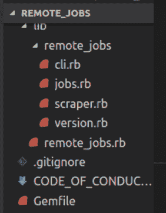
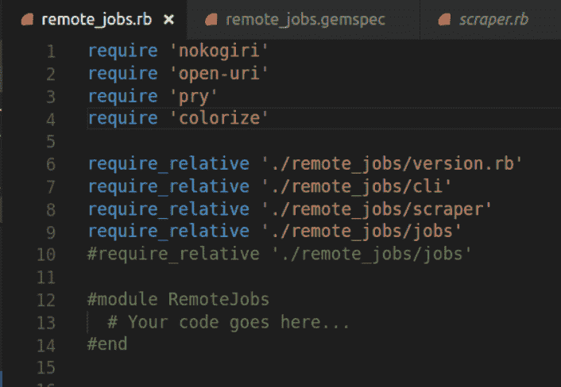
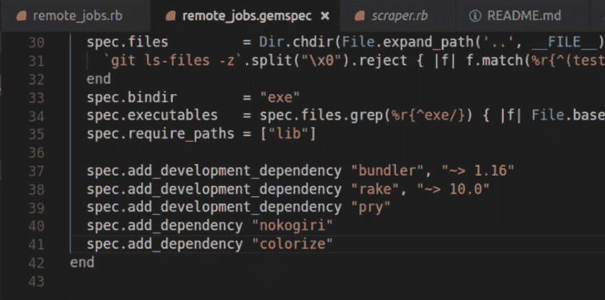
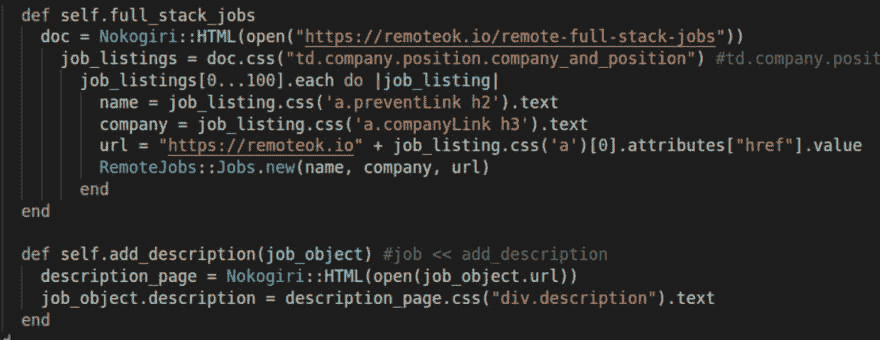

# 带有 Nokogiri 的 Ruby Web Scraper

> 原文：<https://dev.to/meikay/cli-data-gem-walk-through-web-scraper-1bg3>

我对远程全栈头寸感兴趣，所以我决定为什么不在我的投资组合项目中构建这种头寸呢？我构建了一个命令行应用程序，它使用面向对象编程为他们的前 100 名全栈开发人员工作抓取 remoteok.io。该应用程序能够执行第二级抓取来检索工作描述，并且可以作为一个 gem 安装在您的本地环境中。我的项目使用 Nokogiri gem，这是一个用于解析 HTML 和 XML 的开源软件库。

我将通过以下步骤介绍我是如何构建 CLI Data Gem 项目的:

### 步骤 1 安装捆绑器宝石

在您的终端键入:

`bundle install remote_jobs`

### 第二步添加必要的文件

我必须规划出我将在整个程序中使用的模型。我决定将我的文件夹命名为 lib，remote_jobs，在这个文件夹中，我添加了另外 3 个包含我的类的文件。

### 步骤 3 设置文件环境

然后，我需要 remote_jobs.rb 中的文件来设置我的项目环境。此时，我必须弄清楚要构建什么对象以及它们的属性是什么。

### 第四步添加依赖关系

在我的 remote_jobs.gemspec 文件中，我添加了必要的依赖项，如 Nokogiri、colorize 和 pry。我还添加了关于我的 gem 的信息，比如它的名称、版本、描述、作者和主页。

### 第五步 Suedo 代码

我想象了我的 CLI 将如何运行，并写下了一些步骤。然后，我想了想我会用什么方法让我的 CLI 那样运行。我还需要找到我想要收集的数据。

### 第六步刮

我寻找数据的 css 选择器，以便能够通过它们的子节点访问它们。我决定从 remotok.io 中抓取前 100 个全栈作业，并遍历每个作业对象以获取作业名、公司名和 url。在第二级刮削中，我刮削了每个工作的描述。然而，我没有多次抓取，也没有被锁定在网站之外，我只是在用户选择的工作没有描述的情况下抓取。

### 我遇到的问题&我(我们)是如何解决的

所以不可避免地，我遇到了困难。在这个项目中，我不被允许向技术教练寻求帮助，所以我依靠我的可靠朋友谷歌，以及向我的同行寻求一些建议！当你需要从头开始编写项目代码时，你开始意识到自己的弱点。所以我发现我对面向对象的理解并没有我想象的那么强。我重新看了一些关于这个主题的视频，并将我的理解应用到我的项目中。

你可以在上面的标题中看到，我说的是我(我们)。这是为了鼓励你在遇到困难时寻求帮助。如果你已经尝试过谷歌搜索一切，搜索堆栈溢出，但仍然无法找到解决方案，不要害怕寻求帮助。这就是我碰到的下一个问题，第二次刮擦的数据没有按照我认为应该的方式显示。当我运行我的程序时，在描述中到处都有一个{linebreak}。所以我请一位同行看一看，看看他认为是什么导致了这个问题。我们在 pry(调试工具)中摆弄代码，想出了用 gsub 来解决这个问题。此方法用第二个参数全局替换第一个参数。这允许我们在描述中的任何地方用文字换行符替换{linebreak}。

`clean_description = description.gsub("{linebreak}", "\n")
puts "#{clean_description}".colorize(:blue)`

总而言之，我很感激经历了这段经历，我迫不及待地想开始我的下一个项目！