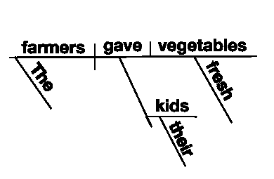
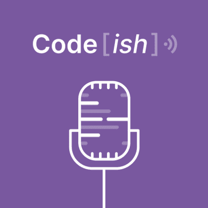

# 实践中的 CLI 标志+如何使用 oclif 创建自己的 CLI 命令

> 原文：<https://dev.to/heroku/cli-flags-in-practice-how-to-make-your-own-cli-command-with-oclif-26in>

*编者按:如果你喜欢 CLIs，你应该看看 2019 年 5 月 31 日星期五在三藩市举行的 [oclifconf](https://oclif.io/conf) 。这是 oclif 的第一次社区聚会！空间有限，如果您有兴趣加入，请尽快通知我们。*

是什么让从命令行工作变得如此强大？当然，它有时会让人觉得过时，但是当你记住了你要做的事情的单词、字符和符号的正确顺序时，它会带给你一种成就感和对工具的掌握，这是任何图形界面都无法比拟的。

那么，作为一名开发人员，还有什么比开发自己的 CLI 工具更好的方式来继续您的冒险呢？

在这篇文章中，我们将讨论 CLI 命令采用什么类型的参数——也称为“标志”、“参数”，有时也称为“选项”然后，我们将从 [oclif](https://oclif.io/) 开始，这是一个 CLI 框架，可以轻松创建新的 CLI 命令！

## CLI 命令的语法

任何命令行界面命令都有一些标准的“词类”作为 CLI 工具的用户，了解这些词类可以帮助你少打错别字。它还可以帮助你更快地理解其他人与你分享的复杂命令(比如[这些](https://www.commandlinefu.com/commands/browse))。如果你正在设计一个 CLI 工具，理解这些词类就更重要了，这样你就可以为你的用户提供最符合人体工程学的界面。是的，CLI 是一个用户界面！

你们中的一些人可能认识像下面这样的小学或小学的图表。幸运的是，理解 CLI 命令的结构不会有这种感觉。

[](https://res.cloudinary.com/practicaldev/image/fetch/s--juyi0ltD--/c_limit%2Cf_auto%2Cfl_progressive%2Cq_auto%2Cw_880/https://heroku-blog-files.s3.amazonaws.com/posts/1557265553-sentence-diagram.png)

与典型的英语句子相比，CLI 命令非常简单。

首先，让我们看看出现在 CLI 命令右侧的参数。当然，有许多方法可以将数据传递给 CLI 命令，但是命令“右边”的这三种类型的参数可能是最常见的:参数、长标志和短标志。这两种标志格式是 GNU 风格标志的标准。并不是所有的 CLI 都遵循这个约定，但是它已经成为类 Unix 和 POSIX 兼容操作系统上最流行的风格。

对于我们来说，还有比使用`ls`命令更好的开始方式吗？这是类 Unix 操作系统中最常见和最简单的命令之一。它只是列出了一个目录的内容。

### 命令

```
$ ls 
```

Enter fullscreen mode Exit fullscreen mode

该命令`ls`作为一个独立的命令单独工作。没有任何参数，这个命令将列出当前目录的内容。

### 论证

```
$ ls . 
```

Enter fullscreen mode Exit fullscreen mode

但是你可以用一个论点做同样的事情！原来`ls .`和`ls`是一回事，`ls`只是使用了一个隐含的`.`目录。对于那些不记得或不知道，`.`总是指当前目录。

但是现在，参数语法使您可以将任何目录路径传递给`ls`，并查看那里有什么。

```
$ ls /home/casey/code/some-repo-name 
```

Enter fullscreen mode Exit fullscreen mode

参数是命令右边的任何东西，不是标志(我们接下来将讨论标志)。幸运的是，争论可以出现在旗帜之前或之后——它可以与旗帜愉快地共存。

### 长旗

要列出通常隐藏的文件(如`~/.bashrc`)，可以在`ls`命令中使用一个标志。`ls --all`是长旗形式。长标志总是使用双破折号，并且总是由多个字符表示。

```
$ ls --all
$ ls . --all 
```

Enter fullscreen mode Exit fullscreen mode

### 短旗

此旗还有一个简称旗形:`ls -a`。在这种情况下，`a`是`all`的简称。短标志总是使用单个破折号，并且总是由单个字母表示。

```
$ ls -a
$ ls . -a 
```

Enter fullscreen mode Exit fullscreen mode

短标志也可以堆叠，所以你不需要为每个单独的破折号。顺序对这些来说并不重要，除非传递一个*标志参数*。

```
$ ls -la 
```

Enter fullscreen mode Exit fullscreen mode

### 标志自变量

许多标志接受一个称为“标志参数”的选项(不要与“命令参数”混淆)。一般来说，命令的参数可以按任何顺序排列，但是接受选项的标志必须在标志后面直接有选项。这样，命令就不会被非标志参数混淆。

例如，这里的`-x`标志不接受选项，但是`-f`标志接受。`archive.tar`正在将选项传递给`-f`。这两个都是有效的。

```
$ tar -x -f archive.tar
$ tar -xf archive.tar 
```

Enter fullscreen mode Exit fullscreen mode

标志及其选项可以用空格或等号`=`隔开。有趣的是，短旗(但不是长旗)甚至可以跳过空格，尽管许多人发现用空格或等号更容易阅读。这三个都是有效的，等价的。

```
$ tar -f archive.tar
$ tar -f=archive.tar
$ tar -farchive.tar 
```

Enter fullscreen mode Exit fullscreen mode

长标志必须用空格或等号将标志与其选项分开。

```
$ git log --pretty=oneline
$ git log --pretty oneline 
```

Enter fullscreen mode Exit fullscreen mode

### 其他传递数据的方式

我们已经讨论了参数，即自变量、长标志和短标志。向命令传递数据还有另外两种方式:[环境变量(" env vars")](https://en.wikipedia.org/wiki/Environment_variable) ，或者[标准输入(" stdin")](https://en.wikipedia.org/wiki/Standard_streams#Standard_input_(stdin)) 。这些不会在这篇博文中讨论，但是可以通过链接了解更多。

## 用`oclif`建立新的命令

场景:我们想要设计一个 oclif 命令，它接受类似“Casey”的输入，并返回“嗨，Casey！”。用户可以通过多种方式传递这个信息。这里我们用一个参数、一个长标志和一个短标志展示了每种输入的例子。

首先，我们从`oclif`开始。使用 CLI 应用程序非常非常简单。打开您的终端并键入以下内容，这将使用`npx`运行`oclif`，然后创建一个新的 CLI。`npx`是一个非常有用的命令，用于[简化运行托管在 npm 注册表](https://medium.com/@maybekatz/introducing-npx-an-npm-package-runner-55f7d4bd282b)上的 CLI 工具和其他可执行文件。

```
$ npx oclif single greet-me 
```

Enter fullscreen mode Exit fullscreen mode

我们不会深入上面的`single` (vs `multi`)争论的细节。查看 [oclif 文档](https://oclif.io/docs/introduction.html#single-command-or-multi-command)了解更多相关信息。

现在，您将有机会指定新 CLI 的一些细节，包括命令名。当它问你的时候，按回车键，选择默认的。它将接受您传递到上面命令中的`greet-me`参数。您可以为它询问您的大多数问题选择默认值。对于这个简单的教程来说，答案不会有太大的不同。但是，如果您要与他人共享您的 CLI 命令，准确回答这些问题非常重要。

```
? npm package name: greet-me
? command bin name the CLI will export: greet-me

...

Created greet-me in /home/casey/code/greet-me 
```

Enter fullscreen mode Exit fullscreen mode

现在我们已经设置好了，让我们来看看在`/greet-me/src/index.ts`中发生了什么，所有重要的参数和用于 CLI 的标记处理代码都将保存在这里。

```
const {Command, flags} = require('@oclif/command')

class GreetMeCommand extends Command {
  async run() {
    const {flags} = this.parse(GreetMeCommand)
    const name = flags.name || 'world'
    this.log(`hello ${name} from ./src/index.js`)
  }
}

GreetMeCommand.description = `Describe the command here
...
Extra documentation goes here
`

GreetMeCommand.flags = {
  // add --version flag to show CLI version
  version: flags.version({char: 'v'}),
  // add --help flag to show CLI version
  help: flags.help({char: 'h'}),
  name: flags.string({char: 'n', description: 'name to print'}),
  // flag with no value (-f, --force)
  force: flags.boolean({char: 'f'}),
}

module.exports = GreetMeCommand 
```

Enter fullscreen mode Exit fullscreen mode

我们在这里可以看到，它通过在`flags`对象中注册来接受一些不同的旗帜名称(`version`、`name`、`help`和`force`)。

```
{
    /* … */
    version: flags.version({char: 'v'}),
    /* … */
} 
```

Enter fullscreen mode Exit fullscreen mode

在这里，使用`version`标志，键作为“版本”长标志名，在表达式的右边，我们使用`oclif`的`flags`模块中的方法来注册一个标志、它将返回的类型和短标志名。

现在，我们准备好大干一场了:让我们看看通过运行 CLI，开箱即用地处理了多少事情。现在，它只能通过一个有点笨拙的命令来使用。

```
$ ./bin/run 
```

Enter fullscreen mode Exit fullscreen mode

但是 [npm 允许](https://docs.npmjs.com/cli/link.html)我们将这个符号链接到我们的 CLI 名称。

```
$ npm link

...

$ greet-me
> hello world from ./src/index.ts 
```

Enter fullscreen mode Exit fullscreen mode

太棒了。接下来尝试使用`-n`或`--name`传递你的名字——看看有没有其他方法`oclif`可以让你传递参数。

## `SIGTERM`

虽然这就是我们在这篇博文中要讨论的全部内容，但是 oclif 有一个不断发展的社区，并且它的代码是开源的，所以有很多其他的方法可以了解更多。这里有一些继续探索 oclif 的链接。

*   关于 oclif 的一集 [Code[ish]播客](https://www.heroku.com/podcasts/codeish)与 oclif 的创建者之一杰夫·迪基(Jeff Dickey)和 Heroku 的 oclif 项目经理纳希德·萨姆萨米 [# 13.oclif:一个开源的硬币指示器 （coin-levelindicator 的缩写）命令行界面（Command Line Interface for batch scripting）框架](/codeish/13-oclif-an-open-source-cli-framework)  [## <button class="crayons-btn follow-action-button" data-info="{&quot;id&quot;:65,&quot;className&quot;:&quot;Podcast&quot;}">T11】代码【ish】</button>](/codeish) ![Code[ish]](img/e911be199700676597763a254e0153cd.png)

    <audio id="audio" data-episode="13-oclif-an-open-source-cli-framework" data-podcast="codeish"><source src="https://www0.assets.heroku.com/podcasts/codeish/Codeish_episode_13_OClif.mp3" type="audio/mpeg">您的浏览器不支持音频元素。</audio>

    [](/codeish/13-oclif-an-open-source-cli-framework)<input type="range" name="points" id="volumeslider" value="50" min="0" max="100" data-show-value="true">1x初始化...×T59】
*   💻🎙️ [oclifconf 详情](https://oclif.io/conf)如果你在 2019 年 5 月 31 日星期五在旧金山湾区
*   👀🗣️ oclif 的[频谱社区](https://spectrum.chat/oclif)
*   最后，oclif 的 GitHub 资源库

    ## 
    
     [奥克里夫](https://github.com/oclif) / [奥克里夫](https://github.com/oclif/oclif) 

    ### 
    . js 开放式硬币指示器 （coin-levelindicator 的缩写）命令行界面（Command Line Interface for batch scripting）框架。建造于💜由赫罗库.

    <article class="markdown-body entry-content container-lg" itemprop="text">

    [](https://user-images.githubusercontent.com/449385/38243295-e0a47d58-372e-11e8-9bc0-8c02a6f4d2ac.png)

    # [OCL if:Node .射流研究…开放式硬币指示器 （coin-levelindicator 的缩写）命令行界面（Command Line Interface for batch scripting）框架](https://user-images.githubusercontent.com/449385/38243295-e0a47d58-372e-11e8-9bc0-8c02a6f4d2ac.png)

    [](https://spectrum.chat/oclif)[](https://npmjs.org/package/oclif)[](https://circleci.com/gh/oclif/oclif/tree/master)[](https://ci.appveyor.com/project/heroku/oclif/branch/master)[](https://npmjs.org/package/@oclif/command)[](https://github.com/oclif/oclif/blob/master/package.json)

    *   [<g-emoji class="g-emoji" alias="spiral_notepad" fallback-src="https://github.githubassets.cimg/icons/emoji/unicode/1f5d2.png">🗒</g-emoji>描述](https://raw.githubusercontent.com/oclif/oclif/master/#-description)*   [<g-emoji class="g-emoji" alias="rocket" fallback-src="https://github.githubassets.cimg/icons/emoji/unicode/1f680.png">🚀</g-emoji>入门教程](https://raw.githubusercontent.com/oclif/oclif/master/#-getting-started-tutorial)*   [<g-emoji class="g-emoji" alias="sparkles" fallback-src="https://github.githubassets.cimg/icons/emoji/unicode/2728.png">✨</g-emoji> 特色](https://raw.githubusercontent.com/oclif/oclif/master/#-features)*   [<g-emoji class="g-emoji" alias="pushpin" fallback-src="https://github.githubassets.cimg/icons/emoji/unicode/1f4cc.png">📌</g-emoji>要求](https://raw.githubusercontent.com/oclif/oclif/master/#-requirements)*   [<g-emoji class="g-emoji" alias="rainbow" fallback-src="https://github.githubassets.cimg/icons/emoji/unicode/1f308.png">🌈</g-emoji> CLI 类型](https://raw.githubusercontent.com/oclif/oclif/master/#-cli-types)T87*   T89<g-emoji class="g-emoji" alias="building_construction" fallback-src="https://github.githubassets.cimg/icons/emoji/unicode/1f3d7.png">🏗</g-emoji>用法*   [<g-emoji class="g-emoji" alias="books" fallback-src="https://github.githubassets.cimg/icons/emoji/unicode/1f4da.png">📚</g-emoji>例题](https://raw.githubusercontent.com/oclif/oclif/master/#-examples)*   [<g-emoji class="g-emoji" alias="hammer" fallback-src="https://github.githubassets.cimg/icons/emoji/unicode/1f528.png">🔨</g-emoji>命令](https://raw.githubusercontent.com/oclif/oclif/master/#-commands)*   [<g-emoji class="g-emoji" alias="factory" fallback-src="https://github.githubassets.cimg/icons/emoji/unicode/1f3ed.png">🏭</g-emoji>相关知识库](https://raw.githubusercontent.com/oclif/oclif/master/#-related-repositories)*   [<g-emoji class="g-emoji" alias="hedgehog" fallback-src="https://github.githubassets.cimg/icons/emoji/unicode/1f994.png">🦔</g-emoji>了解更多](https://raw.githubusercontent.com/oclif/oclif/master/#%F0%9F%A6%94-learn-more)*   [<g-emoji class="g-emoji" alias="mega" fallback-src="https://github.githubassets.cimg/icons/emoji/unicode/1f4e3.png">📣</g-emoji>反馈](https://raw.githubusercontent.com/oclif/oclif/master/#-feedback)

    # <g-emoji class="g-emoji" alias="spiral_notepad" fallback-src="https://github.githubassets.cimg/icons/emoji/unicode/1f5d2.png">🗒</g-emoji>描述

    T129】这是一个用于在节点. js 中构建硬币指示器 （coin-levelindicator 的缩写）命令行界面（Command Line Interface for batch scripting）的框架。该框架是在 Heroku CLI 的基础上构建的,但可以通用于构建任何自定义 CLI .它既适用于带有几个标志选项的单文件 CLI，也适用于带有子命令的非常复杂的 CLI(如饭桶或 heroku).

    [更多信息参见文档](http://oclif.io/docs/introduction).

    T137<g-emoji class="g-emoji" alias="rocket" fallback-src="https://github.githubassets.cimg/icons/emoji/unicode/1f680.png">🚀</g-emoji>入门教程

    [入门教程](http://oclif.io/docs/introduction)是一个循序渐进的指南,向你介绍奥克里夫.如果您以前没有在命令行中开发过任何东西,那么本教程是一个很好的起点

    # <g-emoji class="g-emoji" alias="sparkles" fallback-src="https://github.githubassets.cimg/icons/emoji/unicode/2728.png">✨</g-emoji> 特色

    *   **标志/参数解析** -没有标志解析器的 CLI 框架是不完整的。我们已经从多年的实验中建立了一个自定义…

    </article>

    [查看 GitHub 上的](https://github.com/oclif/oclif)