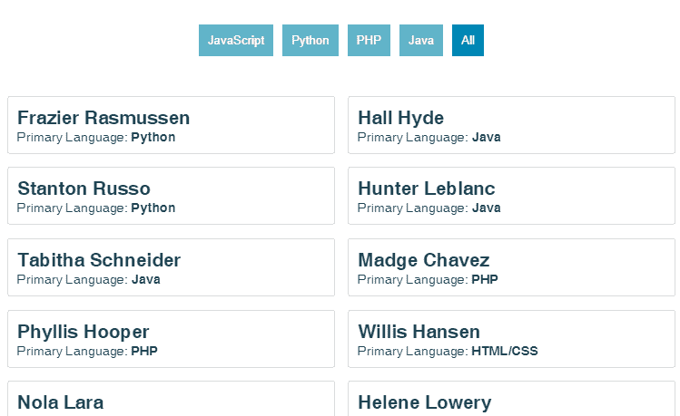

# 在 Vue.js 中的 JSON 渲染列表上单击事件过滤

> 原文：<https://dev.to/alexmourer/click-event-filtering-on-a-json-rendered-list-in-vuejs-3kpn>

在本教程中，我们将探索使用 [Vue.js](https://vuejs.org/) 中的 JSON 数据对呈现的列表进行基本的点击事件过滤。这是一个基础教程，但它应该是开始构建更复杂的东西的坚实基础。

**TL；这里是一个工作代码沙箱的例子

[](https://res.cloudinary.com/practicaldev/image/fetch/s--SVkkxX5w--/c_limit%2Cf_auto%2Cfl_progressive%2Cq_66%2Cw_880/https://thepracticaldev.s3.amazonaws.com/i/xl455y4r4u3acdki28yg.gif)**

#### 我们为什么需要这样做？

作为一名前端开发人员，过滤数据是我日常生活的一部分。我经常遇到需要循环、过滤和显示的大量数据。在本教程中，我们将`fetch()`一个 [JSON 文件](https://next.json-generator.com/api/json/get/4JCnNiTCr)，从数据中构建一个渲染列表，并用点击事件控件过滤列表。

我们不会使用 Vue.js 之外的任何依赖项。

#### 我们如何做到这一点？

首先，我们需要启动并运行 Vue.js。这里的涵盖了这个[，或者你可以建立一个](https://vuejs.org/v2/guide/) [CodeSandbox](https://codesandbox.io) 。

如果您使用 Vue CLI 或 CodeSandbox 来设置您的应用程序，您可能已经有了项目的初始结构。如果你没有，你需要一个地方来展示我们未来的组件。

```
// App.vue file
<template>
  <div id="app">
  </div>
</template>
<script>
  export default {
    name: "App"
  }
</script> 
```

以上代码是本教程的良好起点。在提供的 [CodeSandbox 示例](https://codesandbox.io/s/kkvr7z5rr3)，**中，这个文件被命名为`App.vue`** 。这里显示的代码将作为显示我们将要构建的组件的基础。

在本教程中，我们将把过滤器控件和渲染列表放在同一个组件中。如果这是一个更大的应用程序或更长的教程，我可能会把它们分成两部分，在它们之间共享数据。我已经写了一个关于在多个组件之间共享数据的单独教程[这里](https://dev.to/alexmourer/sharing-data-between-components-invuejs-48me)。

#### 好了，让我们开始构建我们的组件。

在提供的[示例](https://codesandbox.io/s/kkvr7z5rr3)中，我们正在处理的文件被命名为 **DataDisplay.vue** 。

```
// DataDisplay.vue file
<template>
  <div>
  </div>
</template>

<script>
  export default {
    name: "DataDisplay"
  };
</script> 
```

我们要做的第一件事是数据。我已经通过一个名为 [JSON 生成器](https://next.json-generator.com/)的服务创建了样本 JSON 数据。为了将数据放入我们的`DataDisplay.vue`文件，我们将在`created`生命周期钩子中`fetch()`数据。关于生命周期挂钩的信息可以在[这里](https://vuejs.org/v2/guide/instance.html#Instance-Lifecycle-Hooks)找到。所有返回的数据都将存储在数据属性`users`中。

```
// DataDisplay.vue file
<template>
  <div>
  </div>
</template>

<script>
  export default {
    name: "DataDisplay"
    data: function() {
      return {
        users: []
      }
    },
    created() {
      var apiURL = "https://next.json-generator.com/api/json/get/4JCnNiTCr";
      fetch(apiURL)
        .then(res => res.json())
        .then(res => (this.users = res))
        .catch(error => console.log(error));
    }
  }
</script> 
```

现在我们已经存储了数据，我们可以开始显示它了。

让我们用 Vue 的`v-for`指令遍历存储在`users`属性中的数据。指令的 [v-for 需要一个`x in y`或`(x, i) in y`的语法结构。也可以用`of`代替`in`作为分隔符。在这个例子中，我们的语法是`"(entry, index) in users"`，其中`users`是数据源，`entry`是被迭代的元素的别名，`index`是呈现列表中项的索引。](https://vuejs.org/v2/guide/list.html)

示例中提供的测试数据是一个开发人员列表，其中包含每个开发人员的一些相关信息。我们将在一个无序列表中呈现它们的名称和主要编码语言。你可以在这里查看完整的 JSON 文件。

```
// DataDisplay.vue file
<template>
  <div>
    <ul class="userWrap">
      <li
        v-for="(entry, index) in users"
        :item="entry"
        :key="index"
        class="user"
      >
        <h2>{{ entry.name }}</h2>
        <span>
            Primary Language: <strong>{{ entry.mainLanguage }}</strong>
        </span>
      </li>
    </ul>
  </div>
</template>

<script>
  export default {
    name: "DataDisplay"
    data: function() {
      return {
        users: []
      }
    },
    created() {
      var apiURL = "https://next.json-generator.com/api/json/get/4JCnNiTCr";
      fetch(apiURL)
        .then(res => res.json())
        .then(res => (this.users = res))
        .catch(error => console.log(error));
    }
  }
</script> 
```

您应该会看到开发人员及其主要编码语言的列表。我们现在可以构建我们的按钮来过滤这个列表。

我们将向结果列表中添加一系列按钮、一系列数据属性和`v-if`指令。

从数据属性开始。`fkey`属性是我们将要过滤的数据字段。`filterList`是我们将用来检查数据的一组过滤值。过滤器按钮列表也将基于`filterList`构建。`filter`包含当前设置过滤器的值。默认情况下，我们希望显示用户的`All`。

```
data: function() {
  return {
    fkey: "mainLanguage",
    filterList: ["JavaScript", "Python", "PHP", "Java", "All"],
    filter: "All",
    users: []
  }
} 
```

让我们构建我们的过滤器控制按钮。

我们将再次使用`v-for`指令。这一次，遍历`filterList`数组并生成我们的过滤值。你会注意到在我们的渲染列表属性中有两个新的部分，`@click` & `:class`指令。点击按钮时，`@click`将设置`filter`的值。`:class`在`entry === filter`时会将按钮的类别设置为`active`。

```
<button
  v-for="(entry, index) in filterList"
  :item="entry"
  :key="index"
  @click="filter = entry;"
  :class="{ active: entry == filter }"
>
  {{ entry }}
</button> 
```

**接下来，我们将把过滤按钮连接到呈现的`user`列表。**

为此，我们将把 Vue 的`v-if`指令添加到列表的属性中。我们的例子使用了`v-if="entry[fkey] === filter || filter === 'All'"`。如果我们的条目的`mainLaguage`等于`filter`或者`filter`被设置为`'All'`，它将返回`true`并显示该条目。

```
<ul class="userWrap">
  <li
    v-for="(entry, index) in users"
    v-if="entry[fkey] === filter || filter === 'All'"
    :item="entry"
    :key="index"
    class="user"
  >
    <h2 class="title">{{ entry.name }}</h2>
    <span class="language">
      Primary Language: <strong>{{ entry.mainLanguage }}</strong>
    </span>
  </li>
</ul> 
```

这是完整的`DataDisplay.vue`文件。为了好玩，我加了一些 CSS。

```
// DataDisplay.vue
<template>
  <div>
    <div>
      <button
        v-for="(entry, index) in filterList"
        :item="entry"
        :key="index"
        @click="filter = entry; active = index;"
        :class="{ active: entry == filter }"
      >
        {{ entry }}
      </button>
    </div>
    <ul class="userWrap">
      <li
        v-for="(entry, index) in users"
        v-if="entry[fkey] === filter || filter === 'All'"
        :item="entry"
        :key="index"
        class="user"
      >
        <h2 class="title">{{ entry.name }}</h2>
        <span class="language">
          Primary Language: <strong>{{ entry.mainLanguage }}</strong>
        </span>
      </li>
    </ul>
  </div>
</template>

<script>
export default {
  name: "DataDisplay",
  data: function() {
    return {
      fkey: "mainLanguage",
      filterList: ["JavaScript", "Python", "PHP", "Java", "All"],
      filter: "All",
      users: []
    };
  },
  created() {
    var apiURL = "https://next.json-generator.com/api/json/get/4JCnNiTCr";
    fetch(apiURL)
      .then(res => res.json())
      .then(res => (this.users = res))
      .catch(error => console.log(error));
  }
};
</script>

<style scoped>
button {
  background: #74b6cc;
  border: none;
  color: #fff;
  padding: 10px;
  margin: 5px;
}
button.active {
  background: #0089ba;
}
.userWrap {
  list-style-type: none;
  padding: 2%;
  display: flex;
  flex-wrap: wrap;
  justify-content: space-between;
  flex-direction: row;
}
.user {
  padding: 10px;
  margin: 1% 0;
  border: 1px solid #ddd;
  border-radius: 3px;
  width: 45%;
  text-align: left;
}
h2.title {
  font-size: 1.3rem;
  font-weight: bold;
  margin: 0;
}
.language {
  display: block;
  font-size: 0.9rem;
}
</style> 
```

**最后一步是将我们的`DataDisplay`组件导入我们的`App.vue`文件。**

```
// App.vue
<template>
  <div id="app">
    <DataDisplay />
  </div>
</template>

<script>
import DataDisplay from "./components/DataDisplay";

export default {
  name: "App",
  components: {
    DataDisplay
  }
};
</script> 
```

🍻

[https://codesandbox.io/embed/kkvr7z5rr3](https://codesandbox.io/embed/kkvr7z5rr3)