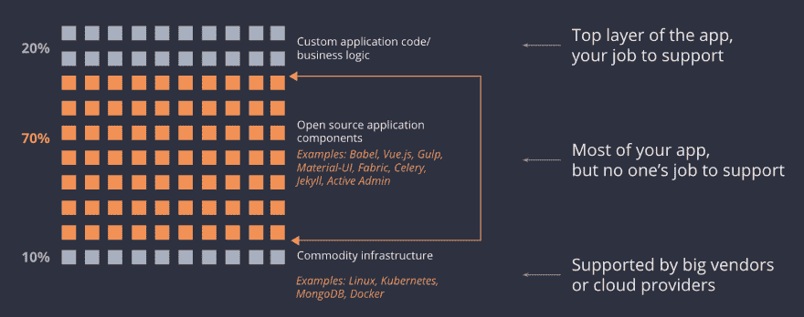

# 云提供商管理您的计算、存储和网络。但是谁管理你的开源库呢？🤔

> 原文：<https://dev.to/tidelift/cloud-providers-manage-your-compute-storage-and-network-but-who-manages-your-open-source-libraries-4012>

应用程序依赖是代码。像所有的代码一样，这些代码需要精心呵护。

你的应用程序和云基础设施层之间的包——你加载到你的应用程序的实际地址空间的包，进入你构建的容器映像的包——几乎都是由志愿者专门运行的[，通常是一个*单人*。](https://blog.tidelift.com/who-supports-react-that-depends-on-what-you-mean)

团队今天面临的困境:

*   中间的这些包和框架使得发布可用的应用程序变得非常非常快。从头开始实现 HTTP 不是您的团队应该做的事情！快速的应用程序开发依赖于开源代码的重用。
*   包裹并不总是处于良好的状态。[他们中的 10-20%根本看不到任何维护活动](https://blog.tidelift.com/up-to-20-percent-of-your-application-dependencies-may-be-unmaintained)。更多的是维护不足。很少有足够的安全程序，结果导致了一系列[高调事件](https://blog.tidelift.com/event-stream-100-million-downloads-unmaintained-hacked.-now-can-we-pay-the-maintainers)。
*   如果法律部门要求你使用的所有代码都要许可证…玩得开心点，因为没有可靠的注释。
*   同时，*被*维护的包可以快速移动，并且有必要跟上…否则你将不会有错误修正、安全修正或新特性。

当工程团队想要管理他们所依赖的这些开源库中的技术、法律和安全风险时，他们不得不使用自己开发的或者昂贵的工具，这暴露了一系列的问题...然后投入工程时间来解决这些问题。他们还必须自己一个包一个包地研究*和监控*包的状态(质量、路线图、许可、发布)。(顺便说一句，很多团队用的都是几千包。)

因为这个太费时间，不实用，实际上团队都不做。维护和监控不充分的依赖性会产生风险、消防演习、不合格的质量和工程兔子洞。团队经常将依赖性视为一种需要最小化的负担，而不是充分利用开源代码的重用。

在许多公司，公开声明的开源政策(勤奋的研究、监控、批准和维护)和现实(每个人都忽略这个政策)之间存在巨大的差距。

## 托管开源方法能为您省钱吗？

如果你能有一个**管理的开源**策略来照顾好你的开源依赖，会怎么样？那到底是什么意思？

最好的类比可能是回到大约 15 年前云计算出现之前的世界。在那个时候，如果你试图推出一个新的 SaaS 应用程序，你需要从一个声誉良好的托管设施租赁空间，购买并安装服务器以确保你的应用程序有适当的备份/故障转移，并在这些服务器上配置你需要的所有软件。然后，如果服务器出了问题，你不得不开车或坐飞机去托管设施，把它换出来，安装软件更新，等等。

如今，您只需点击几个按钮或运行一个脚本，您最喜欢的云提供商就会为您管理所有这些。

但是当涉及到你的应用程序所依赖的所有开源组件时，今天的开发团队仍然需要自己做很多繁重的工作。

我们认为类似的托管方法——托管开源——可能会让您收回目前花费在争论开源依赖项上的时间，从而将您和您的团队解放出来，专注于您的应用程序真正与众不同的功能。

我们已经在 Tidelift 上建立了一种方法来解决这个问题。简而言之，我们跟踪您应该使用的推荐版本(和推荐的包),并在创建您的包的开源维护者的专家帮助下，为您提供工具和指导。

## 没有良好管理的开源依赖，会出什么问题？

一如既往的， [xkcd 很好的解释了问题](https://xkcd.com/2140/)。我们不能说参差不齐的依赖关系会在什么时候伤害你，但是我们知道它们会。

 漫画由 [xkcd](https://xkcd.com/2140/) 提供

最可怕的风险包括安全漏洞和诉讼。然而，维护不善的软件最不可避免的后果是浪费时间。俗话说“如果你的时间一文不值，开源就是免费的。”

这就是为什么您为您的计算、存储和数据库购买托管云服务，而不是自己拥有和运营它们。应用程序依赖关系也是如此。他们需要照顾和喂养，如果你自己做，你可能会以更高的成本得到更差的结果。家酿依赖栈是无差别的沉重负担。他们不创造商业价值。

根据我们的调查，开发人员花费大约 30%的时间在维护上，其中 25%与开源相关。所以假设开发人员 8%的时间是开源相关的维护。这可以节省很多时间，你可以[使用我们的投资回报率计算器](https://tidelift.com/subscription/roi-calculator)计算你在 it 上花费的开发人员工资。

但是真正的成本甚至超过了开发人员的工资；特别是两个:

*   **机会成本**:你的开发人员可以致力于什么样的核心业务能力，这有什么价值？
*   **风险:**法律、技术、安全相关的冰山，因对你的依赖关系维护不足而产生；最常见的风险是技术性的，可能需要几个月的时间；糟糕的法律和安全结果不太常见，但代价可能高得令人难以承受。

对于软件行业来说，这是一个重要的未解决的问题。你在你的组织中是如何考虑的？我很想在评论中听到你的意见。