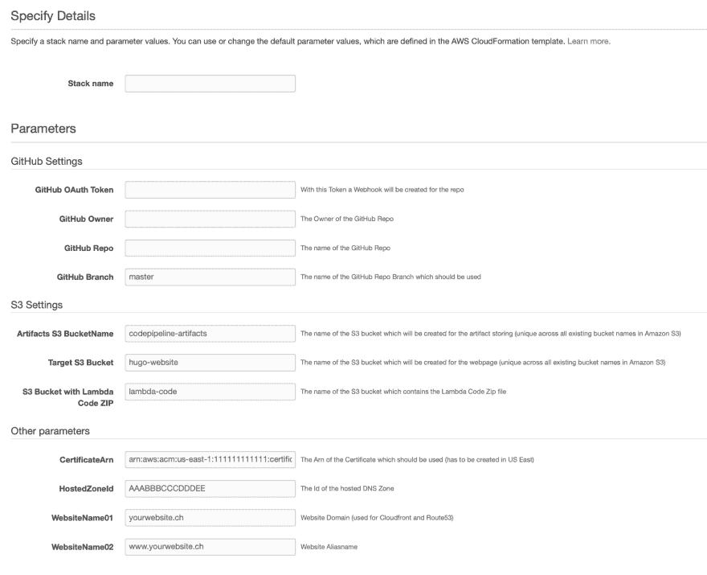

# AWS 代码管道- Hugo 部署的 CloudFormation 示例

> 原文：<https://dev.to/kbild/cloudformation-example-for-aws-codepipeline-hugo-deployment-51o9>

我最近写了一篇关于如何使用 AWS CodePipeline 将 Hugo 网站自动部署到 AWS S3 的博客，并承诺了一个 CloudFormation 模板，所以我们开始吧。你可以在这个 GitHub repo 中找到完整的模板[。](https://github.com/kbild/AWS_Cloudformation_Examples/blob/master/HugoStaticWebpages/Deploy-Pipeline.yaml)

如果您使用模板创建一个新的堆栈，将会要求您输入以下参数，让我们来详细了解一下:

[](https://kbild.ch/201902/cloudformation.png)

* * *

### 需要的参数

GitHub OAuth 令牌→将用于在 Repo 中创建 webhook 的令牌

GitHub 所有者→GitHub 回购的所有者

GitHub 回购→GitHub 回购的名称

GitHub 分支→分支的名称

工件 S3 存储桶名称→将保存代码管道工件的 S3 存储桶的名称，该存储桶将被创建！

目标 S3 桶→你的雨果网站将部署的 S3 桶的名称，这个桶将被创建！

Lambda 代码为 ZIP 的 S3 存储桶→现有的 S3 存储桶<mark>，其中包含用于 CloudFront 失效的 python 脚本的 ZIP 文件</mark>。该文件必须命名为 invalidateCloudFront.zip，可以在[这里](https://github.com/kbild/AWS_Cloudformation_Examples/blob/master/HugoStaticWebpages/invalidateCloudFront.zip)找到

Certificate earn→应该在 CloudFront 发行版上使用的证书的 Arn(必须在美国东部创建！)

* * *

HostedZoneId→route 53 上托管区域的 Id，将用于创建以下两个子域名/网站名称

网站名称 HostedZone 的子域 1

网站名称 HostedZone 的子域 2

### 创建了 AWS 资源

如果您使用此模板创建堆栈，将自动创建以下资源:

pipelaneratifactsbucket→AWS::S3::水桶神器 S3 BucketName

PipelineWebpageBucket→AWS::S3::Bucket 目标 S3 Bucket

Bucket policy→AWS::S3::Bucket policy，将用于带有 Hugo 源文件的 S3 存储桶，并允许公共读取访问

myCloudfrontDist→AWS::CloudFront::以下子域名的分布

domain DNS record 1→AWS::route 53::RecordSet websitename 01

domaindnsrecord 2→AWS::route 53::RecordSet websitename 02

CodeBuildProject→AWS::CodeBuild::Project，将在代码管道中使用的实际构建项目

代码管道→ AWS::代码管道::管道

GithubWebhook→AWS::code pipeline::web hook

CreateCodePipelinePolicy→AWS::IAM::managed policy，将用于相应角色/管道的托管策略

CodePipelineRole→AWS::IAM::Role，具有代码管道的托管策略

CreateCodeBuildPolicy→AWS::IAM::managed policy 将用于代码生成的相应角色的托管策略

CodeBuildRole → AWS::IAM::Role，带有代码生成的托管策略

CreateLambdaExecutionPolicy→AWS::IAM::managed policy

LambdaExecutedRole→AWS::IAM::Role，带有托管策略以赋予 Lambda 足够的权限

LambdaCloudfrontInvalidation→AWS::Lambda::Function python 函数

### 代码示例

在整个模板中，我试图遵循最小特权原则，也就是说，如果你查看 **CodeBuild 策略**，你会发现 CodeBuild 只允许与创建的 S3 桶一起工作。

```
108 CreateCodeBuildPolicy: 
109 Type: AWS::IAM::ManagedPolicy
110 Properties: 
111 ManagedPolicyName: CodeBuildAccess_Hugo
112 Description: "Policy for access to logs and Hugo S3 Buckets"
113 Path: "/"
114 PolicyDocument: 
115 Version: "2012-10-17"
116 Statement:
117 - Sid: VisualEditor0
118 Effect: Allow
119 Action: s3:*
120 Resource: [
121 !Join ['', ['arn:aws:s3:::',!Ref TargetS3Bucket] ],
122 !Join ['', ['arn:aws:s3:::',!Ref TargetS3Bucket, '/*'] ],
123 !Join ['', ['arn:aws:s3:::',!Ref ArtifactsBucketName] ],
124 !Join ['', ['arn:aws:s3:::',!Ref ArtifactsBucketName, '/*'] ]
125 ]
126 - Sid: VisualEditor1
127 Effect: Allow
128 Action: logs:*
129 Resource: '*' 
```

接下来的部分创建了包含所有阶段

的**代码管道**(来源于 GitHub，在 CodeBuild 上构建，部署到 S3 并调用 Lambda 函数)

```
108 CodePipeline:
109 Type: AWS::CodePipeline::Pipeline
110 Properties:
111 Name: PipelineForStaticWebpageWithHugo
112 ArtifactStore:
113 Type: S3
114 Location: !Ref PipelineArtifactsBucket
115 RestartExecutionOnUpdate: true
116 RoleArn: !GetAtt CodePipelineRole.Arn
117 Stages:
118 - Name: Source
119 Actions:
120 - Name: Source
121 InputArtifacts: []
122 ActionTypeId:
123 Category: Source
124 Owner: ThirdParty
125 Version: 1
126 Provider: GitHub
127 OutputArtifacts:
128 - Name: SourceCode
129 Configuration:
130 Owner: !Ref GitHubOwner
131 Repo: !Ref GitHubRepo
132 Branch: !Ref GitHubBranch
133 PollForSourceChanges: false
134 OAuthToken: !Ref GitHubOAuthToken
135 RunOrder: 1
136 - Name: Build
137 Actions:
138 - Name: CodeBuild
139 ActionTypeId:
140 Category: Build
141 Owner: AWS
142 Provider: CodeBuild
143 Version: '1'
144 InputArtifacts:
145 - Name: SourceCode
146 OutputArtifacts:
147 - Name: PublicFiles
148 Configuration: 
149 ProjectName: !Ref CodeBuildProject
150 RunOrder: 1
151 - Name: Deploy
152 Actions:
153 - Name: S3Deploy
154 ActionTypeId:
155 Category: Deploy
156 Owner: AWS
157 Provider: S3
158 Version: '1'
159 InputArtifacts:
160 - Name: PublicFiles
161 Configuration: 
162 BucketName: !Ref TargetS3Bucket
163 Extract: 'true'
164 RunOrder: 1
165 - Name: LambdaDeploy
166 ActionTypeId:
167 Category: Invoke
168 Owner: AWS
169 Provider: Lambda
170 Version: '1'
171 Configuration: 
172 FunctionName: invalidateCloudfront
173 UserParameters: !Ref myCloudfrontDist
174 RunOrder: 2 
```

这是用 python 写的 Lambda 函数，用来创建 CloudFront 失效。我需要一些时间来获取 CodePipeline jobId，并从 UserParameters 中获取 CloudFront 发行版的 Id。

```
108import time
109import logging
110from botocore.exceptions import ClientError
111import boto3
112
113LOGGER = logging.getLogger()
114LOGGER.setLevel(logging.INFO)
115
116def codepipeline_success(job_id):
117 """
118 Puts CodePipeline Success Result
119 """
120 try:
121 codepipeline = boto3.client('codepipeline')
122 codepipeline.put_job_success_result(jobId=job_id)
123 LOGGER.info('===SUCCESS===')
124 return True
125 except ClientError as err:
126 LOGGER.error("Failed to PutJobSuccessResult for CodePipeline!\n%s", err)
127 return False
128
129def codepipeline_failure(job_id, message):
130 try:
131 codepipeline = boto3.client('codepipeline')
132 codepipeline.put_job_failure_result(
133 jobId=job_id,
134 failureDetails={'type': 'JobFailed', 'message': message}
135 )
136 LOGGER.info('===FAILURE===')
137 return True
138 except ClientError as err:
139 LOGGER.error("Failed to PutJobFailureResult for CodePipeline!\n%s", err)
140 return False
141
142
143def lambda_handler(event, context):
144 LOGGER.info(event)
145 try:
146 job_id = event['CodePipeline.job']['id']
147 distId = event['CodePipeline.job']['data']['actionConfiguration']['configuration']['UserParameters']
148 client = boto3.client('cloudfront')
149 invalidation = client.create_invalidation(DistributionId=distId,
150 InvalidationBatch={
151 'Paths': {
152 'Quantity': 1,
153 'Items': ['/*']
154 },
155 'CallerReference': str(time.time())
156 })
157 codepipeline_success(job_id)
158        
159 except KeyError as err:
160 LOGGER.error("Could not retrieve CodePipeline Job ID!\n%s", err)
161 return False
162 codepipeline_failure(job_id, err) 
```

希望这个模板能帮助你通过 CloudFormations 构建自己的代码管道。