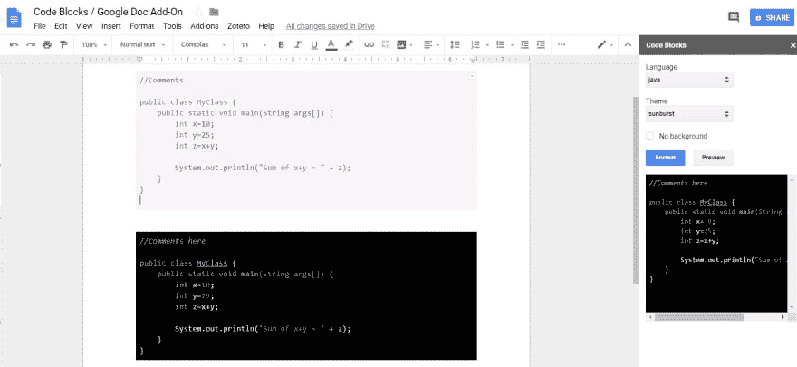

# “代码块”Google doc 插件，提供更好的代码文档

> 原文：<https://dev.to/skrish2017/code-blocks-google-doc-add-on-for-better-code-documentation-j59>

你好，我碰到了一个叫做“代码块”的 Google Doc 插件，它可以灵活地格式化任何源代码。使它更容易阅读，并可用于许多不同的原因，包括文档。它有不同的语言选项+有颜色主题，允许您根据需要定制它。

如果人们没有听说过，这就是。

您可以从以下网址下载/安装该插件到您的 Google Doc:

[https://chrome . Google . com/Webster/detail/code-blocks/ebaibifdgmgmplgmingcekpeffd](https://chrome.google.com/webstore/detail/code-blocks/ebieibfdjgmmimpldgengceekpfefmfd)

如果你有/使用其他同样好或更好的代码文档工具，请在评论中发表。乐学！

干杯，

沙希