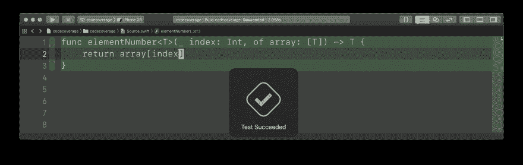
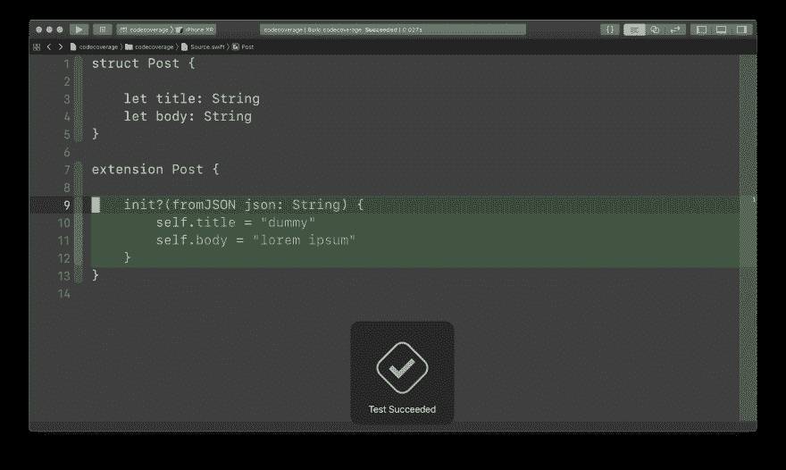

# 代码覆盖率是一个不完整的指标

> 原文：<https://dev.to/mokagio/code-coverage-is-a-broken-metric-3aac>

这是我的博客[mokacoding.com](https://www.mokacoding.com/blog/code-coverage-is-broken/)的一篇交叉文章。

开始与管理层讨论测试，很快你就会被问到代码覆盖率。一些团队和公司可能需要一定的代码覆盖率阈值来确保代码的安全性。代码覆盖率是一个不可靠的指标，你应该小心对待它。有点像智商分数。

智商测试是 20 世纪初引入的一套标准化测试，用于测量人类的智力。冒一次险，你可能会发现你并不像自己想象的那么聪明。至少智商测试是这样的。

事实上，该测试并不是对整体智力的测量，只是对一个人在测试任务中的能力的测量。智商不衡量智力，它衡量的是智商。世界各地学校实施的标准化考试也是如此。他们不衡量孩子在社会中的准备程度，只衡量他们是否擅长记忆或做数学，几乎没有触及他们是否理解和内化这些概念的表面。

智商和在学校或工作中的表现之间的相关性是显而易见的，但不是那么强。“有时智商分数被描述为表现的‘最佳预测者’。然而，值得注意的是，这种测试预测的*远远小于与工作相关的措施的方差的一半*【重点矿山】”研究人员说 [<sup id="researchers-say">1</sup>](#fn1) 。

我经常被问到的一个问题是“我们应该使用什么代码覆盖率值？”。代码覆盖率就像智商一样，它是衡量代码库及其测试套件实际上有多好的一个不完整的指标。

这里有一个代码覆盖率误报的例子:

```
// Source.swift
func element(atIndex index: Int, of array: [Int]) -> Int {
    return array[index]
}

// Tests.swift
func testArrayAccess() {
    XCTAssertEqual(element(atIndex: 0, of: [1, 2, 3]), 1)
} 
```

Enter fullscreen mode Exit fullscreen mode

代码有 100%的代码覆盖率，但是调用`element(atIndex: 3, of: [1, 2, 3])`会导致崩溃。当编写测试不足以覆盖快乐路径时，您还需要验证代码在失败和边缘情况下的行为。

[](https://res.cloudinary.com/practicaldev/image/fetch/s--_a5B8OZh--/c_limit%2Cf_auto%2Cfl_progressive%2Cq_auto%2Cw_880/https://s3.amazonaws.com/mokacoding/2019-02-19-code-coverage-fail-1.png)

再比如:

```
// Source.swift
struct Post {

    let title: String
    let body: String
}

extension Post {

    init?(fromJSON json: String) {
        // TODO: remove dummy implementation
        self.title = "dummy"
        self.body = "lorem ipsum"
    }
}

// Tests.swift
func testPostFromJSON() {
  let post = Post(fromJSON: loadJSONFixture())
  XCTAssertNotNil(post)
} 
```

Enter fullscreen mode Exit fullscreen mode

[](https://res.cloudinary.com/practicaldev/image/fetch/s--abh0vJfw--/c_limit%2Cf_auto%2Cfl_progressive%2Cq_auto%2Cw_880/https://s3.amazonaws.com/mokacoding/2019-02-19-code-coverage-fail-2.png)

同样，我们有 100%的代码覆盖率，但是代码的行为是不正确的。这里的问题是测试不够细致，它断言返回了*某个*的东西，而没有验证它是否是我们所期望的。代码的作者忘了跟进他们的`// TODO:`注释，并且交付了带有不完整实现的代码。

如你所见，**代码覆盖率只擅长测量代码覆盖率**，也就是说，有多少代码路径被测试命中。它没有告诉我们这些测试是否全面，是否准确，或者它们有多严格——它们是否有助于重构，或者是否需要在每次实现改变时进行更新？

我们应该原谅管理人员和架构师管理代码覆盖率阈值。就像人类的智力或学校提供的教育水平一样，代码库的质量是一个很难衡量的东西，有很多影响分数的变量。很容易找到更容易计算的东西，并将其用作代理。

那么我们应该放弃代码覆盖吗？不再关心增加数量，还是让它不下降到某个阈值以下？一点也不。也许对于代码覆盖率来说，broken 这个属性太强了。指标本身并没有被打破，只是我们使用它的方式被打破了。

我们不能仅仅依靠代码覆盖率来衡量测试套件的质量，我们也不能指望强制执行覆盖率%就能让代码变好。此外，在没有首先考虑应用程序中有多少内容实际上对测试有价值的情况下，像. 8 或. 9 这样的任意覆盖率是没有意义的。例如，纯 UI 或动画代码在编写测试上投入的时间回报很差，UI 方面的代码库应该授予较低的覆盖率阈值。

使用代码覆盖率的最好方法不是强调你有多少测试，而是强调你没有多少测试。使用它来识别你的代码库中没有被测试的区域，然后仔细检查它们。它们中的任何一个对于应用程序的正确行为是重要的吗？在不久的将来有计划改变他们吗？你能忍受它暂时未经测试，而[将你的工作集中在更有影响力的任务上](https://www.mokacoding.com/blog/how-to-choose-what-to-refactor/)吗？

软件工程师喜欢说他们使用最好的工具来完成工作。这不仅适用于数据库、框架或编程语言，也适用于代码覆盖率之类的指标。测量代码覆盖率，跟踪其趋势，但不要将其作为测试套件或代码库的唯一质量指标。记住，代码覆盖率仅仅是衡量代码覆盖率。

* * *

👉📬如果你喜欢阅读此文[,请点击这里](http://eepurl.com/dEr0DH),在你的收件箱里收到类似这样的新帖子。

* * *

### 脚注

1.  [*研究者称*](#researchers-say) 。美国奈塞尔；布杜；布沙尔，T. J .，j；博伊金；布罗迪，n。颜后君；哈尔彭；洛林；佩尔洛夫河；斯特恩伯格；乌尔维纳(1996 年)。[智力:已知和未知](https://en.wikipedia.org/wiki/Intelligence:_Knowns_and_Unknowns)。美国心理学家协会。