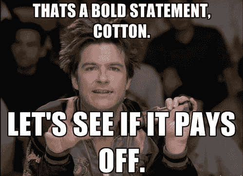
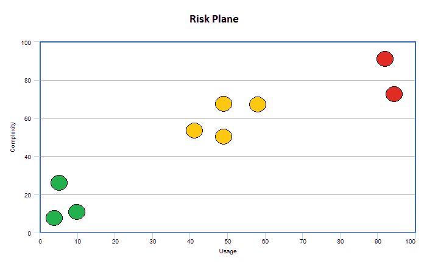
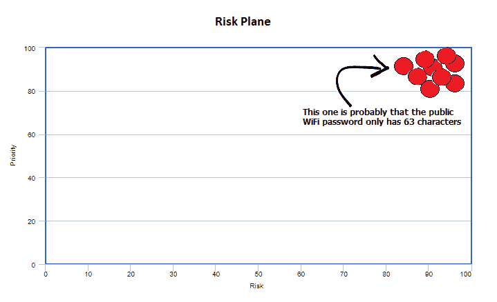

# 代码覆盖率是没有用的

> 原文：<https://dev.to/johnpreese/code-coverage-is-useless-1h3h>

不久前，办公室里还在讨论一项新的测试计划。现在，就其本身而言，这是一个极好的消息。谁不想花些时间让我们的测试故事达到标准呢？

问题存在于所提出的方法中，甚至可以说:**“我们需要确保我们至少有 80%的测试覆盖率。”**

虽然意图是好的，但不幸的是代码覆盖是无用的。

[](https://res.cloudinary.com/practicaldev/image/fetch/s--7iQbG8Sn--/c_limit%2Cf_auto%2Cfl_progressive%2Cq_auto%2Cw_880/https://thepracticaldev.s3.amazonaws.com/i/1n78lahvqexka4nok3v0.jpg)

现在，这是一个相当大胆的声明，所以让我澄清一下。代码覆盖率**目标**毫无用处。你不应该在一个给定的代码库上追求 X%的覆盖率。这有几个原因，我来解释一下。

## 有可能考不够

并非所有的代码基础都是平等的。一个可能是一个应用程序，一天内有数百万次点击，非常复杂。另一个可能是一个每天为几个用户服务的小应用程序。我总是喜欢在一个*风险平面上设想这些不同种类的应用。*

[](https://res.cloudinary.com/practicaldev/image/fetch/s--Kxt0HRsv--/c_limit%2Cf_auto%2Cfl_progressive%2Cq_auto%2Cw_880/https://thepracticaldev.s3.amazonaws.com/i/sbltxbxuc086b70yojkd.png)

想象一下，如果你愿意，每个点都是我们系统中的一个应用。我们越向右上方走，越有可能出现一些坏消息。而更左下方的..呃？也许有人会注意到。

现在，说每个应用程序都应该有至少 80%的代码覆盖率是很愚蠢的。为什么？**机会成本。**虽然我非常支持测试，但我不喜欢仅仅因为。我们应该以测试足够多为目标。进行足够的测试，这样我们就有足够的信心相信我们的应用程序会如我们所期望的那样运行。

实际上，也许对于我们的右翼应用程序来说，80%是不够的。也许实际上应该更高，我们不应该停留在 80%。另一方面，左下角的较小的应用程序可能不需要这么高的覆盖率。增加测试的周期可能会给我们带来很少甚至没有价值，最终只是浪费时间。

注意:我觉得在这一点上，有些人可能会对增加测试的价值感到困惑。有一个完整的开发方法，叫做 TDD，它通过遵循红色、绿色、重构循环来创建高水平的覆盖率。我在这里提出的观点通常指的是返回并添加测试，因为有人指出代码基础覆盖率太低。如果你一开始就在做 TDD，那么设定一个目标真的没有帮助。这只是副产品。

这都是关于上下文的。我们不能概括代码库中的覆盖率，因为每个代码库都是不同的。

有趣的事实:你知道这种风险平面图可以应用于许多不同的场景吗？想知道安保人员的风险平面是什么样的吗？

[](https://res.cloudinary.com/practicaldev/image/fetch/s--39u4PU5u--/c_limit%2Cf_auto%2Cfl_progressive%2Cq_auto%2Cw_880/https://thepracticaldev.s3.amazonaws.com/i/ljsawjxn2il1ly27kpsh.png)

无论如何...

同样，并不是所有东西都需要测试。假设我们想在我们的代码库中引入一个新的公共成员，这很简单

```
public FirstName { get; set; } 
```

引入这一行代码，如果在我们的任何测试中没有调用，将会降低代码覆盖率。甚至可能低于我们挚爱的 80%。修复？

```
[Fact]
public void FirstName_ByDefault_CanBeSet()  
{
  var myClass = MyClass();
  myClass.FirstName = "testname";
  Assert.AreEqual("testname", myClass.FirstName)
} 
```

在这一点上，我们只是测试。NET——这是我们绝对要避免的。我倾向于只对我知道有可能以我不希望的方式改变的代码进行测试。逻辑代码。

## 代码覆盖率是*容易*

仅仅因为我们有很多代码覆盖率，并不一定意味着我们可以对我们的应用程序如我们所期望的那样工作充满信心。有了例子，一切总是更清楚，所以让我们考虑以下几点:

```
public class Flawless  
{
  public bool IsGuarenteedToWork()
  {
    // some code
  }
} 
```

现在，方法通常有我们通常想要测试的逻辑，对吗？条件句，数学运算，应有尽有。但是，对于我们的例子来说，这无关紧要！我们只是想增加代码覆盖率。这是我们的目标。

```
[Fact]
public void IsGuarenteedToWork_ByDefault_Works()  
{
  var flawless = new Flawless();

  var actual = flawless.IsGuarenteedToWork();
} 
```

现在你知道了！100%的代码覆盖率。默认情况下，没有`Assert`的测试将被视为通过。现在你可能在想..拜托，谁会真的这么做？

当受到激励时，人们会做傻事。我举的一个例子是，一家公司告诉 QA，他们在季度末每发现一个 bug，就会得到一笔奖金。似乎很合理，对吗？另一方面，同一家公司告诉 development，他们将根据引入系统的错误数量获得奖金。

这种情况刺激了对立团体的失败。开发组织真的不想写任何代码，因为害怕引入 bug，并且希望 QA 在他们的分析中遗漏 bug。而 QA 组希望开发人员将错误引入到系统中，这样他们就可以发现错误并因此得到回报。

我们需要记住的另一件事是...

## 代码覆盖上下文*事项*

让我们考虑一下，我们的开发人员不仅仅是试图玩弄系统，而且实际上付出了诚实的努力来实现他的代码覆盖目标。我们的实现可能如下所示:

```
public class Flawless  
{
  public bool IsGuarenteedToWork()
  {
    for(var x = 0; x < int.MaxValue; x++) 
    {
      // Man, this is gonna work. I'll find that solution.. eventually.
    }
  }
} 
```

..别忘了测试。

```
[Fact]
public void IsGuarenteedToWork_ByDefault_Works()  
{
  var flawless = new Flawless();

  var actual = flawless.IsGuarenteedToWork();

  Assert.True(actual);
} 
```

我希望很明显，上面的例子是远远不够的。但是在这种情况下，我们已经达到了 100%的代码覆盖率，我们实际上是在断言代码正在按照我们的预期工作。实现是可行的。测试是正确的。大家都很开心。几乎...

谈到测试，有不同的利益相关者。

> 利益相关者是那些你触及其生活的人

这可以进一步细分为利益相关者的类型。

1.  主要利益相关者(我是为谁做的)*例如:请求该特性的客户。*

2.  第二利益相关者(其他直接参与的人)*例子:你的老板和/或项目的其他开发人员。*

3.  间接利益相关者(那些受到其他影响的人)例如:你客户的客户。

作为程序员，我们写代码是为了给别人解决问题(有时是我们自己，如果我们有时间的话)。同一段代码对不同的人有不同的意义。人 A 只在乎答案是否正确。也许当它准备好的时候他们会被通知，但是当他们收到它的时候他们是相当漠不关心的。人 B 在请求后很快就需要答案。我们的测试只让 a 完全满意。

在编写代码的时候，可能会有很多利益相关者。不幸的是，我们不能自信地说，即使是 100%的代码覆盖率，我们的代码将会与每个人的需求兼容。

在喋喋不休地解释了为什么代码覆盖率作为*目标*毫无用处之后。最后，我想说...

## 代码覆盖率其实可以*有用*

我更喜欢利用代码覆盖率作为度量标准。覆盖率是我们知道的东西，我们可以用它来对每个代码库做出明智的决定。

如果我们注意到一个代码库的覆盖率持续下降，我们可以将此视为一个信号，以深入了解正在发生的事情。代码库难以测试吗？即使有意义，开发人员也不愿意付出努力去测试吗？也许这正是我们对代码库的期望，所以一切都很简单。

覆盖率也可以让我们知道我们是否做了足够多的测试。如果一个任务关键的应用程序只有 10%的覆盖率，我们应该调查其原因，并可能开始一个质量计划，并进行一些测试。它允许我们优先考虑我们的测试计划，而不只是随机选择一个代码库并开始对它进行测试。

所有这一切的要点是，设定覆盖目标只会适得其反。我们应该意识到覆盖率，以便我们能够做出明智的决定，但是不要仅仅为了覆盖率的实现而让它影响我们代码的质量。